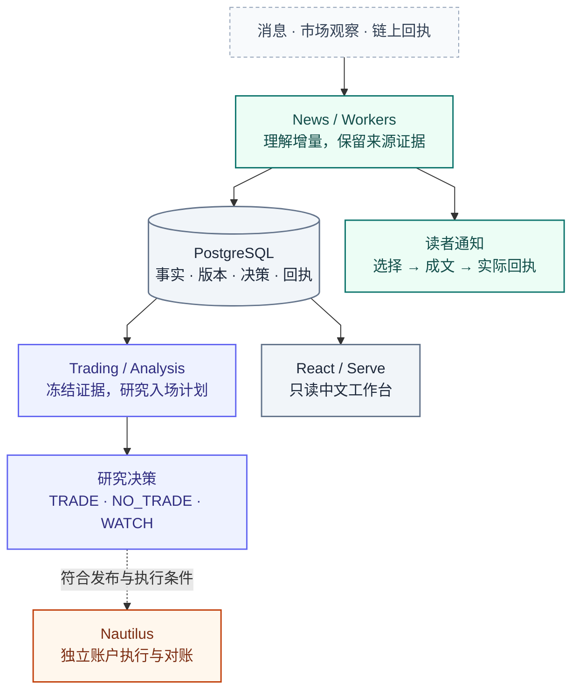

<div align="center">


# Tracefold

### 从消息增量，到有据可查的交易研究。

新闻理解与通知 · 市场与链上观察 · 独立执行与对账

[快速开始](docs/SETUP.md)　/　[架构图谱](docs/ARCHITECTURE.md#atlas)　/　[中文手册](docs/README.md)　/　[开发指南](docs/DEVELOPMENT.md)

[<kbd>Python 3.13</kbd>](pyproject.toml)　[<kbd>React 19</kbd>](web/package.json)　[<kbd>中文手册</kbd>](docs/README.md)　[CI 运行记录 ↗](https://github.com/AnalyThothAI/tracefold/actions/workflows/ci.yml)

</div>

---

Tracefold 将持续到达的新闻、市场报告和链上回执，整理为可追溯的事实、版本与研究记录。它关注的不只是“发生了什么”，还有**这次新增了什么、证据来自哪里、读者收到什么，以及账户实际执行了什么**。

**理解、通知、研究、执行，各有自己的证据和边界。** News 不以卡片发送成功作为知识采用的条件；Trading 不把模型建议当成交；只读工作台让这些过程能够被检查，而不是用一个成功标记将它们混在一起。

## 能力一览

| 理解与观察 | 研究与交付 |
| :--- | :--- |
| **01　新闻增量理解**<br/>从来源修订中抽取命题与引文，识别复述、补充和更正，形成版本化 EventUpdate。<br/>[News 手册 →](docs/modules/news.md) · [语义链路入门 →](docs/modules/news-semantics-guide.md) | **02　有依据的读者通知**<br/>逐命题比较实际已发正文；只为选中内容生成中文卡片，保留真实发送结果。<br/>[通知与回执 →](docs/modules/news.md#notification) |
| **03　市场与链上观察**<br/>确定性解析 OI / 清算 / 大户报告；从完整链上回执发现多地址集中净买入。<br/>[市场观察 →](docs/modules/oi.md) · [钱包警报 →](docs/modules/wallets.md) | **04　受限交易研究**<br/>冻结当时可见的证据；通过只读 ReAct 和有限计划菜单，输出 TRADE / NO_TRADE / WATCH。<br/>[Trading 手册 →](docs/modules/trading.md) |
| **05　行情与复核**<br/>区分当前报价、新闻后价格反应和研究结果；保留固定语料的评审器校准。<br/>[行情复盘 →](docs/modules/market-review.md) · [复核校准 →](docs/modules/review.md) | **06　独立账户执行**<br/>Nautilus 消费有作用域的 Signal 与操作意图，负责订单、保护、真实成交归属和对账。<br/>[Execution 手册 →](docs/modules/execution.md) |

## 三分钟理解系统

**输入是来源材料，核心是持久证据，输出是彼此独立的产品。**



*能力视图：实线表示主要产物关系；虚线表示有条件的后续。省略了恢复与回写连线，不代表所有消息都会产生交易。*

系统只有 **News、Trading 两个业务域**，以及 **Serve、Workers、Analysis、Nautilus 四种进程角色**。前三者共用应用镜像；Nautilus 单独管理。RabbitMQ 承接原始消息与语义唤醒，PostgreSQL 保存事实、工作和回执。完整部署图与依赖方向见[系统架构](docs/ARCHITECTURE.md)。

> [!IMPORTANT]
> **采用知识 ≠ 已发通知；研究决策 ≠ 已发布 Signal；订单受理 ≠ 真实成交。**
> 这些区别是重试、回放、故障恢复与账户对账的依据。

## 快速开始

准备 **Git、GNU Make、系统 Python 3.10+，以及 Docker 与 Compose v2**。应用依赖与前端在镜像内构建；正常部署不要求宿主机安装 uv、npm、curl 或登录 GitHub。

```bash
git clone https://github.com/AnalyThothAI/tracefold.git
cd tracefold

# 构建镜像并初始化私有配置，不启动业务服务
make init
# 编辑默认生成的 ~/.tracefold/config.yaml

# 验证配置、准备基础设施、等待迁移，再启动应用
make up
```

启动成功后访问 **http://127.0.0.1:8765/**。

| 下一步 | 入口 |
| :--- | :--- |
| 配置新闻源、模型与可选推送 | 编辑 `TRACEFOLD_HOME/config.yaml`，默认 `~/.tracefold/config.yaml`，见[按能力配置](docs/SETUP.md#capabilities) |
| 核实应用状态 | `make topology` 查看脱敏拓扑，`make status-app` 检查应用；`make logs` 包含 Analysis |
| 查看有效配置 | `make config`，使用容器镜像输出脱敏配置 |
| 停止服务、保留数据 | `make down`；先停独立执行进程，再停应用与依赖 |

> [!NOTE]
> 默认没有外部新闻和模型凭据，推送、交易分析、Signal 发布和执行各自受配置控制。空列表不一定是启动失败。`make up` **不会启动或重启 Nautilus**；停止进程也不表示账户已平仓。

业务配置与部署参数分开：可选 `.env` 只配置 Compose 项目名、宿主机目录和端口，不是业务字段的替代来源。开发 worktree 使用独立项目、配置与端口；生产来源核验由显式 `make verify-main-ci` 完成，不成为停止或恢复服务的联网前置条件。

完整的[安装说明](docs/SETUP.md)解释配置、容器地址、挂载和升级；[运维手册](docs/OPERATIONS.md)解释精确恢复。不要用 `init --force` 或删除数据卷代替排障。

## 按你的任务进入

| 我想…… | 从这里开始 |
| :--- | :--- |
| 运行与管理系统 | [安装](docs/SETUP.md) → [运维](docs/OPERATIONS.md) → [安全](docs/SECURITY.md) |
| 理解设计或审查边界 | [架构图谱](docs/ARCHITECTURE.md#atlas) → [模块手册](docs/README.md#modules) → 对应实现与测试 |
| 修改后端或 Agent | [开发](docs/DEVELOPMENT.md) → [News](docs/modules/news.md) / [Trading](docs/modules/trading.md) → [验证](docs/TESTING.md) |
| 修改只读工作台 | [前端架构](docs/FRONTEND.md) → [接口契约](docs/CONTRACTS.md) → [界面设计记录](docs/design/news-event-detail.md) |

<details>
<summary><strong>源码目录速览</strong></summary>

```text
tracefold/
├── news/          来源、知识、市场观察、钱包、通知与复核
├── trading/       研究契约、纯策略逻辑与交易存储
├── integrations/  消息、行情、链上与执行适配
├── platform/      配置、数据库、资源和可观测性
└── app/           进程装配、HTTP / CLI、跨域映射
web/               React 工作台与前端测试
scripts/           检查、生成、部署与维护工具
tests/             单元、契约、架构与真实依赖测试
notebooks/         离线研究与明确标识的历史实验
```

</details>

---

文档描述同版本源码，不证明某个部署已健康。精确字段与命令见[生成参考](docs/generated/README.md)；历史研究不构成当前模型质量或收益保证。当前没有进程内 Paper 模拟执行，也不保留旧 GEPA / release / canary 在线流程。

[中文手册](docs/README.md) · [贡献与开发](docs/DEVELOPMENT.md) · [AI 开发入口](AGENTS.md) · [Claude 入口](CLAUDE.md) · [安全与权限](docs/SECURITY.md)
