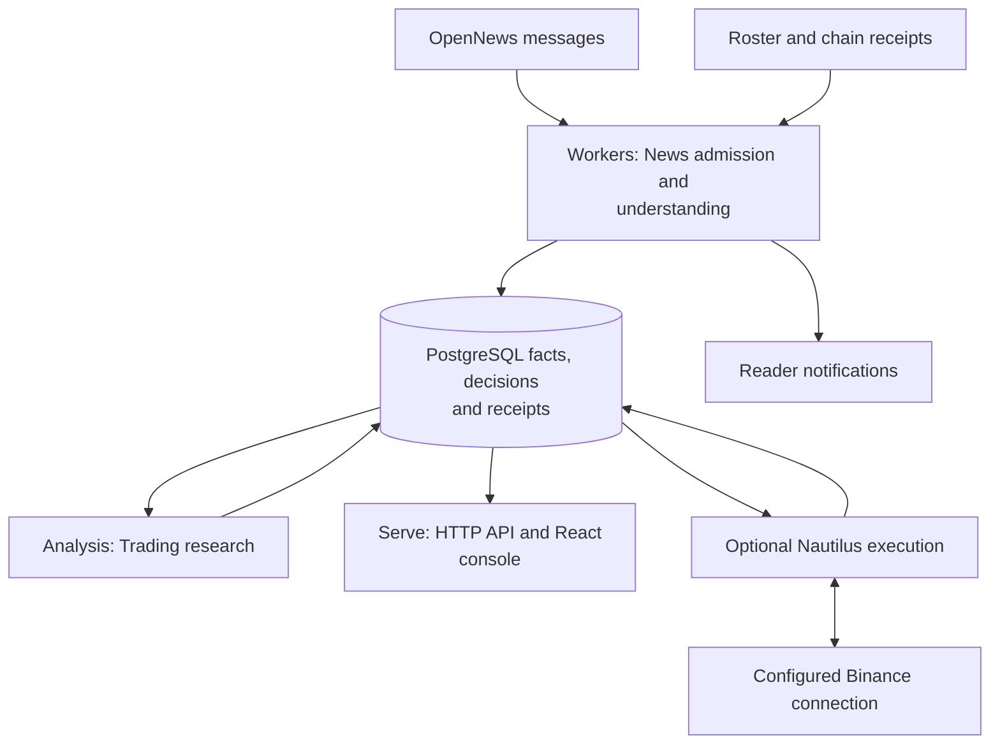

# Tracefold

**Evidence-first market research, news understanding, and separately controlled execution.**

Tracefold turns provider messages and on-chain receipts into durable, inspectable
facts. News understands editorial stories and publishes reader cards; Trading
researches eligible news catalysts and open-interest observations, records its
reasoning and decisions, and can publish account-scoped signals. A separate
Nautilus process owns execution against the configured Binance connection.

The React console exposes what was received, understood, decided, delivered, and
executed. These are different outcomes: a model answer is not a fact, a queued
card is not a sent receipt, and a signal is not an order fill.

## What is inside

| Capability | Implemented responsibility | Guide |
| --- | --- | --- |
| Editorial News | Source admission, incremental claim understanding, versioned EventUpdates, independent notification planning and on-demand cards | [News](docs/modules/news.md) |
| Market observations | Deterministic OI, liquidation and smart-money parsing; grouped notifications; independent Trading handoff | [OI and market data](docs/modules/oi.md) |
| Wallet activity | Followed-address roster, receipt-backed fills, concentrated net-buy episodes and independent price samples | [Wallets](docs/modules/wallets.md) |
| Trading Analysis | One target per source, bounded read-only Agent research, frozen Cases, TRADE / NO_TRADE / WATCH decisions | [Trading](docs/modules/trading.md) |
| Execution | Signal validation, scoped plans, venue orders, protection, reconciliation and native execution evidence | [Execution](docs/modules/execution.md) |
| News improvement | ReviewDesk for current intents and bounded card-judge calibration; legacy optimization/release execution removed | [Review and calibration](docs/modules/learning.md) |

## System at a glance



There are **two business capabilities** (`news`, `trading`) and **four process
roles** (`serve`, `workers`, `analysis`, `nautilus`). Process isolation does not
create additional business domains. Serve, Workers and Analysis share the
application image; Nautilus has a separate image and lifecycle.

News uses the merged EventUpdate path, not the retired three-predictor/GEPA
workflow. New catalysts and amendments reach Trading independently of reader delivery.

See [Architecture](docs/ARCHITECTURE.md) for the broker, transaction boundaries,
dependency graph and deployment topology. The [documentation index](docs/README.md)
identifies the reviewed source baseline and separates current guides from history.

## Run locally with Docker

Install Git, Make, [uv](https://docs.astral.sh/uv/), Docker with its Compose plugin,
`curl`, and the [GitHub CLI](https://cli.github.com/). Start the Docker daemon and
authenticate GitHub CLI for the repository's existing build/deployment preflight:

```bash
gh auth login --hostname github.com
git clone git@github.com:AnalyThothAI/tracefold.git
cd tracefold
make up
```

Open **http://127.0.0.1:8765/** after startup succeeds.

`make up` initializes operator files without replacing existing choices, builds
the Python/React application image, starts PostgreSQL and RabbitMQ, applies broker
policy and migrations, then starts Serve, Workers and Analysis. A failed required
startup boundary returns non-zero; it is not a successful deployment.

```bash
make status   # inspect application and configured execution readiness
make logs     # follow logs; Ctrl-C leaves services running
make down     # stop services, including execution; preserve data volumes
```

Generated defaults contain no live provider, model or delivery credentials.
An empty feed without a configured source is expected; it is not demo data.
Trading and execution require their own configuration, and signal publication is
disabled by default. **`make up` does not start or restart Nautilus.** Its explicit
`make runtime-*` lifecycle is documented in [Execution](docs/modules/execution.md).

### Configuration

The operator-owned configuration is **`~/.tracefold/config.yaml`**, generated by
`tracefold init`. There is no second maintained example config or `.env` fallback.
Secret files, archive, cache and logs live under the same operator directory.
Initialization preserves an existing config and passwords; `init --force` replaces
config and is not a routine upgrade command.

```bash
uv run tracefold config  # redacted configuration, not raw secrets
uv run tracefold --help
```

Configure only the capabilities needed: News source, model endpoint, delivery,
wallet sources, Trading analysis, and execution are separate concerns. Follow
[Setup](docs/SETUP.md) for the actual fields, file permissions and container mounts.
Do not paste live credentials into tracked files.

For the standard Compose network, run database/broker diagnostics in a container:

```bash
docker compose exec workers tracefold news bus-check
docker compose exec workers tracefold db audit
```

The generated config uses container-network addresses; it does not automatically
rewrite them for a host-side CLI. [Operations](docs/OPERATIONS.md) covers health,
incident diagnosis, backups, maintenance and authorized runtime controls.

## Find your way through the code

```text
tracefold/
  news/           editorial and market facts, delivery, wallets, review and calibration
  trading/        analysis contracts, pure policy, Cases, execution contracts
  integrations/   provider, broker, delivery, market and Nautilus adapters
  platform/       config, PostgreSQL, resource limits, identity, telemetry
  app/            process composition, HTTP/CLI, cross-capability mapping
web/              React operator console and frontend tests
scripts/          maintenance, generation and bounded research utilities
tests/            unit, architecture, contract, integration and deployment tests
notebooks/        offline research; not imported by production processes
```

Use the [file-by-file repository map](docs/generated/repository-map.md) to locate
an owner, then the relevant module guide to understand its behavior. The map is
generated from tracked paths and Python declarations; it is navigation, not a
claim that every line has been individually audited.

## Develop and verify

```bash
uv sync --frozen
make check        # hermetic static, architecture and contract checks
make test-fast    # broad hermetic checkpoint
```

Run focused tests while editing; use the full resource-backed lanes when the
change needs them. [Development](docs/DEVELOPMENT.md) explains the workflow and
[Testing](docs/TESTING.md) names the actual CI lanes. Frontend commands and layering
are in [Frontend](docs/FRONTEND.md); generated HTTP, CLI and database references
are indexed in [Contracts](docs/CONTRACTS.md).

A cohesive change includes its callers, tests, documentation and obsolete-path
removal. Agent entry points are [AGENTS.md](AGENTS.md) and [CLAUDE.md](CLAUDE.md).
Documentation, unit tests and historical replays do not establish live execution
or profitability; deployment and account control remain explicit operations.
