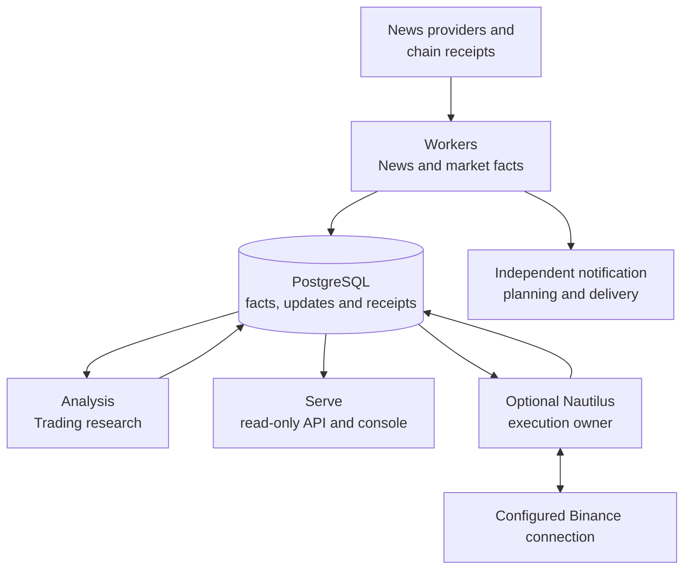

# Tracefold

**Evidence-first news research, market observations and separately controlled trading.**

Tracefold records provider messages and on-chain receipts, understands incremental
news changes, explains what is new, and exposes the evidence in a read-only React
console. Trading researches eligible catalysts and OI observations; an independent
Nautilus process owns execution against the configured Binance connection.

A source report, adopted claim, selected notification, sent receipt, trading decision
and venue fill are different facts. The system preserves those boundaries instead
of treating a model answer or an accepted command as proof of an external result.

## Capabilities

| Area | What runs | Guide |
| --- | --- | --- |
| News | Incremental claim extraction, versioned EventUpdates, evidence relationships, notification planning and on-demand cards | [News](docs/modules/news.md) |
| Market observations | Deterministic OI/liquidation/smart-money parsing and grouped notifications, independent of editorial News | [OI](docs/modules/oi.md) |
| Wallets | Followed-address roster, receipt-backed fills, concentrated net-buy episodes and separate price observations | [Wallets](docs/modules/wallets.md) |
| Trading Analysis | One eligible target, frozen evidence, bounded read-only ReAct research, TRADE / NO_TRADE / WATCH and optional Signal publication | [Trading](docs/modules/trading.md) |
| Execution | Scoped plans, actual orders/fills, protection, reconciliation and native economics | [Execution](docs/modules/execution.md) |
| Review | ReviewDesk and bounded card-judge calibration | [Review](docs/modules/review.md) |

## Architecture at a glance



There are **two business capabilities** (`news`, `trading`) and **four process
roles** (`serve`, `workers`, `analysis`, `nautilus`). Serve, Workers and Analysis
share the application image. Nautilus has a separate image and lifecycle.
[Architecture](docs/ARCHITECTURE.md) maps processes, package owners, durable state
and the public News-to-Trading handoff.

## Start the application

Install Git, Make, [uv](https://docs.astral.sh/uv/), Docker with the Compose plugin,
`curl` and [GitHub CLI](https://cli.github.com/). Start Docker and authenticate GitHub
CLI for the existing repository/deployment preflight. From the permitted main checkout:

```bash
gh auth login --hostname github.com
git clone git@github.com:AnalyThothAI/tracefold.git
cd tracefold
make up
```

Open **http://127.0.0.1:8765/** after startup succeeds.

`make up` initializes operator files, builds the Python/React image, starts
PostgreSQL/RabbitMQ, applies broker policy and migrations, then starts Serve,
Workers and Analysis. It preserves existing operator choices and persistent data.
It does **not** start or restart Nautilus. A failed required boundary returns non-zero.

```bash
make status-app
make logs
make down  # stops execution first as well; preserves data volumes
```

The application config is **`~/.tracefold/config.yaml`**, generated by `tracefold init`.
There is no repository-local credential file or `.env` fallback. Defaults contain
no external provider/model/delivery credentials. An empty feed without a source is
expected, not a reason to fabricate demo data. Trading, Signal publication and
execution have explicit independent settings; execution is disabled by default.

```bash
uv run tracefold config  # redacted configuration, never raw secrets
uv run tracefold --help
```

Follow [Setup](docs/SETUP.md) for credential-dependent capabilities, mounts and
container versus host addresses. [Operations](docs/OPERATIONS.md) owns diagnostics,
exact failed-work retries, backups and explicit execution lifecycle actions.

## Navigate and develop

```text
tracefold/news/          Items, EventUpdates, market facts, delivery and review
tracefold/trading/       Research contracts, pure policy, Cases and execution contracts
tracefold/integrations/  Provider, broker, delivery, market and Nautilus adapters
tracefold/platform/      Configuration, PostgreSQL, physical resources and telemetry
tracefold/app/           Process composition, HTTP/CLI and cross-capability mapping
web/                    Read-only React workbench and frontend tests
notebooks/              Offline research, preserved inputs and historical experiments
```

The [handbook](docs/README.md) routes each question to one maintained owner. Module
guides link directly to implementation and tests rather than duplicating every
function's docstring in an automatically expanded manual. [Generated contracts](docs/generated/README.md)
own the exact CLI/API/database shapes.

```bash
uv sync --frozen
make check
make test-fast
```

Use focused tests while editing and the appropriate resource-backed lanes for the
change. [Development](docs/DEVELOPMENT.md), [Testing](docs/TESTING.md) and
[Frontend](docs/FRONTEND.md) describe those workflows. Coding-agent entry points
are [AGENTS.md](AGENTS.md) and [CLAUDE.md](CLAUDE.md).

The former three-predictor News Program and its GEPA/release/canary execution are
not current capabilities. Historical studies remain in Git or their explicitly
historical research workspace, not mixed into the operating handbook. A test or
research return is not proof of production model quality, execution or profitability.
