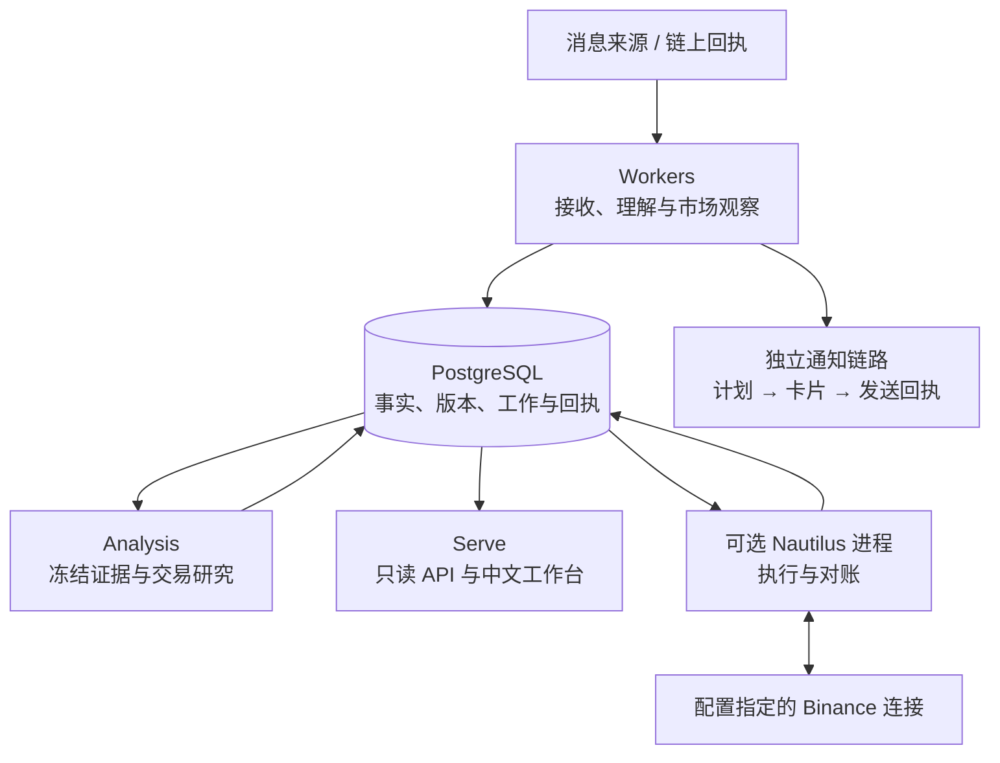

# Tracefold

### 从一条消息，到可追溯的研究与执行证据

**新闻增量理解 · 市场观察 · 链上净买入警报 · 交易研究 · 独立执行**

[快速开始](docs/SETUP.md) · [系统架构](docs/ARCHITECTURE.md) · [中文手册](docs/README.md) · [开发指南](docs/DEVELOPMENT.md) · [运维排障](docs/OPERATIONS.md)

---

Tracefold 是一个以证据为中心的市场研究系统。它保存原始消息和链上回执，将新闻中的新增事实、条件变化与更正组织成版本化 **EventUpdate**，独立决定哪些内容值得通知读者，再把符合条件的公开事实交给交易分析。

交易研究由受限的 DSPy Agent 完成；真正的订单、保护单与账户对账由独立的 Nautilus 进程负责。中文 React 工作台只读取已记录的事实、决策和结果，不在浏览器里下单。

> **报道不等于事实已兑现，模型建议不等于交易指令，指令受理不等于成交。**
> Tracefold 保留这些边界，让每一步都能回答：依据是什么、当时知道什么、实际发生了什么。

## 能做什么

| 能力 | 当前实现 | 深入阅读 |
| --- | --- | --- |
| **新闻理解** | 保存来源修订；抽取带引文的命题；识别复述、补充、阶段变化与更正；形成不可变 EventUpdate | [News](docs/modules/news.md) |
| **读者通知** | 按命题比较实际已发送正文；只为选中的内容生成中文卡片；记录真实发送结果 | [通知决策](docs/modules/news.md#notification) |
| **OI 与市场观察** | 确定性解析 OI、清算和大户报告；分组控制通知节奏，不经过编辑型新闻的模型链路 | [OI / 市场观察](docs/modules/oi.md) |
| **行情与事件复盘** | 类型化标的目录、当前报价快照，以及独立的新闻后 1h / 4h 价格反应 | [Market Review](docs/modules/market-review.md) |
| **钱包净买入** | 关注地址名单 → 完整链上回执 → 同窗口净买入 → 首报与当前快照；价格观察独立运行 | [Wallets](docs/modules/wallets.md) |
| **交易研究** | 单一合格标的、冻结证据、有限计划菜单、只读 ReAct 工具，输出 TRADE / NO_TRADE / WATCH | [Trading Analysis](docs/modules/trading.md) |
| **独立执行** | 消费有作用域的 Signal；账户检查、真实下单、保护、成交归属与对账 | [Execution](docs/modules/execution.md) |
| **复核与校准** | ReviewDesk 版本化复核与卡片评审器校准；不冒充自动训练发布闭环 | [Review](docs/modules/review.md) |

## 一张图理解系统



代码只有 **News、Trading 两个业务域**，运行时分为 **Serve、Workers、Analysis、Nautilus 四种角色**。前三者共用应用镜像；Nautilus 使用独立镜像与生命周期。RabbitMQ 承接原始输入和语义工作唤醒，PostgreSQL 保存需要恢复与审计的状态。

详细的进程拓扑、模块依赖、事务边界和跨域时序见[系统架构](docs/ARCHITECTURE.md)。

## 快速开始

### 1. 准备环境

需要 Git、Make、[uv](https://docs.astral.sh/uv/)、已启动的 Docker 与 Compose 插件、curl，以及已登录的 [GitHub CLI](https://cli.github.com/)。项目解释器固定为 Python 3.13，前后端依赖由锁文件管理。

```bash
# 登录 GitHub，获取仓库及构建所需的访问权限
gh auth login --hostname github.com
gh repo clone AnalyThothAI/tracefold
cd tracefold

# 在符合部署检查的 main 主检出目录执行
make up
```

启动成功后访问 **http://127.0.0.1:8765/**。

`make up` 不是裸 `docker compose up` 的别名：它检查源码与 CI 身份，初始化配置、构建镜像、准备 PostgreSQL / RabbitMQ、应用消息策略和数据库迁移，然后启动 Serve、Workers、Analysis。**它不会启动或重启 Nautilus。**

### 2. 配置实际需要的能力

唯一应用配置是 **`~/.tracefold/config.yaml`**，由 `tracefold init` 生成；`make up` 会调用初始化。配置不放在仓库目录，也没有 `.env` 回退配置。

| 初始状态 | 含义 |
| --- | --- |
| 没有新闻源凭据 | 不会产生虚构演示新闻；空列表可能是正常状态 |
| 没有完整模型配置 | 编辑型语义工作不能正常推进；市场确定性解析不是同一条能力 |
| 推送默认关闭 | 看到 EventUpdate 不代表已发送通知 |
| 交易分析、Signal 发布、执行分别控制 | 开启研究不等于允许下单；执行默认关闭 |

```bash
uv run tracefold config  # 查看脱敏配置，不输出原始密钥
make status-app         # 检查应用栈
make logs               # 查看主应用日志；Analysis 详见运维指南
```

完整的配置归属、容器地址、挂载、升级和可选执行操作见[安装与配置](docs/SETUP.md)。已有配置和数据会保留；不要用 `init --force` 或删除数据卷来代替故障诊断。

### 3. 停止服务

```bash
make down
```

这会先停止独立执行进程，再停止其余服务，**不会删除数据卷**。停止进程不等于账户已经平仓。

## 从哪里读源码

```text
tracefold/
├── news/          新闻、市场事实、钱包、通知与复核
├── trading/       交易研究契约、纯策略逻辑与交易存储
├── integrations/  消息、模型周边、行情、链上与执行适配
├── platform/      配置、PostgreSQL、资源和可观测性
└── app/           进程装配、HTTP / CLI、跨业务域映射
web/               React 工作台与前端测试
scripts/           检查、生成、部署与维护工具
tests/             单元、契约、架构与真实依赖测试
notebooks/         离线研究；历史实验不属于在线运行链路
```

新开发者可沿 **[架构](docs/ARCHITECTURE.md) → [模块手册](docs/README.md#modules) → 对应源码与测试** 阅读。每份模块文档解释入口、输入输出、状态、失败恢复与验证点，而不是复制全部函数声明。

```bash
uv sync --frozen
make check
make test-fast
```

这是开发验证，不是部署授权。修改文档时优先运行链接、生成入口和相关契约检查；数据库、消息队列与浏览器测试需要各自的隔离资源，见[测试指南](docs/TESTING.md)。

## 文档与边界

**文档描述同一版本源码，不证明某个部署已经健康。** 精确 CLI、HTTP 与数据库字段保留在[生成参考](docs/generated/README.md)，不手工翻译机器契约。模型调用数量取决于证据、命题、缓存和通知选择，不固定为“三次”。

旧版三预测器 News Program、GEPA / release / canary 在线流程与进程内 Paper 模拟执行不属于当前能力。历史研究和已应用迁移保留其原始语境；测试通过、研究收益与真实成交是不同证据。

开发入口：[AGENTS.md](AGENTS.md) · [CLAUDE.md](CLAUDE.md) · [贡献与开发](docs/DEVELOPMENT.md) · [安全边界](docs/SECURITY.md)
