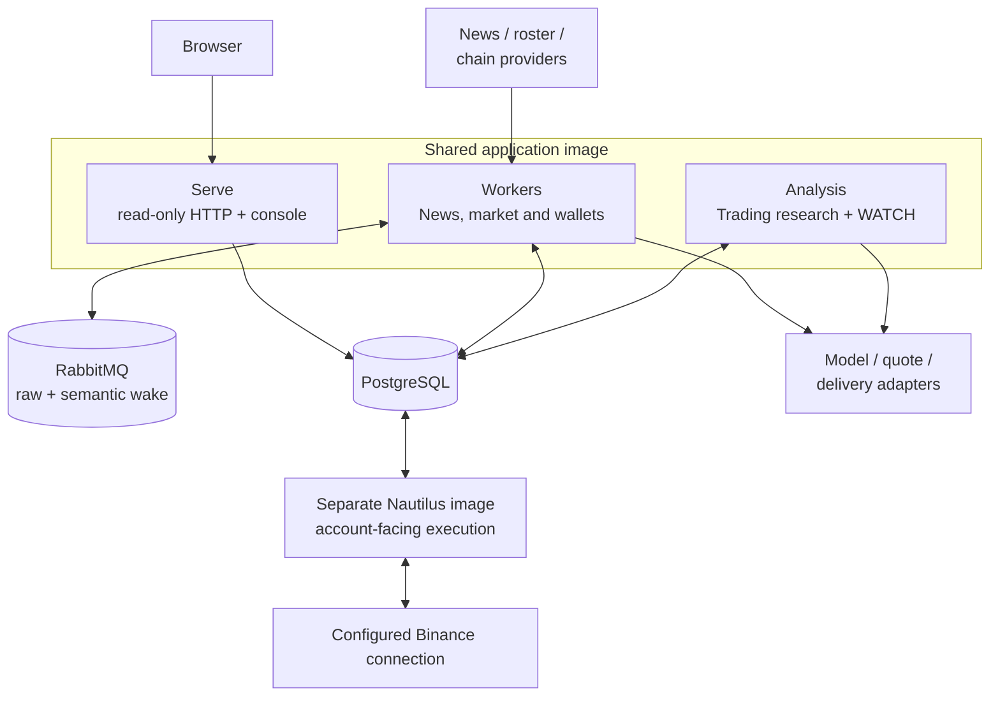
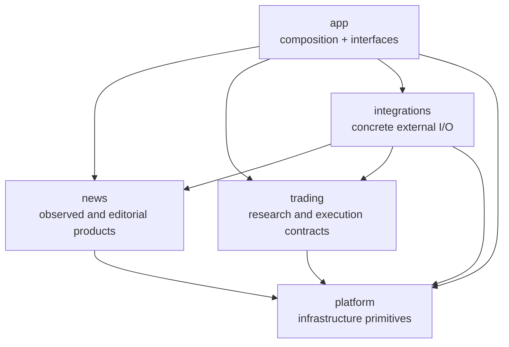
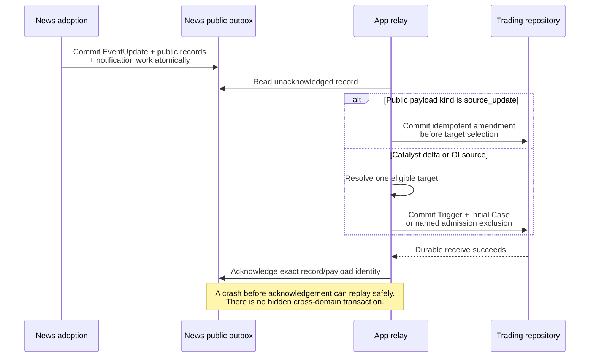
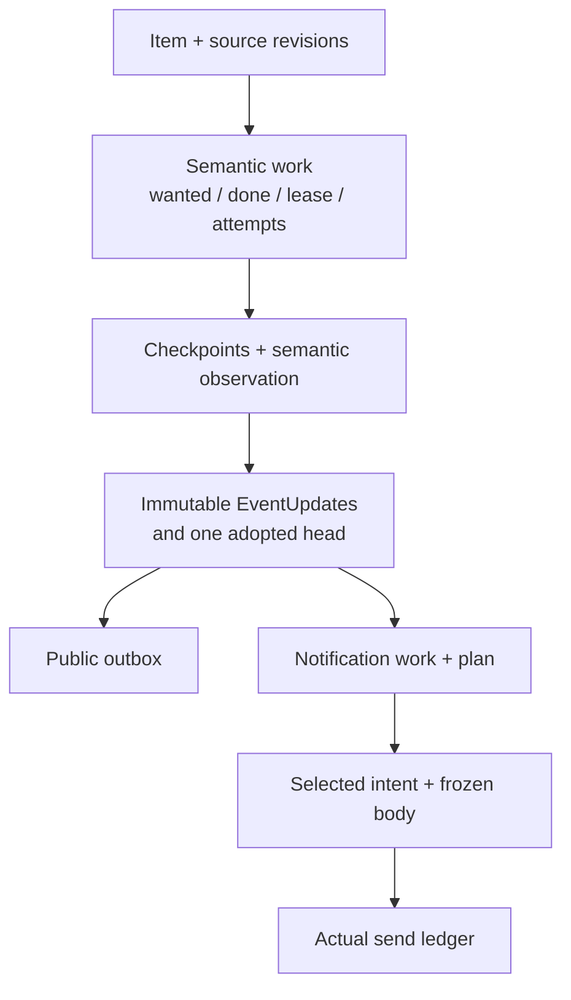

# Architecture

[Handbook](README.md) · [News](modules/news.md) · [Trading](modules/trading.md) · [Execution](modules/execution.md)

Tracefold is one codebase with **two business capabilities** and **four process
roles**. PostgreSQL holds durable observed facts, adopted knowledge, work and
receipts. External sources remain authoritative for their own evidence; the venue
is authoritative for actual execution. A cache, model result or queue is not an
alternative copy of business truth.

## 1. Process topology

[compose.yaml](../compose.yaml) owns service definitions and mounts.
[Makefile](../Makefile) owns the application/migration sequence and separate
Runtime lifecycle. One-shot broker policy and migration jobs prepare infrastructure;
they are not additional business services. `make up` waits for migration completion
before Serve/Workers/Analysis and does not restart Nautilus.

| Role | Composition entry | What it owns |
| --- | --- | --- |
| Serve | [serve_runtime.py](../tracefold/app/serve_runtime.py), [HTTP routes](../tracefold/app/http/routes/) | Persisted read projections and the bundled React console; no public mutation route. |
| Workers | [entrypoint.py](../tracefold/app/workers/entrypoint.py), [task_contract.py](../tracefold/app/workers/task_contract.py) | Reception, admission, semantic and notification work, market review, wallet tasks and maintenance. |
| Analysis | [trading_analysis.py](../tracefold/app/trading_analysis.py), [analysis_status.py](../tracefold/app/analysis_status.py) | Public-source relay, target mapping, fenced Cases, bounded Agent research, WATCH and research outcomes. |
| Nautilus | [app/nautilus](../tracefold/app/nautilus/), [runtime Strategy](../tracefold/integrations/nautilus/oi_runtime/strategy.py) | Scoped entry, actual orders, protection, native evidence and venue reconciliation. |

## 2. Package ownership and source navigation

There is no direct News-to-Trading import or internal-table read. App translates
public contracts and supplies database capabilities. Integration adapters may use
the explicit construction seams allowed by the architecture tests; that does not
turn an adapter into another business owner. Package imports perform no runtime I/O.

| Source area | Responsibility | Behavior guide |
| --- | --- | --- |
| [news/pipeline](../tracefold/news/pipeline/) | Source intake, admission, semantic worker, delivery and maintenance | [News](modules/news.md) |
| [news/events](../tracefold/news/events/), [updates](../tracefold/news/updates/) | Fact scope/grouping and versioned claim understanding/notification contracts | [News](modules/news.md) |
| [news/storage](../tracefold/news/storage/) | News-owned facts, input work, updates, plans, receipts and read projections | [News](modules/news.md) |
| [market notifications](../tracefold/news/market_notifications.py), [market_review](../tracefold/news/market_review/) | Typed observation notifications, catalogues, current quotes and Event reactions | [OI](modules/oi.md) |
| [news/chain_tape](../tracefold/news/chain_tape/) | Roster, complete receipt prefix, fills, detection and price sampling | [Wallets](modules/wallets.md) |
| [news/review](../tracefold/news/review/), [learning](../tracefold/news/learning/) | Retained ReviewDesk and card-judge calibration, not GEPA/release execution | [Review](modules/review.md) |
| [trading/engine](../tracefold/trading/engine/), [storage](../tracefold/trading/storage/) | Pure plans/decisions and Trading-owned sources, Cases, amendments and execution records | [Trading](modules/trading.md) |
| [app/news_updates.py](../tracefold/app/news_updates.py), [trading_analysis.py](../tracefold/app/trading_analysis.py) | Explicit cross-capability mapping and Analysis orchestration | [Trading](modules/trading.md) |
| [app/trading_analyst.py](../tracefold/app/trading_analyst.py), [trading_tools.py](../tracefold/app/trading_tools.py) | Bounded read-only ReAct and attributable tool/model calls | [Trading](modules/trading.md) |
| [integrations/nautilus](../tracefold/integrations/nautilus/) | The separate account-facing adapter and execution Strategy | [Execution](modules/execution.md) |
| [platform](../tracefold/platform/), [integrations](../tracefold/integrations/), [app](../tracefold/app/) | Configuration, physical resources, ports, provider I/O, process and interface composition | [Platform](modules/platform.md) |
| [web/src](../web/src/), [web/tests](../web/tests/) | Read-only feature-owned UI, queries, URL state and browser tests | [Frontend](FRONTEND.md) |
| [tests](../tests/), [scripts](../scripts/), [notebooks](../notebooks/) | Verification, narrow utilities and explicitly offline/historical research | [Testing](TESTING.md), [Notebooks](../notebooks/README.md) |

Source links are navigation, not a second specification of every helper. The owning
module guide identifies its principal interfaces and executable tests. Exact public
fields belong to [Contracts](CONTRACTS.md) and generated schemas.

## 3. News-to-Trading handoff

News adopts an EventUpdate independently of reader delivery. The public payload
`news_public_update_v1` carries claims, changes, citations and their identities,
not a model-generated ReaderCard.

| Input | Trading meaning |
| --- | --- |
| Editorial `catalyst_delta` payload | New/changed published claims can qualify for target selection. The outer News trade-event catalyst lane is not a separate model or card event. |
| Editorial `source_update` payload | An amendment to cited prior knowledge. No new Trigger/Case, fresh TTL, order cancellation or additional authority. |
| Typed OI source | Independent numeric source contract and source-key validity; no editorial Event prerequisite. |

A correction or real-world replacement can invalidate a still-unsubmitted entry
by explicit cited claim refs, including cross-Event refs. It does not by itself
close an existing position. Knowledge cutoffs and source availability remain part
of the frozen research record. `possible_new` and restatement are not fabricated
new catalysts. [Trading](modules/trading.md) owns the full Case/WATCH/Signal path.

## 4. Durable ownership, not one overall Event state

These are dependency/ownership edges, not unconditional success transitions. Input
can finish without a changed head; the latest failed input preserves the previous
head; a completed plan can coexist with a dead card. A notification receipt cannot
be inferred from semantic success. [News](modules/news.md) documents each persisted
axis and exact failed-work retry.

For execution, PostgreSQL plans record intent; the venue and reconciled Nautilus
Cache provide position/order evidence. A current account read, a Runtime heartbeat
and native-fill completeness answer different questions. Unknown venue data is
not flat, and a Signal is not a fill.

## 5. Transactions, resource completion and supervision

The caller owns each short transaction. Repositories operate on the supplied
connection/capability and do not hide commits. Model/provider/filesystem I/O stays
outside it; expensive preparation precedes the bounded SQL/lock/conditional-write
portion. Native I/O permits remain held until the physical operation actually ends,
not merely until an asyncio timeout is raised.

| Atomic boundary | Recovery ownership |
| --- | --- |
| Item evidence revision and semantic work | Stable source identities and current wanted revision; admission/redelivery remains inspectable. |
| Frozen semantic lease/input | Owner token and per-revision attempts; a stale worker cannot settle a successor. |
| Adopted update, public outbox and notification work | Head compare-and-swap and lease ownership; no card generation inside the commit. |
| Trading decision, Case transition and eligible Signal | Claim/lease, source validity, scope and identity validation. |
| Complete wallet receipt facts and progress | Continuous committed prefix, not the maximum observed block. |
| External side effect | Persist intent first and actual provider outcome later; uncertain outcomes require specific reconciliation. |

[NewsPipeline.runners](../tracefold/news/pipeline/root.py) and
[task_contract.py](../tracefold/app/workers/task_contract.py) declare the actual tasks.
`news-semantic` consumes the retained `news.triage` queue. Foundational ingestion
and shared database/ownership failures differ from a named optional capability
fault. A task existing does not prove it is configured or making progress.

The architecture tests enforce [backend ownership](../tests/architecture/test_backend_boundaries.py)
and [Trading boundaries](../tests/architecture/test_trading_boundaries.py).
[Operations](OPERATIONS.md) owns diagnosis; [Migrations](MIGRATIONS.md) owns schema
cuts; [Security](SECURITY.md) owns credentials and authority. Do not infer a new
runtime gate or an extra business service from a historical issue's design vocabulary.
