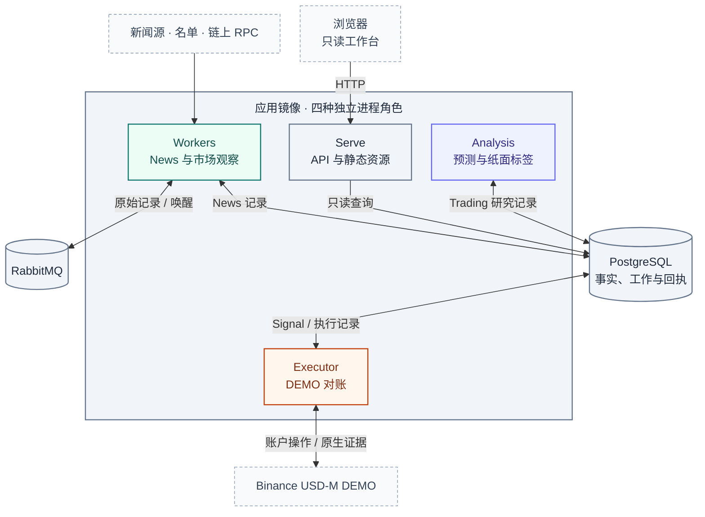
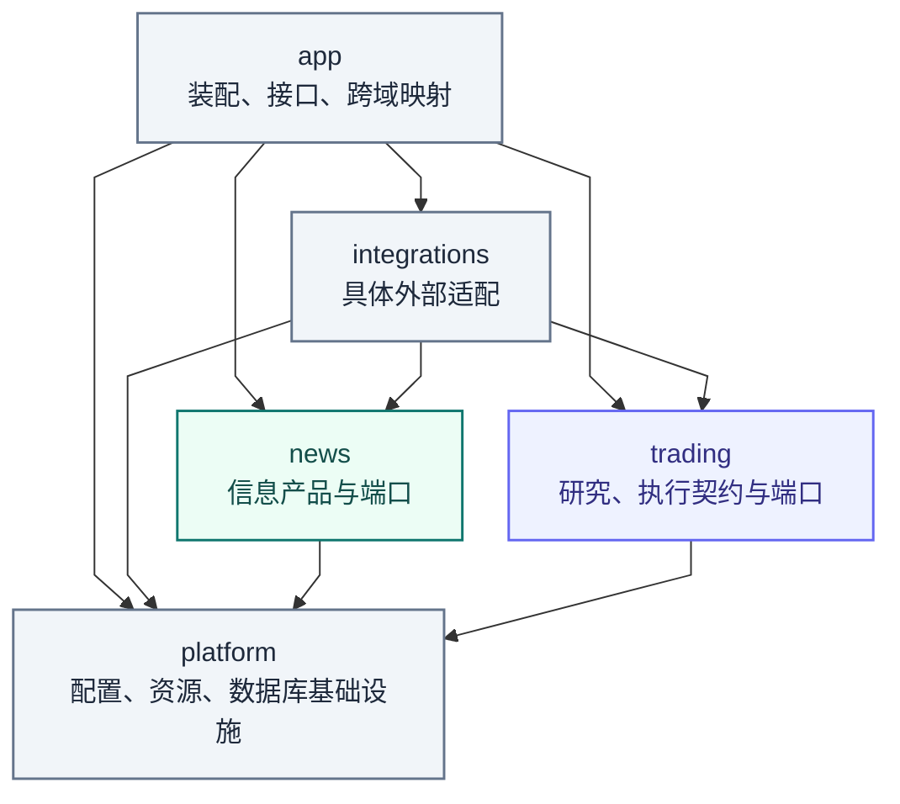
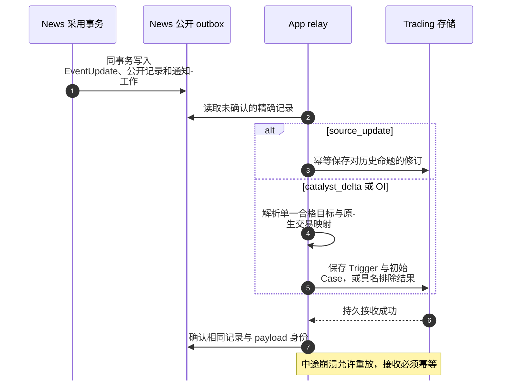
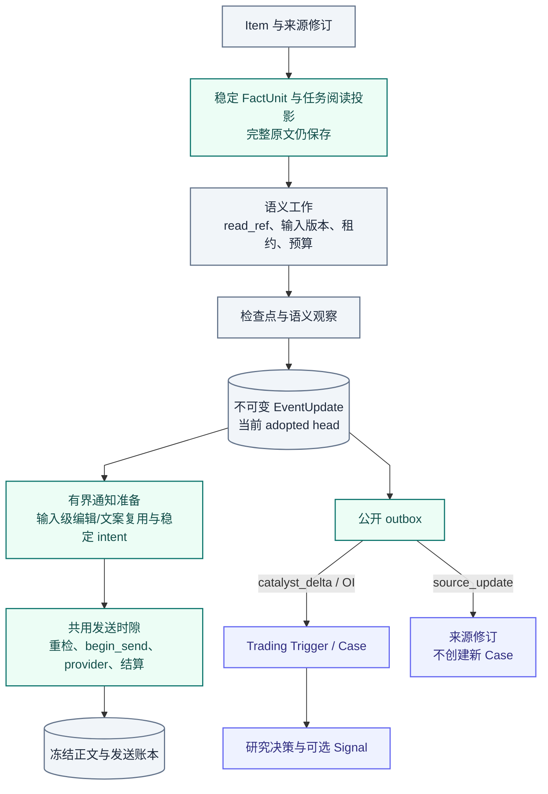

# 系统架构

[手册](README.md) · [News](modules/news.md) · [Trading](modules/trading.md) · [Platform](modules/platform.md)

Tracefold 是一个代码仓库、两个业务域、四种进程角色。**News 负责信息产品，Trading 负责交易研究与执行契约。**

业务域定义谁拥有事实和规则；进程角色定义这些工作在哪里运行。Workers 运行 News，Analysis 运行 Trading 研究，Executor 运行 DEMO 账户执行，Serve 读取两域的公开投影。四个角色共用应用镜像，保留各自生命周期和权限。

`tracefold.app` 映射公开契约并装配运行依赖。News 与 Trading 各自拥有事实和表，跨域交接经过公开契约；Platform 提供配置、数据库资源和监督机制。核心对象的含义见[统一术语](../CONTEXT.md)。

本页是当前系统地图。细节以链接的源码和模块手册为准；箭头表达调用或数据依赖，不代表跨系统事务或无条件成功。

<strong>本页目录</strong>

1. [架构图谱](#section-架构图谱)
2. [进程与部署拓扑](#section-进程与部署拓扑)
3. [包依赖与源码导航](#section-包依赖与源码导航)
4. [三类输入不是同一条流水线](#section-三类输入不是同一条流水线)
5. [News → Trading：先持久接收，再确认来源](#section-news--trading先持久接收再确认来源)
6. [数据归属与独立状态轴](#section-数据归属与独立状态轴)
7. [事务、恢复与外部副作用](#section-事务恢复与外部副作用)
8. [验证与文档边界](#section-验证与文档边界)

## 01 · 架构图谱

**先选视图，再读箭头。** 同一系统可以有部署、依赖、数据和时序四种不同投影；它们不能相互替代。

| 视图 | 回答的问题 | 深入阅读 |
| :--- | :--- | :--- |
| [部署拓扑](#deployment) | 哪些进程运行，谁访问数据库与账户？ | [安装配置](SETUP.md) · [Platform](modules/platform.md) |
| [包依赖](#packages) | 代码依赖沿什么方向，领域在哪里隔离？ | [源码责任地图](#source-map) |
| [跨域时序](#handoff) | News 何时成为 Trading 的持久来源？ | [研究链路](modules/trading.md) |
| [数据归属](#ownership) | 输入、知识、通知与研究各保存什么？ | [News 状态](modules/news.md#state) |
| [权限与执行](SECURITY.md#model-authority) | 模型可以做什么，谁拥有账户权限？ | [Execution](modules/execution.md) |

**图例。** 方框为进程、模块或产物，圆柱为持久存储或队列，菱形为实际条件分支；节点中的文字始终是语义依据。青绿表示信息产品，靛蓝表示交易研究，橙色表示账户执行，灰色表示共享存储或运行基础；颜色不代表成功、可信度或风险等级。

每张图的图注单独定义箭头。依赖图的箭头是 import 方向；数据图是产物关系；时序图的虚线是回复，**不能统一解释成“只读”**。节点边框为虚线时表示外部来源，不意味着接口没有副作用。

## 02 · 进程与部署拓扑

*部署视图 · 连线说明角色与依赖的访问关系；同一应用镜像不等于同一进程或相同权限。模型、公共行情和通知适配的职责见下表。*

| 角色 | 实际入口 | 拥有的职责 | 不承担的职责 |
| --- | --- | --- | --- |
| Serve | [serve_runtime.py](../tracefold/app/serve_runtime.py)、[HTTP routes](../tracefold/app/http/routes/) | 读取持久化投影、提供 React 静态文件 | 模型重跑、公开写接口、下单 |
| Workers | [entrypoint.py](../tracefold/app/workers/entrypoint.py)、[task_contract.py](../tracefold/app/workers/task_contract.py) | 消息接收、准入、语义、通知、标的目录、当前报价、钱包与维护 | Trading Analysis 生命周期、账户执行 |
| Analysis | [trading_analysis.py](../tracefold/app/trading_analysis.py)、[trading_assessor.py](../tracefold/app/trading_assessor.py) | 来源转交、LIVE CaseView、冻结预测、六策略、两腿纸面结果 | 发送新闻卡片、向交易所写订单 |
| Executor | [app/executor.py](../tracefold/app/executor.py)、[REST 适配](../tracefold/integrations/trading/binance.py) | Signal / 操作意图消费、订单、保护、原生成交与对账 | 新闻理解、重新决定 ReaderCard 内容 |

[compose.yaml](../compose.yaml)定义镜像、依赖、挂载与探针；[Makefile](../Makefile)提供薄命令入口，[scripts/deploy.py](../scripts/deploy.py)统一持锁、启动、迁移等待、镜像和就绪验收。[make/checks.mk](../make/checks.mk)只拥有开发验证，不进入服务启动链路。`rabbitmq-policy`、`migrate` 是一次性准备作业，不是额外业务服务。`make up` 等迁移成功后启动应用角色，executor 随应用镜像部署，启用交易时持有 DEMO 账户执行权限。

News 命题嵌入在 Workers 进程内使用固定 MiniLM FP32 ONNX，权重保存在挂载缓存，应用镜像不含权重。只有显式 `tracefold news embedding prepare` 会下载；运行时离线加载并做黄金向量自检，失败只使稠密路线降级。推理和模型加载在专用有界执行器、数据库事务之外完成，向量随精确文本版本持久化。

### 外部访问不是所有角色共享

| 角色 | 主要外部访问 | 账户订单写权限 |
| :--- | :--- | :--- |
| Serve | 持久化读模型和本地静态 / 冻结材料 | 无 |
| Workers | 新闻源、名单、链上 RPC、新闻模型、公共行情与通知提供商 | 无 |
| Analysis | 研究模型、受限公共市场证据 | 无 |
| Executor | Binance USD-M DEMO 账户、订单和原生成交 | 仅 DEMO，独立于 Analysis 模型 |

> [!NOTE]
> `make up` 管理应用角色；是否启用其中的模型或研究能力由配置决定。Executor 随应用镜像管理；账户权限由执行配置、账户状态和场所证据决定。

## 03 · 包依赖与源码导航

*依赖视图 · 箭头为允许的代码依赖方向，不是消息流。News 与 Trading 之间没有直接箭头。*

**News 与 Trading 不直接导入对方内部实现，也不直接查询对方内部表。** App 将公开值对象映射为另一侧需要的契约。适配器在架构测试允许的装配接缝使用具体实现，不因此获得另一套业务决策权。模块导入阶段不执行运行时 I/O。

<strong>展开源码责任地图</strong>

| 目录或入口 | 当前职责 | 行为文档 |
| --- | --- | --- |
| [news/pipeline](../tracefold/news/pipeline/) | 接收、恢复、准入、语义 Worker、投递与维护 | [新闻](modules/news.md) |
| [news/events](../tracefold/news/events/) | FactUnit 范围、实体 grounding、候选归组、去重辅助 | [新闻输入](modules/news.md#input) |
| [news/updates](../tracefold/news/updates/) | 增量命题提取、关系判断、版本化采用与公开更新；`NewsAgent` 拥有语义工作流 | [新闻 Agent](modules/news.md#agent) |
| [news/notifications](../tracefold/news/notifications/) | 回执召回、通知政策、卡片与发送状态；`Notifications` 拥有通知工作流 | [通知链路](modules/news.md#notification) |
| [news/adapters](../tracefold/news/adapters/) | DSPy 提取、语义判断、读者判断与文案的具体模型适配 | [模型边界](modules/news.md#agent) |
| [news/storage](../tracefold/news/storage/) | News 事实与短事务；语义、通知使用各自存储接口和显式 SQL 协作者 | [新闻状态](modules/news.md#state) |
| [market_notifications.py](../tracefold/news/market_notifications.py) | OI / 清算 / 大户 / 钱包通知的确定性分支与发送循环 | [市场观察](modules/oi.md) |
| [news/market_review](../tracefold/news/market_review/) | 标的目录、当前报价与发送时行情 | [行情复盘](modules/market-review.md) |
| [news/chain_tape](../tracefold/news/chain_tape/) | 名单、回执完整前缀、成交解释与净买入 | [钱包](modules/wallets.md) |
| [news/learning](../tracefold/news/learning/) | 卡片评审器与固定语料校准 | [复核](modules/review.md) |
| [trading/engine](../tracefold/trading/engine/) | 类型化目标、LIVE 特征、双腿几何、预测策略与记分纯函数 | [交易研究](modules/trading.md) |
| [trading/executor](../tracefold/trading/executor/) | Signal v4、入场准入与执行生命周期纯状态决策 | [执行](modules/execution.md) |
| [trading/storage](../tracefold/trading/storage/) | Trigger、Case、修订、研究和执行记录 | [交易状态](modules/trading.md) |
| [app/news_updates.py](../tracefold/app/news_updates.py) | News 语义、判断路由与通知的装配 | [新闻 Agent](modules/news.md#agent) |
| [app/trading_intake.py](../tracefold/app/trading_intake.py)、[trading_analysis.py](../tracefold/app/trading_analysis.py) | News 公开更新映射、接收确认及研究调度 | [跨域交接](#handoff) |
| [integrations/trading](../tracefold/integrations/trading/) | DEMO 账户签名 REST 执行适配 | [执行](modules/execution.md) |
| [platform](../tracefold/platform/)、[app](../tracefold/app/)、[integrations](../tracefold/integrations/) | 配置、资源、数据库、进程装配与外部 I/O | [平台](modules/platform.md) |
| [web/src](../web/src/)、[web/tests](../web/tests/) | 只读工作台、路由、查询和浏览器验证 | [前端](FRONTEND.md) |
| [scripts](../scripts/)、[tests](../tests/)、[notebooks](../notebooks/) | 生成与维护、验证、独立离线研究 | [开发](DEVELOPMENT.md)、[测试](TESTING.md) |

## 04 · 三类输入不是同一条流水线

| 输入 | News 的处理 | 下游 |
| --- | --- | --- |
| 编辑型消息 | Item 修订 → FactUnit / Event → 命题理解 → EventUpdate | 独立通知；符合条件的公开新闻更新 |
| OI / 清算 / 大户报告 | 已识别来源契约 → 确定性解析 → 类型化观察或显式解析失败 | 市场通知；OI 可独立进入交易研究 |
| 链上回执 | 已发布名单 → 完整回执前缀 → 成交解释 → 净买入 episode | 钱包通知与链上事实详情 |

OI 不先通过编辑型新闻模型；钱包首报不先经过 LLM 或价格收益评估。三者共用必要基础设施和发送适配，但不共用一套虚构的“总评分”或 Event 状态。

编辑型新闻由两个业务工作流所有者处理：`NewsAgent` 抽取、理解并采用知识；`Notifications` 选择通知并完成持久发送。召回器为判断选择输入，模型提供理解证据，代码检查身份、版本和通知规则。

`NotificationSender` 执行冻结发送，行情查询和回执编辑由各自协作者负责。它们经唯一 `InitialSendEntry` 共享发送时隙，`DelivererLoop` 负责调度。实体特征由纯 [entities.py](../tracefold/news/entities.py) 提供。具体输入、产物和事务时序见 [News 手册](modules/news.md)。

## 05 · News → Trading：先持久接收，再确认来源

*时序视图 · 编号帮助定位调用顺序；回复虚线不表示只读。News 与 Trading 的提交、broker 确认各有边界。*

采用的编辑型内容通过 `news_public_update_v1` 发布，由 [public.py](../tracefold/news/updates/public.py)从命题、变更与引用生成，**不是把卡片正文喂给另一个 Agent**。

| 公开类型 | 消费语义 |
| --- | --- |
| `catalyst_delta` | 合格的新增或变化命题可以成为研究触发源；复述与 `possible_new` 不自动成为新催化 |
| `source_update` | 在选标的之前保存历史命题修订；不创建新 Case、不续期、不自动撤单或平仓 |
| 类型化 OI 来源 | 保留独立 measurement 与 source-key 语义；无需先有编辑型 Event |

修订按显式 claim refs 指向旧知识，可能跨 Event。它可以让尚未发布的决策在发布资格检查中以 `source_corrected` 被拒绝；已发布 Signal 不因此自动撤销，修订本身也没有处理现有仓位的权限。冻结 Case 的知识截止时间不会被后来修订改写。

## 06 · 数据归属与独立状态轴

*数据视图 · 箭头表示产物关系，不是数据库外键。source_update 不创建新 Case；此图止于研究与通知，账户证据另见 Execution。*

这是**概念数据关系**，不是物理外键 ER 图。精确表、列和约束见[数据库生成参考](generated/db-schema.md)。

### 当前账本结构

当前 schema head 为 `20261003_0430`，包含 19 张 News 表、7 张 Trading 表及 `runtime_processes`、`alembic_version`，共 28 张表。表集合由 [audit.py](../tracefold/platform/postgres/audit.py)校验，版本由 [Alembic](../tracefold/platform/postgres/alembic/versions/)维护。

| 持久所有者 | 主要记录 | 当前作用 |
| --- | --- | --- |
| News 输入与语义 | `news_items`、`news_event_members`、`news_events`、`news_analyses`、`news_jobs` | 来源修订、范围与工作、不可变采用文档和当前 head |
| News 召回与读者 | `news_claim_index`、`news_reader_clock`、`news_notifications` | 精确文本向量与 FTS 投影、读者 CAS 围栏、冻结通知及真实结果 |
| News 市场与链上 | `news_market_observations`、`news_collectors`、`news_market_wallets`、钱包 fills / events | 类型化市场事实、采集进度、名单成员区间与链上事实 |
| News 对外交接 | `news_trade_events` | Trading 尚未确认或已确认的公开来源记录 |
| Trading 研究 | `trading_inputs`、`trading_cases` | 接收与修订、冻结模型输入/预测、六策略和双腿纸面标签 |
| Trading 执行 | `trading_entries`、`trading_accounts`、`trading_orders`、`trading_fills`、`trading_operator_intents` | Signal / Plan 生命周期、账户控制与对账、原生订单成交和本地操作意图 |
| Platform | `runtime_processes` | 进程身份与心跳；不替代业务进度或账户证据 |

这些是表组与职责摘要，完整列、约束和其他 News 目录/报价/缓存表由生成参考维护。召回索引可重建；reader clock 提供事务内并发围栏。两者不能代替其所引用的采用文档与发送事实。

| 状态轴 | 能回答的问题 | 不能推断的结论 |
| --- | --- | --- |
| 输入工作版本 | 最新证据是否已处理、谁持有租约、还可重试几次 | 当前 adopted head 一定是最新输入的结果 |
| 已采用知识 | 哪些命题、引用与变更已成为当前版本 | 读者已经收到通知 |
| 通知计划 / 卡片 | 选择了什么、正文是否冻结、生成是否失败 | 外部提供商已经成功发送 |
| 实际发送结果 / 已送回执 | 精确正文、sent / not_sent / ambiguous 结果，及 sent 的 provider 回执 | 允许交易、存在成交 |
| Case / 决策 / 发布 | 研究用了什么、决定什么、是否产生 Signal | 交易所接受或成交 |
| 账户 / 保护 / 原生历史 | 当前仓位是否已核实、是否有保护、原生成交与手续费证据是否完整 | 仅靠进程存活就能判断账户安全或已平仓 |

最新语义输入失败时，旧的有效 head 仍可读；无实质变化时，done 可以前进而内容版本不增加。通知与交易分析可以在同一条新闻上独立成功、失败或暂缓。

### 为什么这些状态分别保存

例如，一条“暂停提现”的命题已经采用，发送卡片时 provider 连接中断。如果无法证明卡片是否送达，发送结果记为 `ambiguous`，保留重复发送保护；采用版本仍然有效。公开来源已经交给 Trading 时，研究也可以继续。

这时要查发送意图、冻结正文和 provider 结果。重跑来源或改写知识版本不能证明送达，也不能消除外部结果的不确定性。通知恢复见[News 状态](modules/news.md#state)与[精确恢复](OPERATIONS.md#news-retry)；账户执行必须另外检查场所证据。

## 07 · 事务、恢复与外部副作用

| 边界 | 当前恢复机制 |
| --- | --- |
| Item 证据与语义工作 | 同事务提交；再发送唤醒并记录发布，维护任务补偿遗漏 |
| 语义处理 | 冻结输入、owner token、lease、版本级尝试预算、检查点复用 |
| EventUpdate 采用 | 比较当前 head 并条件更新；同事务生成公开 outbox 与通知工作 |
| 通知发送 | 先记录意图和精确正文；等待共用发送时隙、完成目标预检，再以短事务重检并记录 sending；事务外发送并在释放时隙前结算实际结果；不盲重试未知结果 |
| Trading 研究完成 | 校验 Case 所有权，保存冻结预测和六策略；发布前核实来源与 DEMO 执行器 |
| 钱包采集 | 完整交易事实与连续进度一起提交，不能跳过未完成回执 |
| 交易所写操作 | 命令与计划只是意图；通过交易所 REST 回执和对账确定真实结果 |

数据库事务由调用方拥有，仓储不隐藏提交。模型、网络、文件 I/O 在事务外完成；昂贵的序列化、验证和哈希也不占着数据库连接执行。RabbitMQ ack 与 PostgreSQL commit 是两个边界，不能写成“一个跨系统原子事务”。

物理操作与调用方超时也不是一回事：阻塞线程或数据库请求未真正结束时，资源许可不能提前释放。[平台文档](modules/platform.md)解释资源所有权、Workers 任务和故障隔离。

## 08 · 验证与文档边界

[后端边界测试](../tests/architecture/test_backend_boundaries.py)与[Trading 边界测试](../tests/architecture/test_trading_boundaries.py)约束依赖方向。模块手册链接可执行行为测试；[契约](CONTRACTS.md)维护接口语义；[运维](OPERATIONS.md)维护实际操作。

边界测试约束跨域依赖、SQL 所有权、公开运行入口和退役路径。队列 `news.triage` 的名称保留协议拼写，当前用途是语义唤醒；Analysis 的纸面双腿是基于 LIVE 行情的离线结果标签，账户订单仍由 DEMO Executor 按场所证据处理。

---

[返回文档中心](README.md) · [架构图谱](ARCHITECTURE.md#atlas) · [返回顶部](#系统架构)
