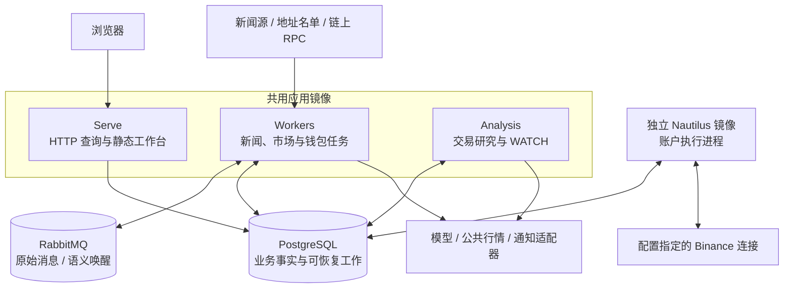
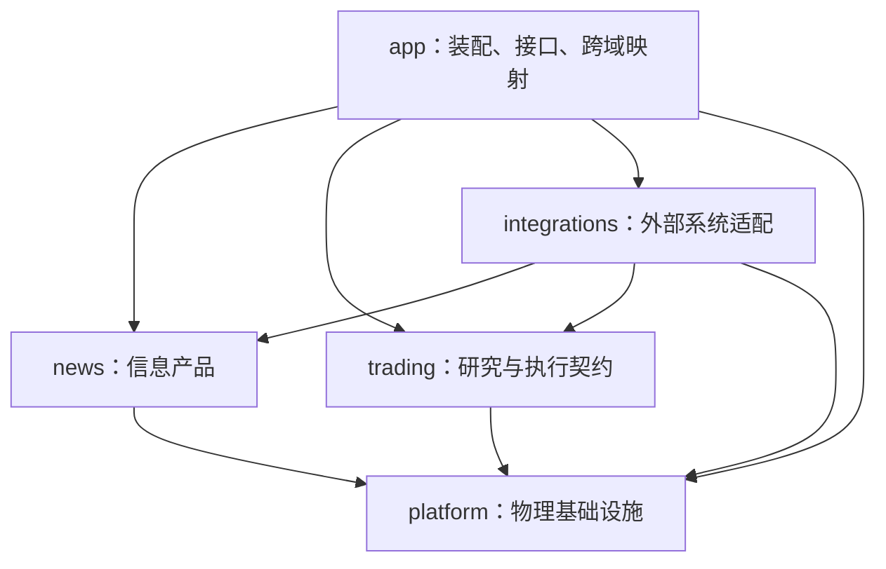
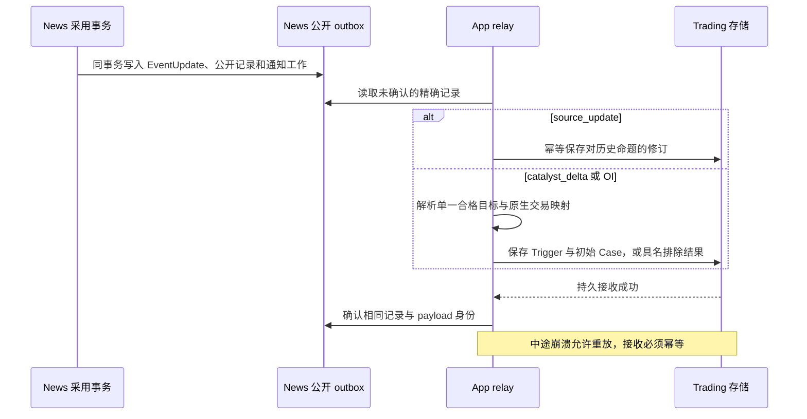
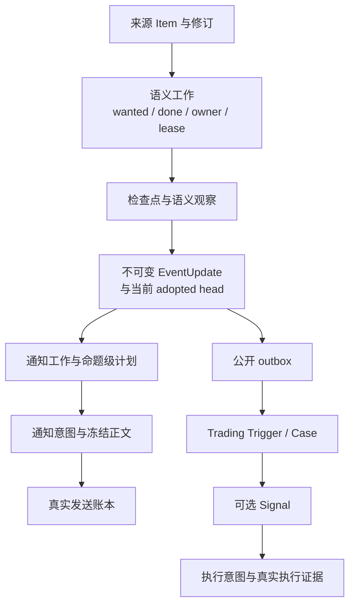

# 系统架构

[手册](README.md) · [News](modules/news.md) · [Trading](modules/trading.md) · [Platform](modules/platform.md)

Tracefold 是一个代码仓库、两个业务域、四种进程角色。**News 负责信息产品，Trading 负责交易研究与执行契约；App 装配两者，不把两套业务合并成一个巨大 Agent。**

本页是当前系统地图。细节以链接的源码和模块手册为准；箭头表达调用或数据依赖，不代表跨系统事务或无条件成功。

## 1. 进程与部署拓扑

| 角色 | 实际入口 | 拥有的职责 | 不承担的职责 |
| --- | --- | --- | --- |
| Serve | [serve_runtime.py](../tracefold/app/serve_runtime.py)、[HTTP routes](../tracefold/app/http/routes/) | 读取持久化投影、提供 React 静态文件 | 模型重跑、公开写接口、下单 |
| Workers | [entrypoint.py](../tracefold/app/workers/entrypoint.py)、[task_contract.py](../tracefold/app/workers/task_contract.py) | 消息接收、准入、语义、通知、行情复盘、钱包与维护 | Trading Analysis 生命周期、账户执行 |
| Analysis | [trading_analysis.py](../tracefold/app/trading_analysis.py)、[trading_analyst.py](../tracefold/app/trading_analyst.py) | 来源转交、标的选择、Case、受限研究、WATCH 与研究结果 | 发送新闻卡片、向交易所写订单 |
| Nautilus | [app/nautilus](../tracefold/app/nautilus/)、[Strategy](../tracefold/integrations/nautilus/oi_runtime/strategy.py) | Signal / 操作意图消费、订单、保护、原生成交与对账 | 新闻理解、重新决定 ReaderCard 内容 |

[compose.yaml](../compose.yaml)定义镜像、依赖、挂载与探针；[Makefile](../Makefile)定义启动和迁移顺序。`rabbitmq-policy`、`migrate` 是一次性准备作业，不是额外业务服务。`make up` 等迁移成功后启动应用角色，Nautilus 始终单独管理。

## 2. 包依赖与源码导航

**News 与 Trading 不直接导入对方内部实现，也不直接查询对方内部表。** App 将公开值对象映射为另一侧需要的契约。适配器在架构测试允许的装配接缝使用具体实现，不因此获得另一套业务决策权。模块导入阶段不执行运行时 I/O。

| 目录或入口 | 当前职责 | 行为文档 |
| --- | --- | --- |
| [news/pipeline](../tracefold/news/pipeline/) | 接收、恢复、准入、语义 Worker、投递与维护 | [新闻](modules/news.md) |
| [news/events](../tracefold/news/events/) | FactUnit 范围、实体 grounding、候选归组、去重辅助 | [新闻输入](modules/news.md#input) |
| [news/updates](../tracefold/news/updates/) | 增量命题理解、版本化采用、通知选择、DSPy 适配、公开更新 | [新闻 Agent](modules/news.md#agent) |
| [news/storage](../tracefold/news/storage/) | News 事实、工作、更新、回执及查询投影 | [新闻状态](modules/news.md#state) |
| [market_notifications.py](../tracefold/news/market_notifications.py) | OI / 清算 / 大户 / 钱包通知的确定性分支与发送循环 | [市场观察](modules/oi.md) |
| [news/market_review](../tracefold/news/market_review/) | 标的目录、当前报价、固定期限 Event Reaction | [行情复盘](modules/market-review.md) |
| [news/chain_tape](../tracefold/news/chain_tape/) | 名单、回执完整前缀、成交解释、净买入与价格采样 | [钱包](modules/wallets.md) |
| [news/review](../tracefold/news/review/)、[learning](../tracefold/news/learning/) | ReviewDesk、保留的卡片评审与校准 | [复核](modules/review.md) |
| [trading/engine](../tracefold/trading/engine/) | 类型化目标、证据、特征、有限计划和纯决策编译 | [交易研究](modules/trading.md) |
| [trading/storage](../tracefold/trading/storage/) | Trigger、Case、修订、研究和执行记录 | [交易状态](modules/trading.md#state) |
| [app/news_updates.py](../tracefold/app/news_updates.py)、[trading_analysis.py](../tracefold/app/trading_analysis.py) | News 公开更新映射、接收确认及研究调度 | [跨域交接](#handoff) |
| [integrations/nautilus](../tracefold/integrations/nautilus/) | 账户侧执行适配与 Strategy | [执行](modules/execution.md) |
| [platform](../tracefold/platform/)、[app](../tracefold/app/)、[integrations](../tracefold/integrations/) | 配置、资源、数据库、进程装配与外部 I/O | [平台](modules/platform.md) |
| [web/src](../web/src/)、[web/tests](../web/tests/) | 只读工作台、路由、查询和浏览器验证 | [前端](FRONTEND.md) |
| [scripts](../scripts/)、[tests](../tests/)、[notebooks](../notebooks/) | 生成与维护、验证、独立离线研究 | [开发](DEVELOPMENT.md)、[测试](TESTING.md) |

## 3. 三类输入不是同一条流水线

| 输入 | News 的处理 | 下游 |
| --- | --- | --- |
| 编辑型消息 | Item 修订 → FactUnit / Event → 命题理解 → EventUpdate | 独立通知；符合条件的公开新闻更新 |
| OI / 清算 / 大户报告 | 已识别来源契约 → 确定性解析 → 类型化观察或显式解析失败 | 市场通知；OI 可独立进入交易研究 |
| 链上回执 | 已发布名单 → 完整回执前缀 → 成交解释 → 净买入 episode | 钱包通知、详情与独立价格观察 |

OI 不先通过编辑型新闻模型；钱包首报不先经过 LLM 或价格收益评估。三者共用必要基础设施和发送适配，但不共用一套虚构的“总评分”或 Event 状态。

## 4. News → Trading：先持久接收，再确认来源

采用的编辑型内容通过 `news_public_update_v1` 发布，由 [public.py](../tracefold/news/updates/public.py)从命题、变更与引用生成，**不是把卡片正文喂给另一个 Agent**。

| 公开类型 | 消费语义 |
| --- | --- |
| `catalyst_delta` | 合格的新增或变化命题可以成为研究触发源；复述与 `possible_new` 不自动成为新催化 |
| `source_update` | 在选标的之前保存历史命题修订；不创建新 Case、不续期、不自动撤单或平仓 |
| 类型化 OI 来源 | 保留独立 measurement 与 source-key 语义；无需先有编辑型 Event |

修订按显式 claim refs 指向旧知识，可能跨 Event。它可以让尚未提交的入场以 `source_corrected` 被拒绝，但本身没有处理现有仓位的权限。冻结 Case 的知识截止时间不会被后来修订改写。

## 5. 数据归属与独立状态轴

这是**概念数据关系**，不是物理外键 ER 图。精确表、列和约束见[数据库生成参考](generated/db-schema.md)。

| 状态轴 | 能回答的问题 | 不能推断的结论 |
| --- | --- | --- |
| 输入工作版本 | 最新证据是否已处理、谁持有租约、还可重试几次 | 当前 adopted head 一定是最新输入的结果 |
| 已采用知识 | 哪些命题、引用与变更已成为当前版本 | 读者已经收到通知 |
| 通知计划 / 卡片 | 选择了什么、正文是否冻结、生成是否失败 | 外部提供商已经成功发送 |
| 实际发送回执 | 精确正文及 sent / not_sent / ambiguous 结果 | 允许交易、存在成交 |
| Case / 决策 / 发布 | 研究用了什么、决定什么、是否产生 Signal | 交易所接受或成交 |
| 账户 / 保护 / 原生历史 | 当前仓位是否已核实、是否有保护、费用与资金费率覆盖是否完整 | 仅靠进程存活就能判断账户安全或已平仓 |

最新语义输入失败时，旧的有效 head 仍可读；无实质变化时，done 可以前进而内容版本不增加。通知与交易分析可以在同一条新闻上独立成功、失败或暂缓。

## 6. 事务、恢复与外部副作用

| 边界 | 当前恢复机制 |
| --- | --- |
| Item 证据与语义工作 | 同事务提交；再发送唤醒并记录发布，维护任务补偿遗漏 |
| 语义处理 | 冻结输入、owner token、lease、版本级尝试预算、检查点复用 |
| EventUpdate 采用 | 比较当前 head 并条件更新；同事务生成公开 outbox 与通知工作 |
| 通知发送 | 先记录意图和精确正文；事务外发送；再记录实际结果；不盲重试未知结果 |
| Trading 研究完成 | 校验 Case 所有权、来源有效性与作用域，原子保存决策及可发布 Signal |
| 钱包采集 | 完整交易事实与连续进度一起提交，不能跳过未完成回执 |
| 交易所写操作 | 命令与计划只是意图；通过交易所回执、Cache 和对账确定真实结果 |

数据库事务由调用方拥有，仓储不隐藏提交。模型、网络、文件 I/O 在事务外完成；昂贵的序列化、验证和哈希也不占着数据库连接执行。RabbitMQ ack 与 PostgreSQL commit 是两个边界，不能写成“一个跨系统原子事务”。

物理操作与调用方超时也不是一回事：阻塞线程或数据库请求未真正结束时，资源许可不能提前释放。[平台文档](modules/platform.md)解释资源所有权、Workers 任务和故障隔离。

## 7. 验证与文档边界

[后端边界测试](../tests/architecture/test_backend_boundaries.py)与[Trading 边界测试](../tests/architecture/test_trading_boundaries.py)约束依赖方向。模块手册链接可执行行为测试；[契约](CONTRACTS.md)维护接口语义；[运维](OPERATIONS.md)维护实际操作。

旧类名、队列名或目录名可能保留历史拼写，例如 `news.triage` 与 `oi_runtime`。它们不能证明旧的三预测器 Program、OI 专属下单通道或 Paper 模拟器仍在运行。当前能力由实际装配与调用路径决定。
