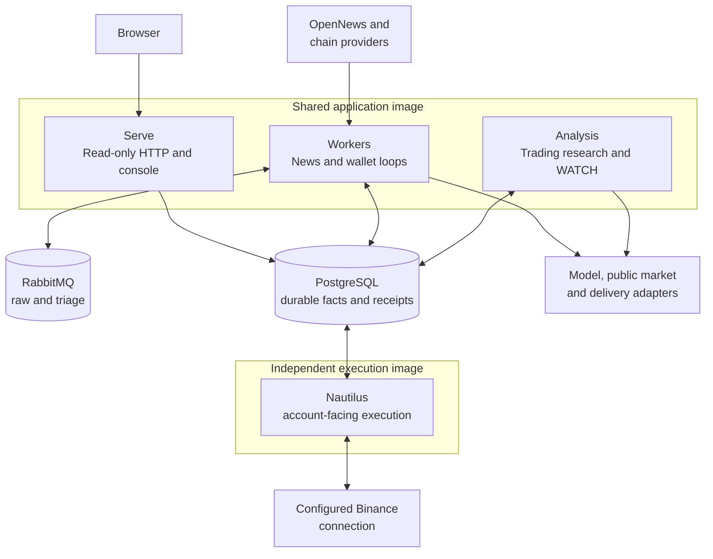
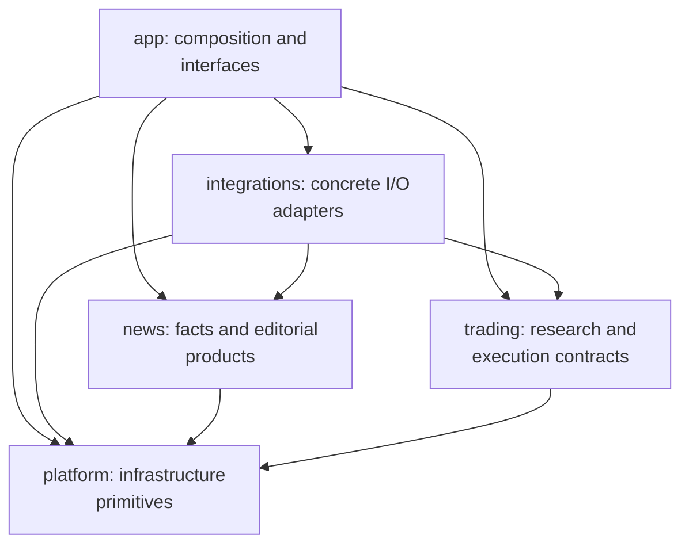
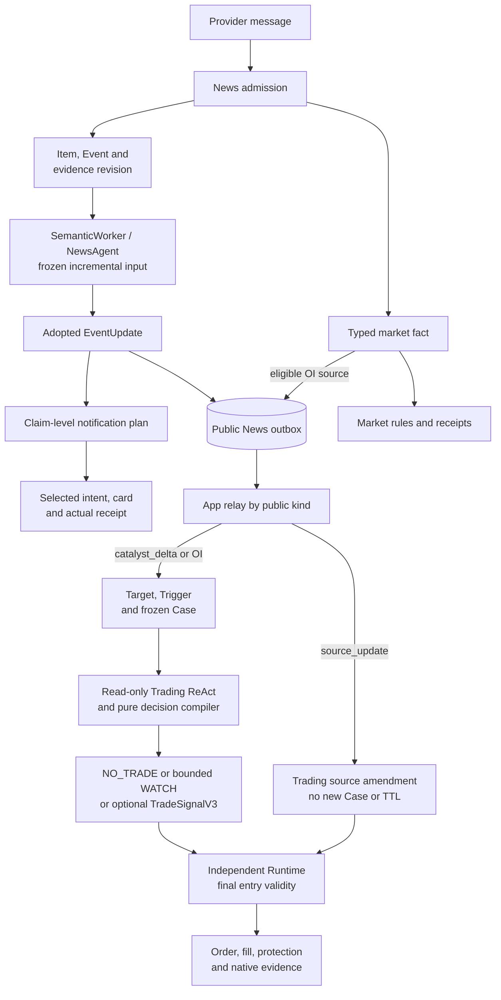
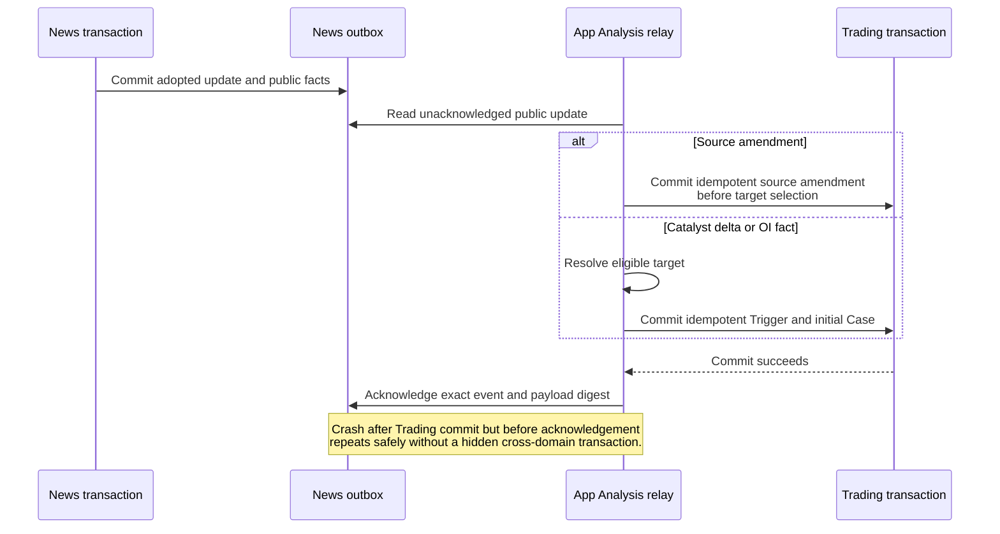

# Architecture

Tracefold has two sibling business capabilities, **News** and **Trading**, composed
into four process roles. PostgreSQL stores durable facts, decisions and receipts;
external providers and the execution venue remain authoritative for their own
observations. See the [reviewed baseline](README.md) and [module guides](README.md#start-with-a-question).

## 1. Deployment topology

The service names and commands are defined by [compose.yaml](../compose.yaml),
not by this diagram. [Makefile](../Makefile) waits for migration completion before
starting `serve`, `workers` and `analysis`. `make up` does not restart `nautilus`;
its `make runtime-*` targets own that lifecycle. [Setup](SETUP.md) documents actual
operator prerequisites, mounts and the startup sequence.

| Process | Composition entry | Responsibility and failure boundary |
| --- | --- | --- |
| Serve | [serve_runtime.py](../tracefold/app/serve_runtime.py), [HTTP](../tracefold/app/http/) | Expose persisted read projections through a read-only pool; no browser command or hidden analysis in a read request. |
| Workers | [entrypoint.py](../tracefold/app/workers/entrypoint.py), [task_contract.py](../tracefold/app/workers/task_contract.py) | Supervise News tasks; foundational ingestion or shared infrastructure failure differs from one optional capability fault. |
| Analysis | [trading_analysis.py](../tracefold/app/trading_analysis.py), [analysis_status.py](../tracefold/app/analysis_status.py) | Relay sources, claim Cases, perform bounded research, observe WATCH conditions and write research outcomes. |
| Nautilus | [root.py](../tracefold/app/nautilus/root.py), [oi_runtime.py](../tracefold/app/nautilus/oi_runtime.py) | Own the account-facing execution lifecycle, reconciliation and execution evidence. |

A configured capability, a constructed task, a running process and observed
business progress are different facts. Readiness must not hide required ingestion
failure; an unavailable optional model must not fabricate results or erase source data.

## 2. Dependency direction

There is deliberately **no News-to-Trading import or internal SQL dependency**.
App translates public News contracts into Trading contracts. Integrations implement
the relevant ports; they do not become a new business truth store. Package roots
perform no runtime I/O. [Backend boundary tests](../tests/architecture/test_backend_boundaries.py)
and [Trading boundary tests](../tests/architecture/test_trading_boundaries.py)
enforce the implemented rules, including allowed composition seams.

| Owner | What belongs here | Detailed guide |
| --- | --- | --- |
| `news` | Items, Events, versioned EventUpdates, notification receipts, market facts, wallets and review/calibration | [News](modules/news.md), [OI](modules/oi.md), [Wallets](modules/wallets.md), [Review and calibration](modules/learning.md) |
| `trading` | Trigger/Case contracts, pure market features and policy, account-scoped Signals, control and execution ledgers | [Trading](modules/trading.md), [Execution](modules/execution.md) |
| `integrations` | OpenNews, broker, delivery, venue, public-market and Nautilus adapters | [Platform](modules/platform.md) |
| `platform` | Config, secure files, PostgreSQL, migrations, physical resource limits and telemetry | [Platform](modules/platform.md) |
| `app` | HTTP/CLI, process ownership, database-port implementations and cross-capability mapping | [Platform](modules/platform.md) |
| `web` | Read projections, UI interaction and explicit operator commands | [Frontend](FRONTEND.md) |

## 3. End-to-end data flow

A reader card is not the public Trading input. News adopts structured claims and
changes first; it can publish a catalyst delta and/or source amendment independently
of notification success. A source amendment does not create a new Case, refresh
freshness or issue an account command. It can invalidate a not-yet-submitted entry
against explicitly cited claims. OI preserves its own source-key contract.

WATCH is bounded observation followed by a conditional child analysis, not an
unbounded recursive loop or an automatic order on a price touch. Wallet detection
is another News input path, not an automatically implemented Trading strategy.

### The cross-capability handoff

`AnalysisRunner.relay_once` and [App public mapping](../tracefold/app/news_updates.py)
own dispatch. Trading reads its own amendment/Case records, never News tables.
Invalid payloads have named rejection outcomes; a lookup timeout does not mean
the source was consumed. Historical headline/why payloads are not compatibility
inputs on the new editorial path.

## 4. Truth, derived views and control

| Kind | Examples | What it establishes |
| --- | --- | --- |
| Observed source facts | Provider Item, typed OI observation, chain receipt/fill | What the system observed, with provenance and uncertainty. |
| Frozen decisions and evidence | Adopted EventUpdate, accepted review, Case manifest, selected plan | What that owner decided using those inputs at that cutoff. |
| External receipts | Sent card, signed venue trade, execution observation | An actual observed result, not merely an intent. |
| Work and authority | Work claims, leases, notification work, operator command | Who may act and what remains to do. |
| Derived projections | Quote snapshot, Event reaction, episode current snapshot, API status | A read model with an identified writer and freshness meaning. |

A queue is a handoff, not an audit database. A model is a reader of evidence, not
an authority to alter facts or place orders. Nautilus Cache is a reconciled venue
projection; PostgreSQL plans record intent, not a competing position state machine.
An unavailable venue read is unknown, never flat.

## 5. Transaction and recovery boundaries

The caller owns the transaction. Repositories use the supplied connection rather
than hiding commits. Provider/model/network/file I/O stays outside short database
transactions; adapters retain their physical permits until the real operation ends.

| Boundary | Atomic durable unit | Recovery rule |
| --- | --- | --- |
| News admission | Item plus editorial membership/evidence or typed market fact | Stable source/fact identities make redelivery inspectable and idempotent. |
| Editorial adoption | EventUpdate, public outbox and pending notification work | Lease ownership and head compare-and-swap protect the current content revision. |
| Trading settlement | Decision, Case transition and eligible Signal | Claim token, lease, source version and account scope are checked. |
| Wallet collection | Complete receipt facts and derivation progress | Stop at a real receipt gap; replay from the continuous committed prefix. |
| External send/order | Persisted intent before I/O; receipt after I/O | Unknown results require provider-specific reconciliation, not blind resubmission. |

Exact conditional-write predicates remain in the linked storage owners. These
summaries are not replacements for schema constraints or a promise of exactly-once
external side effects.

## 6. Operational and development navigation

[Operations](OPERATIONS.md) owns diagnostics, [Migrations](MIGRATIONS.md) owns
schema cutovers, and [Security](SECURITY.md) owns credential and command authority.
[Development](DEVELOPMENT.md) and [Testing](TESTING.md) own verification. The
[file-by-file map](generated/repository-map.md) covers the current tracked tree;
[generated contracts](generated/README.md) own exact CLI/API/database shapes.

Historical OpenTrade/DeepAgents proposals, the retired OI-only signal policy and
the retired three-predictor/GEPA News plane are not additional live paths. Keep historical evidence
in its indexed context and change the current module guide with the implementation.
