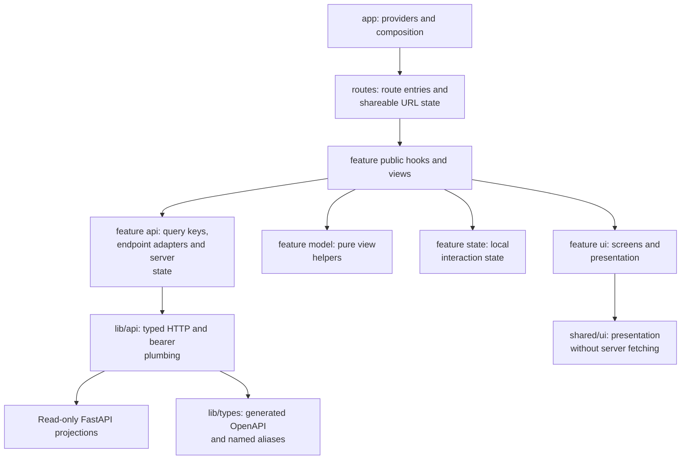
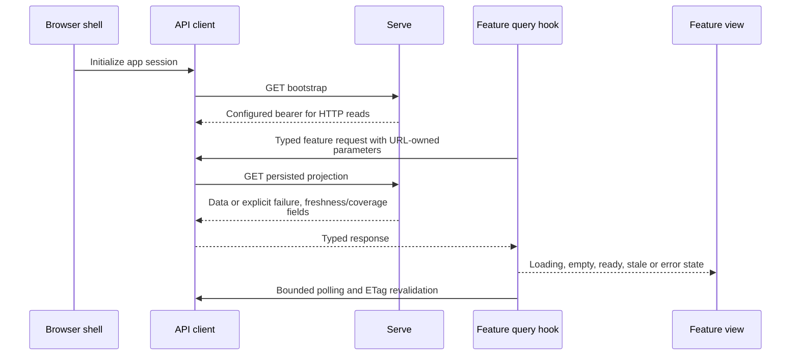

# Frontend: a read-only operator workbench

[Handbook](README.md) · [Architecture](ARCHITECTURE.md) · [Contracts](CONTRACTS.md)

The React console lets a reader inspect editorial News, market observations,
wallet episodes, Trading decisions and execution evidence. **It has no command or
order authority.** Every current public API operation is GET; operator writes use
their explicit CLI/control boundary. There is no browser WebSocket client.

## 1. Source layers



| Location | Responsibility |
| --- | --- |
| [src/app](../web/src/app/) | App composition, session initialization and root behavior; no feature query/renderer ownership. |
| [src/routes](../web/src/routes/) | Route selection, parsing/serializing shareable URL state and loading/error boundaries. |
| [features/news](../web/src/features/news/) | News feed/detail/status, market observations, wallet episodes and symbol views. |
| [features/trading](../web/src/features/trading/) | Read-only Case/decision and execution monitoring. |
| [features/cockpit](../web/src/features/cockpit/) | Workbench shell composition. |
| `features/*/api` | Feature-owned server reads, query keys and reusable hooks. |
| `features/*/model` | Pure labels, filter interpretation, view models and arithmetic. |
| `features/*/state` | Narrow client interaction state, not a duplicate server cache or hidden URL filter. |
| `features/*/ui` | Feature presentation through props or public feature hooks. |
| [shared](../web/src/shared/) | Reusable UI/hooks/query/routing helpers without new business ownership. |
| [lib/api](../web/src/lib/api/), [lib/types](../web/src/lib/types/) | Typed client, auth plumbing, generated types and explicit frontend aliases. |
| [styles](../web/src/styles/) | Shared tokens and global styles; feature styles stay with their owner. |

Import another feature through its public index or the sanctioned shell entrypoint,
not its private files. Do not recreate retired `api/`, `store/` or `components/`
roots. Source-boundary tests and lint enforce the actual allowed imports.
The linked source directories are the live navigation map; individual files stay
with their feature rather than a second generated catalog.

## 2. Data loading and freshness



The source owners are [useAppSession.ts](../web/src/app/useAppSession.ts),
[API client](../web/src/lib/api/), and feature API hooks. Requests use the current
origin; [Vite](../web/vite.config.ts) proxies `/api` during development.
Bootstrap's field name `ws_token` is historical, not a live socket feature.

Feature hooks own server reads and polling. Route modules and presentational UI
must not acquire raw queries or patch another feature's cache. Missing, zero,
pending and stale are different values. A refresh failure may preserve clearly
marked stale data; it must not manufacture a fresh result or hide a cold failure.

## 3. Product surfaces and what they mean

| Surface | Read responsibility | Important distinction |
| --- | --- | --- |
| News feed / Event detail | Adopted update, source evidence, semantic progress, claim-level notification reasons and reader receipts | Source Item, adopted content revision, work progress and sent card are different facts. |
| Market list / Item detail | Typed observations, parser status, group coverage and notification outcome | A notification group is not an editorial Event or Trading Case. |
| Wallet list / episode detail | First/current snapshot, member evidence, historical episodes and price observations | Roster metadata is not a fill; missing baseline is not zero return. |
| Symbol view | Typed identity and related reads owned by their endpoints | A same-named equity and coin are not interchangeable. |
| Trading decisions | Source → frozen Case → Agent/decision/publication explanation | A TRADE action is not proof a Signal was published or filled. |
| Execution monitor | Runtime/account evidence, scoped plans, native executions and attributable economics | Unavailable account data is not a verified flat account. |

Event detail renders the current update and processing state; older verdicts are
explicit `legacy_verdict` history, not synthesized claims. Retired four-axis taxonomy
filters are gone. See [News](modules/news.md) for the three independent state dimensions.

The backend [contract inventory](CONTRACTS.md) owns the actual API route templates.
Frontend pages must not add a speculative route because an old issue or screenshot
contained it. Historical replay views read archived evidence; opening them does
not rerun the model or execute a strategy.

## 4. Navigation and shareable state

News queries, filters and supported time scope are URL-owned through route/model
helpers. Wallet selected episode and history pagination use their owning helpers.
Trading tabs/selected Case use the Trading route owner. A hard reload or shared
link must preserve the query's meaning; do not hide filters in a singleton store.

The topbar search is News search, not a generic token/address/provider search.
Feature views must distinguish a real empty result from an error or a still-loading
page. Back navigation retains the documented route context rather than reconstructing
an older filter from stale local state. There is no independent subscription
registry, cross-feature socket cache or manual-order drawer to keep synchronized.

## 5. Visual and accessibility contract

The current workbench is a restrained light Chinese-reading interface.
[styles/tokens.css](../web/src/styles/tokens.css) owns semantic colors, type, radius,
depth and focus; it is not duplicated as numerical rules in this manual.
Shared `PageShell`, `PageHeader` and `PageReadingContent` own page geometry and
reading width. Feature CSS must not override the shell to invent another page grid.

Scan/workspace and detail/case archetypes retain a stable header and shell across
loading, error, empty and ready states. Numbers need consistent tabular alignment;
status/financial meaning must be expressed in text rather than color alone.
Use accessible names, real controls, visible focus and appropriate keyboard
behavior. Missing evidence gets an explicit explanation, not a misleading green badge.

Pure design-token/component changes, route/data changes and backend contract
changes require different verification. Preserve the owning architecture checks
rather than adding an unrelated UI process gate for a docs-only change.

## 6. Build and test

From `web/`:

```bash
npm ci
npm run dev
npm run typecheck
npm run lint
npm run test:unit
npm run test:architecture
npm run build:checked
```

The complete scripts live in [package.json](../web/package.json). The build serves
through the normal backend image; `npm run preview` is a local static preview, not
a replacement for the backend's bootstrap/API behavior.

| Test directory | Evidence |
| --- | --- |
| [unit](../web/tests/unit/) | Pure model, route-state and helper behavior. |
| [component](../web/tests/component/) | Components/hooks and feature API behavior. |
| [routes](../web/tests/routes/) | App/route integration and navigation state. |
| [architecture](../web/tests/architecture/) | Import, CSS, test-placement and compatibility boundaries. |
| [e2e/golden-paths](../web/tests/e2e/golden-paths/) | Required viewport/interaction behavior with intercepted APIs. |
| [e2e/full-stack](../web/tests/e2e/full-stack/) | Browser smoke against real FastAPI static/bootstrap/API reads. |

Use `npm run test:e2e` and `npm run test:e2e:full-stack` for those corresponding
lanes. Intercepted fixtures prove UI behavior, not backend correctness or live
account state. Full-stack smoke does not prove venue execution. Record which
lane actually ran rather than reporting every UI scenario as verified.

## 7. Generated contract workflow

Change backend schemas and caller behavior together, run `make regen-contract`,
and inspect both OpenAPI and frontend type diffs. The generated
[openapi.ts](../web/src/lib/types/openapi.ts) is not hand-edited;
[frontend-contracts.ts](../web/src/lib/types/frontend-contracts.ts) owns the small
frontend envelope/alias layer. [Development](DEVELOPMENT.md) and
[Testing](TESTING.md) describe the broader CI contract.
