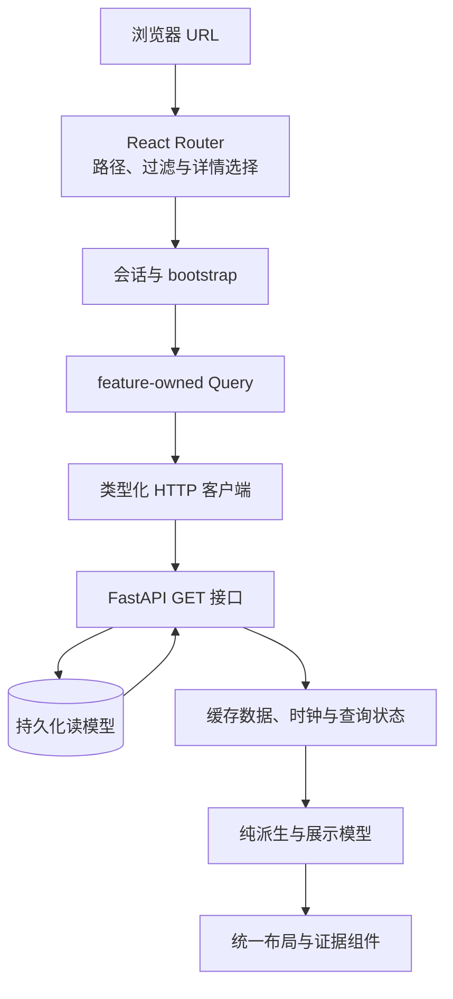

# Frontend：中文只读工作台

[手册](README.md) · [系统架构](ARCHITECTURE.md) · [接口契约](CONTRACTS.md) · [开发](DEVELOPMENT.md)

工作台负责把**已记录的事实、理解、决策与实际结果**呈现清楚，而不是把后端复杂度藏在一个绿色状态点后面。它不生成另一份业务账本，不在页面请求时重跑模型，也不提供浏览器下单入口。

## 1. 技术与目录

当前前端由 React 19、React Router 6、TanStack Query、TypeScript、Vite 和 Tailwind 构成；版本范围见 [package.json](../web/package.json)，实际解析版本由锁文件决定。

| 目录 | 所有者职责 |
| --- | --- |
| [src/app](../web/src/app/) | 应用装配、全局 provider 与会话接缝 |
| [src/routes](../web/src/routes/) | 路由定义、URL / 路由会话、页面装配和错误边界 |
| [src/features](../web/src/features/) | News、Trading、cockpit 等业务 feature 的公开入口 |
| feature 内 `api` | 查询键、请求、缓存和刷新；不让组件重复组织同一请求 |
| feature 内 `model` | 纯派生、格式与状态解释；不请求网络 |
| feature 内 `state` / `ui` | 交互状态 / 展示，不重复存储 URL 与服务器事实 |
| [src/shared](../web/src/shared/) | 可复用布局、控件与展示接缝；不拥有 feature 数据读取 |
| [src/lib](../web/src/lib/) | HTTP 客户端、类型、基础工具 |
| [src/styles](../web/src/styles/) | 设计 token 与共享样式 |
| [tests](../web/tests/) | 单元、组件、路由、架构与浏览器行为验证 |

依赖从路由装配进入 feature 的公开入口；跨 feature 不深挖私有实现。公共组件不偷偷发查询，纯模型不藏网络副作用。

## 2. 从 URL 到已记录证据



`/api/bootstrap` 返回当前读取所需的 `ws_token`。这个历史字段名不代表系统使用 WebSocket；当前页面通过 HTTP 查询 / 轮询读取，没有浏览器命令写权限。

Query 管理服务器状态，URL 管理可分享的筛选和详情位置，组件 state 管理短暂交互。不要再用全局 store 复制同一批记录，否则刷新、分享链接和浏览器后退容易看到三份不同状态。

## 3. 实际路由与页面职责

以 [router.tsx](../web/src/routes/router.tsx)为准：

| 路径 | 页面问题 | 主要数据 |
| --- | --- | --- |
| `/` | 导向新闻首页 | 重定向 `/news` |
| `/news` | 最近采用或通知的新闻是什么 | 新闻流与过滤 |
| `/news/events/:eventId` | 一件新闻如何从证据走到知识与通知 | EventUpdate、语义进度、意图和实际回执 |
| `/news/status` | News 哪些能力正常，哪里没有推进 | 业务状态、时间与错误 |
| `/news/market` | 当前哪些类型化市场观察值得查看 | 观察组、通知节奏与具名原因 |
| `/news/market/:itemId` | 这一条市场记录到底解析了什么 | 原始 Item、测量、组内上下文 |
| `/news/wallets` | 哪些代币出现集中净买入 | 名单 / 覆盖、episode、成员、首报与当前快照 |
| `/news/symbols/:base` | 这个类型化资产关联哪些信息 | 身份、新闻、报价与窗口数据 |
| `/trading` | 研究做了什么，账户实际执行了什么 | Case / replay、执行记录与角色状态 |

Trading 的 tab / case 等页面选择由路由会话保留，不应复制一套客户端状态机。旧 Radar、Review 写页面和 `/app/*` 路径不属于当前产品；未知页面显示明确未找到状态。

## 4. 新闻页面不是旧 verdict 页面

Event 详情应分别呈现：最新 wanted 输入是否完成、当前 adopted head 是哪一版、命题与引文如何变化、为什么选择 / 不选择通知、哪个 intent 的正文真正发出。

| 不能混用 | 正确展示 |
| --- | --- |
| 新输入失败与已有知识无效 | 保留可读旧 head，同时说明最新语义失败 |
| 卡片生成成功与提供商发送成功 | 展示意图、冻结内容和独立真实回执 |
| 所选 claim refs 与正文完整覆盖 | 以实际发送正文为准，不用选择集合冒充覆盖证据 |
| 旧 `legacy_verdict` 与新 Claim | 标明历史来源，不由 UI 合成或提升新知识 |
| 新闻流计数与推送次数 | 各用对应查询定义，不把一个 Event 的多次通知重复计成多条 Event |

News 状态还要分开 `semantic_pending`、`semantic_deferred`、`semantic_in_progress` 与 `semantic_failed_exhausted`；耗尽工作不能画成仍可自动运行的 pending。

## 5. 行情、钱包和执行的状态展示

**未知不等于零，过期不等于缺失，部分完成不等于失败。** 行情应显示来源、价格种类和时钟；Reaction 应显示锚点 / 期限 / 覆盖；钱包应区分 first、current、send snapshot；执行页应区分研究 action、发布、受理、成交、保护与平仓。

请求失败时可以保留最后成功缓存，但必须标记数据陈旧与错误，不突然把整页变成“没有数据”。同一查询的加载、空数据、失败、部分数据和正常状态保持可理解的布局与重试入口。

全局健康探针不是所有业务能力的汇总完成证明。尤其不能把“Runtime 进程在线”直接画成“账户已核实、已保护、费用齐全”。

## 6. API 类型与生成物

[openapi.json](generated/openapi.json)来自实际挂载的 FastAPI routes / schemas；[openapi.ts](../web/src/lib/types/openapi.ts)由它生成。手写 envelope 与类型别名留在 [frontend-contracts.ts](../web/src/lib/types/frontend-contracts.ts)，不要手改生成文件以绕过后端契约。

```bash
make regen-contract
```

仅当接口契约真的改变时重新生成并提交 JSON 与 TypeScript 的对应变化。纯文字文档不要求安装前端依赖或刷新无关 schema。

## 7. 视觉与交互约定

工作台优先呈现信息层级，而不是装饰性面板。使用现有 `PageShell`、`PageHeader`、`PageReadingContent` 及统一 token；保持内容宽度、间距、表格密度和详情区节奏一致，避免每个 feature 自建一套外观。

中文文案说明状态与下一步，英文保留精确契约名和代码标识。错误和风险不仅靠颜色表达；交互元素可键盘聚焦，有可辨识名称。长 ID、原文和模型解释提供适当换行 / 展开，不挤坏主要事实。

顶部搜索服务于 News 阅读场景，不虚构一个覆盖全部产品的全局搜索。可分享过滤条件放入 URL，刷新和后退应恢复同一阅读位置。

## 8. 本地开发与验证

后端地址与代理以 [vite.config.ts](../web/vite.config.ts)为准。不要把开发页面误接到未经授权的账户操作环境。

```bash
cd web
npm ci
npm run dev
```

在实际改动对应层面选择检查：

```bash
npm run typecheck
npm run lint
npm run test:unit
npm run build:checked
```

`lint` 已包含架构测试，单独诊断时可运行 `npm run test:architecture`。组件级渲染不证明整条页面路由可用；Mock API 的 Playwright 场景也不证明真实 FastAPI / 静态文件 / bootstrap 已贯通。

`npm run test:e2e` 与 `npm run test:e2e:full-stack` 的资源和证据范围不同，见 [TESTING](TESTING.md)。改变视觉与路由后实际查看页面，检查桌面 / 窄屏、加载 / 错误 / 空数据、导航和控制台错误；不要仅凭 build 成功宣称体验已验收。
