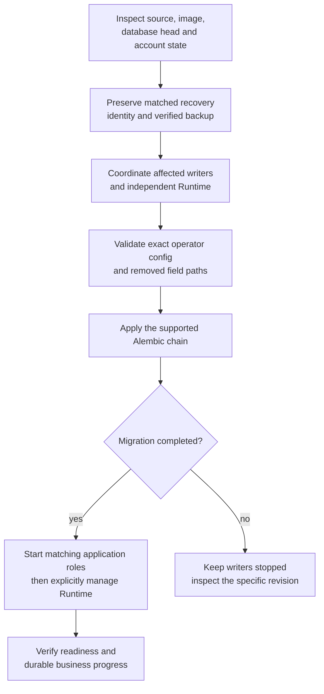

# Database migrations and recovery boundaries

[Handbook](README.md) · [Operations](OPERATIONS.md) · [Schema reference](generated/db-schema.md)

The current schema is the single Alembic chain under
[versions](../tracefold/platform/postgres/alembic/versions/), rooted at
`20260831_0340`. Applied revision files are part of upgrade/restore correctness;
documentation cleanup must not delete or rewrite them. This page owns the current
procedure, not a chronological transcript of every historical deployment.

## 1. Determine the actual source and database heads

Read the checked-out source head without a database call:

```bash
uv run python -c 'from tracefold.platform.postgres.migrations import latest_migration_version; print(latest_migration_version())'
```

Read the database's current migration status through its configured container:

```bash
docker compose exec -T workers tracefold db audit
```

The EventUpdate chain includes `20260926_0404` and
`20260927_0405`. The source function and database status above remain authoritative
if a later revision is added. Do not copy an old head into `alembic_version`, infer
compatibility from a successful import, or start new writers before migration ends.

## 2. Supported upgrade sequence



Use the supported [Makefile](../Makefile) deployment/migration entry from its
permitted main checkout. Normal `make up` waits for migration exit zero before
starting Serve, Workers and Analysis. The separate account owner is not restarted
implicitly. A mismatched schema beneath a running Runtime is an operational
boundary, not a warning to bypass with an environment flag.

Before maintenance, identify what the venue actually holds. Stopping Nautilus is
not an exit receipt, and an accepted flatten request is not confirmed flatness.
Coordinate account management through the [execution runbook](OPERATIONS.md#5-trading-and-account-operations),
then stop affected writers. Never assume a News-only code change makes its schema
safe for another process that still runs an older contract.

Validate config without exposing secrets. Strict settings reject removed fields,
so remove only the documented key at its exact YAML path. `tracefold init` does not
rewrite an existing config; `init --force` is not a migration tool. [Setup](SETUP.md)
owns initialization and role-appropriate mounts.

Record backup, source/image IDs, pre/post heads, migration result and restarted
roles. Inspect readiness and the actual source/semantic/notification/account
progress separately; a green HTTP endpoint does not verify all of them.

## 3. EventUpdate cut: 0404 and 0405

| Revision | Current contract established | Source |
| --- | --- | --- |
| `20260926_0404` | Item revisions, semantic work/checkpoints/observations, adopted EventUpdates/heads, notification work, intent-keyed delivery, public source updates and Trading amendments | [0404](../tracefold/platform/postgres/alembic/versions/20260926_0404_news_event_updates.py) |
| `20260927_0405` | Source revision sequence/chain metadata, immutable v1 plus new v2 updates, indexed cross-Event claim targeting | [0405](../tracefold/platform/postgres/alembic/versions/20260927_0405_news_revision_ownership.py) |

Both revisions are **forward-only**. Stop the affected Serve/Workers/Analysis
roles, coordinate the independent Runtime as above, preserve a verified recovery
backup and migrate before starting the matching image. The new source contracts
and amendment reader must not be mixed with an old writer.

Remove **`news.policy`** and **`llm.news_compiler_reflection`** from the operator
config. Do not reinstate the old Program/GEPA/release/canary runtime to make a
historical artifact executable. The current [ReviewDesk and calibration](modules/review.md)
are separate retained capabilities.

Historical verdicts, reviews and learning evidence are not synthesized into new
claims. Existing sent receipts retain their real payload/history; unsent legacy
work does not become a fresh current intent. Inspect the revision's exact data
transformation, not an assumed one-to-one rewrite from old verdict to new update.

The current [News guide](modules/news.md) owns input versus content revision,
checkpoint identity, current source contribution and notification semantics.
`retry-work` operates on exact failed work, not on the migration chain. A changed
prompt or new image does not automatically relabel/recompute historical evidence.

## 4. Older supported upgrades can require explicit preparation

Some supported older revisions deliberately refuse unsafe data rather than silently
coercing it. Read the failing revision's preflight before changing data. Important
examples are:

| Refusal / older boundary | Required interpretation |
| --- | --- |
| Retired Case/admission values at the `0355` hard cut | The revision names the incompatible rows. Archive the exact affected evidence before an authorized scoped removal; dependent admission rows must be handled before their Cases. Do not delete all current Cases or use CASCADE. |
| Signal/entry-plan contract changes or an open plan | An old nonterminal execution intent may not be reinterpretable. Preserve and resolve the account/plan under its matching runtime before the coordinated cut. |
| Runtime observation and connection cuts | The writer's image, runtime identity and snapshot schema must agree; older snapshots are not valid current evidence. |
| Native execution evidence additions | New columns/coverage do not prove complete historical native fills, fees or funding. Verified history recovery is a separate bounded operation. |
| Unknown/unsupported pre-baseline revision | Current source is not a general upgrader for arbitrary old backups. Use its recorded pre-cut source/image and original procedure first. |

The source for the first example is
[0355](../tracefold/platform/postgres/alembic/versions/20260903_0355_trading_case_dead_columns.py).
Its executable check and the backup's matching historical documentation own the
precise affected values. Do not carry the entire former schema or destructive
repair SQL into a fresh-install guide.

The named volume's `initdb` hook applies only to a genuinely new cluster. It is not
a generic role-repair tool for an unknown restored database. Preserve the separate
bootstrap/application credentials and restore using the appropriate recorded
identity, never by blindly replacing grants or stamping the head.

## 5. Failure and rollback

A failing migration is not a reason to start readers/writers against the partial
upgrade. Capture its revision, sanitized error, actual database head and transaction
outcome. PostgreSQL transaction rollback and the revision's own deadlines determine
what committed. Verify it rather than guessing from elapsed time or container exit.

For a same-schema code rollback, the narrow `make deploy-image` operation checks
image/source/database compatibility. For a forward-only schema cut, recovery
requires the verified pre-cut backup and matching image in a coordinated restore;
newer-source downgrade is intentionally unavailable. Do not use `alembic stamp`,
manual `alembic_version` edits, empty migrations or compatibility aliases to hide
an unperformed transformation.

A backup that can be listed has not yet been proven restorable. Run the matching
restore in an isolated database and verify its schema and relevant durable records.
[Operations](OPERATIONS.md#6-backup-and-restore) owns dump handling and the isolated
restore drill. A model evaluation or a replay of old paper trades is not a database
restore check.

## 6. Authoring and validating a new revision

Use one revision with the correct `down_revision`; document why it exists, affected
writers, required preflight, retained/deleted history, the acceptance predicate and
roll-forward/rollback behavior. Run DDL through the migration's supplied connection;
application processes must not introduce a second runtime-DDL path.

Keep SQL and lock duration bounded with the repository's current migration deadline
pattern. Explicitly check data before destructive transformations. Do not mask a
wrong schema with broad `IF EXISTS`, fabricated defaults, a blanket CASCADE or
rewritten historical receipts. A forward-only refusal can be correct, but it needs
an actionable recovery boundary rather than an untested claim of reversibility.

Relevant tests include [authoring contracts](../tests/contract/test_migration_authoring.py),
[migration history](../tests/integration/test_migration_history.py),
[EventUpdate storage](../tests/integration/test_news_event_update_store.py),
[revision ownership](../tests/integration/test_news_revision_ownership.py), and
[Trading public updates](../tests/integration/test_trading_analysis_public_updates.py).
Use their isolated PostgreSQL resources, not the operator database.

Regenerate [db-schema.md](generated/db-schema.md) only against an isolated database
at the actual new head, using the procedure in [Generated references](generated/README.md)
and [Testing](TESTING.md). Preserve generated constraints and ordering. A docs-only
cleanup needs no new migration or schema regeneration.
