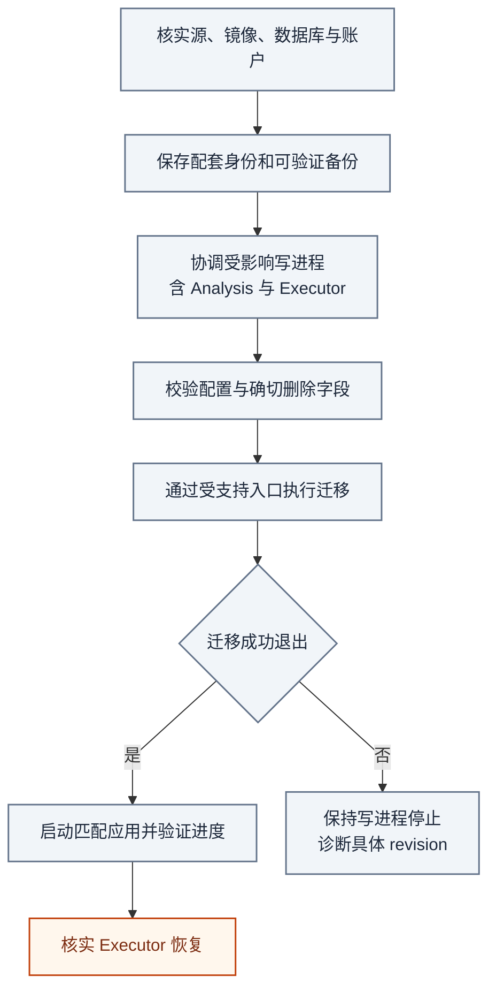

# 数据库迁移与恢复边界

[手册](README.md) · [运维](OPERATIONS.md#backup) · [结构参考](generated/db-schema.md)

当前 schema 使用 [Alembic 单链](../tracefold/platform/postgres/alembic/versions/)，基线为 `20260831_0340`。已应用的迁移文件属于升级与恢复证据，**不是可随过时文档一起删除的文件**。

`20261001_0420`（[#764 P0](https://github.com/AnalyThothAI/tracefold/issues/764)）从 `0419` 升级：压缩连续同成员钱包版本，保留每组最后一个版本 ID 与最早 `known_at_ms`，重映射成交和 tape 游标；冻结回执 `sent_claims`，收紧决策和 EventUpdate 的 NULL 检查；删除四张无读者表、两个执行消费游标、六个 delivery 删除字段、两列历史状态及六个孤儿函数。全部处于同一事务，成员、成交数、游标引用和 Claim 投影核对失败即回滚。

此迁移先停全部进程，Analysis 先于 Executor；备份并导出 `news_market_wallet_archive`、`news_market_instrument_listing_events`、`news_market_wallet_roster`、`news_market_wallet_tape_state`、`news_market_wallet_fills`、`news_deliveries`、`news_notification_decisions`，记录 sha256 并核验归档可读。存在 Trading 写者会话、非空冲突/证据表、delivery 删除状态、无效文档/决策或版本内时间不一致时拒绝升级。停 Executor 会暂停 time exit 和 flatten，停前核对实际持仓、挂单及未处置输入；恢复后核对 pause/halt、待处置数和 `db audit`。仅支持已核验备份加旧镜像恢复；生产彩排、部署与 24 小时性能验收需要另行授权。

本地行为证明由 [P0 迁移测试](../tests/integration/test_p0_migration.py)、[待处置消费测试](../tests/integration/test_p0_executor_pending.py) 和 [状态缓存测试](../tests/test_measured_once.py)维护。

`20261001_0421`（#764 P1）从 `0420` 升级：市场 Item 与三类事实并入 `news_market_observations`，保留观测 ID、分组键、通知标记和 OI outbox 身份；钱包快照转换为 `news_market_wallets` 成员区间；四个采集器状态与事故归 `news_collectors`。编辑 `news_items` 删除七个市场列，反应与钱包 outcome 表和字段删除。迁移内冻结旧投影并双向 `EXCEPT ALL`，核对事实数、历史成员、当前监控值、链游标与未完成事故。

P1 停 Serve、Workers、Analysis 后执行。备份外另导出 `news_oi_signals`、`news_market_liquidations`、`news_market_smart_money`、`news_market_wallet_roster`、`news_market_wallet_tape_state`、`news_market_instrument_snapshot_state`、`news_opennews_incidents`、`news_ingest_state`、`news_event_reactions`、`news_market_wallet_outcomes`，以及 `news_items` 和 `news_market_wallet_events`；记录 sha256 并验证 `pg_restore -l` 可读。市场行成为编辑证据、来源事实不匹配、语义常量或派生身份不一致时拒绝升级。backlog、未开始卡片、游标与待恢复事故保留；残留 `sending` 由启动扫描标记 `unknown`。恢复后核对 kind / notify_state 分布、当前名单与 `scanned_block`；回滚使用已验证备份和旧镜像。

[P1 迁移测试](../tests/integration/test_p1_migration.py)用 P0 固定市场 JSON 证明分组、详情、时间线不变；[采集器与重放测试](../tests/integration/test_p1_market_collectors.py)覆盖 `xmin`、outbox、成员区间与并发事故。生产导出、恢复彩排、部署后性能与三天写入观测属于上线验收，尚未由这些本地测试证明。

`20261001_0422`（#764 P2）从 `0421` 升级：通知判断、待发送意图、回执与市场卡片统一到 `news_notifications`；通知规划和市场组节奏统一到 `news_jobs`。编辑通知保留 decision / intent / update 身份，原行执行 pending → sending → settled；可重试 not_sent 保留冻结卡片，ambiguous 不自动重发。无 FK 的孤儿事件任务由 janitor 有界清理。

P2 先停 Workers，再停 Serve，核实没有 News 写者会话。完整备份外导出 `news_notification_decisions`、`news_delivery_queue`、`news_deliveries`、`news_notification_work`、`news_market_tracks`、`news_market_deliveries`、`news_notification_feedback`、`news_notification_external_feedback`、`news_external_miss_snapshots`，记录 sha256 并验证归档可读。ReviewDesk 非空、单判断对应多个意图、queue / ledger 冻结字段不一致或 card 的正文与摘要不一致时拒绝升级；六组源投影逐列双向 EXCEPT ALL 与 md5 一致后才删除旧表、视图和函数。日志须包含 `p2_verify ok`。

迁移保留 sending、编辑状态、租约期限与重试预算。恢复时编辑通知 sending 按现有恢复路径结算为 ambiguous，市场 sending 扫描为 unknown；编辑超时也按现有路径结算，禁止将这些记录批量改为 pending。核对详情（删除 feedback）、状态（删除四个复核字段）、市场分组与外部消息身份。回滚恢复已核验备份及旧镜像；备份之后已发生的外部发送仍须逐 intent 对账，不能从数据库恢复推断未发送。

[P2 迁移测试](../tests/integration/test_p2_migration.py)覆盖空库、全部通知与市场状态、冻结载荷、终态不可变、投影不一致拒绝及并发孤儿清理；[发送恢复测试](../tests/integration/test_news_update_delivery.py)覆盖 lease、发送不确定性与崩溃窗口。生产备份恢复彩排、部署和上线观测尚未执行。

`20261001_0423`（#764 P3）从 `0422` 升级：观察与采纳、scope repair 统一到 `news_analyses`，Event 保存唯一 head 指针；证据保存 material 摘要、焦点来源、事实范围及版本摘要日志，来源修订归 `news_items.revisions`，band 归 Event 数组，语义任务归 `news_jobs`，checkpoint 归缓存。`news_event_assets` 保留，命题链接从不可变 changes 派生。

P3 先停 Workers，再停 Serve，核实无 News 写者会话。完整备份外导出 `news_claim_links`、`news_event_update_heads`、`news_event_updates`、`news_head_scope_repairs`、`news_semantic_observations`、`news_semantic_checkpoints`、`news_semantic_work`、`news_event_evidence_snapshots`、`news_event_bands`、`news_item_revisions`，记录 sha256 并验证 `pg_restore --list`。band 身份、采纳来源、repair、head 或 checkpoint 键不一致时拒绝升级；迁移逐列核对源投影、数量与 md5，日志须有 `p3_verify ok`。孤儿证据只记录 NOTICE，不作为存活 Event 事实回填。

启动前在维护窗口执行 `VACUUM (FULL, ANALYZE) news_events; ANALYZE news_analyses, news_jobs, news_items;`，回收回填旧版本并刷新统计。租约和重试预算保留，未发送唤醒由现有 repair turn 恢复。核对详情版本、head 和待处理任务；回滚恢复已核验备份加旧镜像。生产迁移、维护 VACUUM、HOT 比率与 24 小时性能观测尚未执行。

[P3 迁移测试](../tests/integration/test_p3_migration.py)核对 20 个读取投影及预检回滚；[并发与 GIN 测试](../tests/integration/test_news_p3_semantic_chain.py)证明证据 CAS、Event 串行锁、成员 FK 兼容和 4 万 Event 的索引路径。当前库为 36 张表，P4 再收敛到最终目标。

<details>
<summary><strong>本页目录</strong></summary>

1. [确认源、镜像与数据库版本](#section-确认源镜像与数据库版本)
2. [正常升级顺序](#section-正常升级顺序)
3. [EventUpdate 的 0404 / 0405 / 0407 切换](#section-eventupdate-的-0404--0405--0407-切换)
4. [基线之前的备份与严格拒绝](#section-基线之前的备份与严格拒绝)
5. [回退不是数据库降级](#section-回退不是数据库降级)
6. [迁移验证与提交证据](#section-迁移验证与提交证据)

</details>

<a id="section-确认源镜像与数据库版本"></a>
## 01 · 确认源、镜像与数据库版本

读取检出源码的 head，不访问数据库：

```bash
uv run python -c 'from tracefold.platform.postgres.migrations import latest_migration_version; print(latest_migration_version())'
```

读取实际数据库状态：

```bash
docker compose exec -T workers tracefold db audit
```

当前代码 head 为 `20261001_0423`；后续以该函数和数据库状态为准。不要把文档中的旧 head 写进 `alembic_version`，也不要从“Python import 成功”推断旧镜像能够使用新 schema。

<a id="section-正常升级顺序"></a>
## 02 · 正常升级顺序



*操作视图 · “迁移成功”指实际退出结果；停止 Runtime 不是账户平仓回执。*

使用管理该实例的检出目录及统一 Make 工作流，核对项目、配置目录与端口；隔离开发实例不共享生产写进程。`make up` 等迁移结束后启动 Serve、Workers 和 Analysis；同时管理匹配镜像的 Executor。运行中 Runtime 与待迁移 schema 不匹配时，不以环境标志绕过检查。

停 Executor 不等于账户平仓。维护前先知道交易所实际持仓、保护与订单归属，必要操作按[执行 runbook](OPERATIONS.md#trading-operations)执行并核实结果，再协调写进程。

普通 `init` 保留配置；`init --force` 不是迁移工具。0418 切换前的配置需移除已退役的 `llm.trading_semantics`、`trading.analysis.max_model_input_bytes`、`trading.analysis.model_input_price_ceiling_usd_per_million` 和 `trading.analysis.model_output_price_ceiling_usd_per_million`，并显式配置 `trading.analysis.program.path` / `sha256` 与 `trading.analysis.model_name`。保留当前 News 的 `llm.news_judgment` 与 `llm.news_reader_judgment` 路由。严格设置若仍报其他旧字段，仅处理报出的确切 YAML 路径，保留其他 operator 选择。

<a id="section-eventupdate-的-0404--0405--0407-切换"></a>
## 03 · EventUpdate 的 0404 / 0405 / 0407 切换

| Revision | 建立的当前契约 | 源码 |
| --- | --- | --- |
| `20260926_0404` | Item 修订、语义工作 / 检查点 / 观察、EventUpdate 与 head、通知工作、intent 发送、公开更新与 Trading amendment | [0404](../tracefold/platform/postgres/alembic/versions/20260926_0404_news_event_updates.py) |
| `20260927_0405` | 来源修订顺序 / 前驱、保留不可变 v1 与新 v2、跨 Event claim 定位索引 | [0405](../tracefold/platform/postgres/alembic/versions/20260927_0405_news_revision_ownership.py) |
| `20260927_0407` | 不可变通知决策、工作与意图引用、逐命题复核和外部漏报短反馈 | [0407](../tracefold/platform/postgres/alembic/versions/20260927_0407_news_notification_decisions.py) |
| `20260928_0408` | Trading 同资产来源检索索引与模型请求截止前未派发状态，不改写历史调用或交易事实 | [0408](../tracefold/platform/postgres/alembic/versions/20260928_0408_trading_not_dispatched.py) |
| `20260928_0409` | News 任务级已处理阅读身份、定向重分析谱系与通知文案复用字段；删除来源级已处理跳过字段 | [0409](../tracefold/platform/postgres/alembic/versions/20260928_0409_news_task_reads.py) |
| `20260928_0410` | 历史编号事实归属修复证明；EventUpdate 来源明确区分模型观察与确定性修复 | [0410](../tracefold/platform/postgres/alembic/versions/20260928_0410_news_head_scope_repairs.py) |
| `20260928_0411` | 清除退役的 News verdict / Review / 学习表及 Trading root tape / Case evaluation；旧市场 Event、v1 EventUpdate 所属 Event 与 `first` / `followup` 发送行删除；Wallet 旧快照字段一次性改写，收紧当前约束 | [0411](../tracefold/platform/postgres/alembic/versions/20260928_0411_retire_historical_contracts.py) |
| `20260928_0412` | 通知队列保存已证明未发送结果、发送账本保存最终结果的精确结算身份；移除与从零开始的真实失败计数冲突的旧约束 | [0412](../tracefold/platform/postgres/alembic/versions/20260928_0412_news_notification_settlement.py) |
| `20260929_0413` | 通知工作增加终态 `failed` 与 `last_error_code`；删除 0407 起恒为空的 `plan` 列；迁移时已过期且 `attempts=3` 的 pending 工作改为 `failed`（`news_notification_exhausted_legacy`），未到期的仍由新代码再规划一次 | [0413](../tracefold/platform/postgres/alembic/versions/20260929_0413_news_notification_work_terminal.py) |
| `20260929_0415` | 语义工作增加失败阅读隔离 `failed_read_refs` 与本次尝试所读范围 `attempt_read_refs`：失败修订（含 Janitor 结算的崩溃最终尝试）只隔离该次尝试实际送入的材料，不再随后续修订重复送入，精确重分析仍可读取；只加列，无回填 | [0415](../tracefold/platform/postgres/alembic/versions/20260929_0415_news_semantic_failed_reads.py) |
| `20260929_0416` | 新增只追加的 `news_claim_links` 并从历史 EventUpdate 回填；通知决定支持 `reader_v2` | [0416](../tracefold/platform/postgres/alembic/versions/20260929_0416_news_reader_decisions.py) |
| `20260929_0417` | DEMO 执行账本硬切：Signal v4、disposition、Plan、订单与原生成交；删除 Nautilus 执行表 | [0417](../tracefold/platform/postgres/alembic/versions/20260929_0417_trading_execution_hard_cut.py) |
| `20260929_0418` | LIVE Analysis 硬切：仅选中 Trigger 建 Case，冻结预测、六策略和双腿纸面账本；删除旧 Gate、WATCH 与逐调用表 | [0418](../tracefold/platform/postgres/alembic/versions/20260929_0418_trading_analysis_hard_cut.py) |
| `20261001_0419` | News 关联召回改为索引驱动：`news_event_assets` 增加数据库生成的 `retrieval_symbol` / `retrieval_pair_base`（重写约 3.4 万行）与索引，`news_items.canonical_url`、`news_events.leader_item_id` 和成员事实 GIN 三元组索引；删除只被旧召回使用的标题 GiST 索引。不改事实行；生产副本上整次约 4 s，可降级 | [0419](../tracefold/platform/postgres/alembic/versions/20261001_0419_news_recall_indexes.py) |

这些切换是前向迁移，不通过旧卡片 / verdict 伪造新 Claim。0407 曾将旧 pending `first` / `followup` 意图结算；0411 将它们连同旧发送行删除。当前 intent 只接受 `update`，发送账本保留决策引用。EventUpdate 的不可变版本与已发送的当前通知保留。

`20260927_0406` 为 [执行硬切 Signal 退休原因](../tracefold/platform/postgres/alembic/versions/20260927_0406_execution_hard_cut_retirement.py) 增加约束取值；它自身不清理账户数据。数据切换步骤见 [Trading 运维](OPERATIONS.md#trading-operations)。

### 配套检查

| 边界 | 要确认的内容 |
| --- | --- |
| 配置 | 删除已退役 `news.policy`、`llm.news_compiler_reflection` 的确切路径 |
| 原始证据 | 来源正文修订与前驱不丢失，不把相同正文的再次出现当旧版本重投 |
| 语义工作 | wanted / done、owner / lease、耗尽结算与新版本预算隔离 |
| 知识 | EventUpdate 不可变，head 不倒退，未变的命题 / 问题保留 |
| 通知 | 当前 `update` 回执和冻结卡片保留；旧 `first` / `followup` 数据按 0411 删除。新决策与工作 / intent 引用一致，不因 schema 迁移重复推送 |
| Trading | 旧公开 payload 与新契约明确区分；来源更正不制造新 TTL |

迁移不是整库重新分析。0411 丢弃退役 verdict / Review / 学习数据；旧静态 Program 资产不接回运行时。

0409 不把旧 `processed_evidence_refs` 推断成所有任务范围已完成：新 `processed_read_refs` 从空开始，由实际完成的阅读写入。切换前排空旧 News writers 和发送 owner，记录 pending、failed、sending、ambiguous 及受影响范围，保存可恢复备份。迁移后 API、Workers 与前端使用同一新契约，不让旧镜像写新 schema。对确证漏范围且仍需修复的 Event 逐项预览并执行 `news reanalyze`；不批量唤醒历史 Event。回退依赖匹配旧镜像的已验证备份或前向修复，不能重新启动旧 writer 对新 schema 写入。

0412 切换前还要导出旧 update intent 的未决/耗尽清单，至少包含 `intent_id`、Event、目标版本、queue state、旧 attempts、lease/下次到期、通知 work 状态及对应 delivery 状态。旧 attempts 混合领取与失败次数，迁移保留原值，不批量归零，也不把它改名为真实失败次数。只有确证仍有通知责任且未进入可能发送边界的精确 intent，才使用当前版本校验做定向恢复；`sending`、`ambiguous`、已有回执和缺少发送证据的记录保持其真实或未知状态。部署时停止旧发送 owner，完成迁移后只启动新 owner，避免两版进程并行消费。

```sql
SELECT q.intent_id, q.event_id, q.content_revision, q.state AS queue_state,
       q.attempts AS legacy_attempts, q.lease_token, q.next_attempt_at_ms,
       w.state AS work_state, w.content_revision AS work_revision,
       d.state AS delivery_state, d.payload_sha256
  FROM news_delivery_queue q
  LEFT JOIN news_notification_work w ON w.event_id=q.event_id AND w.channel='news'
  LEFT JOIN news_deliveries d ON d.intent_id=q.intent_id
 WHERE q.kind='update' AND (q.state='pending' OR q.state='dead')
 ORDER BY q.event_id, q.intent_id;
```

0410 先新增插入式修复证明表，再允许新 EventUpdate 以 `scope_repair_id` 代替 `observation_result_id`；恰好一个来源必须存在。既有 EventUpdate 和发送账本不回填。历史 head 的实质清理通过[运维命令](OPERATIONS.md#历史编号事实的-head-归属清理)另行执行，采用精确 head CAS 和整批事务；迁移自身不退休 Claim。

0411 是一次性破坏性清理。停用 News 与 Trading 写进程并核实备份后再升级；迁移使用 `lock_timeout=5s`、`statement_timeout=1800s`，无法取得锁时整笔回滚，可待写进程停稳后重试。旧市场 Event、非当前准入 Event、含 v1 EventUpdate 的 Event 及旧投递行被删除；旧 verdict、Review、学习、root tape 与 Case evaluation 表及其专用 SQL 函数 / 视图被删除。原始 Item、类型化市场事实、v2 EventUpdate / head、当前通知回执、Trading Case 与执行证据保留。旧 Wallet JSON 中三个退役成员字段在迁移事务内改写，运行时只读取严格当前形状。此 revision 不支持数据库降级；需要旧数据时从已验证的迁移前备份恢复，不把旧镜像接到新 schema。

<a id="section-基线之前的备份与严格拒绝"></a>
## 04 · 基线之前的备份与严格拒绝

基线之前的备份需要其记录的源码 / 镜像和对应恢复流程。当前 main 的单链不能无条件接续一个未知历史库；不要手工 stamp、猜字段或先启动新 Writers 再补 schema。

个别已记录的严格切换会拒绝不兼容行，例如 [0355](../tracefold/platform/postgres/alembic/versions/20260903_0355_trading_case_dead_columns.py)。应先阅读该 revision 的拒绝原因并归档确切受影响记录；只有明确授权的数据处理才可按外键顺序操作。不能为了通过迁移执行全表清空或任意 `CASCADE`。

文档清理保留这类仍可能影响恢复的边界，但不把所有一次性事故 SQL 复制成通用日常步骤。

<a id="section-回退不是数据库降级"></a>
## 05 · 回退不是数据库降级

`make deploy-image` 只用于源码 / 镜像 / 数据库 schema 兼容的本地精确镜像替换，不能反转 0404 / 0405 / 0406。需要恢复旧 schema 时，使用匹配备份与镜像，在隔离环境验证后再安排切换。

数据库恢复可能改变本地已记录事实，但不会撤销交易所已发生的订单或成交。账户侧必须独立对账；不能通过恢复旧数据库让系统“忘记”已有风险。

[备份命令与恢复演练](OPERATIONS.md#backup)由运维页维护。归档可列目录仅证明 dump 可读，真正恢复与升级演练需要隔离数据库和相应验证。

<a id="section-迁移验证与提交证据"></a>
## 06 · 迁移验证与提交证据

新增 revision 时至少确认：迁移链单头、从受支持前驱可升级、已有数据处理明确、约束与查询符合新语义、应用启动顺序正确。不要修改已发布 revision 来逃避新增迁移。

生成的 [db-schema.md](generated/db-schema.md)来自隔离且已迁移到目标 head 的数据库，不通过生产库 introspection 更新。相关真实资源测试由[测试指南](TESTING.md)的 migration / postgres lane 承担。

运维记录保存备份身份、源 / 镜像、迁移前后 head、执行结果、实际恢复角色，以及 News / Analysis / Runtime 各自的后续进展。一个绿色 HTTP 探针不证明迁移后全部业务已经闭环。

---

[返回文档中心](README.md) · [架构图谱](ARCHITECTURE.md#atlas) · [返回顶部](#数据库迁移与恢复边界)
