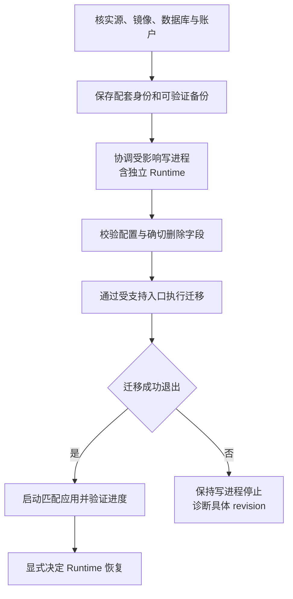

# 数据库迁移与恢复边界

[手册](README.md) · [运维](OPERATIONS.md#backup) · [结构参考](generated/db-schema.md)

当前 schema 使用 [Alembic 单链](../tracefold/platform/postgres/alembic/versions/)，基线为 `20260831_0340`。已应用的迁移文件属于升级与恢复证据，**不是可随过时文档一起删除的文件**。

## 1. 确认源、镜像与数据库版本

读取检出源码的 head，不访问数据库：

```bash
uv run python -c 'from tracefold.platform.postgres.migrations import latest_migration_version; print(latest_migration_version())'
```

读取实际数据库状态：

```bash
docker compose exec -T workers tracefold db audit
```

当前代码 head 为 `20260927_0406`；后续以该函数和数据库状态为准。不要把文档中的旧 head 写进 `alembic_version`，也不要从“Python import 成功”推断旧镜像能够使用新 schema。

## 2. 正常升级顺序



使用主检出目录的受支持 Make 工作流。`make up` 等迁移结束后启动 Serve、Workers 和 Analysis；不自动重启独立账户所有者。运行中 Runtime 与待迁移 schema 不匹配时，不以环境标志绕过检查。

停 Runtime 不等于账户平仓。维护前先知道交易所实际持仓、保护与订单归属，必要操作按[执行 runbook](OPERATIONS.md#trading-operations)执行并核实结果，再协调写进程。

普通 `init` 保留配置；`init --force` 不是迁移工具。严格设置报出旧字段时，仅删除其确切 YAML 路径，保留其他 operator 选择。

## 3. EventUpdate 的 0404 / 0405 切换

| Revision | 建立的当前契约 | 源码 |
| --- | --- | --- |
| `20260926_0404` | Item 修订、语义工作 / 检查点 / 观察、EventUpdate 与 head、通知工作、intent 发送、公开更新与 Trading amendment | [0404](../tracefold/platform/postgres/alembic/versions/20260926_0404_news_event_updates.py) |
| `20260927_0405` | 来源修订顺序 / 前驱、保留不可变 v1 与新 v2、跨 Event claim 定位索引 | [0405](../tracefold/platform/postgres/alembic/versions/20260927_0405_news_revision_ownership.py) |

这两次切换是前向迁移，不提供通过旧卡片 / verdict 伪造新 Claim 的降级路径。旧 v1 保留原始 hash 与语义，新内容才使用 v2；不得批量改历史 JSON 让它“看起来都是最新版本”。

`20260927_0406` 为 [执行硬切 Signal 退休原因](../tracefold/platform/postgres/alembic/versions/20260927_0406_execution_hard_cut_retirement.py) 增加约束取值；它自身不清理账户数据。数据切换步骤见 [#719 运行说明](OPERATIONS.md#719-一次性执行基线硬切)。

### 配套检查

| 边界 | 要确认的内容 |
| --- | --- |
| 配置 | 删除已退役 `news.policy`、`llm.news_compiler_reflection` 的确切路径 |
| 原始证据 | 来源正文修订与前驱不丢失，不把相同正文的再次出现当旧版本重投 |
| 语义工作 | wanted / done、owner / lease、耗尽结算与新版本预算隔离 |
| 知识 | EventUpdate 不可变，head 不倒退，未变的命题 / 问题保留 |
| 通知 | 旧实际回执继续约束读者覆盖；不因 schema 迁移重复推送 |
| Trading | 旧公开 payload 与新契约明确区分；来源更正不制造新 TTL |

迁移不是整库重新分析。保留的 legacy verdict / historical review 只具有其原来含义；也不能把旧静态 Program 资产重新挂回运行时以掩盖切换缺口。

## 4. 基线之前的备份与严格拒绝

基线之前的备份需要其记录的源码 / 镜像和对应恢复流程。当前 main 的单链不能无条件接续一个未知历史库；不要手工 stamp、猜字段或先启动新 Writers 再补 schema。

个别已记录的严格切换会拒绝不兼容行，例如 [0355](../tracefold/platform/postgres/alembic/versions/20260903_0355_trading_case_dead_columns.py)。应先阅读该 revision 的拒绝原因并归档确切受影响记录；只有明确授权的数据处理才可按外键顺序操作。不能为了通过迁移执行全表清空或任意 `CASCADE`。

文档清理保留这类仍可能影响恢复的边界，但不把所有一次性事故 SQL 复制成通用日常步骤。

## 5. 回退不是数据库降级

`make deploy-image` 只用于源码 / 镜像 / 数据库 schema 兼容的本地精确镜像替换，不能反转 0404 / 0405。需要恢复旧 schema 时，使用匹配备份与镜像，在隔离环境验证后再安排切换。

数据库恢复可能改变本地已记录事实，但不会撤销交易所已发生的订单或成交。账户侧必须独立对账；不能通过恢复旧数据库让系统“忘记”已有风险。

[备份命令与恢复演练](OPERATIONS.md#backup)由运维页维护。归档可列目录仅证明 dump 可读，真正恢复与升级演练需要隔离数据库和相应验证。

## 6. 迁移验证与提交证据

新增 revision 时至少确认：迁移链单头、从受支持前驱可升级、已有数据处理明确、约束与查询符合新语义、应用启动顺序正确。不要修改已发布 revision 来逃避新增迁移。

生成的 [db-schema.md](generated/db-schema.md)来自隔离且已迁移到目标 head 的数据库，不通过生产库 introspection 更新。相关真实资源测试由[测试指南](TESTING.md)的 migration / postgres lane 承担。

运维记录保存备份身份、源 / 镜像、迁移前后 head、执行结果、实际恢复角色，以及 News / Analysis / Runtime 各自的后续进展。一个绿色 HTTP 探针不证明迁移后全部业务已经闭环。
