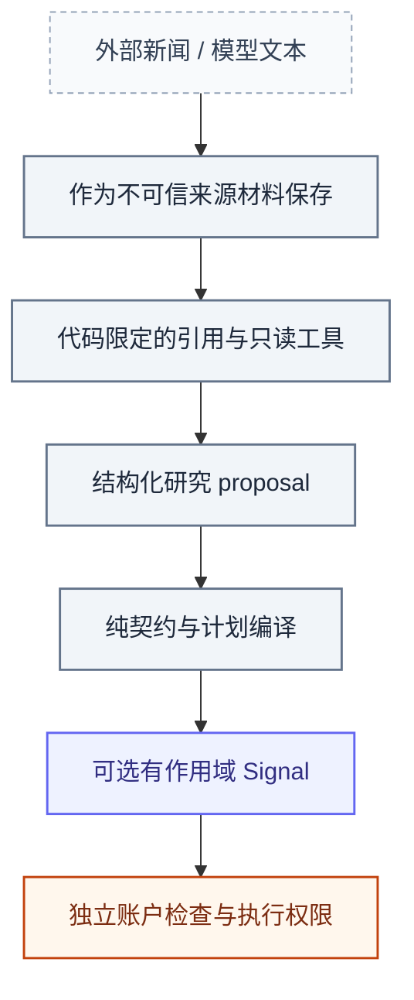

# 安全、访问与操作权限

[手册](README.md) · [安装](SETUP.md) · [执行](modules/execution.md) · [运维](OPERATIONS.md)

Tracefold 的边界围绕实际数据与副作用：**公开工作台只读，模型工具受限，账户凭据只属于执行角色，恢复操作保留原始证据。** 这不是要求每次文档修改新增审批或另造一套安全框架。

<strong>本页目录</strong>

1. [凭据与文件](#section-凭据与文件)
2. [工作台是只读，但不是完整用户认证产品](#section-工作台是只读但不是完整用户认证产品)
3. [模型输入不是指令权限](#section-模型输入不是指令权限)
4. [本地操作与账户权限](#section-本地操作与账户权限)
5. [数据、恢复与可信结果](#section-数据恢复与可信结果)
6. [测试与资源隔离](#section-测试与资源隔离)
7. [暴露或事故处理](#section-暴露或事故处理)

## 01 · 凭据与文件

应用设置从 `TRACEFOLD_HOME/config.yaml` 读取，默认 `~/.tracefold/config.yaml`。Compose 的可选 `.env` 仅承载部署参数，受 Git / Docker ignore 保护，不是业务配置的影子来源。初始化创建私有目录和配置 / secret 文件；不将真实 token、API key、webhook、含密码的 DSN 或 proxy URL 写进仓库、日志、截图和 PR。

| 数据 | 归属 |
| --- | --- |
| PostgreSQL bootstrap 密码 | 初始化 / 数据库生命周期，不挂载给普通应用角色 |
| 应用数据库密码 | 按 Compose 对实际应用角色挂载 |
| 新闻 / 模型 / 推送配置 | 对应能力的配置与适配器；对外诊断脱敏 |
| Telegram token 文件 | 通知角色需要，不构成交易控制身份 |
| Binance 执行 key / secret | 仅 Nautilus Runtime 挂载；不能为研究或页面查询扩大暴露 |
| 备份和冻结研究文件 | 可能包含业务数据，按其实际敏感性保存，不默认为公开附件 |

[config models](../tracefold/platform/config/models.py)、[初始化实现](../tracefold/platform/config/)与 [compose.yaml](../compose.yaml)是实际权限和挂载依据。`tracefold config` 展示脱敏信息；脱敏输出仍可能暴露业务配置，不等于可以无审查公开全部诊断。

## 02 · 工作台是只读，但不是完整用户认证产品

Serve 的 `/api/*` 全部 GET，数据库 pool 默认只读。旧公开控制 / 下单 POST 已移除，浏览器没有因为拿到 bearer 就获得账户权限。

`/api/bootstrap` 返回 `ws_token`，因此不能把这个 token 描述成独立保护整个公开网站的登录系统。若工作台通过反向代理、隧道或公网域名提供，应在整个 origin 外层配置适合部署的访问控制，而不是只挡住一部分 API。

默认端口绑定 loopback。扩大绑定、公开 RabbitMQ 管理端口或数据库不是修改一个视觉参数，应核查真实网络可达性与访问范围。`api.public_url` 只负责读者链接，不自动提供认证或 TLS 终止。

## 03 · 模型输入不是指令权限

*权限视图 · 这是一条受限研究路径，不是让来源文本获得工具或订单权限的升级链。*

新闻中的命令、网页中的提示或模型解释不能调用 shell、任意文件、SQL 或交易接口。News 补读仅使用提供的合法目标与持久预算；Trading tools 仅访问 Case 可见、受限的数据集与证据 refs。

原文引文、数字、资产角色和目标 refs 必须按契约验证；合法 JSON 不等于事实正确。没有充分资料时保留 unknown / unresolved，而不是用一个可执行默认值掩盖不确定性。

`llm.request.extra_body` 不能携带 transport-owned 字段或密钥。不同路由配置不互相猜凭据；不能把某个可选判断模型变成拥有最终订单权限的审批服务。

## 04 · 本地操作与账户权限

`tracefold trading issue` 是本地 OS 身份认证的意图入口。请求保留稳定 request ID 和调用方封存时间，以区分同一操作重试与新操作。控制语法关闭，不接受自由文本映射到任意交易所动作。

操作提交成功只代表意图写入；Runtime、交易所受理、成交、保护和最终持仓均需各自证据。`/pause` 不平仓，`/flatten account` 也不是一张已平仓回执。

只有配置明确、操作有授权、作用域正确且账户状态符合执行政策时才能进行实际交易。News 卡片、AI 研究结论、文档 PR 或一次测试成功都不扩展该权限。不存在让未知持仓自动平仓以清除警告的通用修复。

## 05 · 数据、恢复与可信结果

不可变来源、EventUpdate、实际发送正文、接受复核和原生成交不能被缓存或 UI 覆盖。`ambiguous` 发送、未知持仓、未完成物理请求应保留不确定性，不能随意补一个成功状态。

ReviewDesk 记录实际 reviewer：AI 提交不能写成人工复核。真实成交历史只从正确账户 / 环境、明确订单身份的签名证据恢复；不得合成数量、价格或费用。

数据库迁移、死信重放 / 清空、执行数据硬切、评审提交、账户操作和生产部署都是不同副作用。它们有各自明确入口和授权，不能因一次“检查”请求全部执行。

## 06 · 测试与资源隔离

测试使用显式隔离的 PostgreSQL、RabbitMQ、浏览器和临时文件。宿主机 `127.0.0.1:5672` 可能就是生产 broker；未声明测试资源时不能擅自连接、重置或清空它。

依赖库安装、模型校准、历史 API、原生执行测试可能产生费用或副作用，按实际边界选检查。缺少资源只阻止相应证明，不必阻止文档修订、纯检查和 PR 准备；也不能将跳过或 pending CI 说成通过。

## 07 · 暴露或事故处理

发现真实凭据泄露时先停止继续传播，在凭据所有者处撤销 / 轮换，核查访问和真实账户状态；仅删除 Markdown 并不能使旧 key 失效。相关记录避免再次包含原始秘密。

修复配置、源码、迁移或操作流程中的实际根因，保存必要审计证据并验证对应风险。不要为一个局部事件默认新增全局 gate，也不要为追求 KISS 删除真正的数据、并发和账户权限控制。

可信的短暂初始化容器以操作者 UID/GID 挂载配置目录，生成或修复私有文件；不启动业务循环。其他长期运行角色的最小挂载范围不因此扩大。初始化拒绝密钥文件的符号链接，避免修改无关目标。

---

[返回文档中心](README.md) · [架构图谱](ARCHITECTURE.md#atlas) · [返回顶部](#安全访问与操作权限)
