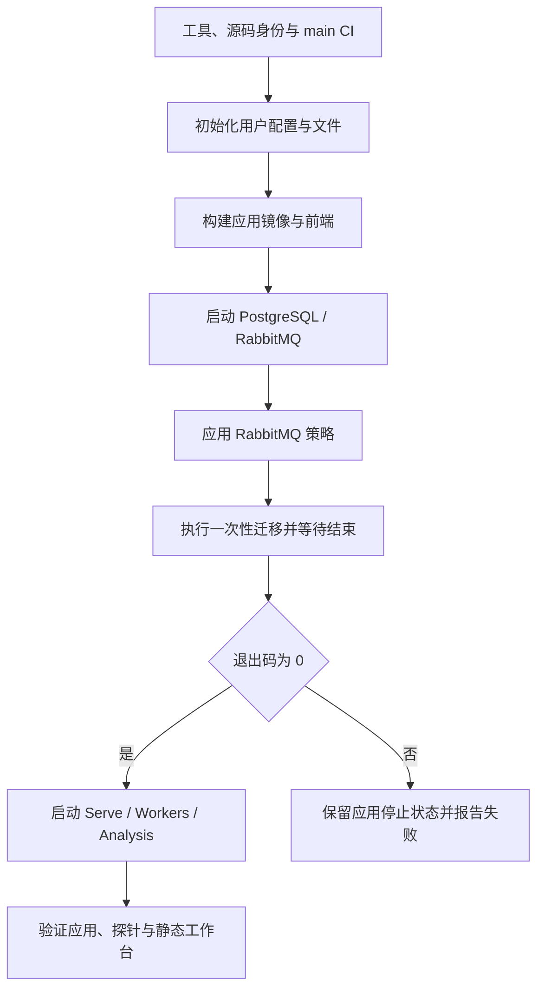

# 安装与配置

[手册](README.md) · [系统架构](ARCHITECTURE.md) · [运维](OPERATIONS.md) · [数据库迁移](MIGRATIONS.md)

推荐使用仓库的 **Make + Docker Compose** 启动完整应用。应用配置只有 `~/.tracefold/config.yaml` 一份；前后端一起构建，Nautilus 执行角色独立管理。

## 1. 前置条件

| 工具 | 用途 |
| --- | --- |
| Git、Make | 获取代码与执行仓库工作流 |
| [uv](https://docs.astral.sh/uv/) | 使用锁文件与项目 Python 3.13；宿主机默认 Python 不必作为项目解释器 |
| Docker 与 Compose 插件 | 构建应用、运行 PostgreSQL / RabbitMQ 和各进程 |
| curl | 就绪与工作台检查 |
| [GitHub CLI](https://cli.github.com/) | 登录、构建访问与精确 main CI 验证 |
| Node / npm | 仅本地前端开发需要；运行已构建应用镜像不要求宿主机单独启动 Vite |

解释器以 [.python-version](../.python-version)为准，Python 依赖以 [uv.lock](../uv.lock)为准，前端以 [package-lock.json](../web/package-lock.json)为准。Docker daemon 必须已启动，当前终端必须能访问它。

macOS 使用具备这些工具的终端；Windows 开发建议在已配置 Docker 访问的 WSL Linux shell 中使用同一套命令。不要把工作树的 `.git` 文件替换成目录，或让 Windows 与 WSL 的绝对 Git 路径相互污染。

## 2. 首次启动

```bash
gh auth login --hostname github.com
gh repo clone AnalyThothAI/tracefold
cd tracefold
make up
```

访问 **http://127.0.0.1:8765/**。使用符合源码与 CI 检查的干净 `main` 主检出目录运行部署；任务 worktree 用于开发，不是跳过检查的理由。



[Makefile](../Makefile)不仅调用 Compose，还等待迁移进程真正退出。不能仅因为 `depends_on` 或部分容器 running 就宣布启动成功。再次 `make up` 会构建并更新应用角色，不应该无故重建已有数据库容器。

```bash
make status-app
docker compose logs --tail=100 analysis
make logs
```

**`make status-app` 检查应用栈；`make status` 还会检查可选执行 Runtime。** 没有启用 Runtime 时，不用后者的非零结果判断整个新闻应用启动失败。

## 3. 初始化生成什么

`make up` 自动调用 `tracefold init`；也可以在首次启动前执行 `make init`，先查看和编辑配置。

```text
~/.tracefold/
├── config.yaml
├── postgres_password
├── postgres_database_password
├── telegram_bot_token
├── binance_usdm_api_key
├── binance_usdm_api_secret
├── archive/
├── cache/
└── logs/
```

初始化生成本地 API bearer 和数据库密码，不会生成可用的外部新闻、模型或交易所凭据。推送 / 执行文件是待填写的占位文件。目录权限为 `0700`，配置与密钥文件为 `0600`。

已有配置内容和数据库密码保留，必要权限会修正。**`tracefold init --force` 会把 config.yaml 替换为生成默认值，不是升级命令，也不会轮换既有数据库密码。** 不要用它处理一个不认识的字段错误。

应用配置不从当前目录读取，不维护另一份手写 `config.example.yaml`，也没有 `.env` fallback。生成配置与[类型化设置](../tracefold/platform/config/models.py)共同解释当前支持的字段。

```bash
uv run tracefold config
uv run tracefold --help
```

`config` 输出脱敏值与路径；不要为了排障直接打印所有原始文件。

## 4. 按能力配置，而不是一次开启所有功能

| 能力 | 配置入口 | 初始状态与注意事项 |
| --- | --- | --- |
| News 接收 | `news.enabled`、`news.opennews_token`、`news.broker` | News 默认 enabled，但没有外部 token 不会产生来源数据 |
| 编辑型模型 | `llm.api_key`、`llm.base_url`、`llm.news_triage_model` | 完整一组；字段名保留历史拼写，但当前调用 EventUpdate Agent |
| 中文卡片路由 | `llm.news_reader_card` 及对应 fallback | 可选独立完整 endpoint；未配置时按实际装配复用默认生成能力 |
| News 有界原生判断 | `llm.news_judgment` | 可选完整 `api_key / base_url / model`，不从 Trading 路由推断 |
| 新闻 / 市场推送 | `news.push` | 默认关闭；Feishu / Telegram 各需自身有效目的地与凭据 |
| 钱包净买入 | `news.chain_tape` | 默认关闭；名单、RPC、规则与后续价格能力分开诊断 |
| Trading Analysis | `trading.enabled`、`trading.analysis` | 默认关闭；需要研究模型和有界市场证据 |
| Signal 发布 | `trading.analysis.publish_signals` | 默认 false；有研究决策也可以不发布 |
| 账户执行 | `trading.execution` | 默认关闭；另配连接、凭据、风险并显式管理 Runtime |

以下是**合并到生成配置中的字段示例，不是完整配置文件**；占位值必须替换，未填写前不要期待模型或新闻正常工作：

```yaml
news:
  opennews_token: "<你的新闻源凭据>"
  push:
    enabled: false

llm:
  api_key: "<你的模型端点凭据>"
  base_url: "https://your-model-endpoint.example/v1"
  news_triage_model: "<端点实际提供的模型名称>"

trading:
  enabled: false
```

启用的来源 Strategy 在提供商账户管理，不是本地维护一个过时的 ID 白名单。模型 endpoint 组只填一部分会被拒绝；当前 News fallback 与 ReaderCard fallback 也有明确配置依赖，按 Settings 错误路径修正，不复制旧 YAML。

推送无效可能只使 delivery capability unavailable；模型缺失、行情不可用和钱包尚未形成完整监控窗口分别展示，不能用一条“服务未启动”概括。空数据不是自动注入模拟内容的理由。

## 5. 网络、端口与挂载

| 服务 | 默认宿主机绑定 | 容器内含义 |
| --- | --- | --- |
| PostgreSQL | `127.0.0.1:56532` | `postgres:5432` |
| RabbitMQ AMQP | `127.0.0.1:5672` | `rabbitmq:5672` |
| RabbitMQ 管理 | `127.0.0.1:15672` | 管理接口，不是应用 HTTP |
| Serve / 工作台 | `127.0.0.1:8765` | 只读 API 与生产静态资源 |
| Workers 探针 | `127.0.0.1:8766` | Workers 存活、就绪与指标 |
| Nautilus 探针 | `127.0.0.1:8767` | 仅独立 Runtime 运行时可用 |

[compose.yaml](../compose.yaml)与 Makefile 拥有全部实际绑定。Analysis 也有自己的容器健康检查，不应凭空假设还有一个公开端口。

生成的 PostgreSQL DSN 和 broker URL 使用容器网络地址，系统不会为宿主机 CLI 自动改写。因此数据库与 broker 诊断应在具备这些地址和挂载的容器内执行：

```bash
docker compose exec -T workers tracefold db audit
docker compose exec -T workers tracefold news bus-policy verify
```

初始数据库的 bootstrap 密码与应用用户密码不同。应用角色使用普通应用登录，以装配能力、事务设置和 `application_name` 区分用途；不向 Serve / Workers / Analysis 挂载 bootstrap 超级用户凭据。

只有 Nautilus 挂载 Binance 执行密钥。Analysis 使用公共市场 / 模型适配和连接身份，不应为研究顺手获得账户写凭据。

改变端口请使用 Makefile 明确支持的命令行变量，不加入另一个未跟踪的 Compose override 或 `.env`。数据库绑定改变可能导致容器重建，应作为运维变更处理。

`api.host` / `api.port` 是监听地址；`api.public_url` 是读者可访问的绝对 HTTP(S) 链接基础地址，不能有 query / fragment，不从 `0.0.0.0` 或 loopback 猜出来。对公网开放工作台前阅读[安全边界](SECURITY.md)。

## 6. 升级已有安装

先确认源版本、镜像和数据库 head，保存配置与适用备份，再处理确切的已删除字段。EventUpdate 切换删除了 `news.policy` 与 `llm.news_compiler_reflection`；钱包双窗口的 `news.chain_tape.rules.net_buy_fast_n` 也不再支持。

只删除对应 YAML 路径，不批量清除所有同名 key。普通 `init` 保留旧配置，`init --force` 不是迁移工具。0404 / 0405 的前向切换与协调写进程要求见[迁移指南](MIGRATIONS.md)。

已有 Runtime 运行时，不能在其持有账户的同时随意改变数据库契约。`make up` 不会替你重启执行进程；精确镜像替换的范围见[运维](OPERATIONS.md#deployment)。

## 7. 可选执行生命周期

```bash
make runtime-build
make runtime-status
make runtime-logs
```

`runtime-build` 生成 `tracefold-runtime:<sha>` 镜像。真正的 `runtime-up`、`runtime-restart`、`runtime-down` 是独立、显式的执行生命周期操作；是否有交易权限取决于实际配置、作用域和账户状态，不取决于是否完成了本安装指南。

没有内置 Paper 模拟器；`trading.execution.binance.environment` 指定原生适配器目标，`LIVE` / `DEMO` / `TESTNET` 也必须配合相应凭据。不要假设未设置环境就一定是测试连接。

## 8. 本地开发

在[独立 worktree](agents/worktrees.md)安装锁定 Python 依赖：

```bash
uv sync --frozen
```

前端开发使用有意配置的后端：

```bash
cd web
npm ci
npm run dev
```

需要进程级调试时，先配置**隔离的**数据库 / broker，再在分别管理的终端运行 `uv run tracefold serve`、`uv run tracefold workers`、`uv run tracefold analysis`。不要在生产 Workers 正占有相同数据库时再启动另一个所有者。

开发服务器与生产镜像路径不是同一验证证据。提交前按[开发指南](DEVELOPMENT.md)与[测试指南](TESTING.md)选择检查，不让每个文档改动都启动完整部署。

## 9. 停止

```bash
make down
```

先停止 Nautilus，再停止应用与依赖；保留配置和数据卷。不要把 `docker compose down -v` 加入日常升级或排障步骤。进程停止也不表示交易所仓位自动关闭。
