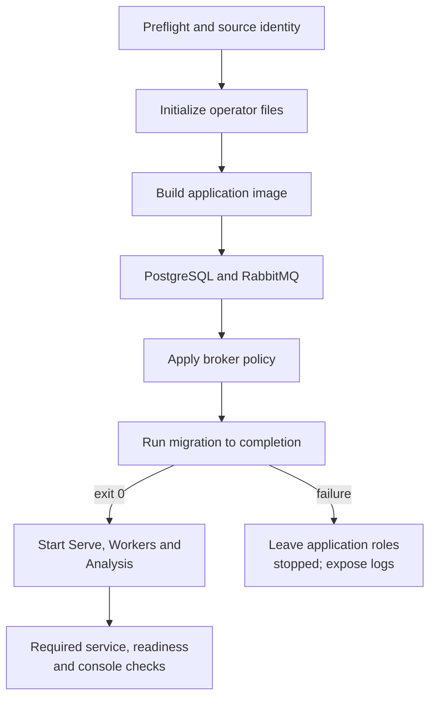

# Setup

[Handbook](README.md) · [Operations](OPERATIONS.md) · [Architecture](ARCHITECTURE.md)

This page owns the normal installation and development paths. It is not a history
of retired settings or a second copy of the News pipeline. Version-specific
upgrade and recovery instructions belong to [Migrations](MIGRATIONS.md) and
[Operations](OPERATIONS.md).

## 1. Prerequisites

Install Git, Make, [uv](https://docs.astral.sh/uv/), Docker with the Compose plugin,
`curl` and [GitHub CLI](https://cli.github.com/). Start the Docker daemon and run
`gh auth login --hostname github.com`. The current Makefile preflight checks these
tools, authenticated repository access and the source/deployment identity.

The project interpreter is pinned by [`.python-version`](../.python-version);
[uv.lock](../uv.lock) owns resolved Python dependencies and
[web/package-lock.json](../web/package-lock.json) owns the frontend lock.
The Docker build includes the console; Node/npm on the host is needed for a
frontend development loop, not to serve an already built application image.

Use the normal primary checkout on `main` for the supported deployment path.
The deployment checks bind the build to the expected clean, green `origin/main`
identity. A task worktree is for isolated development, not a reason to bypass that
boundary. [Worktrees](agents/worktrees.md) documents repository checkout handling.

## 2. Fresh installation

```bash
git clone git@github.com:AnalyThothAI/tracefold.git
cd tracefold
make up
```

The console is **http://127.0.0.1:8765/**. Check actual success before opening it:

```bash
make status
make logs
```



The exact orchestration is [Makefile](../Makefile) and [compose.yaml](../compose.yaml).
The one-shot migration must complete successfully before application roles start.
A failed command returns non-zero and names its boundary; do not interpret a
partially running stack as a completed startup.

A later `make up` rebuilds/recreates the application roles without unnecessarily
recreating an already running PostgreSQL container. Operator files and named
volumes persist. `make down` stops Nautilus first and then the remaining services;
it does not delete data volumes. Do not add `docker compose down -v` to routine
upgrade or troubleshooting instructions.

## 3. Initialization and configuration ownership

`make up` invokes `tracefold init`. The resulting operator directory is:

```text
~/.tracefold/
  config.yaml
  postgres_password
  postgres_database_password
  telegram_bot_token
  binance_usdm_api_key
  binance_usdm_api_secret
  archive/
  cache/
  logs/
```

`config.yaml` is the only application configuration authority. Initialization
creates a local API bearer token, no external credentials, and empty delivery/
execution placeholders. Directories are private (`0700`); config/secret files
use `0600`. The initializer preserves existing config contents and passwords
while repairing required permissions.

**`tracefold init --force` replaces config.yaml with generated defaults.** It is
not the ordinary upgrade command and does not rotate existing database passwords.
Back up intentional operator choices before using it.

There is no maintained static sample YAML or `.env` fallback. Read the generated
file and the actual [typed settings](../tracefold/platform/config/models.py).
Inspect paths and redacted values without printing raw credentials:

```bash
uv run tracefold config
uv run tracefold --help
```

Source code owns default values and accepted fields. Some resource budgets are
explicit Analysis settings; others are fixed in their owning implementation.
Do not copy an old exhaustive list of knobs or assume any undocumented key works.

### Capabilities can be enabled separately

| Capability | Configuration owner and expected behavior |
| --- | --- |
| News ingestion | `news.opennews_token` and `news.broker`; enabled source Strategies are chosen in the provider account, not a local strategy-ID allowlist. |
| Editorial models | Complete `llm` generative endpoint settings, optional ReaderCard/fallback routes and optional News-specific `llm.news_judgment`; partial credentials are rejected. |
| Notifications | `news.push`; disabled by default. Explicitly enabling an invalid provider configuration is not a successful delivery setup. |
| Wallet episodes | Current wallet/chain settings and adapters; roster, receipt collection, detection and price evidence report separately. |
| Trading analysis | `trading.enabled` and `trading.analysis`; disabled by default, with bounded market/model resource settings. |
| Signal publication | `trading.analysis.publish_signals`; false by default and independent of whether research decisions exist. |
| Execution | `trading.execution`, secure credential files and explicit runtime lifecycle; disabled by default. |

Without optional credentials the corresponding capabilities are idle, unavailable
or degraded; no fake feed or model answer is produced. Required shared infrastructure
still matters: an enabled News transport cannot silently run without its broker.
See the module guides for the resulting [News](modules/news.md),
[wallet](modules/wallets.md) and [Trading](modules/trading.md) paths.

## 4. Container addresses, mounts and public links

The generated PostgreSQL DSN and broker URL use Compose-network addresses and are
used as written. They are not automatically rewritten for a host-side CLI.
Run database/broker diagnostics in an appropriate application container:

```bash
docker compose exec -T workers tracefold news bus-check
docker compose exec -T workers tracefold db audit
```

Fresh-volume `initdb` creates the application login and required extensions.
The bootstrap password and ordinary database password are separate. Application
roles share the application database login with role-specific composition and
`application_name`; the bootstrap superuser credential is not an application mount.
An unknown non-empty data volume is not silently repaired or reinterpreted.

Bind mounts and secret exposure are explicitly role-scoped in Compose. Only
Nautilus receives the Binance execution credential files. Analysis uses the
configured connection identity and its own public-market/model adapters, not
account-write credentials. See [Security](SECURITY.md).

Published bindings are declared in Makefile and Compose. Use an explicit Make
command-line override for an intentional binding change; do not introduce an
untracked Compose override or `.env` to create another deployment definition.
Changing a published database binding can recreate its container, so treat it as
an operational change, not a harmless UI preference.

`api.host` / `api.port` describe a bind address. `api.public_url`, when set, is the
operator's externally reachable absolute HTTP(S) URL for reader links; it is not
guessed from that bind address. It must not contain query or fragment components.
Public HTTP is read-only. Browser bootstrap/auth does not grant command authority.

## 5. Updating an existing installation

Read the affected migration notes, preserve the operator config and take the
backup appropriate to the change. Strict settings reject removed keys by name.
Remove only the documented obsolete field at its correct YAML path; do not use
old indentation-blind regex snippets to delete every similarly named key.

For the EventUpdate cut, remove the retired `news.policy` and
`llm.news_compiler_reflection` fields at their exact paths. The forward-only
0404/0405 schema changes and writer coordination are documented in [Migrations](MIGRATIONS.md).

Validate configuration before restarting roles. A plain `tracefold init` does
not rewrite old key shapes. A schema change underneath a running execution owner
requires coordinated maintenance; do not bypass it simply to make `make up` pass.
[Migrations](MIGRATIONS.md) owns the supported baseline/head and destructive-cut
requirements. Pre-baseline backups need their recorded source/image and restore
procedure, not improvised SQL against current main.

For a same-schema exact-image replacement, use the narrow `make deploy-image`
procedure in [Operations](OPERATIONS.md). It validates image/source/database
compatibility and does not downgrade PostgreSQL or automatically replace the
execution process. This page deliberately does not duplicate that runbook.

## 6. Optional execution lifecycle

Nautilus uses a separate `tracefold-runtime:<sha>` image. A News/frontend change
must not restart the account owner implicitly. Its commands are:

```bash
make runtime-build
make runtime-status
make runtime-logs
# Only for an explicitly configured and authorized execution operation:
make runtime-up
make runtime-restart
make runtime-down
```

There is one configured Binance connection, not an in-process Paper simulator.
Environment selection and account authority are documented in
[Execution](modules/execution.md), [Security](SECURITY.md), and [Operations](OPERATIONS.md).
Starting research or following this installation guide does not authorize trading.

## 7. Development loops

Use an isolated task checkout and preserve unrelated changes. For frontend work,
keep an intentionally managed backend stack available and run:

```bash
cd web
npm ci
npm run dev
```

[Vite configuration](../web/vite.config.ts) proxies API requests to the local
backend. The console uses HTTP and persisted read models, not a hidden live
WebSocket subscription. [Frontend](FRONTEND.md) owns the detailed frontend workflow.

A host-process backend loop is an explicit alternative, not another default
installation path. Provision a separate development database/broker, set addresses
reachable from the host, and avoid running duplicate owners against production
state. After installing dependencies and migrating that development database:

```bash
uv sync --frozen
uv run tracefold db migrate
# Run intentionally enabled process roles in separate terminals:
uv run tracefold serve
uv run tracefold workers
uv run tracefold analysis
# In another terminal:
cd web && npm run dev
```

Do not run this block sequentially expecting foreground processes to return.
Execution remains independently managed, not a required development terminal.

## 8. Verification and diagnosis

```bash
make check
make test-fast
```

These are development checks, not deployment commands. [Testing](TESTING.md)
names resource-backed CI lanes; [Operations](OPERATIONS.md) explains service status,
queue state, business progress and backups. For startup failures, inspect the
failed boundary before changing config or deleting data. Report redacted paths,
boolean states and error codes, never credentials or full operator config.
