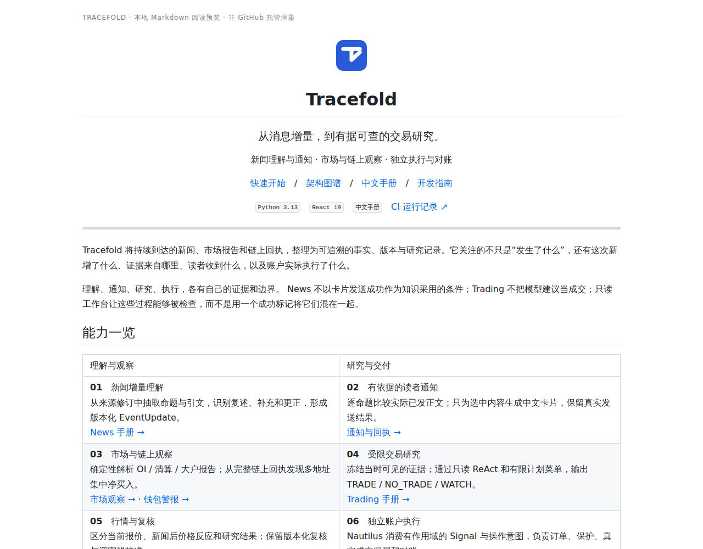
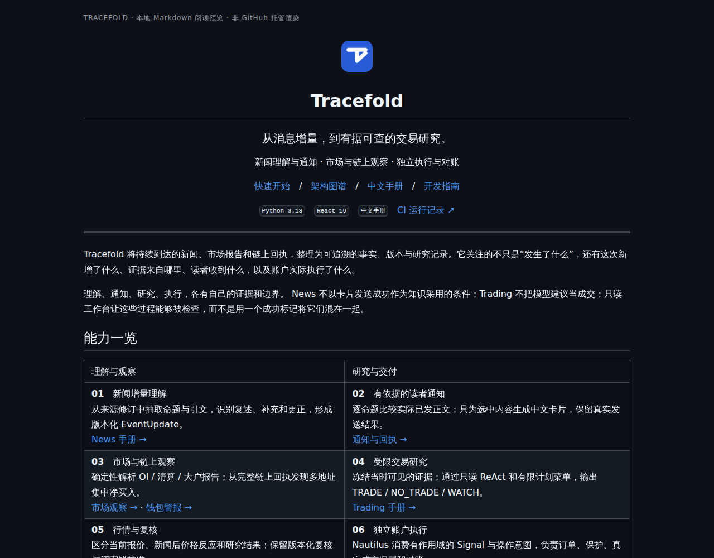
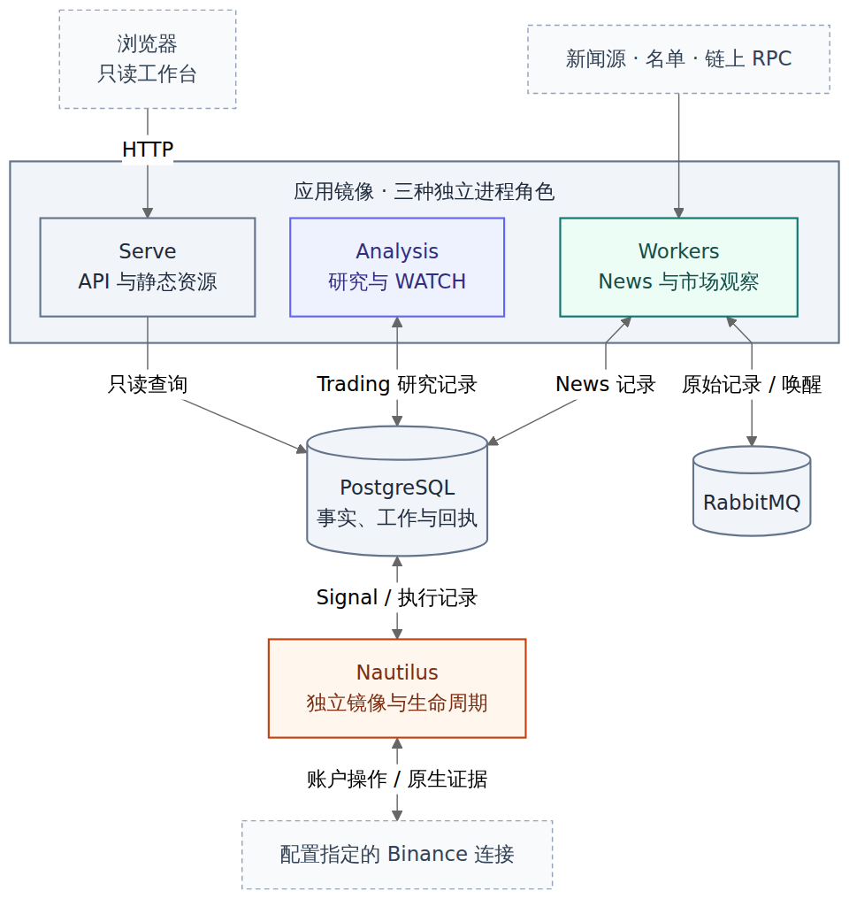

# 中文手册：视觉审阅记录

[文档中心](../README.md) · [项目首页](../../README.md) · [架构图谱](../ARCHITECTURE.md#atlas)

本页保留这轮文档设计的审阅样张。正文与图表仍由各自 Markdown 源码维护；截图不是第二套架构定义，也不是运行系统截图。

> [!NOTE]
> **本地阅读预览，不是 GitHub 托管渲染。** 样张使用 Markdown 渲染与 GitHub 风格 CSS，宽屏 1280 px、窄屏 390 px；图片只记录本轮审阅时的版式，不随业务运行更新。

## 首页：明暗两种阅读环境

<strong>展开暗色与窄屏样张</strong>

## 架构：角色、数据与权限分开表达

## 审阅口径

代码基线包含部署统一 #726 和执行账本 #727。30 张 Mermaid 图使用 Mermaid CLI 11.17.0 分别在明、暗主题实际渲染；每张图有可访问标题、说明和独立图注。页面样张只验证导航、尺寸和可读性，不证明部署、模型质量、发送或账户状态。

页面与图表规范见[文档设计](../DEVELOPMENT.md#documentation-design)，具体检查范围见[图表验证](../TESTING.md#diagrams)。未来改动以源文档为准，无需每次机械刷新这份历史审阅记录。
