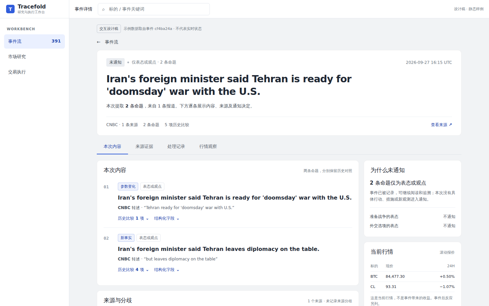
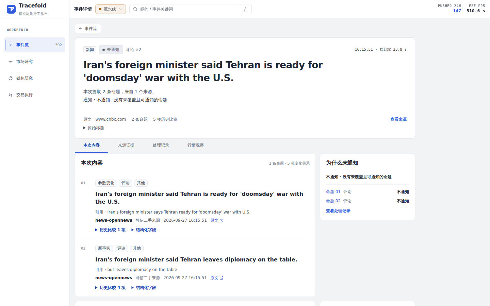
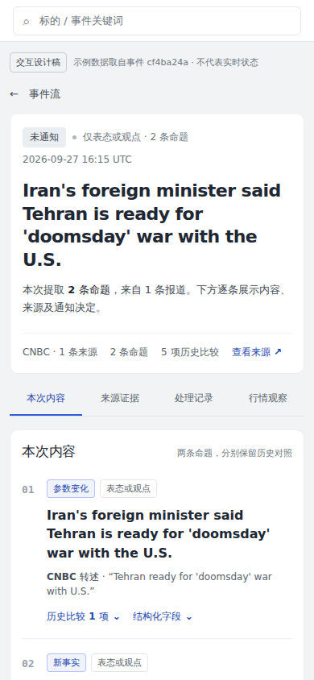
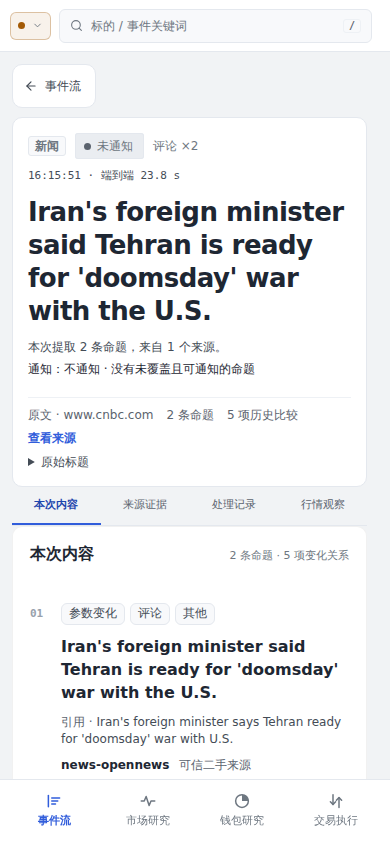

# News 详情页：阅读与交互设计记录

[文档中心](../README.md) · [前端架构](../FRONTEND.md) · [News 模块](../modules/news.md)

**先读懂当前内容，再核对来源，最后查看通知与实际发送结果。**

## 2026-10-02 · 二级详情页设计与落地

本轮以事件 `5f974d9ed7f4b56c1ba06cd83c22984a8ee061ecec550031542696dd0af48421` 为例，从产品交互角度重新组织二级详情页。目标是让页面回答的问题清晰、正文容易阅读，并保持当前工作台的统一风格。

> [!NOTE]
> 正式 React 详情页已随 [PR #795](https://github.com/AnalyThothAI/tracefold/pull/795) 合并到 main 并部署，采用下述原位 tab 交互。HTML 原型与设计图仍是静态示例：中文释义是设计文案，报价是观察快照，边界状态是演示，不能作为当前 API 内容或运行状态的证明。

### 当前问题与阅读目标

调整前，详情已有命题、引用、通知、行情和处理记录，但首屏通知理由重复、命题标签偏多，正文容易被处理术语挤压；时间线、通知决定和发送记录分散，底部关联查询又把长 ID 与版本字段带进普通阅读路径。原目录固定突出首项，也不能说明读者当前的位置。

本轮保留已记录信息的完整可查性，把主要阅读路径收敛为三个问题：发生了什么；材料如何支持这个说法；系统为什么通知，实际发出了什么。

### 信息架构

| 区域           | 回答的问题                     | 主要内容与入口                                                                           |
| :------------- | :----------------------------- | :--------------------------------------------------------------------------------------- |
| **事件概览**   | 这是什么事件，目前到哪一步？   | 标题、当前状态、简短说明、完整日期与时区、资产与来源／命题数量；主入口为“查看来源证据”   |
| **事件内容**   | 这次发生了什么？               | 每条采用命题各占一个编号阅读单元；变化与分歧等标签优先，引用与结构化字段在所属命题内展开 |
| **通知与送达** | 为什么通知，是否实际送达？     | 通知决定回链到对应命题；实际发送摘要连接冻结正文与真实记录                               |
| **来源证据**   | 谁说的，是否有独立材料？       | 来源身份、权威、时间、引文与支持／转述／反驳关系；完整原文及同类报道展开查看             |
| **当前行情**   | 关联资产现在如何报价？         | 类型化资产、交易场所、价格种类、报价时钟与滚动 24H 参考；报价不可用时保留资产信息        |
| **处理记录**   | 证据如何走到理解、通知与发送？ | 简短状态摘要；时间线、逐条决定和实际发送正文按需展开                                     |
| **技术详情**   | 如何定位底层记录？             | 事件标识、材料版本、符号归一和同一报道的关联事件查询，集中折叠                           |

“事件内容”“来源证据”“当前行情”“处理记录”四个 tab 位于同一张白色主内容卡片顶部，复用同一个 panel 槽；同时只显示活动内容。桌面右侧保留“通知与送达”作为上下文，切换 tab 不改变它的位置。窄屏顺序为活动 tab 内容、通知与送达、技术详情，不再把四块内容纵向全部铺开。

两条当前命题仍分别编号；同一报道产生多个命题时明确提示它们并非多个独立来源。来源材料与行情通过 tab 在同一位置查看，不要求读者寻找页面下方的卡片。

正式页面把同类报道与原始标题放入来源 tab，把时间线、发送记录与投递回执放入处理 tab，符号归一与关联 Item 查询放入技术折叠。没有 adopted head 的事件仍使用同样的四个 tab：内容显示原始标题与说明，来源展示已有报道，不从旧回执生成命题。

### 二级页复用原则

本轮以指定新闻事件页作为可体验样板。通用层沿用“返回上下文 → 摘要 → 主内容卡片内切换核心事实／来源／说明／处理 → 技术层”的阅读顺序。标的、市场记录和钱包详情后续可复用这一层级与切换方式，分别呈现各自已记录的数据；本轮不更改这些页面，也不套用新闻命题、通知与送达的业务语义。

### 实际交互

- tab 栏属于主内容卡片，显示选中状态，不再承担滚动目录或 scrollspy。点击在原位切换活动 panel，不自动滚动页面；左右方向键与 Home／End 在 tab 栏内切换，选中项与对应 panel 有明确的无障碍关联。
- 命题中的“来源 01”切换到来源 tab，来源关系回链切换到内容 tab；通知侧栏的发送与决定入口切换到处理 tab。所有内部链接先显示所属 panel，再展开必要记录并突出目标。普通 tab 切换保持原位；显式记录回链在目标超出阅读视口时将目标带入视口，避免手机侧栏的入口切换后仍看不到所点命题。导航不依赖浏览器原生 hash 跳转。
- “引用与命题详情”“来源原文”“同类报道”“处理时间线”“逐条通知决定”和“实际发送记录”采用渐进展开。panel DOM 保留，只用 `hidden` 切换，不重建内容，保留各处展开状态；静态原型中的语言选择也在切换后保留。
- 阅读位置使用 `?tab=source&focus=source-01` 这样的 query 表达；`tab` 取 `content`、`source`、`market` 或 `processing`，支持分享、刷新和浏览器后退。普通 tab 切换只需要对应 `tab`；内部链接再携带目标 `focus`。原型与正式页面统一使用 query，不解析旧 hash 作为详情导航。
- 主内容槽保留已阅读的高度，避免从展开的长内容切到短内容时，文档高度缩短迫使浏览器自动调整滚动位置。保留高度不改变活动内容与隐藏内容的访问边界。
- 静态原型提供“中文释义／记录原文”切换，两种视图保持命题数量、编号和关系一致。正式契约没有独立译文，React 页面只展示已记录命题原文，不提供这一语言切换。
- 正式页面“复制事件链接”保留当前 `tab`／`focus` 的阅读位置，顶部搜索沿用现有工作台。技术详情中的关联事件入口执行真实只读查询；静态原型的搜索与关联查询仅演示入口。
- 详情刷新失败保留最后成功内容，显示缓存读取时间与错误，并提供真实重试。行情读取错误只在行情 tab 呈现，保留其他内容的可读性；有报价缓存时按既有状态呈现陈旧数据。
- 边界状态选择器演示新材料解析失败、新发送失败、报价不可用及详情刷新失败。它只改变原型展示；失败状态应区分最新工作、上一版已采用内容与历史发送记录。

### 统一视觉风格

原型直接引用现有 [设计 token](../../web/src/styles/tokens.css)、[Tracefold 标识](../../web/public/favicon.svg)及[手机底部导航样式](../../web/src/features/cockpit/ui/AppBottomNav.css)，延续浅灰画布、白色面板、蓝色强调、细边框、现有圆角与字体层级。主标题、正文、元信息和等宽数字各有明确层级；减少默认露出的徽章与技术字段，把空间用于正文和证据。手机保留四个工作台入口，并增大主要操作与展开控件的点击范围。

正式页面复用 `PageShell`、`PageReadingContent` 与共享控件，沿用当前 CSS 层及 token；原型的独立工作台外壳没有复制到 React 实现。错误与风险同时用文字表达，链接与展开控件支持键盘聚焦，长 ID 和原文能换行。手机的记录展开整行、来源链接、通知按钮和技术查询控件使用现有 44px `--tap-target`；键盘操作后的浏览器前进／后退同步选中 tab 与焦点。

### 实现边界

- **内容来源**：中文释义仅为静态设计文案。正式页面展示服务端已有命题原文，不在页面读取时重跑模型或另行生成翻译。概览说明来自采用内容；没有 head 时使用来源说明，不合并或改写成新的业务事实。
- **命题与关系**：每条当前命题只展示一次；多项历史比较不是多条新增命题。来源数量、变化、分歧、撤回和替代状态来自已记录关系，不能从视觉相似度推断。
- **通知与评分**：通知计划、选择的命题、实际发送正文和真实回执分别展示。只有 `sent` 意图的正文称为“实际发送正文”，其他意图显示“冻结意图正文”，并保留各自状态与内容版本；发送结果不明时明确不能确认已送达，不暗示等待自动重发。原型评分及阈值是示例记录，没有硬编码为正式页面规则，也不能用选择集合冒充正文完整覆盖。
- **只读与失败**：页面读取不写订单、不重跑模型。最新输入失败时保留上一版 adopted head，并说明新工作失败；最新发送失败时保留历史回执，并明确历史成功不能证明本次成功。刷新失败保留最后成功内容，同时标记缓存、错误与重试入口。
- **导航**：上一篇／下一篇只沿读者原来的筛选列表；冷链接没有列表上下文时不虚构 pager。没有 adopted head 时保留原始标题、来源和已有处理事实。tab 与 focus 只表示阅读位置，不复制服务器事实；未知 tab 回到内容，找不到 focus 时不生成新的业务状态。
- **行情口径**：当前仅展示滚动报价，保留价格种类、来源、报价时钟及 fresh／stale／unavailable。24H 变化不是事件收益；固定期限 Event Reaction 已删除，不在新设计中恢复。
- **静态与演示**：设计快照不冒充实时状态。失败演示中已有时间线、耗时、材料版本和回执要注明所属版本／历史口径；实际实现仍由对应服务端记录驱动。

### 本轮交付物与验证

[交互原型](news-event-detail-prototype.html) · [桌面设计图](news-event-detail-desktop.jpg) · [来源选中设计图](news-event-detail-source.jpg) · [手机设计图](news-event-detail-mobile.jpg)

[正式页面桌面实测](news-event-detail-implementation-desktop.jpg) · [正式页面手机实测](news-event-detail-implementation-mobile.jpg)

桌面图展示主内容卡片与右侧通知上下文；来源选中图展示同一卡片内切换后的状态，手机图展示活动 tab、通知与技术层的顺序。四块内容不会作为一张纵向长图全部铺开。

静态原型此前在 1440 × 900 桌面和 390 × 844 窄屏检查了同卡片切换、单 panel 可见、键盘操作、query 直达、后退、内部链接展开、语言与展开状态保留，以及长短内容切换的高度稳定性；静态图不替代正式 React 的测试证据。原型的恢复／重试仅改变演示状态，正式页面的重试使用对应 Query。

正式页面 typecheck、构建、lint（含 23 项架构检查）与全量单元／组件／路由检查通过。四个视口的 16 项详情浏览器检查覆盖原位切换、冷 query、刷新、后退、键盘、保留展开，以及长处理记录切回短内容与 POP／前进时的高度和真实工作台滚动位置。全量浏览器回归以 4 workers 运行，121／121 通过；首次与单元测试并行使用 16 workers 时，一项无关 Trading 恢复用例超时，随后完整重跑通过，未改该测试或提高超时。

本次改动文件的 Prettier 检查通过。全量 `format:check` 因当前 checkout 的 230 个既有文件使用 CRLF 未通过；未批量重写这些无关文件。文档链接与差异空白检查另行核对。

PR 提交前，正式构建预览通过开发代理读取现有 Serve API，已人工检查指定事件在桌面与手机的实际内容、来源和切换；桌面与原生手机点击的主卡片位置／工作台滚动位置保持不变，没有横向溢出，未发现浏览器控制台错误。以上实测图来自这一预览，不是 HTML 示例，也不证明 FastAPI 静态资源部署或完整服务链路验收。静态原型复制操作曾显示成功提示，但浏览器工具的虚拟剪贴板未取得内容，实际系统复制结果仍未验证；当时未运行后端资源测试或部署。

### main 部署验收

PR #795 的完整 CI 通过后，于 2026-10-02 合并为 `92dbe19655aaab47f11f80dea2bc3699165c4821`，从干净的 `/srv/tracefold` main checkout 运行正常 `make up` 流程。构建、策略任务、迁移与应用就绪检查通过，四个应用角色使用同一不可变镜像；镜像 revision 与 Workers 运行版本均匹配该合并提交，数据库实际与预期 schema 均为 `20261002_0425`。指定事件的 8765 页面加载正式构建资源，原生 tab 点击的主卡片位置和工作台滚动位置保持不变。

部署后的桌面、1024px 平板与 390px 手机检查未发现横向溢出。验收发现并补齐三个交互细节：手机部分记录展开行原来仅约 17px、按钮和原文链接仅 32／36px；键盘切换后的浏览器后退未同步 tab 焦点；手机侧栏回链可能将焦点放在视口上方的命题。补齐后的规则如“实际交互”及“统一视觉风格”所述，普通 tab 仍保持原位。

补丁构建、ESLint、23 项架构检查和 263 项单元／组件／路由检查通过；详情浏览器检查仍为四视口 16／16，通过新增的后退／前进焦点及滚动断言、侧栏回链的实际视口边界断言。390px 构建预览中，记录展开整行、来源原文、通知按钮及技术详情均实测达到 44px；侧栏回链后的目标命题进入真实工作台可见范围，没有横向溢出。

## 历史参考 · #722

此前调整承接 [#720](https://github.com/AnalyThothAI/tracefold/issues/720) 的命题数量与重复变化解释，相关记录见 [#722](https://github.com/AnalyThothAI/tracefold/issues/722) 和 [PR #721](https://github.com/AnalyThothAI/tracefold/pull/721)。其阅读原则是当前命题与引用、通知判断、来源关系，再查看历史和处理记录。

原来的 HTML 原型已由本轮设计替换。以下四张 PNG 保留历史审阅证据；旧原型图与 React 截图均不代表本轮设计，也不代表当前运行内容或行情数值。

<strong>历史桌面 · 1440 px</strong>

**旧交互原型图**

**历史 React 预览**

<strong>历史窄屏 · 390 px</strong>

**旧交互原型图**

**历史 React 预览**

历史 React 截图由当时的本地 Vite 应用读取已有 Serve API，Event ID 为 `cf4ba24aa1221d9e5c03580685d0328184b5349cc8495db7d74824833e34a70d`。完整工作台外壳与实际 API 标签造成它与旧原型的差别；Event、报价及文案之后可能变化。

---

继续阅读：[前端数据与状态](../FRONTEND.md) · [新闻通知语义](../modules/news.md#notification)
