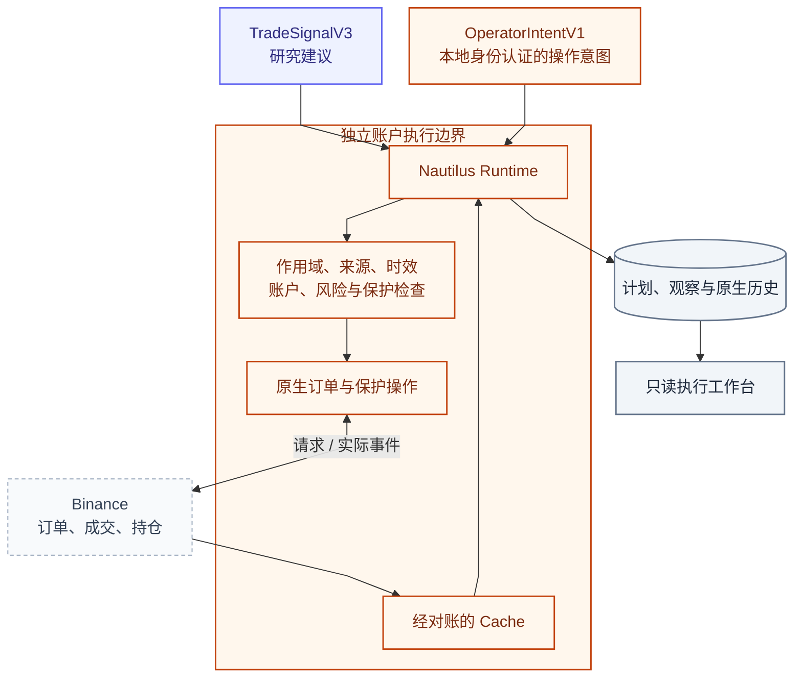
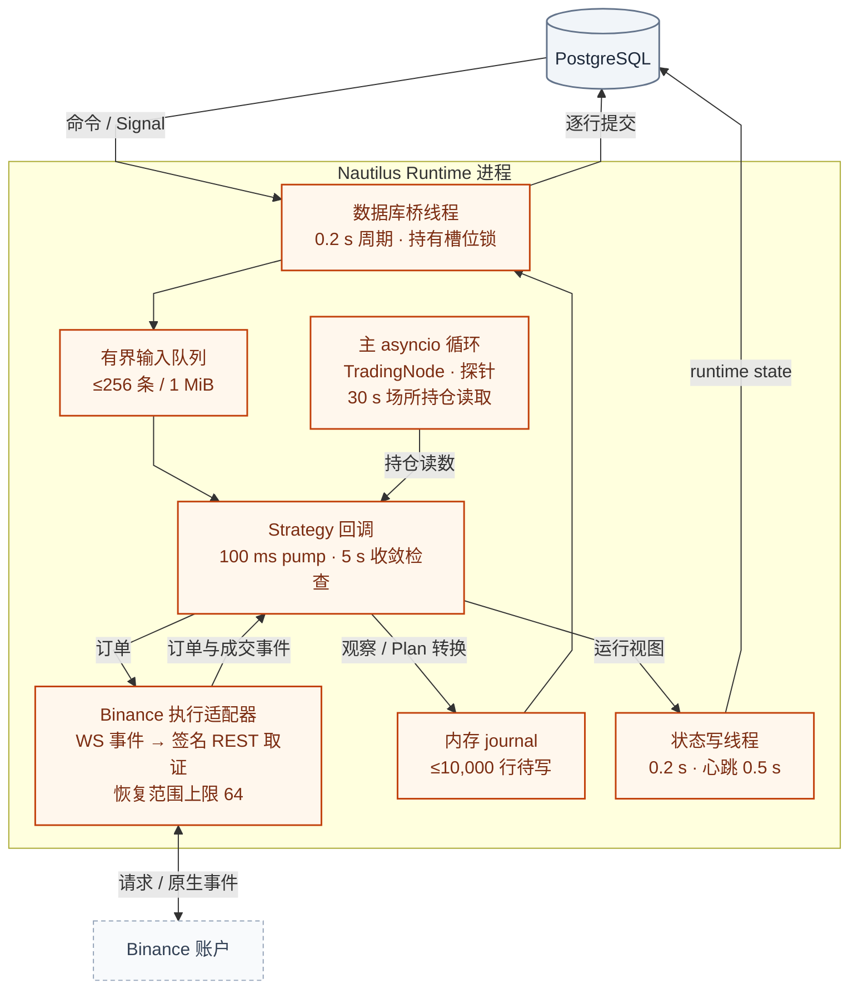
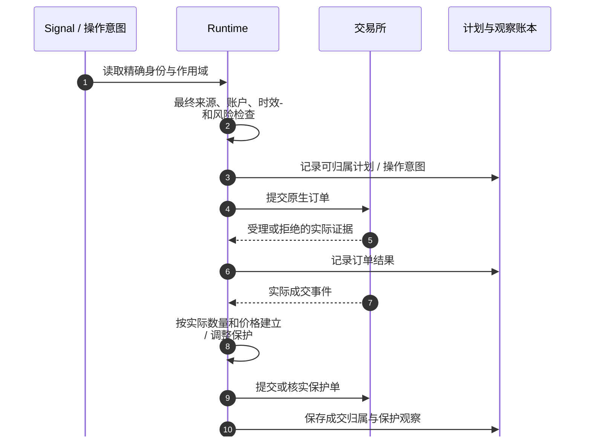

# Execution：独立执行、保护与真实账户证据

[手册](../README.md) · [Trading Analysis](trading.md) · [运维](../OPERATIONS.md#trading-operations) · [安全边界](../SECURITY.md)

Nautilus 是当前系统唯一的账户执行进程。它消费严格作用域的 Signal 和显式操作意图，将交易所事实与本地计划对齐。**记录了请求，不代表交易所接受；接受不代表成交；本地状态变化不代表账户已平仓。**

| 模块速览 | 说明 |
| :--- | :--- |
| **定位** | 交易能力 / 账户执行 |
| **运行位置** | 独立 Nautilus 镜像与进程（Compose profile `execution`，`make up` 不启动） |
| **输入 → 产物** | TradeSignalV3、本地认证的操作意图、交易所证据 → 订单与保护观察、归属成交、账户对账和原生历史 |

> [!IMPORTANT]
> 交易所是实际订单与仓位的证据来源。停止 Runtime 不平仓，未知持仓也不等于零。

[线程模型](#section-runtime-进程与线程模型) · [退出几何](#section-退出几何如何执行) · [已知执行问题](#section-已知执行问题) · [账户操作](../OPERATIONS.md#trading-operations) · [安全与权限](../SECURITY.md)

<details>
<summary><strong>本页目录</strong></summary>

1. [权限与事实来源](#section-权限与事实来源)
2. [Runtime 进程与线程模型](#section-runtime-进程与线程模型)
3. [Signal 到保护完成](#section-signal-到保护完成)
4. [页面上的执行阶段](#section-页面上的执行阶段)
5. [启动恢复与未知敞口](#section-启动恢复与未知敞口)
6. [条件单、成交归属与原生历史](#section-条件单成交归属与原生历史)
7. [操作意图不是操作结果](#section-操作意图不是操作结果)
8. [部署与验证边界](#section-部署与验证边界)
9. [已知执行问题](#section-已知执行问题)
10. [源码责任地图](#section-源码责任地图)
11. [常见误解](#section-常见误解)

</details>

<a id="section-权限与事实来源"></a>
## 01 · 权限与事实来源



*权限与数据视图 · 橙色表示账户执行职责，不表示订单已成功；交易所证据与本地意图各自有来源。*

| 层次 | 拥有的事实 |
| --- | --- |
| 交易所 | 实际订单、成交、持仓及签名可查记录 |
| Nautilus Cache | 经原生事件与对账形成的账户投影 |
| PostgreSQL 计划 / 观察 | 意图、归属、动作结果、可审计执行历史 |
| 浏览器 | 上述已记录状态的只读展示 |

本地计划不是另一个独立撮合账本；两个本地状态彼此一致也不能替代交易所确认。

<a id="section-runtime-进程与线程模型"></a>
## 02 · Runtime 进程与线程模型

Runtime 是一个进程（`tracefold nautilus run`），内部分成几个互不阻塞的执行单元。**Nautilus 回调从不同步访问 PostgreSQL**：进入进程的 Signal / 意图经数据库桥线程读取，离开进程的观察与 Plan 转换先进入内存 journal，再由同一线程逐行提交。研究侧的交接协议见 [Trading 端到端时序](trading.md#section-端到端时序与交接协议)。



*线程视图 · 箭头表示数据方向；Nautilus Cache 不落库，启动时由交易所对账重建。*

| 执行单元 | 节奏 | 负责 | 不做 |
| --- | --- | --- | --- |
| 主 asyncio 循环 | 事件驱动；场所持仓每 30 s | TradingNode 代际构建与重建、启动对账、`/readyz` 探针、唤醒订单恢复 | 业务决策 |
| Strategy 回调 | pump 100 ms；Nautilus 连续检查 5 s | 准入、定仓、提交、保护、时间退出、Cache 与场所持仓比对 | 同步访问 PostgreSQL |
| Binance 执行适配器 | WS 事件驱动；恢复退避倍增至 60 s | WS 订单 / Algo 更新触发签名 REST 取证；启动 mass status 注入；原生成交与费用证据 | 用缺失父 ID 合成成交 |
| 数据库桥线程 | 0.2 s | 单例检查 → 读命令 → 提交 Plan → 最终来源检查 → 写 journal（每轮 ≤32 行、≤100 ms）→ 读 Signal → 日初基线；各步骤失败互不阻断 | 交易决定 |
| 状态写线程 | 0.2 s；无语义变化时每 0.5 s 心跳 | `trading_execution_runtime_state` 投影 | 替代账户证据 |
| 内存 journal | — | Plan 转换与观察待写；关键行（Plan、成交、原生证据）以 0.5–30 s 退避重试，非关键行被拒则记录后丢弃 | 持久化：落库前只存在于进程内存 |

账户槽位由 `pg_try_advisory_lock` 在专用会话上独占；锁会话丢失时进程退出，不在无锁状态下继续交易。网络、场所或数据库的短暂故障只触发重连或代际重建，不让进程退出。

<a id="section-signal-到保护完成"></a>
## 03 · Signal 到保护完成

执行侧读取持久 Signal，检查账户槽位、entry scope、目标经济身份 / 原生路由、映射摘要、有效期、来源更正与入场并发，再按实际账户与风险参数处理计划。



*时序 · 正常成交路径不意味着每次订单都成交；超时与不确定结果按对账规则处理。*

计划退出政策与账户仓位约束由代码和配置拥有，Agent 不自由生成数量。部分成交后的保护必须围绕真实成交数量，不把请求数量当作持仓。来源更正可使尚未提交的入场成为 `source_corrected`；这不自动撤销已有仓位的保护。

### 读取与准入

数据库桥用 `UNRESOLVED_TRADE_SIGNALS_SQL`（[execution_stream.py](../../tracefold/trading/storage/execution_stream.py#L79-L95)）按 `seq` 读取本账户槽位中 `trade_signal_v3` / `entry_envelope_v3`、`expires_at_ns > now`、且没有处置观察、Plan 或退役记录的 Signal。**过期条件在 SQL 中**：Runtime 离线期间过期的 Signal 之后再也不会被读取，也不会得到任何处置记录。已读取但在准入前过期的 Signal 会写 `expired` 处置（若此前曾被延后，则写最后一次延后原因）。

准入按固定顺序给出第一个不满足的结果。“延后”在 Signal 有效期内重试，“拒绝”立即写处置：

| 阶段 | 检查（拒绝 / 延后） |
| --- | --- |
| 权限 | `account_slot_mismatch`、`asset_excluded`、`root_expired`、`emergency_halted`、`entries_paused`、`singleton_lost`（延后）、`unexpected_exposure`、`convergence_unverified`（延后）、`venue_unverified`（延后）、`post_stop_cooldown`（仅 Signal） |
| 账户与映射 | `account_unavailable`（延后）、`risk_non_positive`、`instrument_unmapped`、`mapping_changed`、`instrument_unavailable`（延后） |
| 报价 | 报价超过 `market_stale_after_seconds` 或缺失（延后）；条件子 Case 的 `entry_structure_lost`；可成交价相对参考价超过信封 `max_price_drift_bps`（当前 200）为 `entry_price_outside_envelope`；点差超过 `max_spread_fraction_of_stop × 止损 bps` 为 `spread_limit`（延后） |
| 敞口与定仓 | 同一标的已有持仓或订单为 `exposure_already_present`；另一入场正在提交时 `trade_plan_busy`（延后）；定仓按 `risk_fraction_per_trade × 权益 ÷ 止损距离`，并把名义限制在 `权益 × max_leverage` 减去现有名义以内 |

### 提交前握手

1. journal 把一个 `TradePlan` 交给数据库桥提交；同一 entry scope 已有 Plan 时为 `entry_scope_already_used`。
2. 数据库桥在 PostgreSQL 中运行 `validate_signal_entry`：Plan 已终态、Signal 或根已过期、决策未发布或已变化、来源被取代（`source_superseded`）、所引命题被 News 更正撤回（`source_corrected`）、身份变化，都会让计划以 `not_submitted` 结束；每次检查都写入 `trading_entry_validity_checks`。
3. 提交前 Strategy 再按当前 Cache 复核权限、映射、敞口、报价与冻结风险（`frozen_risk_exceeded`）；可重试项每 1 s 重新请求最终检查，直到入场过期。
4. 以确定性 client order id 提交一张市价入场单。手动入场没有 Signal，跳过第 2 步。

<a id="section-退出几何如何执行"></a>
### 退出几何如何执行

| 参数 | Signal 入场 | 手动入场 |
| --- | --- | --- |
| 止损距离 | Signal `exit_plan.stop_distance_bps`（Analysis 计划的 2×ATR14，100–1,000 bps） | `trading.execution.risk.stop_distance_bps`（默认 100） |
| 止盈距离 | `exit_plan.take_profit_bps`（止损的两倍） | `trading.execution.exit_policy.take_profit_bps`（未配置时 200） |
| 最长持有 | `exit_plan.max_holding_ns`（14,400 s） | `exit_policy.max_holding_seconds`（未配置时 14,400） |

- **保护单**：持仓出现后（包括部分成交），每条腿各一张 reduce-only 原生条件单，都以 **mark price** 触发：止损为 `STOP_MARKET`，止盈为 Nautilus `MARKET_IF_TOUCHED`（Binance 的 `TAKE_PROFIT_MARKET`）。触发价从实际开仓均价按距离计算，数量等于当前持仓数量。
- **调整**：持仓数量或均价变化后，已有保护单不再匹配时提交一张新的匹配单；Binance USD-M 只能修改 LIMIT 单，所以旧保护单保留到新单被接受后再撤，重叠期间两者都是 reduce-only。
- **被拒**：保护单因 `-2021`（会立即触发）被拒时，直接以该腿原因 reduce-only 市价平仓；其他拒绝在下一次 5 s 收敛时重新提交，没有次数上限。
- **时间退出**：在 Runtime 本地判断。到达 `opened_at + max_holding` 时撤掉仍在工作的入场单，并以 reduce-only 市价单平仓。**Runtime 停止期间场所上的止损 / 止盈仍有效，但本地时间退出不会执行。**
- **止损后冷却**：止损平仓后，同一市场在 `post_stop_cooldown_seconds`（默认 14,400 s）内拒绝 Signal 入场。

<a id="section-确定性订单身份"></a>
### 订单身份

确定性 client order id 为 `tf` + `sha256(namespace:entry_id:leg)` 的前 30 位十六进制（共 32 字符），由 [entry.py](../../tracefold/integrations/nautilus/oi_runtime/entry.py#L27) 生成。当前只有每条腿的**第一张**订单使用它：

| 订单 | 当前 client order id |
| --- | --- |
| 入场 | 确定性（`leg=entry`） |
| 第一张止损 / 止盈 | 确定性（`leg=stop` / `take_profit`） |
| 替换保护单 | 确定性 id 已被占用，交给 Nautilus 生成 |
| 每种原因的第一次平仓（`exit:time_exit` 等） | 确定性 |
| 同一原因的再次平仓、venue-only flatten | Nautilus 生成 |

Nautilus 生成的 id 形如 `O-{日期}-{时间}-{trader}-{strategy}-{序号}`，长度随序号增长，可超过 Binance 的 36 字符上限而被 `-4015` 拒绝；影响见[已知执行问题](#section-已知执行问题)。

<a id="section-页面上的执行阶段"></a>
## 04 · 页面上的执行阶段

[execution_stage](../../tracefold/trading/stages.py)是纯派生函数，优先读取计划生命周期，避免缺少一条观察就让活跃计划退回“Signal 已过期”。

| 阶段 | 含义 |
| --- | --- |
| `pending` | 尚没有足够事实证明已提交订单 |
| `rejected` | 入场被拒绝；`not_submitted` 结束的计划不是一笔平仓交易 |
| `expired` | 入场意图在适用边界过期，不说明已有仓位必须消失 |
| `ordered` | 存在订单 / 受理的记录，不等于已经成交 |
| `filled` | 已成交或计划处于 open，但尚无保护证据 |
| `protected` | 存在保护信息；仍需按整体账户状态理解时效和可靠性 |
| `closed` | 计划 / 执行记录确认结束；收益覆盖另行判断 |

这不是让 UI 操纵 Runtime 的状态机。浏览器也不能凭“看到 protected”推断当前所有交易所查询都成功，或者费用数据已齐全。

<a id="section-启动恢复与未知敞口"></a>
## 05 · 启动恢复与未知敞口

Runtime 启动必须结合存储计划、订单身份和交易所持仓进行对账。未完成的请求、失联后的订单、已有持仓与未认领敞口都要保留真实不确定性。

| 情况 | 应保持的语义 |
| --- | --- |
| 签名持仓查询失败或过期 | 账户状态未知，不是 flat |
| Cache 显示关闭但交易所仍有仓位 | 不因本地投影提前撤掉保护 |
| 账户存在无法归属当前计划的持仓 | 显示未认领敞口并遵循已有入场限制；不能凭猜测给它分配 Plan |
| 提交超时，结果未明 | 先核实交易所证据，不盲目重发同一风险操作 |
| Runtime 停止 | 只是进程停止，不是交易所平仓回执 |

修复是恢复真实归属与可靠账户状态，不是为了清掉红色提示去重置计划、伪造 fill 或自动 flatten 未知仓位。

<a id="section-条件单成交归属与原生历史"></a>
## 06 · 条件单、成交归属与原生历史

Binance 条件单触发后，父级 Algo 订单与普通子订单可能使用不同 venue ID。必须通过签名证据建立父子对应，完成归属后再按真实子订单成交补齐；不能用缺失的父 ID 合成一笔成交。

多个平仓执行腿可以有不同原因和价格。汇总结果不能只把最后一次回调当整笔退出原因。手续费、资金费率和成交覆盖分别记录；部分历史仍应显示不完整。

Runtime 只核验当前风险和持久非终态 Plan 的精确订单。原生订单、成交、费用及绑定进入同一 PG 账本；一笔成交终结所需的待写依据与 Plan 终态在同一事务提交。查询缺少原生事实时保留未知，不回退普通 fill。

<a id="section-操作意图不是操作结果"></a>
## 07 · 操作意图不是操作结果

当前本地操作入口为 `tracefold trading issue`，使用本地 OS 身份。请求带稳定 request ID 和调用方封存的纳秒时间，重试必须保留，不能每次当新命令。

| 命令语义 | 不能推断 |
| --- | --- |
| `/pause` | 只限制新入场，不表示持仓已平 |
| `/flatten account` | 请求 reduce-only 平仓并暂停入场；受理不等于平仓已确认 |
| `/halt` | 本次 Runtime 生命周期内的粘性停止；不应假设 `/resume` 可清除 |
| 新账户槽位 | 不保证因为没有历史控制记录就自动处于 paused |

准确 CLI 参数见[生成帮助](../generated/cli-help.md)，实际操作见[运维](../OPERATIONS.md#trading-operations)。公开 HTTP 全部只读，没有浏览器下单或 Telegram 命令 webhook 替代这条本地操作权限。

<a id="section-部署与验证边界"></a>
## 08 · 部署与验证边界

```bash
make runtime-status
make runtime-logs
```

这是独立执行角色的查看入口。`runtime-build`、`runtime-up`、`runtime-restart` 与 `runtime-down` 会改变执行生命周期，不能因提交文档 PR 顺手运行；长期运行角色中，账户执行凭据只挂载给 Runtime；可信初始化器仅负责生成配置文件。

Runtime 的生命周期与应用角色分开：

| 事实 | 当前行为 |
| --- | --- |
| 服务定义 | Compose 服务 `nautilus` 在 profile `execution` 中，使用独立的 `tracefold-runtime:<sha>` 镜像；默认 `:local` 标签从不构建，裸 `docker compose --profile execution up` 会失败 |
| `make up` | 只构建、迁移并启动 Serve / Workers / Analysis，从不启动或重启 Runtime；Runtime 在运行且本次包含 schema 变化时拒绝部署，要求先停止 Runtime |
| `make runtime-up` | 要求 `trading.execution.enabled=true` 且 Runtime 镜像的 Alembic head 等于数据库 head；不构建、不迁移 |
| 迁移之后 | 旧 Runtime 镜像与新 schema 不兼容，需要 `runtime-build` 后再 `runtime-up`；没有自动恢复 |
| Runtime 停止期间 | Analysis 照常研究并发布 Signal（它不读 Runtime 心跳）；这些 Signal 过期后不留处置；场所保护单仍在，本地时间退出不执行 |

实际操作顺序见[运维 · 部署与独立 Runtime](../OPERATIONS.md#deployment)与[迁移指南](../MIGRATIONS.md)。

行为验证见 [Nautilus 进程集成](../../tests/integration/test_nautilus_oi_runtime.py)、[执行读模型](../../tests/integration/test_trading_executions_read_model.py)、[Signal 作用域](../../tests/integration/test_trading_signal_v3_scope.py)及[执行契约](../../tracefold/trading/execution_contracts.py)。测试环境中的模拟事件只证明对应契约，不是当前实际账户已核实的证据。

<a id="section-已知执行问题"></a>
## 09 · 已知执行问题

以下是执行半环的当前缺陷，证据与修复规格由 [#746](https://github.com/AnalyThothAI/tracefold/issues/746)（吸收 #719 未完成部分）拥有；全链路根因见 [Trading 已知设计问题](trading.md#section-已知设计问题)的 RC5 / RC6。

| 问题 | 当前行为 |
| --- | --- |
| 订单身份不完整（RC6） | 替换保护单、重复平仓与 venue-only flatten 使用 Nautilus 生成的 id，可被 `-4015` 拒绝；分笔成交后替换止损失败会让新增数量没有止损，直到时间退出 |
| 恢复预算被永久错误占满 | 被拒 id 进入适配器恢复范围（上限 64 个 key）后不会被剔除，每次唤醒重新排队；占满后新订单拿不到签名证据（日志 `recovery scope budget exhausted`） |
| 终态结算没有收敛出口 | `write_terminal_plan` 要求入场与退出的原生证据完整；证据缺失时 Plan 保持 `open` 并以退避重试，仍占用 `ux_trading_trade_plans_active_instrument`，该标的不能再开新计划；日志只记录异常类型名 |
| 保护单无限重挂 | 非 `-2021` 的拒绝在每次 5 s 收敛时重新提交，没有上限或降风险出口 |
| 过期 Signal 不留处置（RC5） | 轮询 SQL 过滤 `expires_at_ns > now`，未读即过期的 Signal 没有处置记录 |
| 容量 | 默认 `risk_fraction_per_trade = 0.01`、`max_leverage = 1`，止损为下限 100 bps 时一笔入场的名义约等于权益，同一时间实际只能持有一笔 |

#746 还记录了仅经代码审计、尚未在 DEMO 复现的问题：在途入场不计入杠杆 / gross、`submission_unknown` 缺少清除路径、journal 在代际重建时可能丢失关键行。它们在复现前不应被当作已证实事实。

<a id="section-源码责任地图"></a>
## 10 · 源码责任地图

| 实现 | 职责 |
| --- | --- |
| [app/nautilus/root.py](../../tracefold/app/nautilus/root.py)、[oi_runtime.py](../../tracefold/app/nautilus/oi_runtime.py) | 独立进程、配置和 Strategy 装配 |
| [strategy.py](../../tracefold/integrations/nautilus/oi_runtime/strategy.py) | 执行 Strategy、生命周期与信号 / 控制处理 |
| [binance.py](../../tracefold/integrations/nautilus/oi_runtime/binance.py)、[venue.py](../../tracefold/integrations/nautilus/oi_runtime/venue.py) | 交易所接缝、签名查询与事实解释 |
| [entry.py](../../tracefold/integrations/nautilus/oi_runtime/entry.py) | 入场约束、计划与订单交接 |
| [journal.py](../../tracefold/integrations/nautilus/oi_runtime/journal.py)、[observations.py](../../tracefold/integrations/nautilus/oi_runtime/observations.py) | 计划与可归属执行观察 |
| [order_evidence.py](../../tracefold/integrations/nautilus/oi_runtime/order_evidence.py) | 订单身份、条件单父子关联及证据恢复 |
| [trade_history.py](../../tracefold/integrations/nautilus/oi_runtime/trade_history.py)、[funding.py](../../tracefold/integrations/nautilus/oi_runtime/funding.py) | 原生成交与资金费率历史 |
| [trading/stages.py](../../tracefold/trading/stages.py)、[app/execution_status.py](../../tracefold/app/execution_status.py) | 基于记录派生执行阶段与只读账户状态 |

`oi_runtime` 是目录历史命名，不表示它只执行 OI，也不能证明存在另一套 Workers 内置交易引擎。当前没有进程内 Paper 撮合器；执行使用配置指定的 Binance `LIVE` / `DEMO` / `TESTNET` 连接。

<a id="section-常见误解"></a>
## 11 · 常见误解

<details>
<summary><strong>展开常见问题</strong></summary>

**Runtime 在线是否意味着账户已核实？**

不意味着。进程存活、账户新鲜度、计划归属、保护与原生历史覆盖分别判断。

**记录了订单请求是否就存在成交？**

不是。请求、受理、真实成交和保护分别有自己的证据，结果不明时保持不确定性。

</details>

---

[返回文档中心](../README.md) · [架构图谱](../ARCHITECTURE.md#atlas) · [返回顶部](#execution独立执行保护与真实账户证据)
