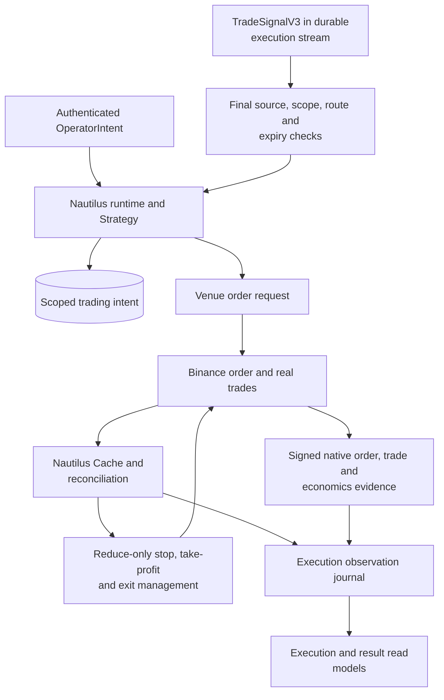
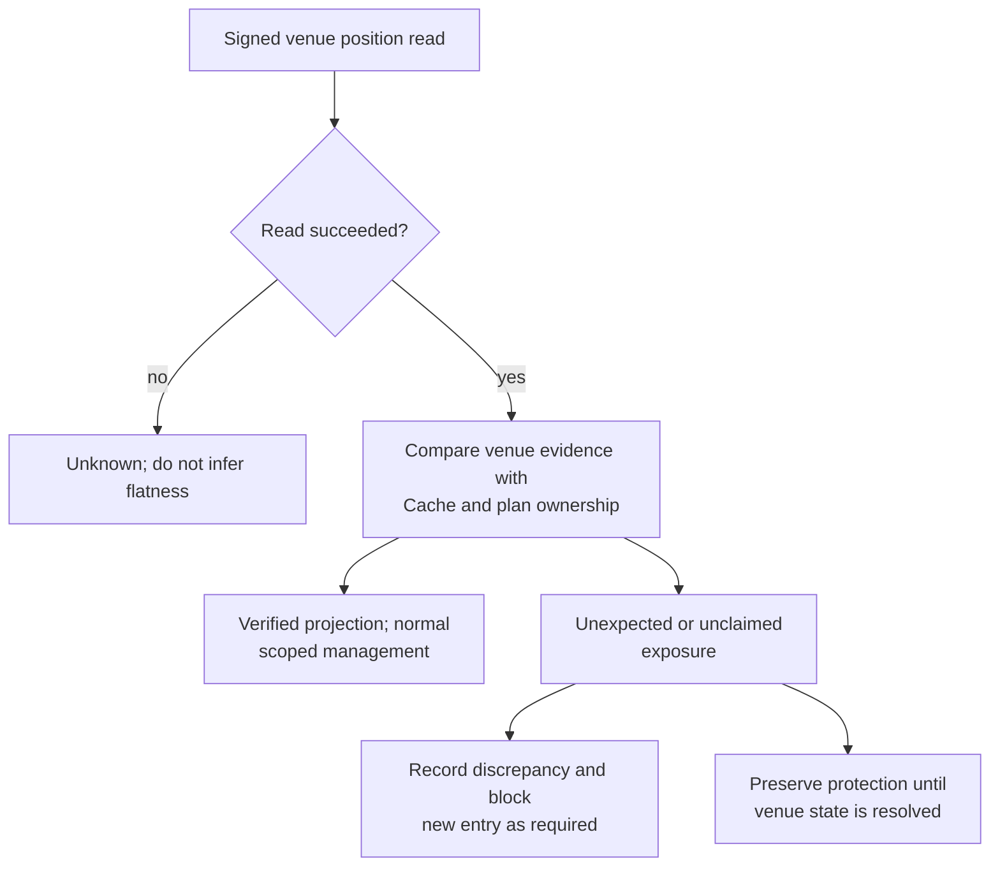
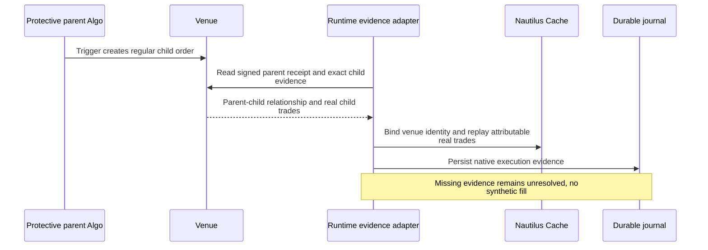

# Execution: one account-facing owner

[Handbook](../README.md) · [Trading Analysis](trading.md) ·
[Operations](../OPERATIONS.md) · [Security](../SECURITY.md)

The independent Nautilus process consumes scoped Signals and authenticated
operator requests. It owns the account-facing lifecycle; a News model, Trading
research tool, HTTP read or PostgreSQL plan row cannot manufacture a venue fill.
This guide describes source behavior, not the current state of an account.

## 1. Ownership and source map

| Fact or responsibility | Owner | Implementation |
| --- | --- | --- |
| Venue order, trade and position evidence | Configured Binance connection | [binance.py](../../tracefold/integrations/nautilus/oi_runtime/binance.py), [venue.py](../../tracefold/integrations/nautilus/oi_runtime/venue.py) |
| In-process order/position projection | Reconciled Nautilus Cache | [strategy.py](../../tracefold/integrations/nautilus/oi_runtime/strategy.py) |
| Trading plan / entry scope | PostgreSQL intent, not a second order state machine | [entry.py](../../tracefold/integrations/nautilus/oi_runtime/entry.py), [Trading storage](../../tracefold/trading/storage/) |
| Critical execution observations | Durable journal of observed results | [journal.py](../../tracefold/integrations/nautilus/oi_runtime/journal.py), [observations.py](../../tracefold/integrations/nautilus/oi_runtime/observations.py) |
| Signed order/trade attribution | Parent/child order evidence and native trade history | [order_evidence.py](../../tracefold/integrations/nautilus/oi_runtime/order_evidence.py), [trade_history.py](../../tracefold/integrations/nautilus/oi_runtime/trade_history.py) |
| Funding and account projection | Attributable economics and current read projection | [funding.py](../../tracefold/integrations/nautilus/oi_runtime/funding.py), [account_projection.py](../../tracefold/integrations/nautilus/oi_runtime/account_projection.py) |
| Runtime process, database and probe | App composition | [app/nautilus](../../tracefold/app/nautilus/), [execution_status.py](../../tracefold/app/execution_status.py) |

The historical directory name `oi_runtime` is not a second OI-only strategy.
Current contracts are those documented in [Trading Analysis](trading.md).

## 2. From Signal to actual execution evidence



A correction to an explicitly cited News proposition can invalidate a still-unsubmitted
entry; the amended source does not itself authorize cancelling orders or flattening
positions. See [Trading source amendments](trading.md#editorial-catalyst-versus-source-amendment).

Submitting a command, Runtime acceptance, venue acceptance, a fill, a protected
position and venue-proven flatness are separate facts. A successful CLI request
only establishes its documented boundary; inspect later observations rather than
promote it directly to a completed execution.

Plans record intended instrument/direction and exit parameters. Nautilus and the
venue own actual fills and positions. Protection uses actual execution evidence;
it does not assume that a requested quantity was fully filled at the quoted price.

## 3. Reconciliation and uncertain states

Startup reconciliation rebuilds the Cache from venue evidence, with the relevant
lookback and open-plan symbol scope. The configured path disables invented
missing-order generation; a discrepancy is not repaired by manufacturing a trade.
Ongoing signed position reads check that the venue and Cache agree.



An unexplained Cache close is not sufficient to cancel a venue position's
protection. Signed venue evidence and the Runtime's own closing-leg attribution
are needed to establish what happened. Unknown exposure is not automatically
flattened simply to make local status green. An explicitly authenticated flatten
request is a separate operation with its own outcomes.

A provider timeout after an order request is not proof of rejection. Reconcile
before deciding whether another action is necessary. Physical I/O completion,
journal durability and recovery semantics must stay aligned.

## 4. Protective Algo orders and historical recovery

A triggered Binance protective Algo order can create a regular child order with
a different venue ID. The signed parent receipt identifies that child; the client
binds the evidence before replaying its actual trades into Nautilus. An unmatched
or incomplete receipt leaves an unresolved state rather than guessed attribution.



Restart recovery follows the same evidence relationship. More than one distinct
closing leg is recorded as mixed exit; the final fill alone does not explain the
whole exit. Native history recovery has bounded preview/apply surfaces in
[history.py](../../tracefold/app/nautilus/history.py), with exact operator procedures
in [Operations](../OPERATIONS.md) and the current [migration cut](../MIGRATIONS.md).
Do not use an old image or historical replay to write retrospective live trades.

## 5. Economics and read models

Execution results must retain native fills, commissions, funding and their coverage
or missing-evidence reasons. Do not replace a partial history with a fabricated
complete PnL, or conflate a research price path with realized execution.
The journal and native evidence support read models; read models do not acquire
order authority by computing a result.

Runtime process status, account freshness, open-plan attribution, protection and
native evidence completeness answer different questions. A live process with
unverified account evidence must not be represented as a verified flat account.
Exact response fields and status vocabulary belong to [Contracts](../CONTRACTS.md).

## 6. Separate lifecycle

The commands below identify the supported lifecycle; they are not instructions
to activate an account as part of ordinary documentation or frontend work:

```bash
make runtime-build
make runtime-status
make runtime-logs
# Explicit operational actions, after the account/configuration checks:
make runtime-up
make runtime-restart
make runtime-down
```

`make up` manages the application roles, not this process. `make down` stops the
Runtime before the rest of the stack. A schema change under active execution needs
the documented coordinated maintenance procedure, not a blind application restart.
Do not bypass the migration/runtime safety boundary to simplify a docs workflow.

Execution uses the configured Binance connection. There is no separate in-process
Paper execution simulator. Environment selection, credentials, activation and
publication remain explicit configuration/control concerns. [Setup](../SETUP.md)
and [Security](../SECURITY.md) describe the actual secure files and authority.

## 7. Verification entry points

[Runtime strategy tests](../../tests/test_nautilus_oi_runtime_strategy.py),
[venue truth tests](../../tests/test_nautilus_oi_runtime_venue_truth.py),
[bridge tests](../../tests/test_nautilus_oi_runtime_bridge.py),
[runtime integration](../../tests/integration/test_nautilus_oi_runtime.py), and
[execution read-model tests](../../tests/integration/test_trading_executions_read_model.py)
cover different boundaries. Passing them does not establish the state of a live
account or prove that a historical provider response was complete.
