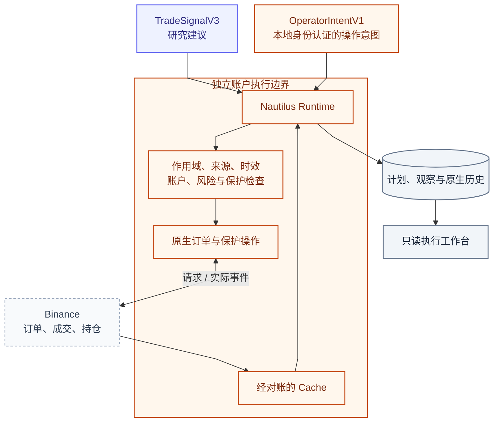
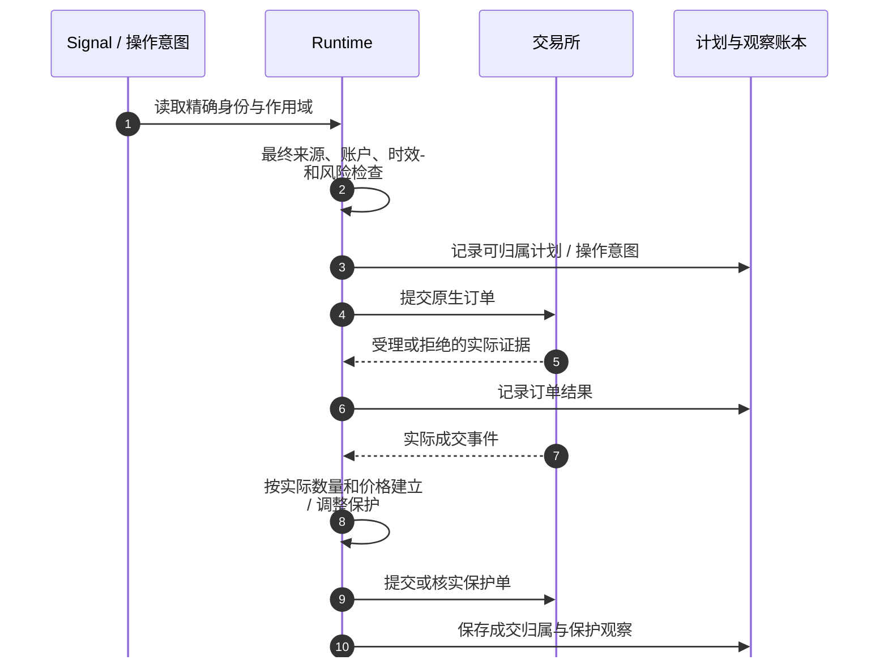

# Execution：独立执行、保护与真实账户证据

[手册](../README.md) · [Trading Analysis](trading.md) · [运维](../OPERATIONS.md#trading-operations) · [安全边界](../SECURITY.md)

Nautilus 是当前系统唯一的账户执行进程。它消费严格作用域的 Signal 和显式操作意图，将交易所事实与本地计划对齐。**记录了请求，不代表交易所接受；接受不代表成交；本地状态变化不代表账户已平仓。**

| 模块速览 | 说明 |
| :--- | :--- |
| **定位** | 交易能力 / 账户执行 |
| **运行位置** | 独立 Nautilus 镜像与进程 |
| **输入 → 产物** | TradeSignalV3、本地认证的操作意图、交易所证据 → 订单与保护观察、归属成交、账户对账和原生历史 |

> [!IMPORTANT]
> 交易所是实际订单与仓位的证据来源。停止 Runtime 不平仓，未知持仓也不等于零。

[账户操作](../OPERATIONS.md#trading-operations) · [安全与权限](../SECURITY.md)

<details>
<summary><strong>本页目录</strong></summary>

1. [权限与事实来源](#section-权限与事实来源)
2. [Signal 到保护完成](#section-signal-到保护完成)
3. [页面上的执行阶段](#section-页面上的执行阶段)
4. [启动恢复与未知敞口](#section-启动恢复与未知敞口)
5. [条件单、成交归属与原生历史](#section-条件单成交归属与原生历史)
6. [操作意图不是操作结果](#section-操作意图不是操作结果)
7. [部署与验证边界](#section-部署与验证边界)
8. [源码责任地图](#section-源码责任地图)
9. [常见误解](#section-常见误解)

</details>

<a id="section-权限与事实来源"></a>
## 01 · 权限与事实来源



*权限与数据视图 · 橙色表示账户执行职责，不表示订单已成功；交易所证据与本地意图各自有来源。*

| 层次 | 拥有的事实 |
| --- | --- |
| 交易所 | 实际订单、成交、持仓及签名可查记录 |
| Nautilus Cache | 经原生事件与对账形成的账户投影 |
| PostgreSQL 计划 / 观察 | 意图、归属、动作结果、可审计执行历史 |
| 浏览器 | 上述已记录状态的只读展示 |

本地计划不是另一个独立撮合账本；两个本地状态彼此一致也不能替代交易所确认。

<a id="section-signal-到保护完成"></a>
## 02 · Signal 到保护完成

执行侧读取持久 Signal，检查账户槽位、entry scope、目标经济身份 / 原生路由、映射摘要、有效期、来源更正与入场并发，再按实际账户与风险参数处理计划。



*时序 · 正常成交路径不意味着每次订单都成交；超时与不确定结果按对账规则处理。*

计划退出政策与账户仓位约束由代码和配置拥有，Agent 不自由生成数量。部分成交后的保护必须围绕真实成交数量，不把请求数量当作持仓。来源更正可使尚未提交的入场成为 `source_corrected`；这不自动撤销已有仓位的保护。

<a id="section-页面上的执行阶段"></a>
## 03 · 页面上的执行阶段

[execution_stage](../../tracefold/trading/stages.py)是纯派生函数，优先读取计划生命周期，避免缺少一条观察就让活跃计划退回“Signal 已过期”。

| 阶段 | 含义 |
| --- | --- |
| `pending` | 尚没有足够事实证明已提交订单 |
| `rejected` | 入场被拒绝；`not_submitted` 结束的计划不是一笔平仓交易 |
| `expired` | 入场意图在适用边界过期，不说明已有仓位必须消失 |
| `ordered` | 存在订单 / 受理的记录，不等于已经成交 |
| `filled` | 已成交或计划处于 open，但尚无保护证据 |
| `protected` | 存在保护信息；仍需按整体账户状态理解时效和可靠性 |
| `closed` | 计划 / 执行记录确认结束；收益覆盖另行判断 |

这不是让 UI 操纵 Runtime 的状态机。浏览器也不能凭“看到 protected”推断当前所有交易所查询都成功，或者费用数据已齐全。

<a id="section-启动恢复与未知敞口"></a>
## 04 · 启动恢复与未知敞口

Runtime 启动必须结合存储计划、订单身份和交易所持仓进行对账。未完成的请求、失联后的订单、已有持仓与未认领敞口都要保留真实不确定性。

| 情况 | 应保持的语义 |
| --- | --- |
| 签名持仓查询失败或过期 | 账户状态未知，不是 flat |
| Cache 显示关闭但交易所仍有仓位 | 不因本地投影提前撤掉保护 |
| 账户存在无法归属当前计划的持仓 | 显示未认领敞口并遵循已有入场限制；不能凭猜测给它分配 Plan |
| 提交超时，结果未明 | 先核实交易所证据，不盲目重发同一风险操作 |
| Runtime 停止 | 只是进程停止，不是交易所平仓回执 |

修复是恢复真实归属与可靠账户状态，不是为了清掉红色提示去重置计划、伪造 fill 或自动 flatten 未知仓位。

<a id="section-条件单成交归属与原生历史"></a>
## 05 · 条件单、成交归属与原生历史

Binance 条件单触发后，父级 Algo 订单与普通子订单可能使用不同 venue ID。必须通过签名证据建立父子对应，完成归属后再按真实子订单成交补齐；不能用缺失的父 ID 合成一笔成交。

多个平仓执行腿可以有不同原因和价格。汇总结果不能只把最后一次回调当整笔退出原因。手续费、资金费率和成交覆盖分别记录；部分历史仍应显示不完整。

Runtime 只核验当前风险和持久非终态 Plan 的精确订单。原生订单、成交、费用及绑定进入同一 PG 账本；一笔成交终结所需的待写依据与 Plan 终态在同一事务提交。查询缺少原生事实时保留未知，不回退普通 fill。

<a id="section-操作意图不是操作结果"></a>
## 06 · 操作意图不是操作结果

当前本地操作入口为 `tracefold trading issue`，使用本地 OS 身份。请求带稳定 request ID 和调用方封存的纳秒时间，重试必须保留，不能每次当新命令。

| 命令语义 | 不能推断 |
| --- | --- |
| `/pause` | 只限制新入场，不表示持仓已平 |
| `/flatten account` | 请求 reduce-only 平仓并暂停入场；受理不等于平仓已确认 |
| `/halt` | 本次 Runtime 生命周期内的粘性停止；不应假设 `/resume` 可清除 |
| 新账户槽位 | 不保证因为没有历史控制记录就自动处于 paused |

准确 CLI 参数见[生成帮助](../generated/cli-help.md)，实际操作见[运维](../OPERATIONS.md#trading-operations)。公开 HTTP 全部只读，没有浏览器下单或 Telegram 命令 webhook 替代这条本地操作权限。

<a id="section-部署与验证边界"></a>
## 07 · 部署与验证边界

```bash
make runtime-status
make runtime-logs
```

这是独立执行角色的查看入口。`runtime-build`、`runtime-up`、`runtime-restart` 与 `runtime-down` 会改变执行生命周期，不能因提交文档 PR 顺手运行；长期运行角色中，账户执行凭据只挂载给 Runtime；可信初始化器仅负责生成配置文件。

行为验证见 [Nautilus 进程集成](../../tests/integration/test_nautilus_oi_runtime.py)、[执行读模型](../../tests/integration/test_trading_executions_read_model.py)、[Signal 作用域](../../tests/integration/test_trading_signal_v3_scope.py)及[执行契约](../../tracefold/trading/execution_contracts.py)。测试环境中的模拟事件只证明对应契约，不是当前实际账户已核实的证据。

<a id="section-源码责任地图"></a>
## 08 · 源码责任地图

| 实现 | 职责 |
| --- | --- |
| [app/nautilus/root.py](../../tracefold/app/nautilus/root.py)、[oi_runtime.py](../../tracefold/app/nautilus/oi_runtime.py) | 独立进程、配置和 Strategy 装配 |
| [strategy.py](../../tracefold/integrations/nautilus/oi_runtime/strategy.py) | 执行 Strategy、生命周期与信号 / 控制处理 |
| [binance.py](../../tracefold/integrations/nautilus/oi_runtime/binance.py)、[venue.py](../../tracefold/integrations/nautilus/oi_runtime/venue.py) | 交易所接缝、签名查询与事实解释 |
| [entry.py](../../tracefold/integrations/nautilus/oi_runtime/entry.py) | 入场约束、计划与订单交接 |
| [journal.py](../../tracefold/integrations/nautilus/oi_runtime/journal.py)、[observations.py](../../tracefold/integrations/nautilus/oi_runtime/observations.py) | 计划与可归属执行观察 |
| [order_evidence.py](../../tracefold/integrations/nautilus/oi_runtime/order_evidence.py) | 订单身份、条件单父子关联及证据恢复 |
| [trade_history.py](../../tracefold/integrations/nautilus/oi_runtime/trade_history.py)、[funding.py](../../tracefold/integrations/nautilus/oi_runtime/funding.py) | 原生成交与资金费率历史 |
| [trading/stages.py](../../tracefold/trading/stages.py)、[app/execution_status.py](../../tracefold/app/execution_status.py) | 基于记录派生执行阶段与只读账户状态 |

`oi_runtime` 是目录历史命名，不表示它只执行 OI，也不能证明存在另一套 Workers 内置交易引擎。当前没有进程内 Paper 撮合器；执行使用配置指定的 Binance `LIVE` / `DEMO` / `TESTNET` 连接。

<a id="section-常见误解"></a>
## 09 · 常见误解

<details>
<summary><strong>展开常见问题</strong></summary>

**Runtime 在线是否意味着账户已核实？**

不意味着。进程存活、账户新鲜度、计划归属、保护与原生历史覆盖分别判断。

**记录了订单请求是否就存在成交？**

不是。请求、受理、真实成交和保护分别有自己的证据，结果不明时保持不确定性。

</details>

---

[返回文档中心](../README.md) · [架构图谱](../ARCHITECTURE.md#atlas) · [返回顶部](#execution独立执行保护与真实账户证据)
