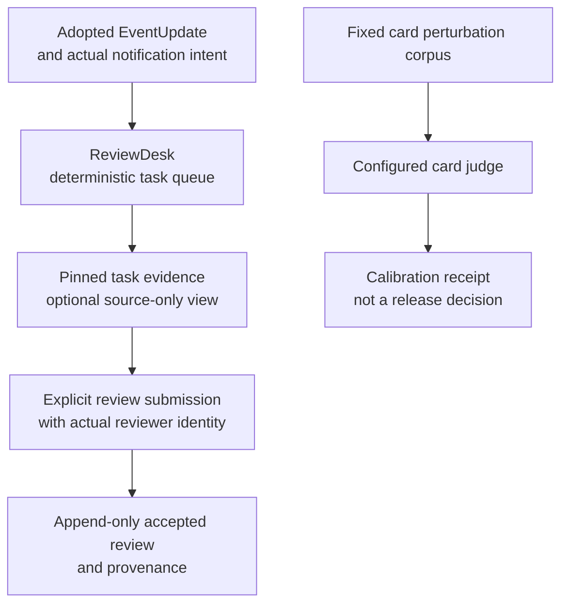

# News review and judge calibration

[Handbook](../README.md) · [News](news.md) · [Review context](../../CONTEXT.md)

**Current main after #711 retains ReviewDesk and card-judge calibration.** The old
three-predictor Program, GEPA optimizer, frozen learning campaigns, candidate
registration, release/canary controls and progression-review execution have been
removed. Historical records remain evidence, not currently callable workflows.

The filename `learning.md` is a navigation label. It does not imply that
`news learning run`, `freeze`, `baseline` or `news release` still exists.

## 1. Current capability map



These are separate measurement paths. A calibration receipt does not accept labels,
change News Agent instructions, rewrite an EventUpdate, activate a candidate or
publish a Trading Signal. No automatic retraining/release loop is implemented by
this diagram.

| Source | Current responsibility |
| --- | --- |
| [review/desk.py](../../tracefold/news/review/desk.py) | Task queue, evidence/version selection, accepted review and external-miss records for the current intent/update product. |
| [learning/judge.py](../../tracefold/news/learning/judge.py) | Card quality judge, not the News understanding/planning authority. |
| [judge_calibration.py](../../tracefold/news/learning/judge_calibration.py) | Measure the judge against the fixed perturbation corpus. |
| [calibration corpus](../../tracefold/news/learning/resources/judge_calibration_cases.json) | Recorded synthetic measurement inputs; not a live production-quality denominator. |
| [app/learning_runtime.py](../../tracefold/app/learning_runtime.py) | Resource composition for retained review/calibration work. |
| [CLI parser](../../tracefold/app/cli/parsers/news.py), [review handler](../../tracefold/app/cli/commands/news_review.py), [learning handler](../../tracefold/app/cli/commands/news_learning.py) | Actual supported operations and their read/write boundaries. |

## 2. Read evidence before accepting a review

The current commands include `news review queue`, `evidence`, `submit` and
`external-miss`. The evidence operation takes the task and its exact version;
`--source-only` excludes the Agent answer and existing reviews for a source-first
reading. Submission records the explicit reviewer principal, supplied review and
idempotency key. Use the [generated CLI help](../generated/cli-help.md) for required
arguments, rather than copying a historical campaign invocation.

A proposed label is not accepted Gold. Acceptance records who accepted what against
which evidence; it does not prove independent human correctness. AI-authored
reviews must retain their actual provenance rather than be described as human
labels. Omitted information and an external miss are different review facts.

Historical pre-cut verdicts remain labeled history. Do not convert their labels
into EventUpdate claims or pretend the old taxonomy dimensions still define the
current reader task. The current [claim/topic/source model](../NEWS_TAXONOMY.md)
and actual sent body are the relevant context.

## 3. Calibration is a bounded model operation

```bash
# Inspect supported options without making a model call:
uv run tracefold news learning judge-calibration --help
```

The actual `judge-calibration` operation requires an explicit model and can write
a JSON receipt with `--out`. It measures the card judge against its fixed synthetic
pairs and does not require a database write. Running it **does spend provider
resources**; ordinary documentation checks do not authorize that experiment.

Judge agreement on these perturbations is not evidence of production recall,
notification usefulness, claim correctness across all stories, or trading returns.
Preserve unavailable/error outcomes and the measured denominator. The card judge
also does not become a second required approval before News adoption or sending.

## 4. What changed and what must not be inferred

| Former workflow | Current meaning |
| --- | --- |
| `NativeNewsProgram` predictor optimization | Removed from execution; News now uses the EventUpdate Agent and independent notification path. |
| Accepted-review development/validation freeze and GEPA | Historical evidence only, not an available current CLI campaign. |
| Candidate register/evaluate/release/canary | Removed; no current automatic promotion authority. |
| Program artifact hash or new prompt deployment | Does not automatically recompute processed evidence or reset exhausted semantic work. |
| Historical quality score | Applies to its recorded old source/data/protocol, not the new EventUpdate product. |

The [research index](../research/README.md) and [engineering receipts](../reports/README.md)
retain useful measured outcomes and inputs. They are explicitly separated from
current instructions, so a previous successful GEPA run is not mistaken for a
supported command or measured improvement after #711.

An explicit scoped `news retry-work` repair is an operational retry of the named
failed revision/intent, not training, retrospective relabeling or a release.
It preserves immutable adoptions and actual receipts. [Operations](../OPERATIONS.md)
and [Migrations](../MIGRATIONS.md) own those current procedures.

## 5. Verification and limitations

Use [judge boundary tests](../../tests/architecture/test_news_judge_boundary.py),
[judge calibration tests](../../tests/news/test_news_judge_calibration.py),
[review CLI tests](../../tests/news/test_news_review_cli.py), and
[ReviewDesk integration](../../tests/integration/test_news_review_desk.py).
The [EventUpdate tests](news.md#8-failure-diagnosis-and-verification) exercise the
new product's separate semantic, notification and receipt contracts.

The implementation supports inspectable review and measurement; it does **not**
yet establish an end-to-end automatic optimization loop for the new News Agent.
Restoring such a loop would be a new implemented/evaluated capability, not a
reason to retain obsolete commands in the current README.
