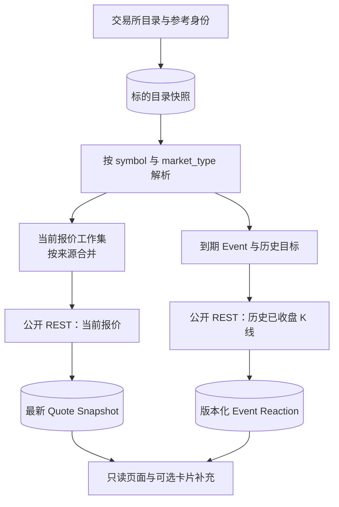
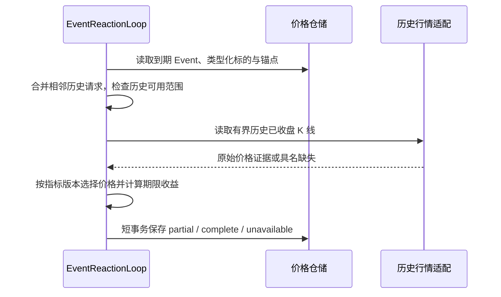

# Market Review：标的目录、行情与事件复盘

[手册](../README.md) · [News](news.md) · [OI](oi.md) · [交易研究](trading.md) · [执行收益](execution.md)

本模块回答三个问题：**这是什么资产、这个合约现在多少钱、新闻出现后价格如何变化**。它不回答账户是否成交，也不是高频订单簿采集器。

## 1. 三种数据产品

| 产品 | 身份 / 时间 | 更新语义 | 不能替代 |
| --- | --- | --- | --- |
| Instrument catalogue | 资产类别、来源、交易所、原生合约 | 周期更新目录，保存明确的可解析身份 | Trading 的已验证经济映射和下单权限 |
| Quote Snapshot | 当前来源报价、来源 / 接收时间、类型化资产 | 有界工作集的最新值；旧快照可被新值替换 | 新闻发生时的历史价、成交价 |
| Event Reaction | Event 锚点、标的、指标版本、固定期限 | 由历史已收盘 K 线补齐的派生结果 | 真实账户收益、策略因果效果 |

当前 Reaction 指标为 **`reaction_v2`**，使用类型化资产解析，避免同名股票和加密资产互相套价。旧 v1 保留原始语义，不能直接和 v2 混算。

## 2. 源码与分层

| 源码 | 职责 |
| --- | --- |
| [instruments.py](../../tracefold/news/market_review/instruments.py)、[instrument_storage.py](../../tracefold/news/market_review/instrument_storage.py) | 标的类别、目录快照、匹配与目录存储 |
| [pricing.py](../../tracefold/news/market_review/pricing.py) | 来源排序、价格类型、时效、K 线选择、期限、收益与资源上限；纯函数 |
| [loops.py](../../tracefold/news/market_review/loops.py) | `QuoteSnapshotLoop` 和 `EventReactionLoop` 的有界 I/O 编排 |
| [quote_storage.py](../../tracefold/news/market_review/quote_storage.py) | 目标查询、当前快照与到期 Reaction 存储 |
| [projections.py](../../tracefold/news/market_review/projections.py) | 显示字段、覆盖率与派生结果投影 |
| [review_storage.py](../../tracefold/news/market_review/review_storage.py) | 保留的历史 verdict / cohort 复盘查询；不能据此宣称新 Agent 自动评估已闭环 |
| [integrations/venues](../../tracefold/integrations/venues/) | Binance、Hyperliquid、OKX 等来源的公开行情与历史适配 |
| [Workers wiring](../../tracefold/app/workers/wiring/) | 将目录、报价、复盘能力装配进 Workers，分配独立资源接缝 |

这里没有新的 broker 队列、每个标的一条常驻任务，也没有因为一次行情失败而重新启动新闻语义分析。

## 3. 类型化资产与来源选择

资产匹配不是把一个裸 ticker 丢给任意交易所。`symbol` 必须结合 `market_type` / `instrument_class`，再由目录解析候选合约。股票 `SEI` 不应匹配同名币；找不到可用匹配就明确缺失，不能借用另一类资产的价格。

来源优先级和报价货币顺序由 [pricing.py](../../tracefold/news/market_review/pricing.py)的共同规则维护，目录 chip、报价与 Reaction 不各写一份排序。参考性身份条目不自动变成可交易报价或执行路由。

解析成功仍只说明该只读行情产品有可用目标。Trading 对非标准合约的经济身份、每张单位和 mapping digest 有自己的契约；执行侧还必须检查实际配置的交易所连接。

## 4. 当前报价循环

`QuoteSnapshotLoop` 从 PostgreSQL 读有界目标，按来源合并请求，在事务外拉取，再以短事务批量写回。工作量按来源组而不是“Event 数 × 资产数”增长，同一资产被多条新闻提到不应重复请求行情。

| 当前代码预算 | 数值 | 含义 |
| --- | --- | --- |
| 报价主周期 | 20 秒 | 按开始时间安排，不重叠、不为错过的轮次无限追赶 |
| 当前报价阶段 deadline | 10 秒 | 必需来源组的有界外部读取 |
| 工作集 / 来源组上限 | 256 个目标 / 12 组 | 防止页面需求变成无界全市场采集 |
| 外部并发 | 4 | 该行情接缝的并发上限，不是模型并发 |
| Binance 日参考刷新 | 300 秒 | 必需当前报价写回之后的可选补充 |
| 报价新鲜窗口 | 45 秒 | 判断 fresh / stale；不是数据延时服务承诺 |
| 卡片读取报价等待 | 1.5 秒 | 超出后应允许缺少该补充，而非伪造价格 |

来源失败时保留上一条快照并明确 stale / unavailable，不把它变为零。报价字段保留 last / mark / mid 等价格种类及 freshness basis；只有接收时钟与有真实来源时钟的证据强度不同。

24h 涨跌与当前价格也要使用一致的参考含义：不能把很旧的日参考伪装成新鲜窗口，更不能把滚动 24h 变化称为“新闻后的收益”。

## 5. 固定期限 Event Reaction

当前锚点查询使用 Event 的 `opened_at_ms`，不是用户收到卡片的时间，也不是订单成交时间。`reaction_v2` 固定 **5 分钟 K 线、1h / 4h 期限**以及价格选择、缺口容差和多资产聚合含义。

基本价格反应为 `return_bps = (终点价格 / 锚点价格 - 1) × 10,000`，精确选价、舍入和是否可用以纯函数为准。还未到期、只补齐一个期限与确实缺失是不同状态；不能把所有未完成项算成零收益。

循环每轮读取有界到期工作；默认周期 60 秒，每轮最多合并为 32 个历史请求。进程在某个期限离线后，可以在历史仍可读时补齐；超过当前允许的历史范围会明确不可用，而不是永久重试。

## 6. 四种“收益”不能混合

| 数字 | 正确解释 |
| --- | --- |
| 当前报价的 24h 变化 | 来源定义的滚动市场变化 |
| Event Reaction | Event 锚点到固定期限的价格反应 |
| Trading 研究结果 | 冻结 Case / 候选根在规定研究协议下的价格路径 |
| 原生执行收益 | 真实成交、手续费、资金费率及其覆盖情况 |

新闻后的上涨不证明新闻造成上涨；通知命中率不证明策略盈利；纸面价格路径也不能补上缺失的手续费和成交证据。`review_storage.py` 中仍有依赖历史 verdict 的聚合，不应包装为新 EventUpdate Agent 的全样本线上质量评估。

## 7. 排障与验证

先检查标的类别与匹配结果，再检查来源可用性、报价 / 锚点时钟、到期工作和 K 线覆盖。公共行情超时与语义失败是两个问题，不应共享一个“新闻不可用”结论。

验证入口：[报价循环](../../tests/news/test_news_v3_price_loops.py)、[价格存储与复盘](../../tests/integration/test_news_v3_price.py)、[规模接缝](../../tests/integration/test_news_v3_price_scale.py)。这些测试验证有界行为和计算，不等于任意交易所此刻可用或所有资产都有完整历史。
