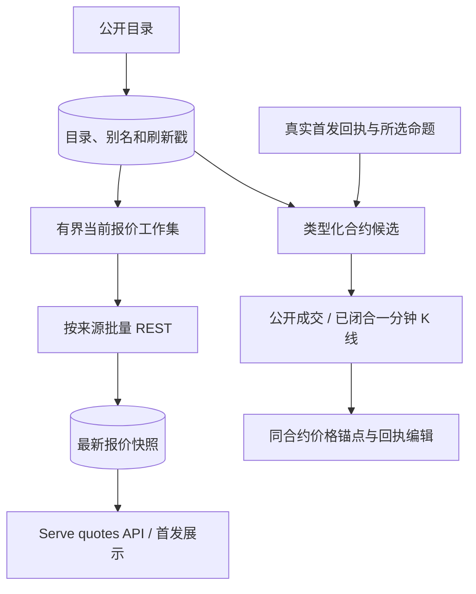

# Market Review：标的目录与行情

[手册](../README.md) · [News](news.md) · [OI](oi.md) · [Trading](trading.md) · [执行收益](execution.md)

本模块为 News 提供资产身份目录、当前报价和发送时行情补充。目录说明某个符号能解析为哪些合约；行情保留来源、价格类型和时效。交易账户的权限、经济映射与成交由 Trading / Execution 自己维护。

## 数据产品与所有者

| 产品 | 存储与语义 | 当前消费者 |
| --- | --- | --- |
| 标的目录 | `news_market_instruments` 保存 venue / venue_symbol、基础符号、类别、报价币和状态；`news_symbol_aliases` 保存别名 | Gate 类别、来源候选、资产 chip、搜索与报价解析 |
| 目录刷新状态 | `news_collectors.instrument_catalog.state.venues` 保存各场所成功刷新戳 | 状态页与目录故障诊断 |
| 当前报价 | `news_quote_snapshots` 每 source 一行，可被该来源新的成功快照替换 | 独立 quotes API、页面与首发可选展示 |
| 发送时补充 | 以真实 push 时间、被选命题和同一合约的历史价格点计算 | 可编辑渠道的回执绑定行情更新 |

目录行的 observed_at 是系统观察到身份或状态变化的时钟，collector 刷新戳才说明完整目录最近何时成功读取。当前目录不保存一份独立的历史 listing-event 账本，不能由最新目录还原过去的全部有效区间。目录变化也不自动生成上币卡片；读者上币通知来自实际来源消息。报价快照不能替代历史价格、账户成交或持久知识。

## 当前两条行情链路

*数据流 · 当前快照与发送锚点使用各自时间和真实来源，账户成交由 Execution 账本提供。*

`InstrumentSnapshotLoop` 与 `QuoteSnapshotLoop` 在 Workers 轮询，外部 I/O 在数据库事务外，结果批量短事务写入。它们不新增 broker 队列，不为每个 Event 或 symbol 建常驻任务。

### 实际装配与配置

`news.venues.enabled` 控制目录/行情能力，各场所开关独立。当前目录轮询装配 Binance、Hyperliquid、OKX 和 `us_reference`；周期为 `snapshot_period_hours`，默认 6 小时。只有实际回答的场所参与目录协调和刷新戳更新，失败场所不会被误判为整体下架。

当前报价轮询装配 Binance spot/perp、Hyperliquid 主市场和 builder DEX、OKX spot/perp。Lighter 与 Bitget 开关也用于按需行情/可交易性校验，不能据此推断它们参与周期目录和报价。`us.listed` 仅为参考身份，不提供可交易价格。

## 类型化资产与合约解析

显示或计算价格时使用 `QuoteRequest(symbol, market_type)`，候选必须匹配 crypto、equity、commodity、index、fx 或 pre_ipo 类别。股票 SEI 和同名代币是不同问题，不能用一个裸 ticker 共享报价。

解析只选择目录中 trading 条目：优先精确基础符号，之后才用别名。真实可交易的 SKHX 不因故事别名 SKHY 被改报另一合约。排序由 [pricing.py](../../tracefold/news/market_review/pricing.py)共同维护：Binance perp → spot，Hyperliquid perp → spot → xyz → 其他 builder DEX，之后 OKX perp → spot；同来源报价币优先 USDT、USDC、FDUSD。资产 chip、当前解析和发送候选使用共同规则。

内部 unknown 请求可以用于采集计划选择现有目录合约；公共 `/api/news/quotes` 的 unknown 资产明确返回“市场未确定”，不猜同名合约。API 使用有界 typed assets 批次，与 Feed 分开请求，避免价格变化使 Feed ETag 和计数查询不断失效。

| 状态 | 解释 |
| --- | --- |
| unlisted | 目录没有匹配所问市场的可交易合约 |
| unavailable | 有合约但没有可用快照，或只有 `us.listed` 参考身份；unknown API 也以此明确市场未定 |
| stale | 有真实上一报价，但时钟已陈旧或超出允许未来偏差 |
| fresh | 来源/接收时钟符合当前价格新鲜规则；不保证所有行情锚点都完整 |

News 目录匹配不授予下单权限，也不能替代 Trading 的已验证经济身份、每张合约单位、mapping digest 或执行连接。

## 当前报价循环与时效

工作集先取 watchlist，再取最近 72 小时已准入 Event 的 grounded assets 和 live、非 historical 的 OI 事实；归一 symbol、合约和 source，多个 Event 提到同资产不增加重复请求。计划只轮询每 symbol 的首选解析目标；读取端可以明确显示未进入工作集的资产暂无报价。

| 代码边界 | 当前值 |
| --- | --- |
| start-based 主周期 | 20 秒，不重叠、不无限追赶错过轮次 |
| 必需当前请求 deadline | 10 秒，来源失败独立 |
| 最大目标 / source group | 256 / 12 |
| 外部并发 | 4 |
| Binance 日参考刷新 | 300 秒，在当前成功写入后进行，最多 spot/perp 两组 |
| fresh 当前窗口 | 45 秒，使用适用时钟中最老者 |
| 日参考有效窗口 | 600 秒，过期只移除百分比 |
| 允许未来时钟偏差 | 5 秒，超出为 stale |
| API typed 批次 | 最多 100 个去重资产 |
| 卡片读报价预算 | 1.5 秒，失败省略展示 |

必需请求超时、异常或无可用 quote 不覆盖该来源旧快照，旧值继续老化为 stale。其他来源仍可成功写入；来源退出工作集时清理其快照。来源提供 source_at 的报价按 source 与 received 两个时钟判断，没有来源时间则明确 `received_only`，不伪造同等证据。

每个 quote 保留 price_kind（last / mark / mid）；当前装配中 Hyperliquid 为 mid，其余当前源为 last。价格须为正且有限 Decimal，缺失不写零。

24h 百分比按本轮当前价格和有时效的 reference price 重新计算。Hyperliquid 当前响应携带日参考；Binance 可选参考在当前事务提交后刷新，后续自然轮次使用。参考失效只去掉 change_pct，不能把很旧的参考伪装成滚动新鲜窗口。`rolling_24h` 与 `provider_day` 含义分别保留。

## 发送时价格锚点

首发的展示读取失败不会改变逐命题通知决定。当前可编辑渠道在 sent 回执之后，由 [DeliveryEnrichment](../../tracefold/news/pipeline/delivery_enrichment.py)按 intent 和真实回执领取编辑权，补价格与可交易性；编辑保持冻结事实正文和 hash。

[DeliveryQuotes](../../tracefold/news/pipeline/delivery_quotes.py)从类型化目录读取有界合约候选，按需查询真实 push 时间、push 前 1 小时、push 前 24 小时及可用 news_at 的价格点。每个候选来源最多 2 秒；整个计算保留同一 venue / venue_symbol，完整失败再换来源，不拼接不同合约的起止价。找不到完整集合时保留首个部分结果或原快照。

[公开价格适配](../../tracefold/integrations/venues/delivery_prices.py)先选不晚于锚点且最多相差 60 秒的真实公开成交，再选不晚于锚点、间隔最多 90 秒的闭合一分钟 K 线。缺历史或停牌缺口不向前填充，不从后续成交倒推先前价格。

当前没有固定期限 Event Reaction 轮询和钱包 outcome 价格采样；Feed / Event Detail 也不返回 reaction / reactions。仍在使用的 trade、Candle、select_candle 和 return_bps 服务按需补充及其他实际行情消费者。

## 市场变化与账户收益

| 展示或结果 | 正确含义 |
| --- | --- |
| 发送补充“新闻后” | 所选新闻时间锚点到真实 push 锚点的同合约价格变化 |
| 发送补充“1h” | push 前 1 小时到 push 的同合约变化 |
| 当前报价“24H” | 来源声明的滚动窗口变化，需要 fresh 价格与有效参考 |
| Trading 研究结果 | 冻结 Case / 候选根在规定协议下的价格路径 |
| Execution 收益 | 真实成交、手续费、资金费率及覆盖证据 |

价格变化不证明新闻因果或策略盈利；缺账户费用与成交不能用行情补齐。`review_storage.py` 当前只读取价格新鲜度状态，不生成历史 verdict cohort 评分。

## 源码与验证

先查 symbol / market_type 和目录匹配，再查 source、venue_symbol、price_kind、来源/接收/参考时钟。公共行情超时与语义失败分开看；不存在合约、存在但无报价、旧报价是不同结果。

| 所有者 | 当前入口 |
| --- | --- |
| 目录规范化、别名、类别与刷新状态 | [instruments.py](../../tracefold/news/market_review/instruments.py)、[instrument_storage.py](../../tracefold/news/market_review/instrument_storage.py)、[InstrumentSnapshotLoop](../../tracefold/news/pipeline/maintenance.py) |
| 纯价格选择、来源排序、时效和资源上限 | [pricing.py](../../tracefold/news/market_review/pricing.py) |
| 当前请求、目标计划和快照持久化 | [loops.py](../../tracefold/news/market_review/loops.py)、[quote_storage.py](../../tracefold/news/market_review/quote_storage.py) |
| 读投影与状态 | [projections.py](../../tracefold/news/market_review/projections.py)、[review_storage.py](../../tracefold/news/market_review/review_storage.py) |
| 外部适配及装配 | [integrations/venues](../../tracefold/integrations/venues/)、[Workers wiring](../../tracefold/app/workers/wiring/market_review.py) |

回归入口：[循环与失败隔离](../../tests/news/test_news_v3_price_loops.py)、[类型化身份](../../tests/news/test_news_typed_market_identity.py)、[实际 PostgreSQL 价格](../../tests/integration/test_news_v3_price.py)、[规模接缝](../../tests/integration/test_news_v3_price_scale.py)、[HTTP 契约](../../tests/contract/test_news_http_contract.py)。这些证明代码边界与计算，不证明任意场所当前可用或所有资产历史完整。
