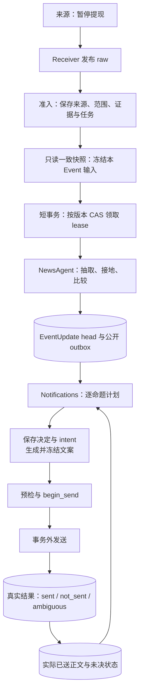

# News 语义链路入门：从来源到实际回执

[文档中心](../README.md) · [News 模块](news.md) · [运行排障](../OPERATIONS.md#news-retry)

阅读链路时先分清三个问题：来源说了什么、系统采用了什么知识、读者实际收到什么。来源证据、EventUpdate 和发送回执分别回答这三个问题。本文适合第一次接触 News，或需要解释“为什么没推送、为什么又推送”的开发者。通用术语见 [CONTEXT](../../CONTEXT.md)。

下面持续跟踪一个示意故事：某交易所暂停代币 ABC 的 N1 网络提现，随后补充影响范围，最后恢复提现。

| 时点 | 来源明确说了什么 | 需要区分的问题 |
| --- | --- | --- |
| T0 · 暂停 | “已暂停 ABC 的 N1 网络提现” | 暂停事实能否抽取、采用和通知？ |
| T1 · 补充 | “其他网络不受影响” | 同一暂停动作是否增加了重要范围？ |
| T2 · 恢复 | “已恢复 ABC 的 N1 网络提现” | 后来的状态变化是否构成读者尚不知道的事实？ |

这些来源可能归入同一个 Event，也可能分属不同 Event。归组结果不改变事实判断的要求。示例不保证模型会抽出哪条命题、判哪种关系或决定推送；实际结果须回到来源、采用记录和通知决定核查。具体身份、预算和规则由 [News 模块](news.md)及所链接实现维护。

<strong>沿例子定位一个阶段</strong>

1. [来源与准入](#section-准入)
2. [冻结输入与领取](#section-领取与冻结输入)
3. [抽取带引用的命题](#section-命题抽取与接地)
4. [候选召回与关系判断](#section-关系与支撑判断)
5. [知识采用](#section-组装与原子采用)
6. [通知决定](#section-通知决策)
7. [正文与实际结果](#section-卡片与发送)
8. [按记录定位失败](#status)

## 全链路

*示意链路 · 来源证据、采用知识与实际回执是三个独立持久边界。*

每阶段先完成自己的持久边界，再交给下一位所有者。模型调用和 provider 调用在数据库事务外运行。RabbitMQ 交付 raw 或唤醒语义工作；PostgreSQL 保存来源、可恢复任务、采用知识与发送结果。

## 1. 保存来源，并确定阅读范围

**输入与处理。** Receiver 将 T0 的来源帧交给准入。提供商第一次报“暂停提现”形成 Item。其后更改同一记录正文，产生新的 Item revision；提供商发布时间不能当作可靠的编辑版本号。T1 若是另一条记录，就有自己的 Item，不覆盖 T0 原文。

普通稿件使用一个 whole-item FactUnit。只有至少三个连续显式编号块的高置信度汇总才拆分；三条列表可产生三份任务范围，却不是模型自由拆出三条 Event。一个 EventUpdate 也可以包含多条 Claim。

准入按来源契约选择编辑型或市场分支。编辑型 Gate、精确身份、标题相似和冲突保护帮助归组，决定是否请求语义工作。同一个 ticker、相似标题或同一个故事不能证明两条说法是同一事实。OI、清算、大户和钱包报告进入独立市场观察，不经过下面的编辑型流程。

**保存与交接。** 准入保存 Item、修订、Event 成员和任务范围，再更新证据快照与持久 semantic 工作。完整来源和本 Event 应读的片段分别保留。补抄在 30 分钟内且时间有效时可按实时准入；更老材料保留历史来源，但不单独请求语义。详见[输入规则](news.md#input)。

**失败查哪里。** T0 没有 Item 时查 collector、恢复游标和 raw 交付；有 Item 却未请求语义时，查 Gate、ingest mode、成员归属与时间。不要从标题相似直接推断已有知识。

## 2. 冻结本轮可以读取的材料

**输入与处理。** SemanticWorker 先在只读 `REPEATABLE READ` 快照中读取待处理工作和本 Event 的材料，构造 `FrozenInput`。这一步不持有 Event 写锁。随后短事务锁定 Event，按 wanted revision 和可领取条件做 CAS，成功才增加尝试并取得 lease。读完之后若版本已变，本轮不能领取旧版本。

`FrozenInput` 包括未处理证据、本 Event 当前有效命题、任务范围和允许的补读目标。若 T1 归入 T0 的 Event，本轮可以同时看到新范围说明和已采用的暂停命题。跨 Event 召回尚未发生；它在抽取之后进行。模型阅读视图按当前正文定位既有范围，不能把旧正文偏移直接贴在新修订上。引文须存在于本轮可见片段和冻结来源中。

另一条提供商记录若只是同文转载，且正文与本 Event 阅读范围相同，已经读过的可见材料不重复抽取；它仍留在来源账本。同一记录真正改变正文时继续读取，包括正文回到之前状态。失败隔离只覆盖当次实际读入范围，后续新材料不受牵连。

来源资产标签按证据冻结，目录只补候选市场依据。模型逐命题选择 primary / mentioned，不能把整篇 tags 或 related prior 复制成每条命题的资产。没有报价不阻止采用。

**保存与交接。** 成功领取保存 wanted revision、lease、尝试数和本轮 `attempt_read_refs`。NewsAgent 接收冻结输入，外部调用不会占用领取事务。版本、读取范围与恢复规则见[语义工作](news.md#agent)和[持久状态](news.md#state)。

**失败查哪里。** 查 semantic wanted/done、到期时间、lease、错误码和 read refs。读取超时只在该版本仍可领取时消耗尝试；已经前进的版本不扣预算。输入无效、失败隔离和精确恢复见[运维](../OPERATIONS.md#news-retry)。

## 3. 抽取带引用的命题

**输入与处理。** NewsAgent 将冻结阅读视图交给抽取器。T0 可形成“交易所已暂停 ABC 的 N1 网络提现”的 DraftClaim，带主体、动作、对象、阶段、资产和逐字引用。若原文只说“宣布将暂停”，命题应保留未来阶段，不能写成已停用。T1 和 T2 同样从各自原文抽取。

`mode` 描述言语行为，`phase` 描述实现阶段，`actor_role` 描述角色，它们是不同读数。命题保留原文的条件、否定与数量尺度，时间不补原文没有的年份。每条命题都须有可用引文。

**保存与交接。** 成功抽取先保存 checkpoint，后续关系判断使用这些命题。相同 analyzer 与冻结输入的重试可以复用抽取。没有新证据时只保存无变化观察并结算工作，不重做旧来源抽取。

**失败查哪里。** 查抽取错误、`discarded_claims`、引用是否属于本轮可见原文，以及 checkpoint 是否存在。抽取成功不证明事实已采用；下一节仍须比较与组装。契约与模型边界见[语义工作](news.md#agent)。

## 4. 选择候选，再比较关系

**输入与处理。** 抽取之后，Workers 在事务外计算本地向量。共享稠密 / FTS / 同源召回为每条新命题寻找跨 Event prior，并保存所选的 `(新命题 slot, prior ref)` 对。语义判断只比较这些跨 Event 对，不把所有召回结果与所有新命题再做一次全组合。本 Event 当前有效命题仍全对比较。召回得分只决定问谁，关系回答才说明是否为同一事实、增量或变化。

关系模型提供回答，代码仍校验引用、身份、时间和可证明的冲突。模型回答本身不具有直接写入知识或发送消息的权限。

| 后续来源 | 可能的关系，须以实际内容判断 |
| --- | --- |
| 重复报“暂停提现” | equivalent；复述不必创建新的发生 |
| T1 补充“其他网络不受影响” | 同一暂停动作的新范围，可为 adds_information |
| 更正“实际未暂停，原公告有误” | corrects；须核实归属、引用和时间 |
| 后来宣布或证实恢复提现 | 不同阶段或实际变化，不能仅凭字段相似吞掉 |
| 报另一个产品或另一种代币动作 | 即使同交易所、同故事，也可以是独立 unrelated 事实 |

T1 若归入另一个 Event，须先召回 T0 的暂停命题，才有机会建立上表中的关系。没有召回不证明 unrelated；同样，召回命中也不证明 equivalent。T2 的恢复描述后来状态，不能仅凭交易所、资产和故事相同认定为暂停的复述。

**保存与交接。** 语义判断记录逐对关系和来源 supports / refutes / reports 等支撑，交给纯组装。转载和同源修订不会变成多个独立证实。未知保留 unresolved；最终尝试可采用 possible_new，但它不能发布公开 catalyst。详见[语义工作](news.md#agent)和[共享召回](news.md#related-recall)。

**失败查哪里。** 怀疑重复或漏关联时，先查抽取命题、召回诊断与实际比较对，再查关系回答。缺向量查 `recall_degraded` 和嵌入状态。模型没有回答、召回没命中与明确判 unrelated 是不同情况。

## 5. 采用知识，与发送分开

**输入与处理。** 纯组装读取本轮理解结果与当前 head，生成 EventUpdate，保留引用、关系、有效/退休/替代 refs 和变化。短事务检查 owner、lease、输入版本和 expected head，再原子提交采用文档、新 head、命题索引、应发布的公开 outbox 与必要通知工作。

**保存与交接。** 同一 Event 内，T0 采用暂停知识后，T1 的新增范围与 T2 的恢复可形成后继版本，具体取决于真实理解和组装结果。跨 Event 时，各 Event 保存自己的版本与关联断言。仅增加来源证据或复述不会自动新建通知义务；已有未完成通知工作仍转向最新 head。只有实质知识变化才增加内容版本，真实 A → B → A 通过前驱链保留三次采用发生。

App 消费 PublicUpdate，将符合公开契约的事实映射给 Trading。Trading 不读取卡片来还原事实，也不等待 News 通知发送完成。采用与公开边界见[语义工作](news.md#agent)和[公开契约](news.md#topics-and-cited-source-authority)。

**失败查哪里。** 保存 observation 不证明采用成功。查其 adopted 状态、当前 head、owner 与 CAS 结果。模型失败或 CAS 冲突保留上一有效知识；文案失败也不会回滚采用。

## 6. 逐命题决定是否通知

**输入与处理。** Notifications 读取当前 head 与一致 ReaderSnapshot。回执召回检索实际已送回执的冻结 `sent_claims`，已链接回执优先，为每条命题选择至多 16 条可核验正文。reader 模型比较的是这些实际 sent 正文；当前 head、来源全文和“选中过 ref”都不能代替它们。`sending` 不作为已读正文，`ambiguous` 保留重复保护。

先处理已失效、过时、已知、在途、结果不明、更正与受保护上币等规则。其余每条命题在一次请求中按实际已送正文分别回答报道类型、新增影响、是否应在几分钟内优先看到、哪条消息已报过同一核心事实。代码资格表决定哪些类型可推，native / generated 各自的校准模型给出推送和重点概率；先过资格下限与推送切线，才可能标重点。期望值只供展示，held 是校准输入，锚点不乘入概率。完整规则见[通知表](news.md#notification)。

新颖度和核心锚点保留 held 的定义：未链接命题已有核心锚点，或适用 linked increment 时为 held；development 和符合无锚点、内容类型、言语行为及有效状态阶段要求的动作不为 held。held 是推送校准模型的一个输入，不另设切线；新增范围或数额仍可使锚定命题获得推送。e 是可推类型概率质量，m 是新增影响尾部概率，i 是优先打断概率。重点先须获准推送，再过自己的 p_key 切线。完整顺序、例外及 native / generated 独立校准状态见[通知表](news.md#notification)。

假设 T0 的暂停卡片已结算 sent，T1 的“其他网络不受影响”才有这份正文作为比较依据。它可能只提供细节，也可能增加重要范围。锚点表示哪条消息报过核心事实，并不自动等于“没有新增信息”。T2 的恢复是后来状态，仍须检查实际 reader 上下文，不能因同故事就认定读者已知。

**保存与交接。** 计划保存逐命题原因、四组分布与 confidence、冻结策略概率和认证状态、所比较正文摘要与计时。选中集合形成稳定 intent；这一阶段没有实际送达事实。判断不可得先暂缓，超过持久等待上限记未评估，不按猜测推送。新四题目前未认证，评分路径进信息流；前置确定性规则继续生效。旧模型判断仅按历史结构只读显示，详情页不重新评分。

**失败查哪里。** 已有 head 却无卡片时，查 notify work 与逐命题 reason，再查 intent。`reader_feed`、`known_to_reader`、等待在途和模型不可得各有原因，不能统称为发送失败。恢复入口见[运维](../OPERATIONS.md#news-retry)。

## 7. 冻结正文，再按真实结果结算

**输入与处理。** 文案只读选中命题、字段、引用和必要来源。T1 若按补充渲染，另带 T0 对应已送正文作对照；更正同样带上对应正文。中文必须保留动作、对象、数字、归因和阶段。卡片冻结后保存选中 refs、精确正文与 payload digest。

共享发送入口取得发送时隙并完成目标预检。短事务 `begin_send` 再复核 head、reader 世代、lease 和重叠发送。若新知识或 reader 事实已使旧计划失效，本轮保持待处理并重新规划。获得许可并写入 `sending` 后，才在事务外调用 provider。

**保存与交接。** provider 结果按同一 lease 和 payload 结算，成为下一轮 reader 上下文的依据：

| 结果 | 后续行为 |
| --- | --- |
| sent | provider 已确认发送；保存真实回执，下轮读者历史使用这份冻结正文 |
| not_sent | 有证据证明没有发送；仅在明确可重试且预算剩余时续用原 intent 与冻结正文 |
| ambiguous | 无法证明是否发送，可能已送；禁止自动重发，保留结果未知 |

**失败查哪里。** 预检失败还未进入 `sending`，按未送出的 intent 处理；provider 调用后则按真实结果分类。进程中断后，实际 lease 已过期且不属于本进程在途 owner 的 `sending` 收敛到 ambiguous。不能从请求成功、超时或本地状态推断外部结果。发送失败不回滚 T0、T1 或 T2 已采用的知识。

后续行情编辑只附加展示信息，不改变已送事实正文/hash。文案、发送许可、结果与恢复的完整规则见[正文、回执与重试](news.md#正文回执与重试)。

## 用这些记录定位问题

| 现象 | 查哪个边界 |
| --- | --- |
| 来源缺失或补抄未完成 | collector 连接、事故、Recovery 游标与 broker |
| Event 有来源但没有新 head | semantic wanted/done、lease、尝试、错误和实际 read refs |
| 已采用却没有卡片 | notify work、逐命题 reason、reader 不可得、intent 和文案准备 |
| 新判断只进信息流 | report_kind 概率质量、materiality 尾部、p_push / p_key 和 certification_status；未认证时不以候选概率授权推送 |
| 不确定有没有送到 | sending lease、provider outcome 和结算回执，不从请求推断成功 |
| 没有价格或市场未知 | 类型化资产、目录与 quote freshness，与语义失败分开 |

[运维指南](../OPERATIONS.md#news-retry)提供精确恢复命令。[News 源码和测试入口](news.md#section-验证与排障入口)连接当前实现；[读者评测](../reports/news-791-b.md)与[本地嵌入证明](../reports/news-799.md)注明模型误差及测试范围。文档中的示意链路不替代真实模型、生产窗口或 provider 的验证。
