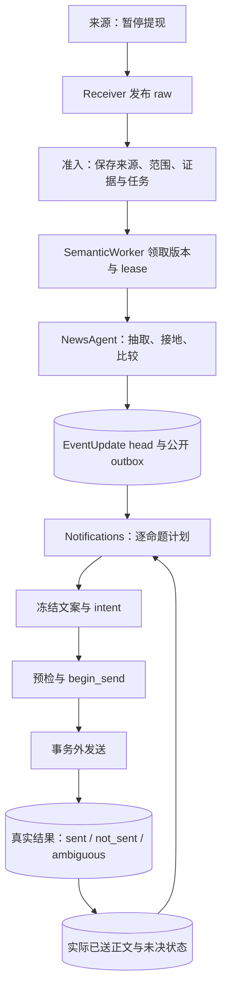

# News 语义链路入门：从来源到实际回执

[文档中心](../README.md) · [News 模块](news.md) · [运行排障](../OPERATIONS.md#news-retry)

阅读链路时先分清三个问题：来源说了什么、当前采用了什么知识、读者实际收到什么。它们分别由来源证据、EventUpdate 和真实发送回执回答。

下面用“某交易所暂停代币提现，随后补充影响范围并恢复”的示意例说明当前代码。例子不绑定生产记录、配置型号或实测耗时；具体身份、预算和规则由 [News 模块](news.md)及所链接实现维护。

## 全链路

*示意链路 · 来源证据、采用知识与实际回执是三个独立持久边界。*

准入、采用与发送分别提交短事务。模型和 provider 不在事务内运行。RabbitMQ 消息用于交付 raw 或唤醒语义，PostgreSQL 保存可恢复的任务和事实。

## 1. 准入保存来源，归组只是候选

提供商第一次报“暂停提现”形成 Item。其后更改同一记录正文，产生新的 Item revision；提供商发布时间不能当作可靠的编辑版本号。

普通稿件使用一个 whole-item FactUnit。只有至少三个连续显式编号块的高置信度汇总才拆分；三条列表可产生三份任务范围，却不是模型自由拆出三条 Event。一个 EventUpdate 也可以包含多条 Claim。

准入按来源契约选择编辑型或市场分支。编辑型 Gate、精确身份、标题相似和冲突保护帮助归组，决定是否请求语义工作；同一个 ticker 或相似标题不能证明两条说法等价。OI、清算、大户和钱包报告进入独立市场观察，不经过下面的编辑型流程。

补抄在 30 分钟内且时间有效时可按实时准入；更老材料保留历史来源，但不单独请求语义。详见[输入规则](news.md#input)。

## 2. 冻结本轮可以读取的材料

准入保存完整来源、修订、成员范围和快照，再提交持久 semantic work。Worker 领取 wanted revision、owner 和 lease，读取 `FrozenInput`。

其中包括未处理证据、本 Event 当前有效命题、任务范围和允许的补读目标。模型看到的阅读视图按当前正文定位既有范围；不能把旧正文偏移直接贴在新修订上。引文须存在于本轮可见片段和冻结来源中。

另一条提供商记录若只是同文转载，且正文与本 Event 阅读范围相同，已经读过的可见材料不重复抽取；它仍留在来源账本。同一记录真正改变正文时继续读取，包括正文回到之前状态。失败隔离只覆盖当次实际读入范围，后续新材料不受牵连。

来源资产标签按证据冻结，目录只补候选市场依据。模型逐命题选择 primary / mentioned，不能把整篇 tags 或 related prior 复制成每条命题的资产。没有报价不阻止采用。

## 3. 抽取带引用的命题

“交易所宣布暂停提现”可抽为一条带主体、动作、对象、阶段、资产和引用的命题。具体结果取决于可见源文与模型回答，代码不能从“宣布”推断提现已经停用。

`mode` 描述言语行为，`phase` 描述实现阶段，`actor_role` 描述角色，它们是不同读数。条件保留否定极性，数量保留尺度，时间不补原文没有的年份。每条命题都须有可用引文。

成功抽取先保存 checkpoint。重试或相关 Event 更新时可以复用它，而不是把整个旧来源重新交给模型。没有新证据只保存无变化观察并结算工作。

## 4. 和当前命题比较

抽取之后，Workers 在事务外计算本地向量，用共享稠密 / FTS / 同源召回寻找跨 Event prior；本 Event 当前有效命题仍全对比较。召回得分只决定问哪些命题对。

| 后续来源 | 可能的关系，须以实际内容判断 |
| --- | --- |
| 重复报“暂停提现” | equivalent；复述不必创建新的发生 |
| 补充“只影响一条网络” | 同一暂停动作的新范围，可为 adds_information |
| 更正“实际未暂停，原公告有误” | corrects；须核实归属、引用和时间 |
| 后来宣布或证实恢复提现 | 不同阶段或实际变化，不能仅凭字段相似吞掉 |
| 报另一个产品或另一种代币动作 | 即使同交易所、同故事，也可以是独立 unrelated 事实 |

语义判断还保存来源 supports / refutes / reports 等支撑。转载和同源修订不会变成多个独立证实；未知保留 unresolved，不伪造确定结论。最终尝试允许 possible_new，但它不能发布公开 catalyst。

## 5. 采用知识，与发送分开

纯组装生成 EventUpdate，保留引用、关系、有效/退休/替代 refs 和变化。短事务检查 owner、lease、输入版本和 expected head 后，原子提交新 head、公开 outbox、命题索引与必要通知工作。

保存 observation 不证明采用成功；模型失败或 CAS 冲突不删除上一有效知识。只有实质知识变化才增加内容版本，真实 A → B → A 通过前驱链保留三次采用发生。

App 消费 PublicUpdate 将公开事实映射给 Trading。Trading 不读取卡片来还原事实，也不等待 News 通知发送完成。

## 6. 逐命题决定是否通知

Notifications 读取当前 head 与一致 ReaderSnapshot。读者历史来自实际 sent 的冻结正文和 sent_claims，不能用当前 head、来源全文或“选中过 ref”代替。

先处理已失效、过时、已知、在途、结果不明、更正与受保护上币等规则。其余每条命题按实际已送消息问两道题：新增内容有多重要，哪条消息已报过同一核心事实。普通推送用期望值，重点用 P(4)；当前 native / generated 切点及有锚点的 held 规则见[通知表](news.md#notification)。

例子中的“暂停”已送后，“只影响某网络”可能只提供细节，也可能有重要新增范围。模型与 policy 根据实际已送正文判断，不能预先保证推或不推。“恢复”是后来状态，不能因同故事就认定读者已经知道。

判断不可得先暂缓，超过持久等待上限记未评估。计划保存每条命题原因、所比较正文摘要和计时；选中不等于送达。

## 7. 冻结正文，再按真实结果结算

文案只读选中命题、字段、引用和必要来源；补充/更正另外读取对应已送正文作对照。中文必须保留动作、对象、数字、归因和阶段。冻结时保存 refs 与 payload digest。

共享发送入口先预检，短事务 begin_send 再复核 head、reader 世代及 lease，写 sending 后才在事务外调用 provider。发送结果按同一 lease 和 payload 结算：

| 结果 | 后续行为 |
| --- | --- |
| sent | 保存真实 provider 回执；下轮读者历史使用这份正文 |
| not_sent | 只有明确可重试才续用原 intent 与冻结正文 |
| ambiguous | 可能已送，禁止自动重发；不伪装成成功或未送 |

进程中断后，过期且无人持有的 sending 也收敛到 ambiguous。发送失败不回滚已采用知识。后续行情编辑只附加展示信息，不改变已送事实正文/hash。

## 用这些记录定位问题

| 现象 | 查哪个边界 |
| --- | --- |
| 来源缺失或补抄未完成 | collector 连接、事故、Recovery 游标与 broker |
| Event 有来源但没有新 head | semantic wanted/done、lease、尝试、错误和实际 read refs |
| 已采用却没有卡片 | notify work、逐命题 reason、reader 不可得、intent 和文案准备 |
| 不确定有没有送到 | sending lease、provider outcome 和结算回执，不从请求推断成功 |
| 没有价格或市场未知 | 类型化资产、目录与 quote freshness，与语义失败分开 |

[运维指南](../OPERATIONS.md#news-retry)提供精确恢复命令。[News 源码和测试入口](news.md#section-验证与排障入口)连接当前实现；[读者评测](../reports/news-791-b.md)与[本地嵌入证明](../reports/news-799.md)注明模型误差及测试范围。文档中的示意链路不替代真实模型、生产窗口或 provider 的验证。
