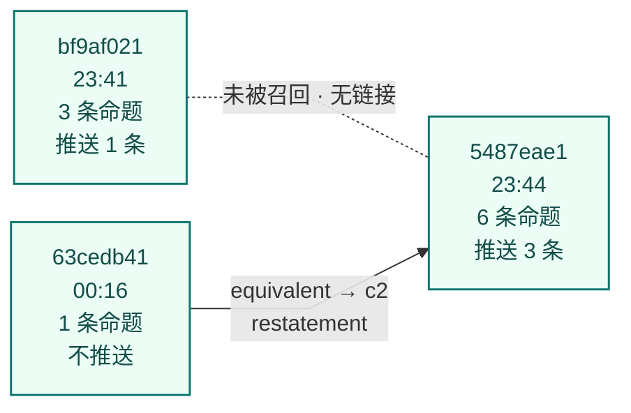
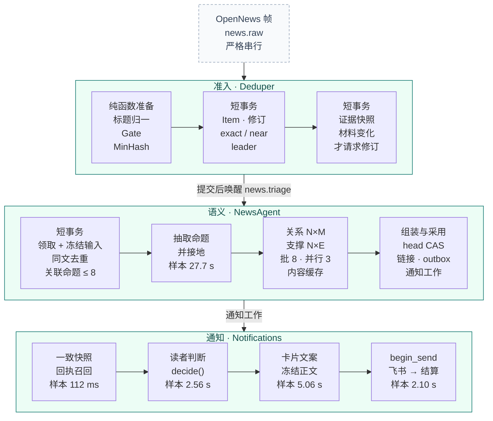

# News 语义链路入门：用一条真实新闻走完全链路

[手册](../README.md) · [News 手册](news.md) · [系统架构](../ARCHITECTURE.md) · [排障](../OPERATIONS.md#news-retry)

这是 News 语义模块的入门走读。主线是一条真实新闻：2026-09-30 深夜，MetaMask Staking 的基础设施被入侵，随后退出 Lido 验证节点。文章跟着它从 OpenNews 帧一直走到飞书卡片，每一步说明用了什么数据结构、算法和常数，以及样本中的实际取值。规则的权威说明在 [News 手册](news.md)。本文只做导读，涉及细节时直接链接过去，不另立一套规范。

| 本文速览 | 说明 |
| :--- | :--- |
| **适合谁** | 第一次接触 News 语义链路，或需要回答“为什么推了 / 没推 / 推了两次”的开发者 |
| **样本** | Event `5487eae1`（Lido 官方推文，两份同文拷贝），以及同一事故的前一个 Event `bf9af021` 和后一个 Event `63cedb41` |
| **代码版本** | 机制按当前实现描述，含 #764 P2/P3 的存储收敛；原走读基线为 main `2f5c6cd45` |
| **权威规则** | [News 手册](news.md)；精确恢复见[运维指南](../OPERATIONS.md#news-retry) |

> [!NOTE]
> **样本是历史数据。** 三个 Event 于 2026-09-30 23:41 至 10-01 00:16 UTC 由当时较早的生产构建处理。文中的时间、token 与分数来自当时的生产记录和只读查询，不是测试结果。之后合并的 #766、#773、#775、#778、#772 改变了其中几步；当前代码会给出不同结果的地方，都在正文中就地用 **「现在」** 标出。时间一律为 UTC（北京时间 +8）。

<strong>本页目录</strong>

1. [样本：一个事故，三个 Event](#section-样本)
2. [全链路总览](#section-全链路总览)
3. [准入：Item、Event 与 MinHash](#section-准入)
4. [证据快照与语义工作](#section-证据快照与语义工作)
5. [领取与冻结输入](#section-领取与冻结输入)
6. [命题抽取与接地](#section-命题抽取与接地)
7. [关系与支撑判断](#section-关系与支撑判断)
8. [组装与原子采用](#section-组装与原子采用)
9. [通知决策](#section-通知决策)
10. [卡片与发送](#section-卡片与发送)
11. [发现与当前状态](#section-发现与当前状态)
12. [与理论方法的对照](#section-与理论方法的对照)
13. [术语](#section-术语)

## 01 · 样本：一个事故，三个 Event

| 时间 | Event | 来源 | 发生了什么 |
| --- | --- | --- | --- |
| 23:41:04 | `bf9af021` | AGGRNEWSWIRE（Telegram 聚合）的大写标题 “METAMASK RESPONDING TO SECURITY INCIDENT; NO THREAT TO METAMASK WALLET AND METAMASK CURRENTLY EXITING AFFECTED VALIDATORS: BLOG” | 消息附带的 “Link” 一词被供应商标成 LINK（Chainlink，A 级）。抽出 3 条命题 |
| 23:41:36 | `bf9af021` | — | **第 1 次推送**：只推了“MetaMask 正在对一个安全事件作出回应”（重要性 2.79）。“正在退出受影响验证节点”得 2.27，差 0.03 没过推送切点 2.3，只进信息流 |
| 23:44:25.7 | `5487eae1` | Lido 官方推文，经 x.com 链接投递（OpenNews id 4280747） | 开新 Event（leader） |
| 23:44:26.8 | `5487eae1` | 同一推文，经 twitter.com 链接再次投递（id 4280749），正文逐字节相同 | 以 `exact` 加入；语义修订从 1 变为 2 |
| 23:45:12.9 | `5487eae1` | — | **第 2 次推送**：6 条命题中选中 3 条，按完整内容渲染；距源发布 47.2 s |
| 23:45:47.9 | `5487eae1` | — | 同文拷贝触发的第二轮语义完成，只产出 `evidence_change`，不通知。**「现在」**这一轮不再调用模型（[§04](#section-证据快照与语义工作)） |
| 00:16:16 | `63cedb41` | OpenNews 自有标题 “COINTELEGRAPH: MetaMask exits Lido validators as it investigates security incident” | 开新 Event。语义层判定它与已推送的 c2 `equivalent`，记为 `restatement`，不建通知工作 |

读者实际收到的两张卡片：

> **第 1 次推送 · 23:41:36 · `bf9af021`**
>
> MetaMask正对安全事件作出回应
>
> MetaMask正在对一个安全事件作出回应。

> **第 2 次推送 · 23:45:12 · `5487eae1`**
>
> MetaMask Staking因基础设施安全事件退出Lido协议以太坊验证节点
>
> 在对基础设施安全漏洞进行调查后，MetaMask Staking（前身为Consensys Staking）已采取预防措施，以保护与其运营的以太坊验证节点相关的客户资产。
>
> 相关验证节点已开始退出流程，预计最后一个验证节点将于2026年10月7日结束前完成退出（但尚未完全提取资金）。
>
> 为降低潜在网络惩罚相关的风险，MetaMask Staking正在退出其在Lido协议中的以太坊（ETH）验证节点，此举可能会产生奖励损失以及若验证节点近期下线可能带来的停机罚款。

第二张卡片的行序是 c1、c3、c2：按命题哈希的字典序排列，不是叙事顺序（[§10](#section-卡片与发送)）。

*结果视图 · 实线箭头是持久的命题链接（新 → 旧）；虚线表示两者之间没有任何链接。*

读者先收到一张几乎没有信息量的卡片，3 分半后又收到一张信息完整的卡片。第二张本可以写成“补充：……”并引用第一张。它没有这样写，是因为 `bf9af021` 与 `5487eae1` 之间没有命题链接，读者判断看到的已发消息里也没有第一张卡片；原因都在召回（[§05](#section-领取与冻结输入)、[§09](#section-通知决策)），owner 已决定不扩召回（[§11](#section-发现与当前状态)）。去重真正起作用的是 00:16 那一条：它被召回，被判为等价，然后被吸收。

## 02 · 全链路总览

链路分为三个所有者：准入（Deduper）、语义（NewsAgent）、通知（Notifications，prepare 与 finalize 两段完成决策和发送）。PostgreSQL 保存全部可恢复状态，RabbitMQ 只负责唤醒。各所有者的职责边界见 [News 手册 · 端到端数据流](news.md#section-端到端数据流)。

*数据流 · 框内是各所有者自己的步骤（从左到右），框间箭头是持久工作的交接。模型与飞书调用都在事务外。*

样本第一轮：从采用到送达 11.3 s，从首次可见到送达 45.3 s，从源发布到送达 47.2 s。最大的单项是抽取解码（27.7 s），它决定了时延的下限。每段耗时都写在决策与发送账本里，可以直接用 SQL 取数，见 [News 手册 · 正文、回执与重试](news.md#正文回执与重试)。

## 03 · 准入：Item、Event 与 MinHash

准入由 [admission.py](../../tracefold/news/pipeline/admission.py) 负责：`news.raw` 是单活跃消费者、prefetch 1 的队列，帧严格串行处理。准入只做确定性归组，等价与补充交给后面的命题层判断，见 [News 手册 · 输入范围与身份](news.md#input)。

### Item 与修订

- **Item**（`news_items`）是一条供应商记录，`item_id = sha256("news-opennews" ␟ provider_id)`。原始参数、规范化正文 `evidence_text` 及其 sha 只写一次。
- **Item revision**（`news_items.revisions` 内的有序 JSON 文档）记录同一 provider_id 的正文、来源、链接或制品 id 变化，用哈希链 `sha(prev, content_sha, received_at)` 串起来，所以 A→B→A 会保留成三个版本。
- **来源制品**：只有 x.com / twitter.com 链接会解析出 `source_artifact_id = x:{status_id}`，发布时间由 Snowflake id 反推。`reporting_origin` 取 `params.source`，为空时退回 URL 主机名。

**样本**：id 4280747 与 4280749 是同一条推文 `x:2105443679905235344`，`evidence_text_sha256` 都是 `d14486bc…`。但 `item_id` 由 provider_id 派生，所以是两个 Item，`reporting_origin` 分别为 `x.com` 和 `lidofinance`。

### Event 归组

1. **比较串**：只取标题，即首个至少有 3 个词的块，不读正文。依次做 NFKC、繁转简、去来源前缀和 URL，再把数字规范成 `usd_82000`、`pct_5`、`num_1500000000` 这样的形式，最后 casefold（[identity.py](../../tracefold/news/events/identity.py)）。
2. **词元**：单词 unigram 集合，中文取相邻汉字 bigram；约 50 词的停用表加 10 组动词别名，没有词干化，也没有 IDF。少于 3 个词元的标题不参与近似匹配。
3. **MinHash / LSH**：128 个固定种子的哈希函数，32 band × 4 row，每个 Event 在 `news_events.dedupe_bands` 保存 32 个 band 身份，由 GIN 索引查候选（[minhash.py](../../tracefold/news/events/minhash.py)）。
4. **判定顺序**：幂等重放 → `exact`（同 family、同标题指纹）→ 同一 X 制品且同指纹（7 天内）→ `near`（LSH 候选按开启时间从早到晚取前 25 个，要求**精确** Jaccard ≥ 0.55；两边的 ticker 集合或数字集合都非空且互不相交时否决）→ 都不中则开新 Event（`leader`）。
5. **窗口**：按 dedupe family 划分，general 12 h、filing 72 h、disaster 6 h、market telemetry 2 h，从 leader 发布时间起算，不滑动。

| Jaccard s | 0.087 | 0.2 | 0.3 | 0.4 | 0.5 | 0.55 | 0.6 | 0.7 |
| --- | ---: | ---: | ---: | ---: | ---: | ---: | ---: | ---: |
| P(成为候选) = 1 − (1 − s⁴)³² | 0.0018 | 0.050 | 0.229 | 0.564 | 0.873 | 0.954 | 0.988 | 0.9998 |

S 曲线的拐点约在 0.42，低于判定阈值 0.55：LSH 负责高召回，精确 Jaccard 负责复核，所以只会漏检，不会误合并（J = 0.55 处漏检约 4.6%）。

**样本**：

- 两份 Lido 推文的标题相同，指纹 `1a069fc2…` 相同，走 `exact` 加入。
- 00:16 的跟进稿只有 7 个词元，与主样本标题的 18 个词元只共享 {metamask, validators}，J = 2/23 = 0.087，32 个 band 一个都没有碰上。“Lido” 在主样本的第二段而不在标题里；exits 和 exiting 因为没有词干化而算作不同词元。
- `bf9af021` 的大写标题与 `5487eae1` 的标题措辞差别很大（三元组相似度仅 0.18），也没有归为一组。

### Gate 与资产接地

[Gate](../../tracefold/news/events/gate.py) 从不拒绝实时新闻帧，真正的过滤在上游供应商策略（样本为 “News Score > 60”）。它决定准入类型、队列优先级和接地资产。资产接地只看标题和首行：文本里有字面 `$TICKER` 就接地；否则跳过一张英文碰撞停用表（NEAR、W、CORE 等），商品要求上下文里出现商品词，其余只看供应商等级是否属于 {B+, A, A+}。Gate 没有“名称 → 代码”的映射表。

| 样本供应商标签 | 等级 | 结果 | 原因 |
| --- | --- | --- | --- |
| LDO | B+ | 接地 | 等级达标 |
| ETH | B | 排除 | 标题里有 “Ethereum”，但 B 级不达标，也没有名称表 |
| NEAR | C | 排除 | 在停用表中，且等级不达标 |
| LINEA / EX / STETH / FI | 无 | 排除 | 没有等级 |

`storyline_key` 只在开 Event 时由 leader 帧计算一次。`5487eae1` 的 LDO 是 B+，得到 `none`；`63cedb41` 的 LDO 是 A，得到 `asset:LDO`。这一差别来自供应商等级，与内容无关。

## 04 · 证据快照与语义工作

每次准入之后，第二个短事务在 Event 行锁下按版本 CAS 追加 `news_events.evidence.versions` 的版本、摘要、焦点和时钟；阅读正文从 Item、成员和修订事实重建。只有**语义材料**变化时，才会增加 `news_jobs` 中 semantic 工作的 `detail.wanted_revision`，并在提交后唤醒 `news.triage`。语义材料由 [`semantic_material`](../../tracefold/news/storage/events.py) 定义：focus fact、焦点来源 `leader_item_id`、接地资产，以及成员的 {item_id, fact_id, fact_text, evidence_revisions}。唤醒丢失只会带来延迟：Janitor 每 60 s 重新唤醒超过 15 s 仍未领取的工作。

**为什么同文拷贝也会请求新修订。** 有两个原因叠加，至今都没有变：

1. 成员按 `item_id` 计入语义材料，任何新成员都算材料变化，不论正文是否相同。
2. “更强成员”规则（[admission.py](../../tracefold/news/pipeline/admission.py) 的 `_member_result`）满足以下任一条件即切换快照焦点：分数更高、自己接地了任何资产、分数 ≥ 80，或者 origin 字符串不同。`lidofinance` ≠ `x.com`，所以焦点切到了拷贝。

当时这一轮的代价（llama-swap 请求日志）：

| 请求 | 输入 token（含缓存） | 输出 token | 耗时 | 说明 |
| --- | ---: | ---: | ---: | --- |
| 抽取 | 7,680 | 2,164 | 26.9 s | 重新抽出同样的 6 条命题 |
| 关系 × 5 批 | ≈ 30,700 | 1,010 | 3.3–11.1 s / 批 | 6×6 = 36 题，每批 8 题，并行 3 批 |
| 支撑 | 6,747 | 166 | 5.9 s | 6 条命题 × 新证据 |
| **合计** | **≈ 45k** | **≈ 3.3k** | **46 s 墙钟** | 没有任何新信息 |

**「现在」**：#773 之后，冻结输入按“可见材料”去重（[§05](#section-领取与冻结输入)）。这份拷贝仍会唤醒一次语义 turn，但它的 `FrozenInput.evidence` 为空，`NewsAgent` 走已有的 `no_new_evidence` 分支：保存一份空观察并结算这次修订，不抽取，也不判断。生产验证：Event `4eb53216` 的 Reuters 同文副本就是这样结算的。

## 05 · 领取与冻结输入

### 领取

`SemanticWorker` 收到唤醒后，在一个短事务里领取工作（[semantic_work.py](../../tracefold/news/storage/semantic_work.py)）：先计一次尝试并取得 180 s 租约，再读取材料、构建 `FrozenInput`，并记下这次尝试读的范围。领取事务使用 News 通道默认的 3 s statement timeout。读取放在 savepoint 里：如果超时，只回滚这次读取，尝试照常计数，按 15 s / 60 s / 300 s 退避，并记录 `news_semantic_input_timeout`，三次耗尽后进入可见失败（排查见[语义失败](../OPERATIONS.md#语义失败)）。一次 `NewsAgent.process` 的所有模型调用共享 120 s 预算。

### FrozenInput 里有什么

[`frozen_input`](../../tracefold/news/storage/semantic_input.py) 从一次一致读取组装出一次语义尝试的完整、不可变输入：

| 字段 | 内容 |
| --- | --- |
| `evidence` | 尚未读过的来源正文：`read_ref` 不在已处理或已隔离集合中，并且经过同文去重 |
| `asset_candidates` | 来源标签按 `evidence_ref` 投影，随同一次抽取冻结 |
| `extraction_scopes` | 编号 FactUnit 的任务边界 |
| `prior` | 本 Event 当前有效的命题，加上相关 Event 的当前命题（至多 8 条） |
| `read_targets` 等 | 可选补读目标、未解问题、已建立的更正与冲突关系 |

两个身份需要分清：`input_sha` 只包含**本 Event** 的命题，相关 Event 重新采用不会改变它，所以重试可以复用已保存的抽取，只重问比较类问题；`work_id = identity(event, revision, input_sha, analyzer)` 是抽取检查点的键。完整契约见 [News 手册 · 冻结输入与增量范围](news.md#冻结输入与增量范围)。

### 同一可见材料只读一次（#773）

可见材料键是 `(正文, 本 Event 的阅读片段 (start, end, role)…)`：正文相同、阅读范围也相同，模型看到的输入就完全相同。资产候选不计入这个键。

- 与已读、已隔离或排在前面的待读材料相同的拷贝，不再送入抽取；被去掉的拷贝仍保留在快照成员里，可以追溯。
- 同一记录自身的正文变化（包括回到较早的正文）总会读取。
- 精确的 `news reanalyze` 仍按指名的 `read_ref` 重读。
- 全部待读都被去掉时 `evidence == ()`，走 `no_new_evidence`，不调用模型，也不做关联召回。

逐字转载本来就不是独立证实。代价是：高权威来源逐字转发低权威来源时，来源不会升级为高权威的那一份。

### 共享召回：抽取后和谁比较（#791）

领取输入只含本 Event prior 与同源读目标。抽取后在事务外嵌入每条命题，再由 [claim_recall.py](../../tracefold/news/claim_recall.py) 与 [存储适配器](../../tracefold/news/storage/claim_index.py) 召回跨 Event 当前命题。每条命题只判自己的 top-k 外部候选，本 Event 内仍全对；已送 48 小时命题有校准的保留名额。

稠密、FTS、同源路线共用一个 RRF；预算和下限来自带数据集摘要的校准文件。检索只是输入选择，关系、新颖度和否决仍负责决策。缺向量时按 FTS 加同源降级，不阻断采用；有界 Janitor 补算向量。完整窗口、持久身份与部署说明见 [News 手册](news.md#related-recall)。

## 06 · 命题抽取与接地

| 环节 | 当前实现 |
| --- | --- |
| 模型路由 | `llm.news_triage_model`（生产为本地 `qwen3.8-27b`，经 llama-swap），输出上限 4,000 token；配置的 fallback 上限 8,000 token；单次调用 60 s（[learning_runtime.py](../../tracefold/app/learning_runtime.py)） |
| 传输 | DSPy `Predict` 加 `CompactJSONAdapter`：schema 作为约束解码的语法，回答写成单行紧凑 JSON（#766，[generation.py](../../tracefold/news/adapters/generation.py)） |
| 严格语法、宽容解析 | 发给模型的 schema 是严格的；回来的结果逐条修复：错层的键放回原位，选项外的读数记 unknown，坏条目只删那一条。只有缺 statement、引文、主语或动作的命题才丢弃 |
| 接地 | 每条引文都必须是冻结原文的子串，并落在本轮可见的片段里；`locate_quote` 容忍大小写、空白和包裹的引号，保存的是原文片段（[extraction.py](../../tracefold/news/updates/extraction.py)） |
| 资产 | 只按被引来源的标签恢复拼写和市场类型，跨来源冲突记 unknown；资产只指可交易标的，地点、国家、组织等不算（#766） |

**命题契约**（`ClaimFields`）：`subject · action · object · speaker · conditions[] · quantities[{name, value（十进制原文）, unit, period}] · effective_at · occurred_at · statistical_period · polarity · mode（9 种）· phase（8 种）· content_kind（8 种）· assets[{symbol, market_type, role}]`，另有 `statement`、`topics`（IPTC 子集，至多 3 个）和 `citations[]`。各字段由模型还是代码负责，见 [News 手册 · 抽取、判断与采用各司其职](news.md#抽取判断与采用各司其职)。

**样本第一轮**：6 条命题，2,300 输出 token，27.7 s。

| # | statement（节选） | kind / mode / phase | 资产 | 点评 |
| --- | --- | --- | --- | --- |
| c1 | MetaMask Staking has taken precautionary steps … following an investigation into an infrastructure compromise | state_change / observation / executing | ETH 主 | 准确 |
| c2 | MetaMask Staking is exiting its ETH validators in the Lido protocol … | state_change / observation / executing | ETH 主 | 准确；LDO 未标为 mentioned |
| c3 | Relevant validators have begun the exit process … expected … by the end of October 7th | schedule / observation / executing | ETH 主 | 一条里同时有“已开始”（观察）和“预计 10/7 完成”（预测） |
| c4 | ETH … expected to return … over approximately up to 45 days | quantified_flow / forecast | ETH 主 | 结构化后只剩 value = 45 days，“approximately up to” 只留在引文里 |
| c5 | Lido maintains an ad hoc reserve fund of over 6,750 stETH | new_quantity / observation | stETH 主 | 常设事实被判为首次披露的数字；“over” 的下界丢失 |
| c6 | A full investigation … is underway | other / observation / executing | 无 | 原文未说明由谁调查，subject 却写成 “MetaMask Staking / Lido” |
| — | 漏抽：“No action is required from stETH holders.” 与 “MetaMask does not manage withdrawal keys.” | | | 对 stETH 持有者恰恰是关键的安抚信息 |

**「现在」#791**：抽取非引文字段统一英文，引用保留原文；mode 为被归因方的言语行为，actor_role 为说话方或组织主体角色。角色不改命题身份，不直接控制 policy。言语行为、九类角色和具体定义见 [News 手册](news.md#当前英文言语行为与角色791)。存量旧读数通过停写前向迁移转换；实时读取端只接受当前枚举。

当时约 383 输出 token / 条命题。**「现在」**：#766 改为紧凑 JSON 后，每条命题的输出 token 约减少 35%，长清单截断也减少了。抽取覆盖率没有度量，数量边界（over / up to）也不进入结构，状态见 [§11](#section-发现与当前状态)。

## 07 · 关系与支撑判断

抽取完成后，[`SemanticAnalyzer.understand`](../../tracefold/news/updates/semantics.py) 依次做三件事：

1. mode 为 unknown 的命题补问一次（只用生成式路由）；
2. **每条新命题 × 每条 prior** 逐对判断关系；
3. 每条新命题 × 每份新证据判断支撑关系。

问题按 8 个一批，至多并行 3 批。缓存键 = identity(判断器, 题目版本, 任务, 问题 id, payload, context)；一组问题读缓存是一条 SQL，每批写缓存也是一条 SQL（[judgment.py](../../tracefold/news/updates/judgment.py)）。关系始终逐对判断：#742 曾回放过“先分诊再细判”，在本地生成式模型上做不到关系召回不降，因此没有采用。

**路由**：生成式判断默认与抽取共用 `llm.news_triage_model`。可选的 `llm.news_triage_judgment_model` 让判断在同一 endpoint、密钥与请求配置下改问另一个模型名（#778）。生产自 2026-10-01 07:36 UTC 起设为 llama-swap 的 `qwen3.8-27b:judge` 变体：温度 0，与默认模型共用进程。读者判断的生成式回退随之一起改；抽取和卡片仍用默认模型。见 [News 手册 · 抽取、判断与采用各司其职](news.md#抽取判断与采用各司其职)。

**关系定义（`QUESTION_VERSION = news_questions_v5`，#772）** 以**同一核心事实**为界，说法与读者锚点题一致：同一行为者、同一动作或事件、同一对象。

| 关系 | 含义（摘要） | 新命题的变更类型 | 读者新颖度 |
| --- | --- | --- | --- |
| `equivalent` | 断言、主体、极性、时期、数量、条件与实现阶段都相同，没有新增事实 | `restatement`（本 Event 内复用 ref） | known |
| `adds_information` | 同一核心事实上多出旧命题没有的细节、数字、条件或背景，且不更正它；同一份报告、发布或交易里的另一个数字也算 | `new_fact` | increment |
| `real_world_change` | 同一核心事实本身的实际变化，包括撤销；不是同一故事里的另一起事件 | `phase_change` / `parameter_change` / `scope_change` | development |
| `corrects` | 明确更正或撤回此前的断言 | `correction` | development |
| `conflicts` | 来源说法互不相容，材料不能确定哪个对 | `conflict`（只作注释，命题本身仍记 `new_fact`） | 不是新颖度链接 |
| `unrelated` | 不同命题，即使主体、话题或持续事件相同 | — | — |
| `unresolved` | 证据不足以判断 | `possible_new` | — |

**代码层否决**：[`proven_mismatches`](../../tracefold/news/updates/assembly.py) 只比较可以证明的差异，包括 subject_id / object_id、极性、mode、phase、季度、显式日期、同口径数量，以及上币资产不同。比较结果既发给模型，也用来否决模型给出的 `equivalent`；自由文本的差异一律视为未知。

**样本（历史）**：同文拷贝那一轮的 6×6 关系矩阵（行是新抽取的命题，列是已采用的命题；当时用 v3 定义，代理强制温度 0.7）：

| | p:c1 | p:c2 | p:c3 | p:c4 | p:c5 | p:c6 |
| --- | :---: | :---: | :---: | :---: | :---: | :---: |
| **c1** | **equiv** | adds | · | · | · | adds |
| **c2** | adds | **equiv** | adds | · | · | · |
| **c3** | adds | adds | **equiv** | · | · | adds |
| **c4** | adds | adds | adds | **equiv** | · | adds |
| **c5** | · | · | · | · | **equiv** | · |
| **c6** | adds | adds | · | · | · | **equiv** |

*「·」为 unrelated。*

对角线全部正确（6/6 `equivalent`），ref 被复用；非对角线上有 13 个 `adds_information`，同一段原文抽出的兄弟命题被判为互相“补充”，并写进了不可变 analysis 的 `document.changes`。**「现在」**：这一轮不会再发生（#773）；关系定义已收紧为同一核心事实（#772）；关系判断改为温度 0（#778）。00:16 的 `63cedb41` 那一轮则正常：它唯一的命题与 `5487eae1` 的 c2 判为 `equivalent`。

## 08 · 组装与原子采用

[`assemble_update`](../../tracefold/news/updates/assembly.py) 是纯函数，没有 I/O，可以重放：

- **命题身份**：存在未被否决、且属于本 Event 的 `equivalent` prior 时，沿用它的 ref；否则 `ref = identity("cl", event_id, 等价 prior 的 ref 或规范化材料)`。材料不含 statement 和 content_kind，即措辞和读法不改变命题身份；有实质关系而没有等价时再加入前驱与引文，使 A→B→A 不被吞掉。
- **兜底复用**：模型把同一 Event 内完全相同的被引全文判成 `unrelated` 时，只有 statement 相同、没有新增数量且无可证明冲突，才窄范围复用旧命题。
- **时间序守卫**：较晚到达的旧报道不能更正或替代比它更新的命题，否则降级为 `unresolved`。
- **内容身份**：`content_sha = digest(claims, retired, evidence_relations, state)`，`content_revision = digest(content_sha, previous_revision)` 形成链；`content_sha` 不变就不产生新的 EventUpdate。当前有效命题只由 `EventUpdate.current_claims` 一处推导。

采用由 [`commit_update`](../../tracefold/news/storage/update_commit.py) 在 Event 的 `FOR NO KEY UPDATE` 行锁下（lock_timeout 2.5 s）用**一个短事务**完成：head CAS（失败时 NewsAgent 最多重试 2 次，只补算缺失的关系，不重做抽取），将理解结果所在的 `news_analyses` 一次性采纳为不可变 document，再更新 `current_analysis_id` 并写公开 outbox。每个带前驱的比较保存在 document.changes，按两端 ref 读取。只有变更属于 `new_fact`、`possible_new`、`parameter_change`、`phase_change`、`scope_change`、`correction`、`conflict` 时，才新建或重置通知工作。

**样本**：

- update 1：6 条命题全部是 `new_fact`，建立通知工作。
- update 2（同文拷贝那一轮）：18 个变更全是 `evidence_change`，不建通知工作；那时通知已完成，所以没有工作需要改指向。13 条兄弟 `adds_information` 链接仍然写入了。
- `63cedb41`：跨 Event 的等价不复用对方的 ref，于是得到本 Event 自己的 `cl:8560400b`，变更为 `restatement`，并写入一条指向 c2（`cl:ef40e9ce`）的 `equivalent` 链接；不建通知工作。
- 两次采用事务都在 7–9 ms 内完成。

## 09 · 通知决策

通知只读取已采用的知识和读者实际收到的正文。规则表与回执召回的权威说明见 [News 手册 · 什么决定一条新闻是否推送](news.md#notification)。

### 一致快照与回执召回

`Notifications.prepare` 在 repeatable-read 快照中读取 head、已送回执和两跳命题链接。事务外先嵌入 head 命题，再用共享 rank 检索冻结 `sent_claims`；若 head 文本已变化，则该命题降级为 FTS。中文卡片正文只作为判断器的实际已读消息。

回执按最佳命题得分排序，语义已链接的回执优先，每条当前命题最多 16 条。快照计算一次上下文；CAS 只读取已送集合与链接图世代，写事务锁定并复核。向量补算不会制造 `reader_changed`，并发真实回执或链接变化会使旧计划失效。

### 读者新颖度

新颖度是纯代码（[novelty.py](../../tracefold/news/notifications/novelty.py)）：链接到读者已收到的命题为 known，正在发送为 in_flight，`real_world_change` / `corrects` 为 development，`adds_information` 为 increment，其余为 unlinked。两跳路径必须有一跳是 `equivalent`，同一对命题以最新断言为准。样本的 6 条命题全部是 unlinked，因为与 `bf9af021` 之间没有链接。

### 读者判断

一次请求问两道题：增量重要性（5 档 `Score`）和锚点（`Choice`：m1…mN 或 none）。原生后端是 System One 上的 JEV `jev-1.13`（`llm.news_reader_judgment`），超时 3 s，失败时回退一次到生成式判断路由（**「现在」**生产上即 `:judge` 温度 0 变体）。分数取期望值 Σ i·pᵢ。当前输入 v3 的 as_of 固定为首次可见的 UTC 日期。统计量包括期望值、P(3)+P(4) 和 P(4)；普通推送用期望值，重点用 P(4)。有锚点或链接细节先过 held 线，才可以标重点。native / generated 各自需要真实重问校准；目前数值是 #791 初始网格，未通过门槛见 [B 报告](../reports/news-791-b.md)。`confidence` 会被记录，但不参与决定。

**样本**（native，6 条并发，2.56 s）：

| 命题 | 分布 [0, 1, 2, 3, 4] | 期望值 | conf | 结果 |
| --- | --- | ---: | ---: | --- |
| c1 采取预防措施 | .00 .01 .06 .92 .01 | 2.93 | .92 | 推送；差 0.05 未达重点 |
| c2 退出 Lido 验证节点 | .01 .01 .11 .87 .00 | 2.84 | .87 | 推送 |
| c3 已开始退出，10/7 完成 | .01 .11 .28 .60 .00 | 2.47 | .54 | 推送 |
| c4 45 天内回流 | .20 .11 .62 .07 .00 | 1.56 | .52 | 信息流 |
| c5 储备金 6,750 stETH | .10 .52 .32 .06 .00 | 1.34 | .54 | 信息流 |
| c6 全面调查进行中 | .03 .34 .27 .36 .00 | 1.96 | .12 | 信息流；双峰分布被期望值抹平 |

### decide()

[`decide()`](../../tracefold/news/notifications/policy.py) 按固定顺序逐命题应用 12 条规则（退休、发送未决、stale、known、更正、上币保护、大幅当日变动、读者判断……），完整表格见 [News 手册](news.md#notification)。样本的 6 条命题都走到读者判断这一条：c1–c3 推送，c4–c6 只进信息流；没有命题达到 2.98，所以不是重点。

## 10 · 卡片与发送

CardComposer（生产为 qwen，样本 1,685 输入 / 231 输出 token，5.06 s）只接收选中命题的 statement、字段、引文和最少的来源信息。指令要求忠实翻译：不加强动词，不改计数，不新增事实；补充写“补充：”，更正写“更正：”。冻结前检查每条命题恰好一行、都含汉字、没有 URL 和控制字符；正文和 `payload_sha256` 一旦冻结，之后的新材料不会改写它（[card.py](../../tracefold/news/notifications/card.py)）。

卡片行序的问题至今仍在：[card.py](../../tracefold/news/notifications/card.py) 按 `plan.selected_claim_refs` 的顺序拼接正文，而它在 [contracts.py](../../tracefold/news/notifications/contracts.py) 里按命题 ref 排序。所以样本卡片先出现“验证节点已开始退出”（c3），后出现“正在退出 Lido 验证节点”（c2）。

发送是“至多一次”的状态机：进程内唯一发送槽 → 预检（失败记 `not_sent`，还没写 sending）→ 短事务 `begin_send` 复核 head、读者 revision 与租约后写入 `sending` → 事务外调用飞书 → 短事务结算为 `sent` / `ambiguous` / `not_sent`。`ambiguous` 视为可能已送达，永不重发。细节见 [News 手册 · 正文、回执与重试](news.md#正文回执与重试)。

**样本时间线**（第一轮）：采用 → 领取通知工作 94 ms → 一致快照 112 ms → 6 条读者判断 2.56 s → 记录计划 → 卡片 5.06 s → 预检与 `begin_send` 1.32 s → 飞书 2.10 s，结算为 `sent`。

## 11 · 发现与当前状态

2026-10-01 对这条链路做了一次只读拆解（Issue #770），当天又处置了一次语义活锁（Issue #771）。下面先给出 2026-09-30 全天的基线（均为变更前的数字），再列出每项发现的当前状态。

| 指标（2026-09-30 UTC） | 数值 |
| --- | --- |
| 编辑型 Event | 1,475，其中多成员 341 |
| 关系判断回答 | 17,229：unrelated 77.5%、adds_information 12.6%、equivalent 5.5%、conflicts 2.2%、real_world_change 2.1% |
| 命题链接 | 2,803：跨 Event adds 1,678、同 Event adds 265、equivalent 199、conflicts 316 |
| 带逐字节重复成员的 Event | 163 个，多出 188 个成员，每个都触发一次完整语义修订 |
| 通知决策 / 推送 / 重点 | 1,472 / 418 / 49 |

| 发现 | 状态 | 依据 |
| --- | --- | --- |
| 同文重复帧触发完整语义修订（抽取 + N×M 关系判断） | 已彻底解决 | #773（2026-10-01 03:55 UTC 上线）；生产 Event 4eb53216 的 Reuters 同文副本以 `no_new_evidence` 结算，零模型调用；上线后 4 小时内 16 次同类修订零模型调用 |
| 关系判断受代理强制 temperature 0.7 的随机性影响（同题重问一致率 79–86%） | 已解决 | llama-swap `:judge` 变体 + #778（07:36 上线）；温度 0 下重问一致率 97%，标注准确率不降 |
| `adds_information` 过宽（同一故事不同事实被判补充，真正新事实被压到 `KEY_CUT`） | 已修复，待 24 h 回执确认 | #772（07:57 上线）；温度 0 回放：不同事实误判补充 33–37% → 12–19%，同一核心事实保留约 91%，约 4% equivalent 改判补充，约 +4–5 条/天推送 |
| 关联召回 SQL 随数据增长超出领取预算导致语义活锁（10-01 01:50–05:14 UTC 停摆） | 已彻底解决 | #775 索引驱动有界召回 + 领取超时计入尝试并退避；#777 恢复 3 s 预算 |
| 生成输出 token 偏重（缩进约占 39%） | 已改善 | #766 紧凑 JSON，每命题输出约 −35% |
| 旧词法召回的跨语言漏召回与重复比较 | 由 #791 共享命题排序替换；验收以真实金标重放为准 | 见校准报告 |
| 来源资产标签噪声（LINK、ETC、COIN、FI、EX 等误挂） | 接受误差（owner 决定） | #766 指令限定资产为可交易标的；能源语境 CL 另见 #769 |
| 官方政策表态分级与重点统计量 | #791 英文 v5 / reader v3 已实现，E1/E2 尚需全部通过才能合并 | [B 报告](../reports/news-791-b.md)；重点改为 P(4)，confidence 仍仅记录 |
| 抽取覆盖率未度量；数量边界（over / up to）丢失 | 未处理（可选） | — |
| 卡片行序按命题哈希字典序 | 未处理（小缺陷） | `notifications/contracts.py` `selected_claim_refs` 排序 + `card.py` 拼接 |
| “更强成员”规则过宽（origin 字符串不同即切换焦点） | 成本影响已由 #773 消除；规则本身未改 | `admission.py` `_member_result` |
| `evidence.shortlist` / `_relevant_candidate` 无生产调用者 | 未处理（遗留代码） | — |

#773、#778 与 #772 的合并 24 h 回执（约 10-02 08:00 UTC）将贴在 Issue #770，包括关系分布、[2.3, 2.98) 区间内被压下的 increment 数、`known_to_reader` 数量、跨 Event 重复推送抽样、推送与重点数，以及同文副本以 `no_new_evidence` 结算的次数。

## 12 · 与理论方法的对照

| 环节 | Tracefold 做法 | 对应理论 / 业界做法 | 评价 |
| --- | --- | --- | --- |
| 近重复归组 | 标题 unigram MinHash 128、LSH 32×4、精确 J ≥ 0.55、ticker / 数字否决 | MinHash（Broder 1997）；LSH（Leskovec 等《MMDS》第 3 章） | 规范；只读标题，无 IDF、无词干 |
| 事件发现 | 单遍阈值，leader 标题代表簇，硬窗口 | TDT 首报检测（Allan、Papka & Lavrenko 1998）；稠密 + 实体的流式聚类（Miranda 等 2018） | 有意保守：改写稿会分裂成多个 Event，等价交给命题层判断 |
| 精确去重 | 准入按供应商记录归组；冻结输入按“正文 + 阅读片段”去重（#773） | 规范化内容哈希作为第一级去重 | 语义层已补齐 |
| 命题抽取 | LLM 结构化输出，说话行为与实现阶段正交，逐字引文 | OpenIE；ACE / FactBank 事实性；Decontextualization；FActScore | 先进；覆盖率与数量边界未建模 |
| 归因 | 引文必须是可见原文的子串 | AIS / ALCE 的 NLI 归因 | 更严格，代价是改写式引用会被丢弃 |
| 关系判断 | LLM 逐对 7 类，以同一核心事实界定，温度 0；代码否决可证明的矛盾 | NLI 三分类 + 事件共指（ECB+）+ claim matching | 结构对；逐对调用中大部分是 unrelated |
| 知识版本 | 不可变 EventUpdate、内容哈希链、head CAS | 事件溯源；双时态建模；W3C PROV-O | 优秀 |
| 候选召回 | 命题稠密 + FTS + 同源 + RRF | 混合检索（BM25 + 稠密 + RRF，Cormack 等 2009）；实体链接 | 按数据集校准预算与下限；缺向量降级 |
| 推送决策 | 命题级新颖度 + 模型分布 + 代码切点 | TREC Temporal / Real-Time Summarization 的 nugget 增益与冗余；G-Eval；代价敏感阈值（Elkan 2001） | 结构对；阈值作用在期望值上 |
| 外部副作用 | intent + sending / ambiguous + 租约 CAS | transactional outbox；至多一次投递 | 优秀 |

## 13 · 术语

| 术语 | 含义 | 身份由什么决定 |
| --- | --- | --- |
| Item | 一条供应商记录 | sha(source, provider_id) |
| Item revision | 同一记录后续的正文或来源版本 | 哈希链 (prev, content, received_at) |
| FactUnit | 从至少 3 个连续编号块切出的任务范围，否则整条 | sha(item, method, ordinal, text) |
| Event | 准入层归在一起的一组近重复来源 | sha(leader item, fact, kind) |
| Evidence | 冻结的来源正文与出处 | identity(publisher, artifact, revision, origin, attribution, published, text) |
| read_ref | 某份来源在本 Event 的实际阅读范围 | identity(event, evidence, material_sha) |
| 可见材料 | 模型实际看到的一份输入：正文加阅读片段 | (text, spans)，用于同文去重 |
| Claim | 带字段、资产与逐字引文的命题 | 本 Event 内等价就复用；否则 identity("cl", event, 材料) |
| EventUpdate | 一次被采用的知识版本 | content_revision = digest(content_sha, previous) |
| claim link | 命题之间持久的关系断言 | (update, current, previous, relation) |
| receipt | 读者实际收到的冻结正文 | intent_id + payload_sha256 |
| intent | “把这组命题发到这个频道”的稳定意图 | identity(update, 排序后的 refs, channel, purpose) |

---

[返回 News 手册](news.md) · [返回文档中心](../README.md) · [返回顶部](#news-语义链路入门用一条真实新闻走完全链路)
