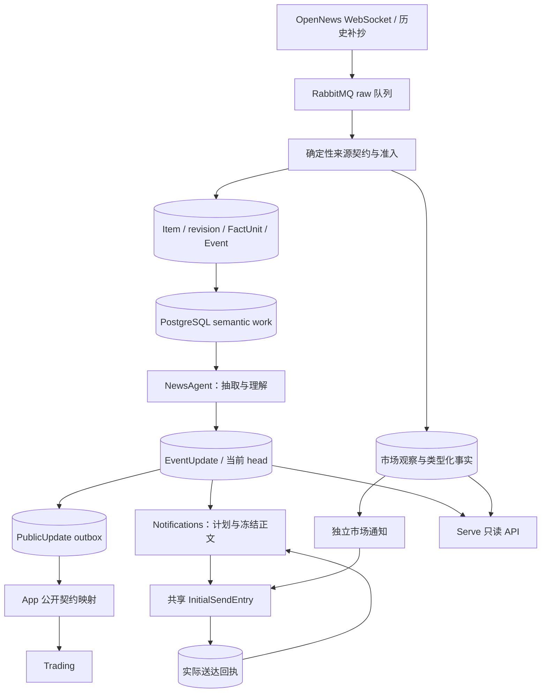

# News：来源、知识版本与通知

[手册](../README.md) · [系统架构](../ARCHITECTURE.md) · [语义链路入门](news-semantics-guide.md) · [OI](oi.md) · [行情](market-review.md) · [运维](../OPERATIONS.md#news-retry)

News 在 Workers 接收来源并保存事实，在 Serve 提供只读 Feed、详情、状态与行情接口。编辑型新闻形成带引用的命题和不可变 EventUpdate；市场报告形成独立的市场观察。知识采用、通知选择、实际送达各有持久记录。

当前有两个编辑型工作流所有者：`NewsAgent` 负责抽取、理解、采用和有界补读；`Notifications` 负责计划、冻结文案、发送和结算。`SemanticWorker` 与 `DelivererLoop` 负责领取和调度，`tracefold.app` 负责模型、存储、provider 和生命周期装配。

## 端到端数据流

*数据流 · PostgreSQL 保存事实、任务与回执；外部调用在事务外，市场分支不经过编辑型语义判断。*

Receiver 对可接受帧使用 broker publish confirms；Deduper 消费 raw 消息，在短事务中完成持久准入。编辑型准入先提交证据与 semantic work，再发布唤醒并记录发布状态；Janitor 修复未发布唤醒与过期租约。语义消息只通知 Worker 有工作，PostgreSQL 保存待处理版本，两者没有共享事务。

连接、进程中断和 broker 故障写入 collector 事故。Recovery 按 Strategy 历史接口和持久游标补抄，每轮限制墙钟、请求数及发布数；失败不伪装成已经恢复。RabbitMQ 重试、delivery limit 和 dead lettering 由 broker policy 管理。Workers 遇到有效 policy 漂移仍附着消费者并报告降级；`news bus-policy verify` 诊断仍失败，修复见[运维](../OPERATIONS.md)。

## 输入范围与身份

| 对象 | 当前含义与边界 |
| --- | --- |
| Item | 一条提供商记录，身份由 source 与 provider record key 决定；保存原始参数和来源信息 |
| Item revision | 同一记录按本地观察顺序出现的正文版本，保留序号和前驱；A → B → A 是三个版本出现 |
| FactUnit | 确定性任务范围；普通记录为 whole item，明确编号汇总才拆分 |
| Event | 准入层归组的来源和事实范围；不必只有一条命题，也不是全局故事百科 |
| Evidence / read_ref | 不可变来源证据 / 该证据在本 Event 实际阅读范围的身份 |
| Claim | 含资产角色、时间、数量、逐字引文及稳定 ref 的结构化命题 |
| EventUpdate | 被采用的知识版本，含命题、证据关系、变更、主题及问题 |

[FactUnit](../../tracefold/news/events/facts.py)只拆至少三个连续、显式编号且满足长度约束的块。任务后续段落保留阅读范围，前后公共限定保留共享上下文；编号锚决定事实身份，续段不重建它。时间列表、金额与普通段落保持整条；whole-item 身份不随标题更改重建。

[准入](../../tracefold/news/pipeline/admission.py)用来源契约、Gate、精确身份和有界标题近似匹配归组。MinHash / Jaccard、资产和数字用于查找候选及冲突保护，不能证明命题等价。同文来源不等于独立证实。只有任务范围、成员事实、正文修订或 grounded assets 等语义材料改变才请求语义工作；只换策略重发更新 provenance。

补抄新闻由 Gate 判断时效：有效 `params.ts` 与观察时间相差不超过 30 分钟时按实时准入，上币保持 `listing_deterministic`；更老或缺有效时间的稿件记 recovery。超时补抄可追加证据，但不请求语义工作。实时稿不受此补抄窗口限制。补抄来源首次可见时间取观察时间与发布时间较早者；并入实时 Event 不抹去来源的补抄标注。

### 阅读投影与资产依据

[阅读投影](../../tracefold/news/updates/projection.py)按当前修订定位既有 FactUnit，定位不唯一时提供完整来源，不直接复用旧偏移。引文必须同时存在于本轮可见的连续片段和对应冻结 Evidence 中。

冻结输入按 `evidence_ref` 保存原始 `source_asset_tags` 和抽取使用的 `asset_candidates`。候选保留 symbol、市场和 grade；商品候选须在自己来源正文中有相应商品语境，并附目录中 trading 合约的 `listed_markets`。`us.listed` 参考目录和 unknown 不补为交易市场；OpenNews 的 `cex` 不能单独证明资产类别。

抽取逐命题选择 primary / mentioned，接地校验只恢复引用来源中被选中的拼写与已知市场。模型市场为 unknown 且目录类别唯一时可补全，跨来源市场冲突仍保留未知。正文明确公司、产品或 ticker 可有限补充，URL、related prior 和泛主题不能补造资产。地点、国家、政府和组织不自动变成可交易标的。没有资产、目录或报价不阻止采用。

`read_ref` 绑定范围、片段和原始标签；派生商品过滤与目录刷新影响 `input_sha`，不使已读来源自动重读。历史市场值 forex 读取为 fx，无法证明市场的旧 fund 保持 unknown。

## NewsAgent 的语义工作

1. `SemanticWorker` 领取 wanted revision 与 lease，冻结本 Event 当前有效命题、未处理来源、任务范围和允许的补读目标。
2. `NewsAgent` 按 event、input revision、`input_sha` 和 analyzer 身份读取抽取 checkpoint，缺失时才调用抽取。
3. 抽取后事务外计算本地向量，有界读取跨 Event prior，再逐对判断关系与支撑。本 Event 有效命题全对比较，外部只比较选中的命题对。
4. 纯组装生成知识版本；保存 observation，再在短事务中校验 owner、lease、wanted revision 和 expected head，原子采用 EventUpdate、公开 outbox、命题索引及必要通知工作。
5. 无新证据或无实质变化只结算版本。采用后可有一次由持久 reservation 限定的已有来源补读，失败不能撤回已采用知识。

`EventUpdate.current_claims` 唯一推导有效命题，排除被更正退休和真实变化替代的 ref。抽取只读本 Event prior；外部 prior 只用于比较，相关 Event 再次采用不使抽取 checkpoint 失效。同一可见正文和范围已读、已隔离或已排入本轮时，转载副本不重复抽取；同一记录自身正文变化仍须读取。

生成使用严格 schema，解码容忍可修复可选字段、层级和单个条目；缺 statement、subject、action 或可用 citation 的命题被具名丢弃。全部条目不可用、空回答和 provider 截断是明确错误。引用可容忍外层引号、强调和空白差异，但必须保存真实源文片段。

| 判断或字段 | 当前职责 |
| --- | --- |
| relation | 等价、补充、更正、真实变化、冲突、无关或 unresolved；代码再检查目标、时间及可证明的标的/数量/语气冲突 |
| support | 来源支持、反驳、转述、未涉及或 unresolved；同源修订和转载不重复计算独立支撑 |
| mode | observation、assertion、decision、commitment、demand、threat、guidance、forecast、opinion、promotion、unknown；判断被归因者的言语行为 |
| actor_role | 被归因者角色读数，不参与 Claim 身份，policy 不按角色字段分支 |
| phase / content_kind | 行为阶段与内容类型，和言语行为分开；未来日期不自动变成执行完成 |
| conditions / quantities / times | 保留条件极性、数量尺度和时间精度；未明示年份不得补造 |

关系以同一核心事实为界；同故事中的另一个动作、标的或事件是独立事实。同一发生新增数字可为补充，更正和真实 A → B → A 转换保留版本及发生身份。只有同一 Event、完整被引全文和 statement 一致，且无数量/发生/结构身份冲突时，才允许窄范围 ref 复用。

### 共享命题召回

[claim_recall.py](../../tracefold/news/claim_recall.py)统一语义 prior、冻结回执和离线评测排序：7 天 prior、48 小时回执内，稠密、PostgreSQL FTS 和同源路线做 RRF。参数来自[校准文件](../../tracefold/news/claim_recall_calibration.json)，当前 prior k=5、receipt k=16；召回只提供比较对象，不裁定同一性。

`news_claim_index` 以 `(claim_ref, text_sha256)` 保存精确版本和带编码身份的 fp16 向量。稠密只读 statement；FTS 的 `claim_lexical_text_v1` 包含 statement、subject、action、object、speaker 和数量 name/unit/value/period。采用向量只有精确文字及模型身份一致时复用；通知读取冻结版本，不借当前 head 替代历史。

当前 Workers 从本地缓存离线加载固定 MiniLM FP32 ONNX，384 维、256 token、attention-mask mean pooling、L2，使用独立有界单线程执行器。缺缓存、自检/运行失败只关闭稠密路线，FTS 和同源继续，缺向量保留 pending。Janitor 补有界 pending；历史完整窗口由显式 backfill 处理。恢复见[运维](../OPERATIONS.md#命题向量缺失与降级)，兼容和资源证据见[本地嵌入报告](../reports/news-799.md)。

### 模型路由与预算

App 分别选择抽取、判断、卡片路由。`llm.news_triage_model` 为基础抽取模型，可选 `news_triage_judgment_model` 指定同 endpoint 的判断模型名；卡片和 fallback 有独立配置。原生 `llm.news_judgment` 与通知 `llm.news_reader_judgment` 独立，不借 Trading 配置；原生不可得按路由回退一次，成功缓存不重复投票。

| 边界 | 当前上限 |
| --- | --- |
| 一次语义 process | 120 秒共享阶段预算 |
| 一次生成调用 | 60 秒及剩余阶段预算 |
| head 变化后的采用尝试 | 2 次，复用抽取，只补必要关系 |
| 通知准备模型阶段 | 60 秒，规划与文案共享，发送等待另计 |
| 通知准备在途 | `news.push.notification_prepare_limit` 默认 2，范围 1–8 |

边界不是端到端时延承诺。关系/支撑暂不可得时重试；最终尝试可保存 unresolved / `possible_new`，不伪造无价值结论。`possible_new` 不发布公开 catalyst。生成契约/引用错误、临时 provider 故障及熔断有不同处理，不用无效回答制造成功版本。

## 主题、来源与公开契约

知识契约为 `news_event_update_v2`。命题携带 IPTC 主题，Event 从有效命题汇总最多三个非冗余主题。来源权威来自实际引用的身份；issuer first party、监管文件与 secondary report 不等于独立核验。

`content_sha` 描述业务材料，`content_revision` 与前一版本链接，允许回到先前状态而保留新的采用。Claim ref、阅读身份、观察、计划及 intent 各回答不同问题，不能用一个标题 hash 代替。

`news_public_update_v1` 有 `catalyst_delta` 和 `source_update`，显式带受影响、退休和替代 refs。App 映射公开事实到 Trading；News 不导入 Trading 或替其写表。卡片、通知分数和报价投影不是 Trading 事实输入。

## 持久状态与恢复

| 记录 | 事实与恢复 |
| --- | --- |
| `news_jobs` semantic | wanted/done revision、lineage、已处理/失败 read refs、state、lease、attempt、due；精确版本领取和结算 |
| `news_analyses` / Event head | 抽取 checkpoint、observation、不可变采用文档；观察不等于采用，失败保留上一有效 head |
| `news_jobs` notify | pending / done / failed；新通知义务重建或重置工作，已有 pending 跟最新 head，保留已用尝试 |
| `news_notifications` | 不可变决定、intent、冻结正文、发送状态及真实结果；DB 状态和 SendOutcome 分开 |
| `news_reader_clock` | 一致读取后的权限版本围栏；不保存知识，采用/链接和读者送达事实使旧证明失效 |

语义、通知快照在 `REPEATABLE READ READ ONLY` 中构造，外部 I/O 在事务外。写事务先锁 Event 再锁 job/intent，校验 owner 和版本。通知锁内只验 head / reader 世代，不重新召回；向量补算、collector 与 Trading 不改变该世代。

语义输入超时计已领取版本尝试并退避；最后尝试有有效 lease 时 Janitor 不能终结。失败只隔离实际读入范围，新材料仍可处理；迟到旧 lease 不能消耗新预算。模型/提示词升级不自动重读已处理证据或重置失败。

没有生成模型时，Worker 可确认唤醒但保留 DB pending；没有 sender 时通知待处理。配置故障分别报告 editorial / delivery / claim_recall 能力，共享基础资源故障由 Workers 根监督处理。

`/api/news/status` 区分 semantic pending、deferred、in progress 和 failed exhausted，保留真实次数与错误。`primary_asset_markets_24h` 统计近 24 小时已采用 semantic 解析中的 primary 资产出现，不限当前 head、已推送或唯一 symbol；空分母比例为 null，只观测而不影响通知或健康。

精确重试、重读与 head scope 修复见[运维](../OPERATIONS.md#news-retry)。scope repair 退休误归属 Claim、写独立证明并发布 source_update；不改旧来源、EventUpdate、回执，也不重开已完成通知。

## 逐命题通知

`NotificationPlanner` 调用纯 [decide()](../../tracefold/news/notifications/policy.py)，根据 adopted 命题、有效关系、真实回执与未决发送状态给出具名决定。模型提供 importance / anchor 分布，policy 控制规则和阈值。

| 顺序 | 当前行为 |
| --- | --- |
| 1 | 退休、替代或跨 Event 失效：retired |
| 2–3 | 自身 sending 暂缓；ambiguous 按可能已送保护，不重发 |
| 4–5 | 首次可见超过 3 小时不推，更正/冲突为 12 小时；明确发生超过 7 天记旧闻，更正和带 speaker 新表态除外 |
| 6–7 | 等价或更全已送命题为 known；链接发送在途则暂缓 |
| 8 | 首次可见晚于旧回执的已送命题更正：通知更正 |
| 9–10 | 受保护上币、商品/指数当日 ≥5% 的价格变动：确定性推送；价格水平/统计百分比不适用 |
| 11–12 | 其余问必要读者判断；不可得暂缓，采用后超过 10 分钟仍不可得记 unassessed，不按猜测推送 |

新颖度从不可变 adopted changes 派生，最多两跳，第二跳须经 equivalent；同一命题对用最新断言。sent、ambiguous、sending 分别处理。可证明的上币标的错链由读取保护过滤，历史图不改写。

唯一 `news_reader_input_v3` 的 `as_of` 是首次可见 UTC 日期；每命题至多 16 条实际 sent 正文，以冻结 `sent_claims` 召回，已链接优先。sending 不进入模型正文，ambiguous 只保护重复；缺冻结历史不借当前 head 补造。

一次调用同时问新增重要性与同核心事实锚点。主体、目标、动作、发生/阶段须匹配；同故事、后来实施或不同统计期不直接作锚点。importance 相对完整已送正文评分，confidence 只记录。rubric 唯一源码为 [reader.py](../../tracefold/news/notifications/reader.py)。

| 后端 | push 期望值 | 锚定/细节 held | 重点 P(4) | 锚点 P(none) |
| --- | ---: | ---: | ---: | ---: |
| native | 2.4 | 2.5 | 0.4 | < 0.2 |
| generated | 2.4 | 2.6 | 0.4 | < 0.2 |

未锚定命题过普通期望值或重点尾部线即可推；held 须先过 held 线再标重点。无锚点、已下令/生效/执行/完成/取消的实际状态变化，linked increment 按普通门槛；承诺、预测、未知阶段和普通参数保持 held。真实误差与范围见[读者评测](../reports/news-791-b.md)。

### 正文、回执与重试

`prepare` 读一致快照、存计划、保留 intent、生成并冻结正文；`finalize` 按持久计划执行，不重判价值。文案只读选中命题、字段、引文和最少来源，补充/更正带实际旧正文作对照。冻结校验 refs、每命题一行、中文、URL/控制字符和 digest；约束不证明真实模型总能忠实翻译。

发送顺序：共享 reservation → 目标预检 → 短事务 begin_send 复核 head / reader / lease 并写 sending → 事务外 provider → 短事务按 lease / payload 结算。sent 需真实回执；not_sent 只有明确可重试才续用原 intent/payload；ambiguous 禁止重发。已知结果可幂等结算，旧 lease 不能结算新 owner。

`DelivererLoop` 有界并行准备，单个 finalizer 串行结算；`NotificationSender` 执行冻结首发，唯一 `InitialSendEntry` 统一编辑型、市场首发和后续编辑节奏。`DeliveryEnrichment` 对真实首发回执领取编辑权，行情编辑不改事实正文/hash。

启动与每 30 秒清扫不属于本进程且实际 lease 已过期的 sending，按 lease token / attempted time CAS 结算 ambiguous；不会仅因固定 elapsed 秒数终结仍有 owner 的发送。停机停止新准备，有界等待在途结算，释放未发送 reservation。

规划异常计 notify work 尝试，文案异常和可重试 not_sent 计 intent 尝试，当前均最多 3 次。等待在途、CAS 冲突和 DB 暂时无答不计业务失败；已有发送账本的 intent 不能用 retry-work 重开。决定、准备和结果分别保存计时与比较回执摘要，不从卡片数推断调用数。

## 独立市场事实与采集器

OI、清算、大户报告、钱包触发和无法结构化的市场记录存 `news_market_observations`，不创建编辑型 Event、verdict、reader judgment 或 semantic work。解析失败保留 raw 与原因；首次类型化事实及公开 outbox 在准入提交，通知规则失败不能回滚事实。

市场观察沿用 Item 身份，首次业务内容不被重放改写，新增来源策略可合并。`news_collectors` 的 opennews、chain_tape、wallet_roster、instrument_catalog 各有类型化状态和事故；锁整行 mutation，无变化不写。事故保留未关闭/待恢复及最近有界已结算记录，钱包名单保存成员区间历史。

Receiver publish 成功后用 1 秒有界事务记时钟，正常每 5 秒至多一次，broker 事故后的成功帧关闭事故。frame 记账暂时失败保留 warning 并续帧重试，连接/事故迁移失败仍传播。目录和报价为 latest-state 循环，市场通知使用自己的决定及账本，见 [OI](oi.md) 和[行情](market-review.md)。

## 验证与源码入口

| 范围 | 实现与回归 |
| --- | --- |
| 接入与准入 | [pipeline](../../tracefold/news/pipeline/)、[FactUnit](../../tracefold/news/events/facts.py)、[范围单测](../../tests/news/test_news_update_input_scope.py)、[补抄集成](../../tests/integration/test_news_recovery_admission.py) |
| 语义与采用 | [updates](../../tracefold/news/updates/)、[语义存储](../../tracefold/news/storage/semantic_store.py)、[Agent 回归](../../tests/news/test_news_event_updates_core.py)、[采用集成](../../tests/integration/test_news_event_update_store.py) |
| 资产与召回 | [claim recall](../../tracefold/news/claim_recall.py)、[资产候选](../../tests/news/test_news_source_asset_candidates.py)、[向量复用](../../tests/integration/test_news_embedding_reuse.py)、[有界召回](../../tests/integration/test_news_claim_recall_bounded.py) |
| 通知和发送 | [notifications](../../tracefold/news/notifications/)、[发送存储](../../tracefold/news/storage/notification_delivery.py)、[通知单测](../../tests/news/test_news_event_update_notifications.py)、[送达集成](../../tests/integration/test_news_update_delivery.py) |
| 运行与 API | [App 装配](../../tracefold/app/workers/wiring/news.py)、[公开面边界](../../tests/architecture/test_news_public_runtime_surface.py)、[发送职责](../../tests/architecture/test_news_delivery_boundaries.py)、[市场边界](../../tests/architecture/test_news_market_path_boundaries.py)、[HTTP](../../tests/contract/test_news_http_contract.py) |

纯算法和值在 events / updates / notifications / market_review，模型在 adapters，SQL 在 storage 的各生命周期所有者，App 建造能力，News 不反向导入 App。当前质量证据为[共享召回评测](../reports/issue-791-claim-recall-2026-10-02.md)、[读者评测](../reports/news-791-b.md)和[本地嵌入兼容](../reports/news-799.md)；每份报告注明版本、失败和证明范围，历史数字不等于当前部署或本次文档修改的验证。
