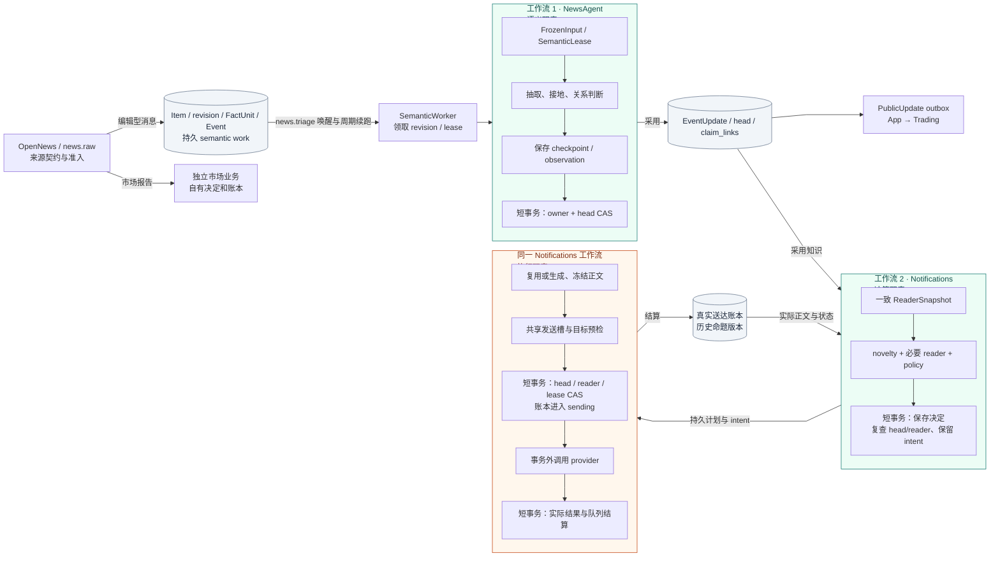
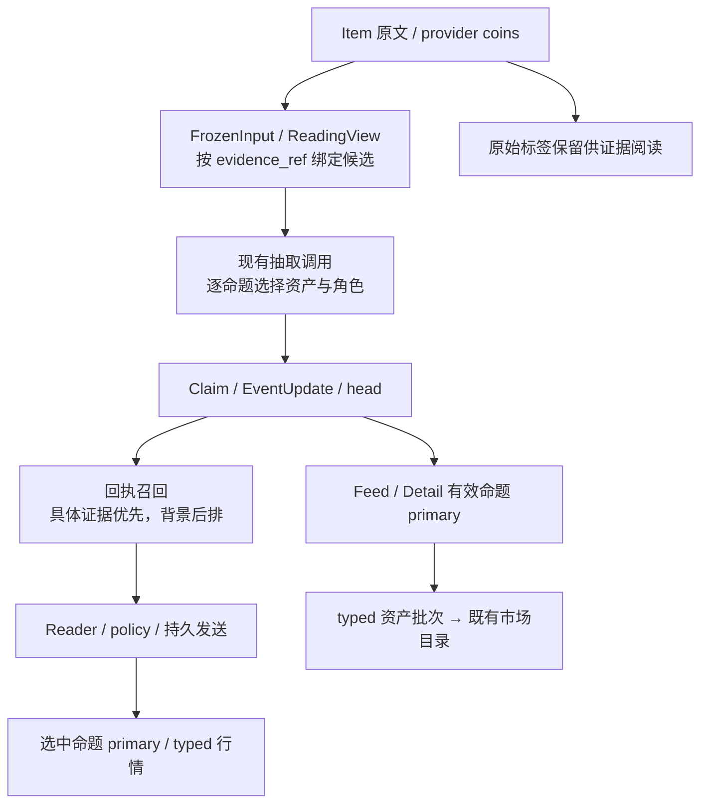
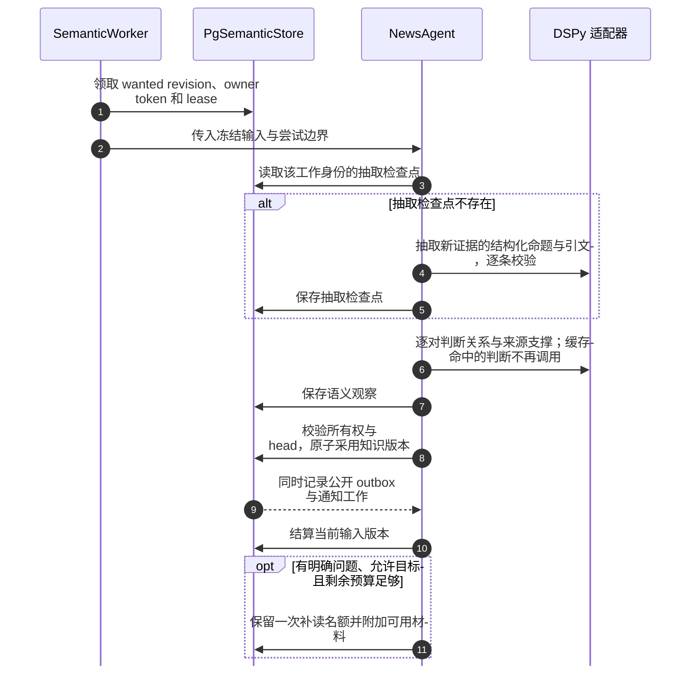
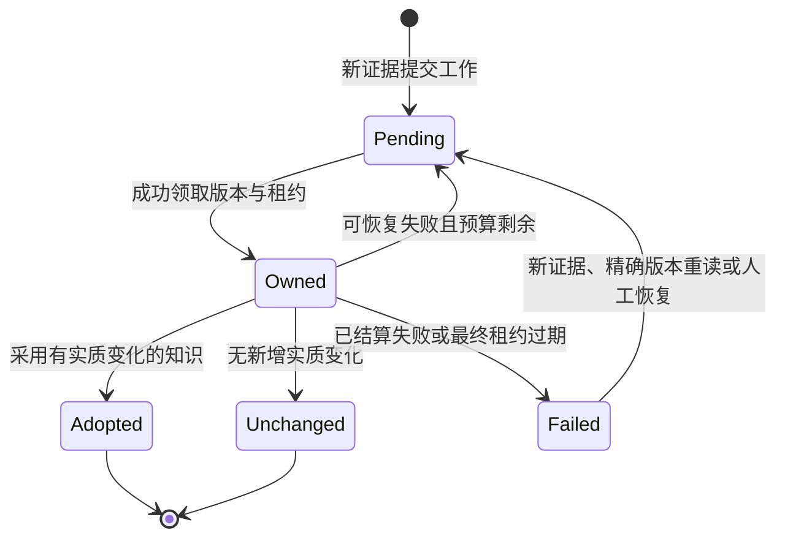
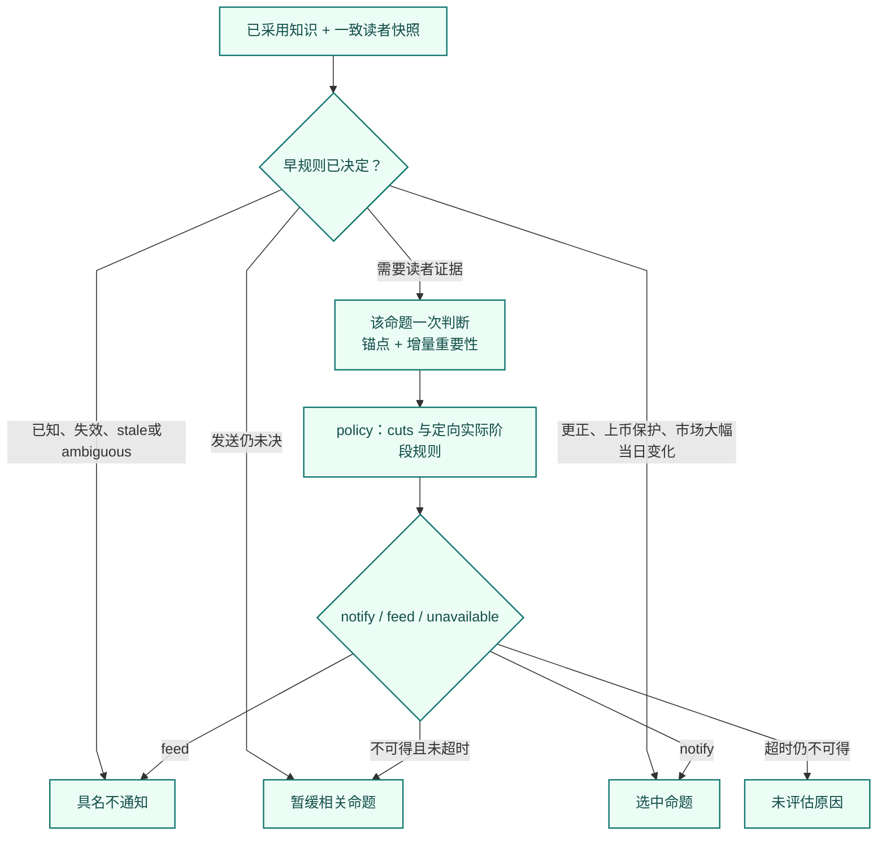
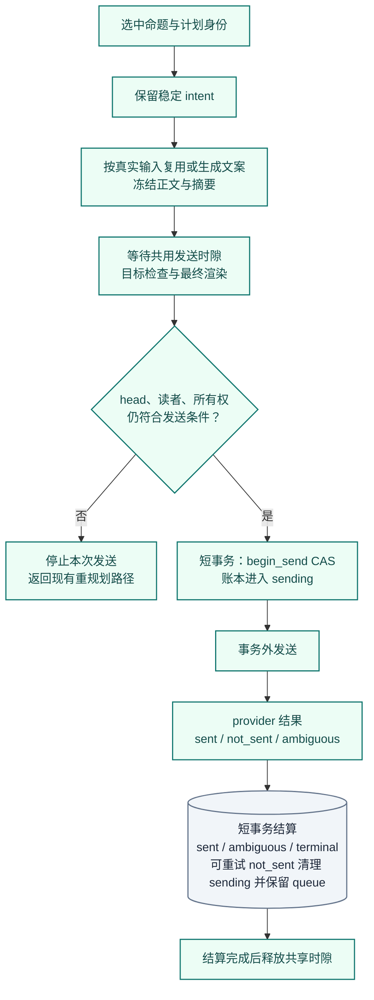

# News：增量新闻理解与独立通知

[手册](../README.md) · [系统架构](../ARCHITECTURE.md) · [OI](oi.md) · [交易研究](trading.md) · [排障](../OPERATIONS.md#news-retry)

News 不只是“把标题交给模型打分”。当前编辑型链路以 **来源修订 → 冻结输入 → 命题理解 → EventUpdate 采用 → 独立通知** 为主线。它分别保存来源说了什么、系统理解了什么、读者实际收到什么。

| 模块速览 | 说明 |
| :--- | :--- |
| **定位** | 信息产品 / 编辑型新闻 |
| **运行位置** | Workers · news-semantic 与独立通知续接 |
| **输入 → 产物** | 来源 Item、修订、冻结证据与 prior claims → EventUpdate、逐命题通知计划、实际回执、公开 outbox |

> [!IMPORTANT]
> 理解、采用和通知分别完成。通知失败不回滚知识；卡片也不是 Trading 的事实来源。

当前有两个工作流所有者，保持三个逻辑职责：

| 工作流所有者 | 负责的职责 | 交接边界 |
| --- | --- | --- |
| [NewsAgent](../../tracefold/news/updates/service.py) | 语义抽取、理解、采用与可选补读 | 已采用的 EventUpdate、公开 outbox、通知工作 |
| [Notifications](../../tracefold/news/notifications/service.py) | 通知决策与通知执行的一个完整用例 | 不可变计划 → 冻结正文 → 真实送达结果 |

语义、通知决策、通知执行仍是三层职责。`Notifications.prepare` 负责快照、规划和冻结；`finalize` 读取持久计划并执行发送与结算，不重新判断新闻价值。纯 policy、模型证据、数据库事务与 provider 适配分别有明确文件所有者，完整索引见[源码责任地图](#section-源码责任地图)。Workers 生命周期保持现有 `SemanticWorker` 与 `DelivererLoop`；无需另设 Coordinator、Executor 类族或新的运行服务。

产品目标是**正确、及时覆盖可交易标的上的新事实**，包括小型加密项目的产品、主网、代币和场所动作。推送量只用于观察运行结果，不是减少推送的配额或验收目标。

[通知判断](#notification) · [输入身份](#input) · [Agent](#agent) · [状态恢复](#state)

<strong>本页目录</strong>

1. [端到端数据流](#section-端到端数据流)
2. [一条 News 为什么可能对应多个 Event](#section-一条-news-为什么可能对应多个-event)
3. [NewsAgent 到底做了什么](#section-newsagent-到底做了什么)
4. [主题、来源与知识版本](#section-主题来源与知识版本)
5. [状态必须分三层理解](#section-状态必须分三层理解)
6. [什么决定一条新闻是否推送](#section-什么决定一条新闻是否推送)
7. [一个具体更新例子](#section-一个具体更新例子)
8. [验证与排障入口](#section-验证与排障入口)
9. [源码责任地图](#section-源码责任地图)
10. [常见误解](#section-常见误解)

## 01 · 端到端数据流

*数据流 · PostgreSQL 保存事实和持久工作；语义消息用于唤醒。图中的三层职责仍由两个工作流编排，外部模型与 provider I/O 均在事务外。市场分支保持独立。*

PostgreSQL 保存可恢复工作；RabbitMQ 的语义消息只是唤醒。准入事务先提交，再发布唤醒并记录发布状态；进程在这几步之间崩溃，由维护任务重新唤醒。它不是 PostgreSQL 与 RabbitMQ 共享一个事务。

## 02 · 一条 News 为什么可能对应多个 Event

### Item、FactUnit、Event 与 Claim

| 对象 | 含义 | 不能混淆的身份 |
| --- | --- | --- |
| Item | 一条提供商记录；保留原始内容与来源信息 | 不等于某一条模型命题 |
| Item revision | 同一记录后续观察到的正文版本，带修订顺序和前驱 | 不等于正文哈希；A → B → A 是三个版本出现 |
| FactUnit | 从一个明确编号汇总中切出的独立输入范围 | 不等于“每句话都拆成一个 Event” |
| Event | 准入层维护的一组相关来源证据 | 不保证只包含一个 Claim，也不是全局故事百科 |
| Claim | 带字段、资产角色、原文引文与稳定引用的命题 | 不等于标题、卡片或一个 ticker |
| EventUpdate | 一次已采用的知识版本，包含命题、关系、变更与问题 | 不等于一次模型请求或一次推送 |

[extract_fact_units](../../tracefold/news/events/facts.py)只拆**至少三个连续、显式编号块**的高置信度汇总。编号后的连续段落保留在该 FactUnit 范围内，列表前后的公共限定保留为共享上下文；事实身份仍由编号锚决定，不随续段增长而改变。不满足该结构时保持一个整体输入，其事实身份只由记录决定：同一记录改了标题是同一事实的新版本，不另开 Event。时间、金额和一般段落不应被当作编号列表拆分。

因此，“一条提供商消息 → 多个 FactUnit → 多个 Event”在当前实现中是有条件的；与此同时，**一个 EventUpdate 本身可以包含多条 Claim**。系统没有让 LLM 自由把每句话扩张成一个独立 Event。

更新已有消息时，系统按既有范围及修订关系读取证据，不把旧正文的字符偏移硬套在新正文上。[唯一阅读投影](../../tracefold/news/updates/projection.py)按本轮来源版本定位任务片段；定位不唯一时展示完整来源。模型只收到该视图，完整 Evidence 仍保存。引用必须同时出现在本轮一个连续可见片段和对应冻结来源中。

编号列表的最后一条任务与其后连续正文构成一个可引用片段；若该任务不是当前 Event 的事实，后文仍只作为共享上下文。更正历史归属时，`scope_retraction` 在新的 EventUpdate 中退休误归属 Claim，并向 Trading 发布 `source_update`；修复证明独立记在 `news_head_scope_repairs`，不伪造模型观察，也不改写旧 EventUpdate、来源或发送回执。修复与语义采用共用 Event 锁及提交路径；按 Event/head/proof 有界执行。纯修复不重新打开已完成的通知工作，也不重置尝试数；仍 pending 或已 `failed` 的工作转向修复后 head，失败工作之后按新 head 定向重试。精确命令见[运维指南](../OPERATIONS.md#历史编号事实的-head-归属清理)。

### 命题身份不随每次关系变化重建

Claim ref 指向一个命题或真实世界中的一次发生。新增支持、来源、跨 Event 冲突或更正关系可以改变 EventUpdate，但不必创建另一个 ref；组装时仍保留关系和证据增量。显式 A → B → A 的状态转换则保留不同发生身份，不能因为字段重新相等就吞掉最后一次动作。

对于同一 Event 中两路来源携带完全一致的被引全文，即使关系模型误判为 `unrelated`，只有命题 statement 相同、没有新增数量 / 发生转换，且结构化身份检查无冲突时，才允许窄范围复用旧 Claim。它不是只凭相似标题跨 Event 去重。

### 准入与候选归组不是语义裁决

[Gate](../../tracefold/news/events/gate.py)与[准入](../../tracefold/news/pipeline/admission.py)负责确定性证据、grounded assets 与队列优先级。来源标签、显式 cashtag、交易标的目录与规则匹配各有作用；并非所有实体都由一次模型调用凭空产生。

精确身份和有界近似匹配用于找到可能归到一起的输入。强事实如 ticker、数字及 token 兼容性可以阻止错误合并；MinHash、标题相似或同一个资产只能帮助召回，**不能证明两个命题相同**。真正的等价、补充、更正与阶段变化在 Claim 层判断。对引文明示的不同 crypto 上币 ticker 或同报价币的不同完整合约，代码阻止错误的等价、增量或阶段关系；ticker 与交易对、未引证标签、自由文字差异保留未知，同标的不同阶段仍交原关系判断。通知读取还用当前 head 与实际回执的原始命题检查最新链接断言：两端证据足够时忽略同类错链，缺任一端时保留，真实更正不受影响；它不改写历史图，也不重新打开已完成工作。实时稿只按文本并入已准入的 Event：断线补抄开出的 recovery Event 不产生语义、卡片或 catalyst，不能吞掉之后的实时稿；补抄稿仍可并入它作为历史。

证据快照记录成员的来源、策略与 provenance，但只有语义材料变化（任务范围、成员记录与事实、正文修订、grounded assets）才请求语义工作；同一记录换策略重发只更新快照，不触发空转。

### 实体依据与相关召回

来源资产采用来源优先的简单链路：Item 的 provider_metadata.coins 保留原始标签；[semantic_input.py](../../tracefold/news/storage/semantic_input.py) 按 evidence_ref 投影为 FrozenInput.asset_candidates（symbol、market_type、grade），随同一次抽取输入冻结。现有抽取器针对每条命题选择相关候选及 primary/mentioned，不把整篇标签复制给所有命题；接地时只恢复被选中、被引用来源候选的拼写与已知市场，跨来源冲突保留未知。正文明确 ticker、公司或产品名称时允许有限补充，不要求 ticker 字面出现；不从 URL、related prior 或泛主题补资产。资产只指可交易标的（token、股票、基金、指数、商品或货币对）；地点、航道、国家、政府、武器、项目和组织在没有明确上市标的时不是资产。空资产、目录未收录或缺行情都不阻止事实采用与通知判断，不新增资产表、实体服务或模型轮次。

资产市场词表复用现有 MarketType。历史读取显式把 forex 解释为 fx；旧 fund 没有证明其市场类别，保留为 unknown，不猜 equity。原始来源、已存 Claim/ref、内容版本与真实回执不重写。

*数据流 · 候选是原始来源的冻结投影；报价仍使用既有目录，不构造另一套资产身份账本。*

[entities.py](../../tracefold/news/entities.py)提供有依据的候选检索特征。`EntityKey(namespace, identifier)` 与 `EntityFeature(key, kind, basis_ref, surface)` 分开：出处和原始写法不会改变 key 的比较结果，但 key 的相同也不会替代命题关系判断。

精确资产 key 保留市场类型和 venue 限定；没有 chain 依据时保留地址大小写，特别是 Solana 地址。目录中的共同发行主体、商品 underlying、venue 基础符号和加密报价对后缀，分别是相关检索特征。例如 XAUT/GOLD 的 underlying、SIUSDT/SI 的候选基础符号，只用于扩大候选，不能证明两个代币合约或新闻事实相同。`subject_id/object_id` 保留代码所给身份，来源中的主体/对象文字只作相关检索。

这套纯特征同时进入抽取前的 [evidence.py](../../tracefold/news/evidence.py) 与 [storage/evidence.py](../../tracefold/news/storage/evidence.py) 查询，以及通知侧 [notifications/recall.py](../../tracefold/news/notifications/recall.py) 与 [storage/notification_context.py](../../tracefold/news/storage/notification_context.py)。扩大召回后仍逐对比较实际命题，不能凭特征交集直接判 equivalent/known，也不能让相关背景自动提高新动作的推送门槛。

原始市场报告走单独的 `admit_market_item`：保存 Item 与解析结果，不创建伪 Event，不走编辑型 Gate / MinHash / 语义链路。

## 03 · NewsAgent 到底做了什么

*时序 · 展示一次能够采用的正常尝试。缓存命中、无变化、重试与 head 冲突会改变实际调用数量。*

### 冻结输入与增量范围

`FrozenInput` 绑定 Event、输入修订、证据范围、prior claims、候选关系和来源时钟；工作身份另外绑定 analyzer 身份，观察身份另外绑定语义 program 身份。prior claims 只取**当前有效**命题（未被更正退休、未被真实变化替代），先本 Event，后召回的相关 Event；“当前有效”只由 `EventUpdate.current_claims` 一处推导。输入身份 `input_sha` 只含本 Event 的命题：相关 Event 再次采用不改变身份，重试复用已保存的抽取，只重问比较（答案按内容缓存）；相关 Event 的命题也不进入抽取输入。每个来源的当前 Event 阅读范围产生 `read_ref`，由任务边界、实际片段、非空来源资产候选和投影版本决定。先构造阅读视图再比较已处理的 `processed_read_refs` 与已隔离的 `failed_read_refs`；同一来源新增范围或条件仍需处理，重投相同任务不重算。旧命题用于比较与延续，不是每次把全部历史成员重新抽取。

“读过但没有命题”的材料也必须记入任务级处理身份。否则同一段空内容会不断进入下一轮。没有新证据或没有实质变化，可以推进 done，而不制造新的内容版本；首个版本没有命题时不采纳 EventUpdate。以失败结束的修订把它读过的范围隔离，之后的新成员只读新材料。对已完成或已失败、确认需要重读的 Event，使用精确 wanted/head/read 身份的 `news reanalyze`；它不伪造来源修订或自动重发历史通知。

来源修订使用**本地观察顺序、修订序号和前驱**，不把提供商发布时间猜成可靠的编辑版本号。同一来源的新旧正文可以同时作为历史证据保存，但当前支撑判断只采用该来源的当前贡献，不能把转载或同源修订算成多个独立证实。

### 抽取、判断与采用各司其职

| 步骤 | 模型承担的工作 | 代码承担的工作 |
| --- | --- | --- |
| 抽取与理解 | 同次给出命题、条件、数量、资产角色、时间、引文、`mode`、`phase`、`content_kind`、逐命题主题与证据支撑提示；不比较旧命题 | 发给模型的 schema 是严格的（受约束解码的 grammar 逐条绑定命题），解析是宽松的：写错层级的键（`fields` 里的 citations / topics）放回原处；选项外的读数记为 unknown（phase 为 `not_applicable` 时记为空）；列表里不可解析的条目（如 `300亿` 这类非十进制数量、资产、条件、引文）只去掉该条；null 或类型不符的可选字段取默认值；多余的键忽略；主题按其指名的 codebook 代码保留，只去掉认不出的那一个。只有缺陈述、引文、主语或动作的命题才丢弃并记原因，其余照常；引文容忍大小写、空白与包在外面的引号 / 强调符，保存来源原文片段 |
| 比较 | 每条新命题与每条当前有效的旧命题逐对判断等价、补充、更正、替代、冲突，以及证据支撑关系；抽取不给关系提示 | 排除已能证明的数字 / 语气矛盾，验证目标 refs 与候选身份；核对更正 / 替代的时间先后；冲突只注释新命题，不吞掉其 catalyst；同一冲突只在首次建立时发布 |
| 组织 | 提议影响机制与未解问题 | 验证支持关系；区分事实与条件性推论；延续未被显式改变的知识 |
| 采用 | 不直接写数据库 | 组装 EventUpdate，保存观察，检查 owner / lease / head 后条件采用 |

当前独立判断任务包括 `relation`、`support`、`next_read`，并非每条消息都需要全部任务。通知侧的读者判断不在这张任务表里，修改它不会让语义检查点失效。关系始终逐对判断：#742 曾重放“先分诊、再细判”，在本地生成式模型上无法做到关系召回不降（通知侧读者新颖度依赖 `equivalent` / `adds_information` 链接，Trading 依赖更正与替代），且只省约 5% 调用，因此未采用。

可选原生判断通过 DSPy 的有限输出类型连接 Jev / System One。未配置该后端时使用生成式判断；已成功缓存的答案不再找另一个模型投票。一组问题的缓存读取是一条 SQL，每个批次的写入是一条 SQL；批次有界并行（至多 3 个），一个批次响应不可用只让它自己的问题不可得，不连累其他批次或整个修订。选项标签按大小写与分隔符规范化，无法识别的标签只让该条不可得。失败回退、批次与缓存身份由 [judgment.py](../../tracefold/news/updates/judgment.py)及 [模型适配](../../tracefold/news/adapters/)控制。

### 模型到底调用几次，为什么有延时

**不是固定三个 DSPy 节点，也不是一个 Event 只调用一次模型。** 一次语义尝试可能包含抽取、多个关系判断批次、缓存命中、回退，以及采用冲突后的缺失关系补算。Jev 抽取同时给出 mode、phase、content_kind 和每条命题的主题，不再对同一输入重复执行原生分类。通知阶段先按持久化的命题链接判断读者新颖度，再对规则未决定的每条命题发一次读者判断（锚点 + 增量重要性）；若有命题选中，再生成中文卡片。

| 预算 | 当前代码值 | 解释 |
| --- | --- | --- |
| 语义阶段 | 120 秒 | 一次 `NewsAgent.process` 的共享截止时间 |
| 通知模型阶段 | 60 秒 | 计划与卡片生成共享，不把外部发送等待算成同一次模型阶段 |
| 通知准备在途上限 | `news.push.notification_prepare_limit`，默认 2 | 只限制实际准备任务和就绪结果；进程唯一的发送时隙不占准备位置；快 Event 可先完成 |
| 生成调用预算常量 | 60 秒 | 具体适配使用的调用边界；不等于端到端保证 |
| 采用冲突尝试 | 2 次 | 处理 head 变化，不无条件重做已完成的抽取 |

语义预算见 [updates/service.py](../../tracefold/news/updates/service.py)，通知预算见 [notifications/service.py](../../tracefold/news/notifications/service.py)，模型调用边界见 [adapters/generation.py](../../tracefold/news/adapters/generation.py)。它们是上限，不是实际耗时、服务级别承诺或性能实测。排查延时需要拆开：**入队等待 → DB 领取 → 模型物理调用 → 判断 / 回退 → 采用 → 通知等待 → 发送**。把总耗时都称为“Agent 慢”无法定位根因。

抽取、语义判断、卡片文案和生成式读者判断都经 `generate()` 调用，回答写成单行紧凑 JSON。DSPy 自带的 `JSONAdapter` 在提示里以 `indent=2` 展示输出样例，模型会照抄缩进；News 的适配器改为展示并要求紧凑格式，#765 实测输出 token 少约 35%。`response_format` 不变，服务端仍按 schema 约束回答。一次回答能写多长，实际由输出上限（qwen 抽取 4000 token）和单次调用 60 秒（`GENERATION_CALL_SECONDS`）中先到的一个决定：单独调大上限，长清单只会从截断变成超时。紧凑输出减少了长清单截断，但不能消除。

提供商失败与内容不确定不同：非最终尝试中，关键关系 / 支撑判断无法取得会进入持久重试；最终尝试允许按契约保存 unresolved / `possible_new`，不能伪造“没有新闻价值”。程序错误和非法核心输出仍是失败。

生成输出具体区分 `news_generation_output_truncated`、`news_generation_output_empty` 与 `news_generation_output_schema_invalid`。provider 以 `finish_reason=length` 截断的回答即使被 JSON 修复成可解析的对象，也是 `news_generation_output_truncated`；一个抽取回答里没有任何可用命题（全部 `news_claim_schema_invalid`）同样是坏回答。已配置的 fallback 只有请求契约有实质差异时才可补答一次（抽取 fallback 的输出上限更大），只有路由上最后一个回答仍不可用才使修订失败；固定契约或引用错误不再消耗相同请求的多轮语义重试。临时限流、超时、服务端和传输错误仍走有界恢复。错误日志只记录错误类别、长度，以及被修复或不可用命题的字段位置与错误类型（`news_extraction_claim_repaired` / `news_extraction_claim_schema_invalid index=… errors=[(loc, type)]`），不记录原始模型响应片段。

### 可选补读的边界

系统只能读冻结输入提供的目标，由实际 `ExistingSourceReader` 实现提供材料。它不是任意网页浏览器、shell 或自主搜索 Agent。一条 lineage 通过持久 reservation 限制一次补读，重试不能获得新名额；失败不能撤销已经提交的 EventUpdate、公开 outbox 或通知工作。

## 04 · 主题、来源与知识版本

[topics.py](../../tracefold/news/updates/topics.py)维护 IPTC 导航主题，最多保留三个，不同时保留冗余父子主题。当前 v2 将主题归属到命题并从有效命题汇总，避免已失效内容长期污染 Event 标签。

[taxonomy.py](../../tracefold/news/taxonomy.py)保留来源权威类别，例如 `regulatory_filing`、`issuer_first_party`、`reputable_secondary` 与 `unknown`，依据已识别的来源身份。来源权威不是对其引用的第三方说法进行独立核验，更不是交易指令。

当前 EventUpdate 使用 `news_event_update_v2`；0411 已清除退役 v1 所属 Event、旧 verdict / Review / 学习表。当前 ReviewDesk 处理通知决策反馈及外部漏报，不把旧四轴 taxonomy 或旧 Program 的 `fact_kind` 当作新 Claim 契约。

### 三层之间的数据契约

| 契约 | 来源与接收者 | 保留的依据 |
| --- | --- | --- |
| `FrozenInput` / `SemanticLease` | 存储冻结来源、当前有效 prior、任务范围和 owner → `NewsAgent` | input revision、lineage、read ref、引用原文；外部 prior 不进入抽取材料身份 |
| `Extraction` / `SemanticObservation` | 模型回答经接地校验、缓存 → 纯组装与采用 | 抽取检查点与理解结果复用现有契约；观察独立持久保存，不代表采用成功 |
| `EventUpdate` / `PublicUpdate` | 原子采用 → 通知与公开 outbox | 不可变内容版本、claim refs、证据、关系与变更；head CAS 决定当前事实 |
| `ReaderSnapshot` | 同一次一致数据库读取 → planner | 可核验冻结正文池、有序 per-claim sent intent IDs、独立链接与送达状态 |
| `ReaderInput` / `ReaderJudgment` | 每命题冻结上下文 → 模型证据 → policy | m1…mN 正文位置、importance/anchor 分布、后端或 unavailable 原因；证据对象不读取 cuts |
| `NotificationPlan` / `IntentLease` | planner → 计划提交 → 执行 | 每命题决定、比对的正文摘要、reader revision、稳定 intent 与 owner token |
| `FrozenCard` / `SendOutcome` | 中文文案冻结 → Sender → 持久结算 | 精确正文与 hash、provider 证明的结果及回执；准备完成不等于送达 |

`ReaderSnapshot.receipts` 是选中正文与语义链接所需的可核验冻结正文的单一池，以 intent 去重；链接行可能保留 ambiguous 的冻结正文，但 `reader_messages` 只读取状态为 sent 的消息。`receipt_intents_by_claim` 保留每命题自己的顺序和 0–16 条模型上下文。`link_receipts` 单独保留 `sent/ambiguous/sending` 状态及 claim refs，即使没有可用正文或未进入模型 Top-K，也保留保护依据。ambiguous 不伪装已送消息，sending 不进入正文池或模型上下文。通知链路不传递 `watch_symbols`，watchlist 仍由实际使用它的准入和其他业务维护。

稳定身份分别回答不同问题：

| 身份 | 实际绑定内容与用途 |
| --- | --- |
| `read_ref` | 实际任务阅读范围，用于已处理/隔离范围；来源正文修订与范围有各自依据 |
| 语义 `work_id` / extraction checkpoint | event、input revision、input SHA、analyzer identity；同一 analyzer/input 可续用成功抽取，不因文案路由变化失效 |
| 语义 `program_identity` | 语义模型和实际语义源码 fingerprint；不含 `card_model_identity`，文案 adapter 仍有独立 identity |
| 观察 `result_id` | program identity、work_id、prior 与 understanding；旧 program 的未采用观察不能与新 program 的不可变结果发生同 ID 内容冲突 |
| `claim.ref` / `content_revision` | 命题或一次真实发生 / 采用前驱与内容；A→B→A 不被吞掉 |
| 判断缓存 key | 判断器、答案 schema 与实际冻结输入；改变 policy 不改变模型证据 identity |
| 计划 input digest / 决策 ref | judge、policy 与 per-claim ReaderInput 摘要等实际决定材料；规则变化形成新决定 |
| `intent` | update、选中命题、channel、purpose；相同选中集合的政策调整和已证明未送的重试保持发送身份 |
| 文案 cache / `FrozenCard` | 独立 composer identity 与精确文案材料 / 已冻结正文与 hash；发送后不由新规则重写 |

五个 DSPy adapter 与 signature schema 的 ID 保留重构前值，见[身份契约回归](../../tests/contract/test_news_program_identity.py)。这不代表整体部署源码 hash 保持不变：本次实际源码、阅读输入与 identity hints 修正改变语义 program fingerprint；观察 ID 纳入 program identity，工作与抽取检查点仍按原 analyzer/input 键续跑。数据库 [judgment_store.py](../../tracefold/news/storage/judgment_store.py) 是 typed cache adapter，[judgment_cache.py](../../tracefold/news/storage/judgment_cache.py) 是唯一缓存 SQL 所有者。

## 05 · 状态必须分三层理解

| 层次 | 记录什么 | 典型情况 |
| --- | --- | --- |
| 语义工作 | wanted / done 输入版本、owner、lease、attempt、due 和错误 | 最新输入待处理、暂缓或失败；最后一次尝试仍可能合法运行 |
| 已采用知识 | 不可变 EventUpdate、content revision、当前 head | 无实质变化不增加 head；失败不删除上一有效版本 |
| 读者结果 | 通知工作、逐命题计划、intent、冻结文案与发送账本 | 不通知、生成失败、等待发送、已发送或结果不明 |

持久状态由各生命周期所有者维护，不合并成一个通用 WorkState：

| 记录 | 实际状态或判定字段 | 结算与恢复 |
| --- | --- | --- |
| `news_semantic_work` | wanted/done revision、owner、lease、attempt、due、last outcome，以及 processed/failed read refs；运行状态由这些字段推导 | 当前 owner 完成、暂缓或失败；精确版本恢复不能改来源/旧 head |
| `news_event_updates` / heads | 不可变内容版本与一个当前 head，没有“已推送”状态 | 采用/修复使用 Event 锁和 head CAS，观察保存与采用分开 |
| `news_notification_work` | `pending/done/failed` | 当前版本完成或退避；真实失败才计尝试，耗尽后精确恢复 |
| `news_delivery_queue` | `pending/dead` | 成功或 ambiguous 结算删除 queue row；可重试 not_sent 保留同 intent/payload |
| `news_deliveries` | `sending/sent/ambiguous/terminal` | sending 后无法证明结果则 ambiguous；它不是可以直接重发的 pending 工作 |
| `SendOutcome` | `sent/not_sent/ambiguous`，provider 边界的规范结果 | 与上面的数据库枚举不同；not_sent 是否重试由证明、retryable 与尝试上限共同决定 |

下面是**恢复过程的概念状态图**，不是完整数据库枚举：

*概念状态 · 标签帮助理解工作结果，不是新增 Event.status，也不把“采用”当成“已发送”。*

`/api/news/status` 分别报告可领取的 `semantic_pending`、等待调度的 `semantic_deferred`、持有有效租约的 `semantic_in_progress` 和终结的 `semantic_failed_exhausted`。失败工作不再计为可运行 pending，并保留真实尝试次数（一次性的契约错误不伪装成用尽三次）；这些是有界工作集的状态计数，不是模型调用数。控制台把失败显示为“解析失败”并附中文原因与错误码；仍有失败待处理时模型健康至少为 warn。

以失败结束的修订（含 Janitor 结算的崩溃最终尝试）只隔离该次尝试实际送入的任务范围，之后的修订不再重复送入；尝试开始后才加入的新成员不受影响，照常抽取与采用。构建冻结输入本身失败时只让该 Event 的工作失败，不让语义消费者故障。

采用只有带新通知义务的变化（`new_fact`、`possible_new`、`parameter_change`、`phase_change`、`scope_change`、`correction`、`conflict`）才新建或重置通知工作；只新增证据、复述或空更新不建工作，但尚未完成的通知工作照常转向最新 head，保留已用尝试。

最终尝试仍持有有效 lease 时，Janitor 不能将它判为耗尽；只有崩溃且 lease 已过期的最后尝试才应被终结。旧版本的延后 / 失败结算不能消耗新版本预算，也不能推迟后继工作。

没有模型配置时，Worker 可以确认 broker 唤醒但保留 PostgreSQL 中待处理工作；这不代表已完成理解。更换模型、提示词或镜像不会自动重放所有已处理证据，也不自动重置耗尽预算。

## 06 · 什么决定一条新闻是否推送

决定者是 **`NotificationPlanner.plan`** 调用的纯函数 **`decide()`**，输入是已采用 EventUpdate、持久化的命题链接、读者实际收到的回执及未决发送状态。它为**每条 Claim**按固定顺序给出 `notify` / `not_notified` / `deferred` 与具名原因；模型只提供分布，切点、规则顺序和重点都在代码里。

| 顺序 | 情况 | 原因与行为 |
| --- | --- | --- |
| 1 | 命题已退休、替代或被跨 Event 修订失效 | `retired`，不通知 |
| 2 | 本 Event 的发送仍在进行（`sending`） | `send_outcome_unresolved`，暂缓；等待不计尝试 |
| 3 | 本 Event 的发送结果不明（`ambiguous`） | `send_outcome_ambiguous`，按可能已送达处理：不重发，也不阻塞其他命题 |
| 4 | 首次可见超过 3 小时（已送内容的更正 12 小时） | `stale_source`，不通知 |
| 5 | 命题所述事件（`occurred_at`）早于首次可见超过 7 天，如旧闻汇总、背景段落；更正和带 `speaker` 的表态不适用 | `stale_occurrence`，不通知 |
| 6 | 新颖度 known：链接到读者已收到的命题（等价，或已送命题是更全 / 更新的版本） | `known_to_reader`，不通知 |
| 7 | 新颖度 in_flight：链接到的命题正在发送 | `linked_send_in_flight`，暂缓 |
| 8 | 更正已送命题（`corrects`，且本命题首次可见晚于那次送达） | `correction_of_sent`，推送，卡片注明更正此前哪条 |
| 9 | 上币公告 | `protected_listing`，推送 |
| 10 | 商品 / 指数的当日价格变动（`level_crossed`、数量是变动而非水平、周期为当日）≥ 5% | `large_daily_move`，推送 |
| 11 | 其余命题：一次读者判断，按作答后端的切点 | 增量重要性 ≥ KEY_CUT 为 `reader_key`（推送并标重点）；≥ PUSH_CUT 为 `reader_push`；否则 `reader_feed` 只进信息流。有实际核心锚点或链接为参数/确认细节的 increment 要 ≥ KEY_CUT；无核心锚点的实际状态变化按下述定向规则使用 PUSH_CUT |
| 12 | 读者判断暂不可得 | `reader_unavailable` 暂缓；采纳 10 分钟后仍不可得记为 `reader_unassessed`，不推送 |

**事件时间**也由代码判断（[policy.py](../../tracefold/news/notifications/policy.py) 的 `stale_occurrence`），读法保守，因为抽取会编造年份：

- ISO 日期：引文写出了年份才用该年份，否则取离首次可见最近的年份。
- 单独的月份（可带 early / mid- / late）：取该月最后一天，默认在过去一年内；只对事件类命题（`state_change`、`official_measure`、`other`）成立，数字类命题里的月份是统计期。
- 带 `speaker` 的命题本身就是新表态，不判断；其余写法（如 “Sept. 10”）也不判断。

**读者新颖度**是纯代码：采纳事务把每个修订 `changes` 里带 `previous_ref` 的比较写入只追加的 `news_claim_links`；通知快照在短事务里从两端读取链接（至多两跳，两跳须经过 `equivalent`），与已送 / 结果不明 / 发送中回执的 `claim_refs` 求交，得到 known / increment / development / in_flight / unlinked。同一对命题以最新一次断言为准，某个修订不再提及不算撤回；因此链接不会因后续修订的 head 不再重复而丢失。

**读者判断**是一次请求两道题（[reader.py](../../tracefold/news/notifications/reader.py)），每条命题有自己的冻结 `ReaderInput`：命题字段与可读主题、来源，以及至多 16 条实际已送正文。输入不含未指向某条已送消息的单个 `change` 类型；`EventUpdate.changes` 和持久命题链接仍决定更正、增量与新颖度。

回执召回（[recall.py](../../tracefold/news/notifications/recall.py)）从已送 `news_deliveries` 出发，普通窗口按 `settled_at_ms` 连续覆盖过去 48 小时。每条当前命题独立查询历史已送版本 `(event_id, content_revision)` 中该回执的 `claim_refs`：有效语义代表优先，结构与同语言实义词项两路各取最多 32 个候选，确定性融合后可返回 0–16 条。结构路线在截断前按有证身份/明确对象、已知市场的 primary、仅共享主体/背景角色排序；最终融合也让合格正文线索优先于弱背景，组内沿用 RRF 与新近度。弱背景仍可填剩余名额，召回策略版本为 claim_receipts_v3；相关候选不能证明已覆盖。资产保留 `market_type` 和 primary / mentioned 角色，相关检索按 [entities.py](../../tracefold/news/entities.py) 同一组目录/商品/venue/报价对特征扩展；精确 key 与 related 特征分开，SQL 路线和纯函数采用相同规则。地址保持大小写，检索重合不证明同一合约或同一事实。词项路线没有停用词表：英文按同一正则取词，中文取相邻汉字 bigram，一个共享词项只有在同一 48 小时窗口里至多 1% 的已送回执（`LEXICAL_DF_MAX`，至少 1 条）出现时才算证据，同一语言至少 2 个这样的词项才入选，按词项数与新近度排序。文档频率由 SQL 在同一次查询的窗口上计算，并把每条命题的合格词项随路线排名返回；纯函数以传入的候选池为窗口，按同一规则计算。二者不提供无共同实体的通用跨语言语义匹配。共享 SQL 批次和正文缓存，但兄弟命题不共享截断后的列表。缺少历史投影时只可使用真实已送正文的合法词项路径，不借当前 head 补造历史。

同一 reader context 同时生成模型正文与 revision，由快照、记录计划、开始发送前两处校验复用。正文必须与已送 payload digest 一致；`sending` 不当作已读，`ambiguous` 保留去重保护。召回依据仅选上下文，是否已覆盖仍由持久关系、新颖度和 reader 判断决定。等价比较只用可证明的身份、枚举、同口径数量及少数可解析绝对时段冲突否决模型的 equivalent；同口径数量指同一指标与单位（忽略大小写与首尾空白）、周期可对齐，不要求主体或对象文本一致，主体不同须由 `subject_id` / `object_id` 证明。自由文本差异返回未知，不代表已经证明等价。

- 锚点题（`Choice` m1…mN / none）：哪条已送消息已经报过本命题的核心事实（同一主体、动作、对象，允许本命题多出细节）。未链接的命题有锚点时，推送门槛提高到 KEY_CUT。卡片的“补充”写法也看锚点：进展（development）对所链接的已送命题写“补充”；其余命题只有锚点指向某条已送消息时才写“补充”，并引用那条消息。链接为 increment 而锚点为 none 时按完整渲染，因为一条链接可能把同一故事里的不同事实连在一起。
- 增量重要性题（5 档 `Score`）：本命题相对已送消息新增的信息值不值得推送；没有已送消息时评价命题本身。完全重复自然落在低档。档位按“有用的新事实”定义（#742 PR-5）；每日推送与重点数量是运行观察，不是配额：
  - 0 档：推广、奖励与空投规则、口号、项目自报的用量 / TVL / 排名、没有新动作的观点，以及顺带提到的知名名字。
  - 1 档：没有里程碑的常规价格与指数更新、行情综述、日程提醒、旧事重述、持续冲突里不改变走向的又一次事件。
  - 2 档：值得记录：已宣布动作的次要细节、加密以外中小公司的业绩与交易、治理提案与投票、申报文件与测试网、没有确定日期的计划。
  - 3 档：值得推送，指读者可交易标的上具体的新动作或里程碑：
    - 加密项目（不论大小）的产品、主网或代币上线，合作、集成、回购与解锁；
    - 知名场所上币，以及下架、停牌；
    - 大公司发布产品，新 ETF / ETP 或其获批，交易所或场所的动作；
    - 有背景的收益率 / 价格 / 指数里程碑；
    - 具体的监管措施、黑客或宕机事件，以及影响能源、航运或供应的具体事件。
  - 4 档：可能立即影响大盘的事件。

**定向增量修正**（[policy.py](../../tracefold/news/notifications/policy.py)）：语义 `adds_information` 可能把事故与之后恢复、计划与实际执行连在一起。只有当核心锚点为 none，且当前命题为 `state_change/official_measure`、`mode=observation/decision`、`phase=ordered/effective/executing/completed/cancelled`，才让 linked increment 按普通 PUSH_CUT 评分；仍需 importance 达到原门槛。未知/缺失阶段、承诺、预测、数量与资金流细节保持原 KEY_CUT；已知、发送中、更正与核心锚点保护保持原规则。阈值未全局降低，也不以这个分支强制推送。

原生判断走通知决策层独用的 `llm.news_reader_judgment`（System One）；不可用或超时则同一签名一次回退到生成式 News 路由，两者切点分别测定。答案按“判断器身份 + 冻结输入摘要”写入 `news_judgment_cache`，兄弟命题变化或 CAS 失败都不重问；不可用的答案不缓存。

每条决定记录新颖度、所用链接或锚点回执、渲染方式（完整 / 补充 / 更正）、分值分布与作答后端；控制台显示模板化原因，原因后面的 `×N` 统计具有该原因的命题数，不是报道数。`key` 是重点展示标记，不是另一轮发送审批或仓位权重。`editorial_v1` 历史决定按旧原因显示表只读展示。

离线重放使用 [eval_news_reader.py](../../scripts/eval_news_reader.py)：在 2026-09-28 归档的 `news_reader_input_v1` 输入与独立标注上，用已记录的回答经现行 `reader_decision` 与切点评分，钉住决策层质量线；它不调用模型，归档输入也不进入现行模型或缓存。已记录的回答是 #742 PR-5 档位在这些归档输入上的回答（在 `news_reader_input_v1` 仍是现行契约时提问），标注按 PR-5 的产品定义重标（改动的行带 `label.relabel`）；决策表同时给出推送切点与重点切点两张表。修改切点或新颖度规则时重跑它；修改档位文本、指令或模型时，须在现行输入契约上重新提问评测（样本不进仓库），并把结果写进 PR。召回由 [回执召回测试](../../tests/news/test_news_receipt_recall.py) 与真实 PostgreSQL 上的黄金案例覆盖。#725 编辑器的有限对照见 [#725 对照报告](../reports/issue-725-attention-2026-09-27.md)。

#759 对 397 条已有独立标签的归档回答做了定向规则前后回放：

| 作答后端 | 加权推送命题/日（前 → 后） | 加权重点命题/日 | keep+borderline precision | keep recall |
| --- | --- | --- | --- | --- |
| native | 331 → 331 | 39 → 39 | .536 → .536 | .725 → .725 |
| generated | 248 → 250 | 62 → 62 | .559 → .561 | .565 → .579 |

变化只有生成式 L098“Bitget 开始恢复提款”（keep），L240“支付合作服务细节”（demote）仍不推送。NVDA 回购簇保持两次，Starship native 保持两次、generated 三次。曾验证的宽泛“所有无锚点 increment 都用 PUSH_CUT”会增加五条 native demote，未采用。上述“每日”是旧分层样本权重估计的命题量，不是今日生产消息量；它证明这次有限规则修正，没有证明当前 24 小时的总体召回、实体召回质量或最新模型质量。新的召回链路由纯查询与真实 PostgreSQL 案例另行验证，改变 rubric/模型仍需现行输入重新评估。

### 受控 PostgreSQL 查询性能

#759 在隔离测试 PostgreSQL 上测量当前查询链路，每组连续执行 20 次；P50 为中位数，P95 按 nearest-rank 取第 19 个有序样本：

| 测量链路 | 数据规模 / 返回 | P50 | P95 |
| --- | --- | --- | --- |
| 一致 reader context | 1,321 条回执、2 条当前 Claim | 43.433 ms | 46.104 ms |
| 抽取前 semantic candidates | 129 个来源 frame、返回 1 个 candidate | 5.274 ms | 7.910 ms |

reader context 包含新建连接、repeatable-read 事务、数据库召回路线、历史命题投影和 Python 选择；semantic candidates 使用复用连接，包含 repeatable-read 查询与成员/任务范围评分。两行的测量边界不同，不能直接比较速度。它们不含模型或 provider 调用，不是生产端到端指标，也未证明相对生产环境的改善；本次未重新测量真实模型/provider 延时。

### 选择：哪些命题需要通知

*决策视图 · 同一计划可以包含不同命题结果；选中仍不等于已发送。*

### 发送：从意图到实际结果

*发送视图 · 复查不通过就停止本次发送；结果不明不能当作已证明未发送。*

### 正文、回执与重试

CardComposer 只收到选中 Claim 的 ref、statement、结构化 fields、精确引用和最少来源身份，而非完整来源全文或整个知识文档；按“补充”或“更正”渲染的命题另带读者已收到的那条消息正文。这段正文只说明哪些内容不必重复，不提供事实、名称、术语或数字，这些一律取自命题本身。“补充”文案以“补充：”开头，只写新增部分，不复述也不点名此前那条；“更正”文案以“更正：”开头，注明更正此前哪条。中文表达必须保留对象、动作、数量、归因与阶段；标题压缩也不能把“宣称”写成“核实”、把“宣布”写成“已经实施”。冻结卡片仍检查 refs 与形状；约束和脚本回归不证明真实模型每次都翻译正确。

“选中了某条 Claim”不证明卡片正文完整表达了它。后续读者判断读的是 `update` 回执的**实际发送正文**，不是来源全文、计划选择集合或某个抽象“已推送 Event”标记；发送正文与摘要必须来自可核验的冻结卡片。

计划提交和发送前分别在 Event 锁下核对 head 与 reader revision。同一 `NotificationContextStorage.reader_state` 构造普通召回、语义链接状态、每命题有序正文选择与上下文 revision；两处 CAS 复用它。revision 包含实际选择的 intent/body hash、新颖度及其相关送达状态、本 Event 发送中/结果不明、跨 Event 失效和上币保护，连同召回策略版本；无消费的 watchlist 不参与摘要。无关历史不会使卡片无故失效，实际影响选择或保护状态的变化必须被发现。

判断先于 reader 检查写入不可变决策与判断缓存，输家计划下一轮复用 exact-input 回答；相同计划就是同一决策行。新的 policy 身份影响计划输入摘要，不改判断器身份；同一选中集合的 intent 保持稳定。重新领取意图时改绑当前持久决定，发送之后不能重新解释或改写已送正文。

正文冻结后不因后台新材料到来而改写已开始的发送。适配器区分 `sent`、`not_sent`、`ambiguous`；目标预检在 `sending` 前完成；已证明未发送的预检失败为 `not_sent`，是否重试由明确 retryable 决定；未进入提交边界的准入超时同样是 `not_sent`。只有已证明未发送且可重试的结果才按原意图重试。已知结果的结算使用同一结果重试，队列或账本保留 lease 与结果身份，即使发送回执后续补充也可验证重复结算；旧 lease 的迟到结果不能结算下一次发送。结果不明不能伪装成功，也不能直接再发一份。

执行适配由 [NotificationSender](../../tracefold/news/pipeline/notification_sender.py) 负责，调度循环不承担文案生成、业务 policy 或渲染细节。[InitialSendEntry](../../tracefold/news/pipeline/send_entry.py) 在 Workers 装配根创建唯一实例，编辑型首发、市场首发和后续编辑共用发送节奏。行情补充由 [DeliveryEnrichment](../../tracefold/news/pipeline/delivery_enrichment.py) 读取真实首发回执、领取编辑权并结算；展示行情由 [delivery_quotes.py](../../tracefold/news/pipeline/delivery_quotes.py) 读取。编辑不改读者事实正文/hash，市场业务继续使用自己的决定与送达账本。

通知准备保持有界并持续补位，最终发送由单个结算者串行执行。一个 Event 的准备失败（包括数据库暂时无法应答）只影响该 Event，不会取消另一个 Event 正在进行的发送；发送由自身持有到结算。停机时不再接新准备，已在途的发送有界等待结算后再退出，就绪但未发送的 intent 释放。进程启动时以及运行期间每 30 秒，把超过 60 秒且无本进程所有者的 `sending` 行对账为 `ambiguous`，并完成它所属的计划。

每次判断保存不可变决策输入与逐命题结果，通知工作和 intent 引用该决策。决策的 `plan` 同时记录比对过的已送回执（`compared_receipts`：intent 与正文摘要）和计时（`timings`：到期、开始、快照 / 读者判断耗时、完成时间），决策行 `created_at_ms` 即写入时间；发送账本的 `history_context.timings` 记录卡片开始 / 结束、就绪时间与等待发送时隙的时长。采纳 → 决定 → 发送的各段耗时因此可直接用 SQL 从库中取数。读者判断按冻结输入与判断器身份逐命题复用；文案按选中命题的完整表达材料（含“补充 / 更正”对照正文）和文案器身份复用；最终计划仍按当前 reader/head 重新检查。读者判断不可用时暂缓并记录错误码，超过上限记为未评估，从不按猜测推送；数据库、配置或外层期限故障不伪装成读者判断。

通知工作状态为 `pending` / `done` / `failed`。只有真实失败才计尝试：规划异常计入工作尝试；卡片失败与可重试 `not_sent` 计入 intent 尝试。第三次失败使工作进入 `failed` 并记录 `last_error_code`，不再自动领取；等待本 Event 在途发送、CAS 失败或数据库暂时无法应答都不计尝试。精确恢复命令及限制见[运维指南](../OPERATIONS.md#news-retry)；任何已有发送账本的 intent 都不能通过 `retry-work` 重开。

## 07 · 一个具体更新例子

以下是**说明流程的虚构消息**，不是测试执行结果，也不承诺模型一定作出正确判断。

| 输入时刻 | 来源变化 | 应阅读的系统事实 |
| --- | --- | --- |
| T0 | 公司甲宣布工厂将在下月投产 | Claim 是“宣布未来行动”，不是“已经完成投产”；EventUpdate 保存引文和阶段 |
| T1 | 另一媒体复述同一公告 | 可能增加来源证据；命题等价不自动产生新的交易催化；链接到已送命题即为已知，不重复通知 |
| T2 | 原记录增加“首期产能为 10 万件” | 保存 Item 修订并抽取新增范围；形成可定位的新增数量 / 条件，独立判断是否通知 |
| T3 | 公司更正为“5 万件” | 更正明确指向旧 claim refs；保留原有历史，生成适用的 source_update |
| T4 | 公司宣布实际投产 | 这是动作阶段的新证据，不能仅凭日历到达就提前推断 |

T2 的卡片生成失败不应回滚 T2 的知识；T3 更正不会改写 T0 冻结的研究 Case，也不会自动平掉账户现有仓位。

## 08 · 验证与排障入口

先定位 `event_id`、来源修订、wanted / done、content revision、intent，再看[输入范围](../../tests/news/test_news_update_input_scope.py)、[语义 Worker](../../tests/news/test_news_semantic_worker.py)、[通知规则](../../tests/news/test_news_event_update_notifications.py)以及[修订存储](../../tests/integration/test_news_revision_ownership.py)、[EventUpdate 存储](../../tests/integration/test_news_event_update_store.py)、[发送集成](../../tests/integration/test_news_update_delivery.py)。

前端通过新闻流与 Event 详情读取这些维度；历史回执按其真实版本展示，不由 UI 合成当前命题。列表计数与卡片成功率、语义采用率的分母不同，不应混算。

代码测试证明状态、身份、引用与副作用边界；真实新闻理解质量仍需独立复核。保留的[ReviewDesk / 校准](review.md)不是自动优化发布系统。

[Issue 717 固定窗口与离线回放记录](../reports/issue-717-hourly-comparison-2026-09-27.md)保存 #718 对重复命题、实际发送与延时的历史比较。它不是本手册整理时重新执行的生产测试，也没有测得部署后的模型调用次数与延时改善。

## 09 · 源码责任地图

| 所有者 | 主要职责 |
| --- | --- |
| [receiver.py](../../tracefold/news/pipeline/receiver.py)、[recovery.py](../../tracefold/news/pipeline/recovery.py)、[admission.py](../../tracefold/news/pipeline/admission.py) | 来源接收与恢复、持久准入、范围拆分、Event 归组与提交后唤醒 |
| [events/](../../tracefold/news/events/)、[entities.py](../../tracefold/news/entities.py)、[evidence.py](../../tracefold/news/evidence.py) | 来源 grounding/事实范围；精确实体 key 与相关检索特征；抽取前候选 |
| [updates/contracts.py](../../tracefold/news/updates/contracts.py)、[identity.py](../../tracefold/news/updates/identity.py)、[projection.py](../../tracefold/news/updates/projection.py) | 语义值契约、内容身份、唯一来源阅读投影 |
| [updates/extraction.py](../../tracefold/news/updates/extraction.py)、[semantics.py](../../tracefold/news/updates/semantics.py)、[assembly.py](../../tracefold/news/updates/assembly.py) | 接地校验、SemanticAnalyzer 调用比较、纯知识组装；没有通知决定或发送依赖 |
| [updates/judgment.py](../../tracefold/news/updates/judgment.py)、[topics.py](../../tracefold/news/updates/topics.py)、[public.py](../../tracefold/news/updates/public.py) | 有限判断任务及预算/缓存、导航主题、公开事实投影 |
| [updates/ports.py](../../tracefold/news/updates/ports.py)、[service.py](../../tracefold/news/updates/service.py) | SemanticStore/SourceReader 外部边界、唯一 NewsAgent 与维护 Repair |
| [notifications/contracts.py](../../tracefold/news/notifications/contracts.py)、[reader.py](../../tracefold/news/notifications/reader.py) | 回执/计划/冻结文案契约；ReaderInput/rubric/模型证据与 exact-input cache |
| [notifications/novelty.py](../../tracefold/news/notifications/novelty.py)、[recall.py](../../tracefold/news/notifications/recall.py) | 有界语义链接新颖度、每命题 actual-sent 上下文选择与 revision |
| [notifications/policy.py](../../tracefold/news/notifications/policy.py)、[planner.py](../../tracefold/news/notifications/planner.py) | cuts/anchor/具名决定表；必要模型回答与逐命题计划 |
| [notifications/card.py](../../tracefold/news/notifications/card.py)、[ports.py](../../tracefold/news/notifications/ports.py)、[service.py](../../tracefold/news/notifications/service.py) | 文案输入与冻结；NotificationStore/Sender 边界；Notifications prepare/finalize 和持久发送结算 |
| [adapters/extraction.py](../../tracefold/news/adapters/extraction.py)、[semantic_judgments.py](../../tracefold/news/adapters/semantic_judgments.py) | 严格生成/宽容解码与 DSPy 语义判断适配 |
| [adapters/reader_judge.py](../../tracefold/news/adapters/reader_judge.py)、[card_copy.py](../../tracefold/news/adapters/card_copy.py)、[generation.py](../../tracefold/news/adapters/generation.py) | 读者证据、中文文案的模型适配与共享生成路由/回退机制 |
| [storage/semantic_store.py](../../tracefold/news/storage/semantic_store.py)、[semantic_work.py](../../tracefold/news/storage/semantic_work.py)、[semantic_input.py](../../tracefold/news/storage/semantic_input.py)、[semantic_updates.py](../../tracefold/news/storage/semantic_updates.py) | 类型化语义 adapter；版本/租约、冻结输入、检查点/观察/head，各自拥有 SQL |
| [storage/notification_store.py](../../tracefold/news/storage/notification_store.py)、[notification_context.py](../../tracefold/news/storage/notification_context.py)、[notification_work.py](../../tracefold/news/storage/notification_work.py)、[notification_delivery.py](../../tracefold/news/storage/notification_delivery.py) | 类型化通知 adapter；一致上下文、决定/intent、开始发送与实际结果的短事务 |
| [storage/judgment_store.py](../../tracefold/news/storage/judgment_store.py)、[judgment_cache.py](../../tracefold/news/storage/judgment_cache.py)、[errors.py](../../tracefold/news/storage/errors.py)、[root.py](../../tracefold/news/storage/root.py) | 类型化判断缓存 adapter 与缓存 SQL、唯一存储异常定义、生命周期模块的显式实例装配 |
| [storage/update_commit.py](../../tracefold/news/storage/update_commit.py)、[update_reads.py](../../tracefold/news/storage/update_reads.py)、[head_scope_repairs.py](../../tracefold/news/storage/head_scope_repairs.py) | 共用知识提交、历史读取、独立 head 范围修复证明 |
| [pipeline/semantic.py](../../tracefold/news/pipeline/semantic.py)、[delivery.py](../../tracefold/news/pipeline/delivery.py)、[maintenance.py](../../tracefold/news/pipeline/maintenance.py) | 语义尝试与熔断、通知有界调度、恢复与保留清理；不接管模块算法 |
| [pipeline/notification_sender.py](../../tracefold/news/pipeline/notification_sender.py)、[send_entry.py](../../tracefold/news/pipeline/send_entry.py)、[delivery_enrichment.py](../../tracefold/news/pipeline/delivery_enrichment.py)、[delivery_quotes.py](../../tracefold/news/pipeline/delivery_quotes.py) | 冻结首发适配、唯一共享节奏、回执绑定的编辑、展示行情 |
| [delivery.py](../../tracefold/news/delivery.py)、[reader_card.py](../../tracefold/news/reader_card.py) | 真实 ReaderCard 渲染和值契约，保持有效生产调用 |
| [app/news_updates.py](../../tracefold/app/news_updates.py)、[app/workers/wiring/news.py](../../tracefold/app/workers/wiring/news.py) | 模型/存储/provider 选择与构造；News 内部不反向导入 App |

旧 `updates/notification.py`、`reader_judgments.py`、`receipt_recall.py`、`dspy_backend.py` 与 `storage/event_updates.py`、`event_update_store.py` 已完整替换并删除，内部无兼容 re-export 或广义 NewsStore/PgNewsStore facade。历史 `editorial_v1` 决定和归档 `news_reader_input_v1` 仅在既有历史查询/离线回放中读取，不充当当前运行路径。

## 10 · 常见误解

<strong>展开常见问题</strong>

**有 EventUpdate，为什么没有卡片？**

知识采用不等待文案。继续看逐命题计划、intent 和实际发送账本；来源数量增加也不必然产生新的通知。

**新来源复述同一说法，是否必然再推送？**

不必然。来源可以只增加证据；重复抑制看实际已发正文的完整覆盖，而非 Event 名称或相似标题。

---

[返回文档中心](../README.md) · [架构图谱](../ARCHITECTURE.md#atlas) · [返回顶部](#news增量新闻理解与独立通知)
