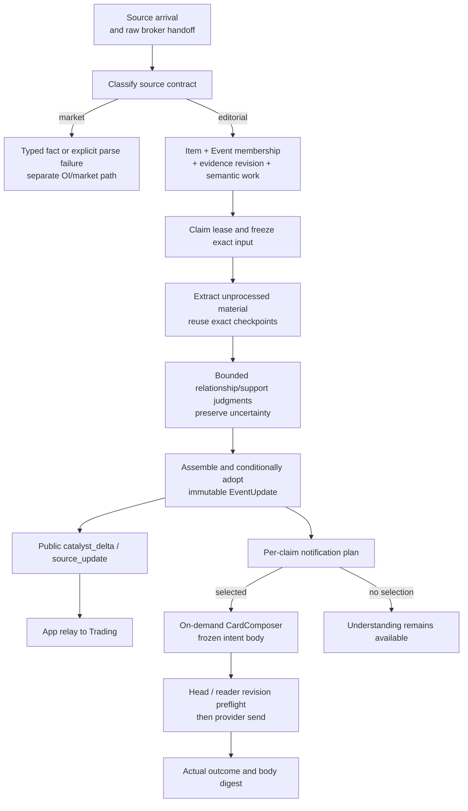
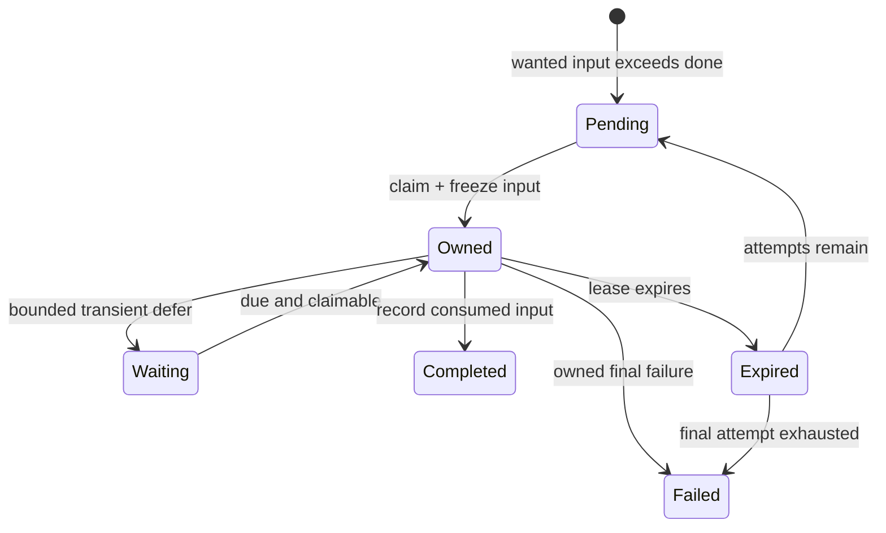
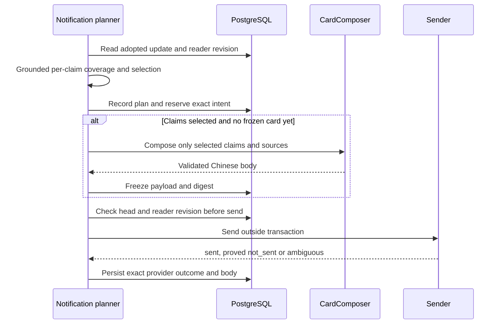

# News: incremental evidence, adopted knowledge and reader delivery

[Handbook](../README.md) · [Architecture](../ARCHITECTURE.md) · [OI](oi.md) · [Review](review.md)

Editorial News has one current understanding product: **EventUpdate**. It records
claims, evidence relationships, changes, implications and open questions. Semantic
processing, reader notification and the public Trading handoff are separate paths.
This page is their canonical behavior/identity reference; no second design document
or taxonomy manual overrides it.

## 1. Objects and implementation owners

| Object / owner | Responsibility |
| --- | --- |
| [Admission](../../tracefold/news/pipeline/admission.py), [events](../../tracefold/news/storage/events.py) | Preserve original Items, source identity, FactUnit focus, Event membership and new evidence revisions. |
| [Source/fact helpers](../../tracefold/news/events/), [source contracts](../../tracefold/news/source_contracts.py) | Deterministic source routing, extraction scope, grounding and candidate grouping. |
| [SemanticWorker](../../tracefold/news/pipeline/semantic.py) | Consume `news.triage` as task `news-semantic`, claim durable input work and attribute bounded failures. |
| [NewsAgent](../../tracefold/news/updates/service.py), [SemanticAnalyzer](../../tracefold/news/updates/semantics.py) | Incremental extraction/understanding, checkpoints, observations, assembly and conditional adoption. |
| [Typed update contracts](../../tracefold/news/updates/contracts.py), [judgments](../../tracefold/news/updates/judgment.py) | Exact claim, evidence, source, time, relationship and model-answer meanings. |
| [DSPy adapters](../../tracefold/news/updates/dspy_backend.py) | Structured extraction, generated/native narrow judgments and selected-card composition. |
| [NotificationPlanner](../../tracefold/news/updates/notification.py), [Notifications](../../tracefold/news/updates/service.py) | Compare actual reader coverage, select claim refs, compose/freeze a card and settle its send. |
| [Storage](../../tracefold/news/storage/event_updates.py), [port adapter](../../tracefold/news/storage/event_update_store.py) | Revision/lease predicates, immutable adoptions, notification state, receipts and scoped retry. |
| [Delivery loop](../../tracefold/news/pipeline/delivery.py), [App composition](../../tracefold/app/workers/wiring/news.py) | Existing supervised polling, provider adaptation and role wiring. |
| [Public facts](../../tracefold/news/updates/public.py), [App mapping](../../tracefold/app/news_updates.py) | Deterministic card-independent public updates for Trading. |
| [Update read model](../../tracefold/news/update_view.py) | Present adopted content, input progress, planning and actual delivery separately. |

An Item ID, source revision occurrence, semantic input revision, adopted content
revision, claim ref and delivery intent ID identify different things. No clock or
hash can be substituted for another solely because both increase or look unique.

## 2. End-to-end data flow

Adoption commits the update, public outbox and notification work together. It does
not wait for Chinese copy or a provider send. Failed copy/delivery cannot retract
already adopted semantics or prevent the independently committed public handoff.
An OI measurement does not enter this editorial chain; see [OI](oi.md).

## 3. Input scope, identities and current source contributions

**Source revision occurrence is not content equality.** An Item-local sequence and
predecessor distinguish A → B → A from an exact retransmission of current A. The
receiver's immutable observation clock orders local arrivals. Publication time is
not a provider edit version; a later arrival of older text is a local observation,
not proof that the upstream author restored it.

**FactUnit scope is deterministic, not another Agent.**
[facts.py](../../tracefold/news/events/facts.py) splits only sufficiently clear,
contiguous explicitly numbered material, retaining shared lead context. A clock
such as `10:30` is not a story number. Other inputs remain whole-item material.
A changed body uses the old extraction scope as a comparison target, never old
character offsets to slice a newly edited body. Only the frozen supplied evidence
can be cited.

**Grouping recalls candidates; it does not decide claim equivalence.** Exact keys,
source-artifact identity and bounded token/MinHash near matching operate within the
source/Event contract. Related prior claims are ranked against new material before
their budget is applied. A shared name, same ticker or high text similarity alone
is not proof that two propositions are equivalent or already reported.

**Only unprocessed material is extracted in a turn.** Existing adopted claims and
questions remain comparison context. Successful no-claim material still records its
analyzed evidence refs, so a new member does not trigger repeated extraction of all
old bodies. Several arrivals while an owner is working can coalesce into the next
wanted revision.

**Current contribution is one version per source record.** Old and corrected
attribution for the same source cannot be counted as independent corroboration.
Source replacement can remove its former support/authority even when its new body
yields no claim. Missing support judgment becomes unresolved, not invented refutation.
Historical evidence remains available for attribution, not duplicate support.

Grounding still uses structured provider candidates, explicit cashtags and the
existing collision/commodity rules in [gate.py](../../tracefold/news/events/gate.py)
and [grounding.py](../../tracefold/news/events/grounding.py). The model identifies
typed primary versus mentioned assets. An unknown asset type remains unknown;
text grounding, catalogue existence and a verified executable native route are
three different questions.

## 4. Agent work, deterministic assembly and source authority

| Stage | What the model may answer | What remains code-owned |
| --- | --- | --- |
| Extraction | Claims, supported conditions/timing, exact source-language citations and optional hints | Input scope, available refs, schema/citation validation and durable checkpoint identity |
| Understanding | Mode, phase, content kind, relation, support, topic and other narrow questions | Task options, input/model cache key, bounded batches, uncertainty and adoption rules |
| Reader planning | Actual sent-body coverage and other grounded narrow readings | Per-claim selection reasons, overlap handling, revision preflight and intent identity |
| Card composition | Chinese explanation for the selected adopted claims | Selection itself, source refs, no-link/plain-text contract, frozen payload and send outcome |

These are native DSPy boundaries in `dspy_backend.py`, not the retired fixed
three-predictor Program. The default judgments are generated. An optional
`llm.news_judgment` route uses the existing Jev/System One SDK with DSPy Choice/Noul.
Successful native answers are reused, not voted on by another model; an unavailable
native batch can use its corresponding generated fallback. Cache identity includes
the task, exact input and model identity.

**Physical call count is variable.** Checkpoint/cache hits, multiple claim/prior
comparisons, missing answers, optional stored-source reading and whether any card
is selected all affect calls. Stage and physical-call budgets remain in the service
and judgment owners. A configured model name or a logical step count is not a receipt
of how many requests actually ran.

Generated requests use short local aliases mapped back to durable refs. Invalid
core claims/citations fail. Invalid optional relationship/support/gap proposals
are diagnosed and omitted without erasing valid claims or existing questions.
Resolving an actually supplied question still requires grounded citations. One
cached clarification of unknown mode belongs to understanding, not notification;
unresolved mode remains unknown. Unknown comparisons can yield `possible_new`,
not a fabricated catalyst.

Assembly carries unaffected claims, implications and questions forward. Omission
is not an instruction to retract a claim or close a question. Explicit grounded
resolution or retirement of its underlying claim is needed. New documents use
`news_event_update_v2`; original v1 documents retain their immutable identity.

The optional extra read chooses only a supplied stored News target, with one durable
reservation per lineage. It is not arbitrary browsing, a general tool loop, or an
opportunity to reset its budget after a retry. Its failure cannot undo adoption.

### Topics and cited source authority

[updates/topics.py](../../tracefold/news/updates/topics.py) pins the IPTC Media Topics
codebook used for navigation/presentation. An update may carry up to three known
qcodes, without simultaneously selecting a broad parent and pinned descendant.
Topics are contributed by active claims; retired/superseded claims do not keep a
stale topic alive. Topics do not collapse the update into one semantic event type.

[taxonomy.py](../../tracefold/news/taxonomy.py) now owns **cited source authority**,
not the removed four-axis taxonomy. It uses structured source names/handles and
HTTP hostname boundaries, not fuzzy text or a strategy ID. Values are
`regulatory_filing`, `issuer_first_party`, `reputable_secondary` and `unknown`.
Authority attaches to a cited Source, not a rank inherited by an entire Event.
A source can establish that it made a claim without verifying a third-party
allegation or future outcome. Independent support remains a separate relationship.

## 5. Work progress and recovery

These labels explain work predicates; they are **not** a new `Event.status` enum.
`news_semantic_work` owns wanted/done revision, owner token, attempts, due time and
lease. The last valid EventUpdate head remains independent. Completing unchanged
input advances progress without inventing another content revision.

Checkpoint identity hashes the full frozen input and comparison context, not just
body text. Extraction/understanding checkpoints and semantic observations are
insert-only. Adoption checks the owned lease and head compare-and-swap. An older
observation cannot move a newer head backward. A still-owned older revision may
finish while newer work waits without spending or clearing the newer budget.

Final-attempt exhaustion is exposed only after its lease expires, never while its
worker still owns a valid lease. Current failure/defer writes for notification and
card work also name the content revision; stale failures cannot postpone a successor.
These predicates are in [event_updates.py](../../tracefold/news/storage/event_updates.py).

| Independent dimension | What to inspect |
| --- | --- |
| Semantic input | Wanted/done revision, lease, attempts, next attempt and failure code |
| Adopted knowledge | Immutable update observations/content and current head |
| Notification planning | Current content revision, plan action/reasons and planner retry budget |
| Card and external result | Exact intent, frozen payload, generation attempts and actual send ledger |

No agent configured can leave durable input pending even when its wake was
acknowledged. Janitor repairs due wake work and exposes crashed exhausted attempts.
A semantic failure is not “no news value”; a plan with no selection is not an outage;
a completed planner with a dead card is not a successful notification.

`news retry-work` reopens only its exact failed target. Semantic retry takes the
wanted input revision; notification retry takes the current exhausted content
revision; card retry additionally requires a dead **unsent** intent. Any existing
send ledger blocks card reopening, including terminal or ambiguous results.
Card retry does not reset an independently exhausted planner. Prompt deployment
does not trigger historical replay. Exact commands belong to
[Operations](../OPERATIONS.md#3-news-identify-the-failed-version-before-retrying).

## 6. Reader coverage, selection and actual delivery

The planner compares claims against **actual sent bodies**. It recalls candidates
using explicit antecedents and current claims/source-language quotes, then ranks
receipts before applying the bounded model budget. An old leader title is only a
fallback; the newest card from another Event can omit an earlier sent proposition.
Similarity, selected IDs or an in-flight intent do not prove the reader was told.

Only full coverage suppresses a proposition as already received. Partial coverage
is not full; in-flight/ambiguous sends block overlap without being successful
receipts. Commentary, promotion, forecast, schedule-only material, unsupported
price reports, stale sources, watchlist exceptions and unknown mode have explicit
claim-level reasons. Unknown mode is not an indefinite quality-approval queue.
`key` is a presentation flag requiring the implemented change/topic/corroboration
conditions, not proof of truth or permission to trade.

The stable intent binds adopted content and selected refs. Sending rechecks the
head and reader revision, including explicit cross-Event correction/replacement
targets even when the card's own head stayed unchanged. Frozen copy is not silently
rewritten during send.

A proved retryable `not_sent` can reuse the intent under its existing budget.
`ambiguous` is not blindly resent. Sender outcomes, persisted ledger states and
queue states are different contracts: a terminal external failure may leave a
`dead` queue record that is **not** eligible for unsent-card recovery because its
send ledger already exists.

## 7. Example: commitment, repetition, execution and correction

Suppose a source reports “Acme will open a plant if approval arrives.” The adopted
claim retains the commitment, condition and supported time precision; it does not
establish an operating plant. A second source repeating it can add attributable
evidence without another catalyst or another fully covered notification.

A later report that the plant actually opened can establish a real-world/phase
change. An explicit retraction of the original report is instead a correction.
News adopts these distinctions independently of card generation.
[public.py](../../tracefold/news/updates/public.py) emits a `catalyst_delta` for
qualifying changed claims or `source_update` for a published ancestor amendment.
Restatement and unresolved `possible_new` are not manufactured fresh catalysts.

[Trading](trading.md) records amendments before target selection, without a new
Case or TTL. It can refuse a not-yet-submitted entry against a corrected cited
proposition; the amendment is not an account-close command. This example is
illustrative, not an observed news item or execution receipt.

## 8. Verification entry points

[Input scope](../../tests/news/test_news_update_input_scope.py),
[semantic worker](../../tests/news/test_news_semantic_worker.py),
[revision ownership](../../tests/integration/test_news_revision_ownership.py),
[update store](../../tests/integration/test_news_event_update_store.py),
[semantic pipeline](../../tests/integration/test_news_semantic_pipeline.py),
[notification decisions](../../tests/news/test_news_event_update_notifications.py),
[delivery](../../tests/integration/test_news_update_delivery.py), and
[Trading amendments](../../tests/integration/test_trading_analysis_public_updates.py)
exercise different boundaries. Test success does not establish model accuracy,
production notification quality, provider completeness or trading profitability.
