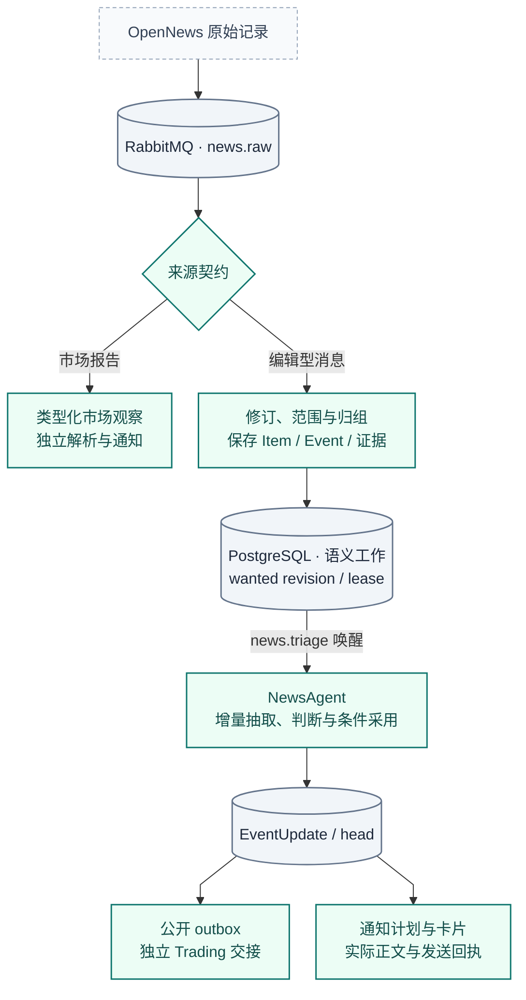
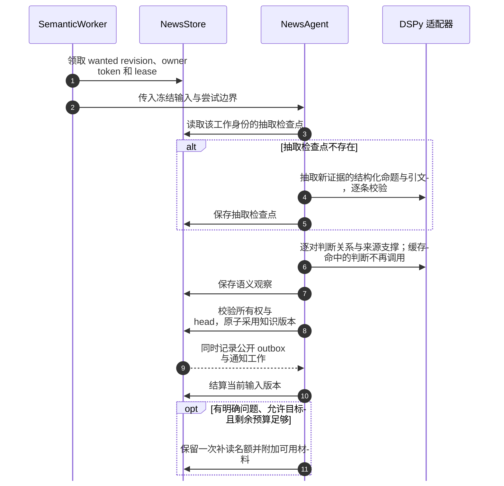
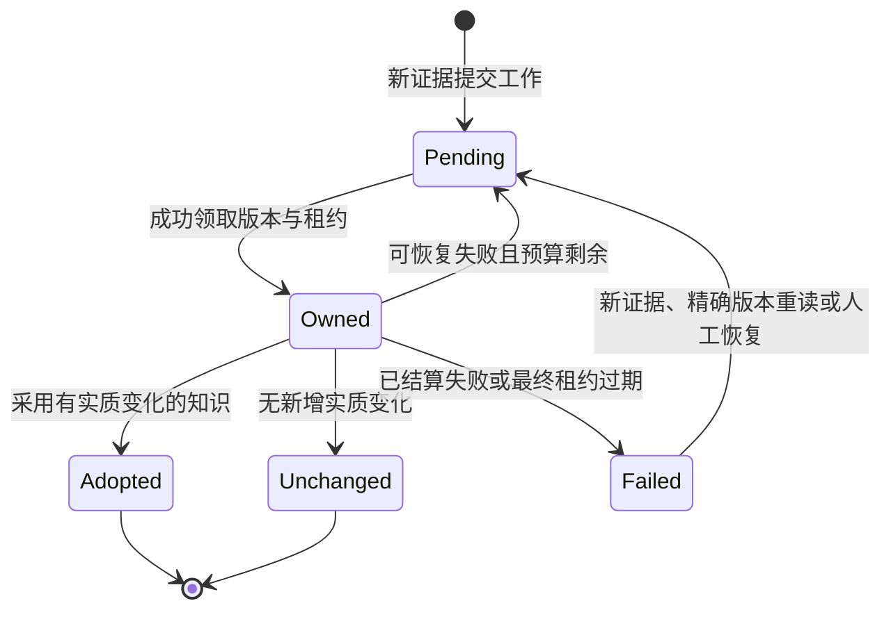
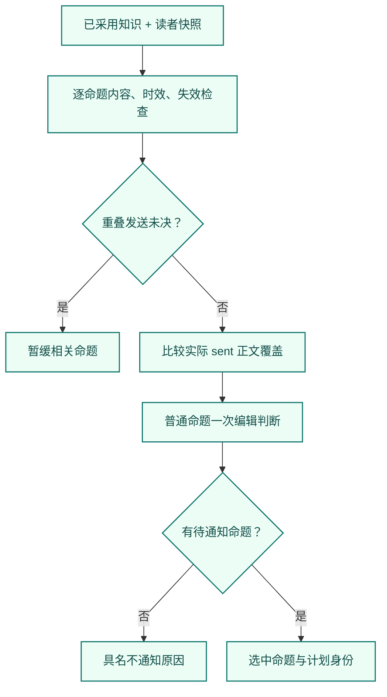
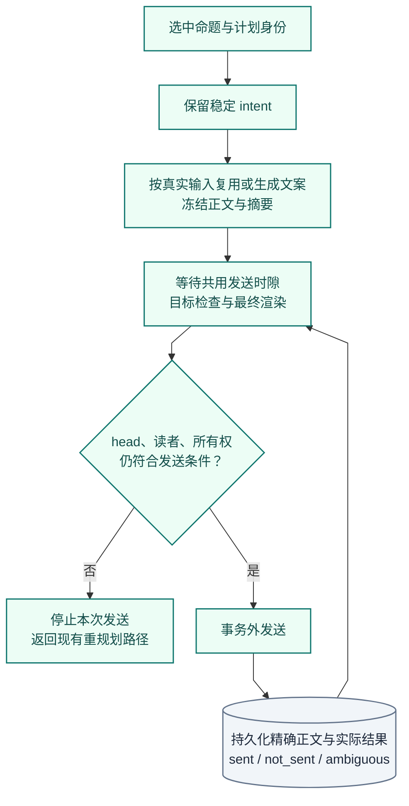

# News：增量新闻理解与独立通知

[手册](../README.md) · [系统架构](../ARCHITECTURE.md) · [OI](oi.md) · [交易研究](trading.md) · [排障](../OPERATIONS.md#news-retry)

News 不只是“把标题交给模型打分”。当前编辑型链路以 **来源修订 → 冻结输入 → 命题理解 → EventUpdate 采用 → 独立通知** 为主线。它分别保存来源说了什么、系统理解了什么、读者实际收到什么。

| 模块速览 | 说明 |
| :--- | :--- |
| **定位** | 信息产品 / 编辑型新闻 |
| **运行位置** | Workers · news-semantic 与独立通知续接 |
| **输入 → 产物** | 来源 Item、修订、冻结证据与 prior claims → EventUpdate、逐命题通知计划、实际回执、公开 outbox |

> [!IMPORTANT]
> 理解、采用和通知分别完成。通知失败不回滚知识；卡片也不是 Trading 的事实来源。

| 所有者 | 主要职责 |
| --- | --- |
| [receiver.py](../../tracefold/news/pipeline/receiver.py)、[recovery.py](../../tracefold/news/pipeline/recovery.py) | 接收 OpenNews，记录中断与有界恢复，将原始输入交给 broker |
| [admission.py](../../tracefold/news/pipeline/admission.py) | 区分来源契约，保存 Item、确定性拆分和 Event 归组，提交证据与语义工作 |
| [events](../../tracefold/news/events/) | FactUnit 范围、grounding、准入、身份、标题 / token / MinHash 候选匹配 |
| [semantic.py](../../tracefold/news/pipeline/semantic.py) | 消费语义唤醒，领取版本工作、执行尝试、退避、熔断与失败结算 |
| [updates/service.py](../../tracefold/news/updates/service.py) | `NewsAgent` 编排、采用与可选补读；`Notifications` 独立续接 |
| [semantics.py](../../tracefold/news/updates/semantics.py)、[judgment.py](../../tracefold/news/updates/judgment.py) | 引文校验、命题比较、有限问题、内容组装 |
| [dspy_backend.py](../../tracefold/news/updates/dspy_backend.py) | DSPy 抽取、中文文案、生成式判断与原生有限选项判断 |
| [notification.py](../../tracefold/news/updates/notification.py)、[attention.py](../../tracefold/news/updates/attention.py) | 已采用命题的编辑判断、实际正文覆盖、稳定意图与冻结卡片 |
| [event_update_store.py](../../tracefold/news/storage/event_update_store.py)、[event_updates.py](../../tracefold/news/storage/event_updates.py) | 短事务、检查点、不可变更新、head 条件采用、计划和发送账本 |
| [public.py](../../tracefold/news/updates/public.py) | 从已采用知识生成公开更新，不依赖读者卡片 |
| [delivery.py](../../tracefold/news/pipeline/delivery.py)、[maintenance.py](../../tracefold/news/pipeline/maintenance.py) | 通知轮询、真实投递、补唤醒与有界保留清理 |

[通知判断](#notification) · [输入身份](#input) · [Agent](#agent) · [状态恢复](#state)

<strong>本页目录</strong>

1. [端到端数据流](#section-端到端数据流)
2. [一条 News 为什么可能对应多个 Event](#section-一条-news-为什么可能对应多个-event)
3. [NewsAgent 到底做了什么](#section-newsagent-到底做了什么)
4. [主题、来源与知识版本](#section-主题来源与知识版本)
5. [状态必须分三层理解](#section-状态必须分三层理解)
6. [什么决定一条新闻是否推送](#section-什么决定一条新闻是否推送)
7. [一个具体更新例子](#section-一个具体更新例子)
8. [验证与排障入口](#section-验证与排障入口)
9. [源码责任地图](#section-源码责任地图)
10. [常见误解](#section-常见误解)

## 01 · 端到端数据流

*数据流 · 圆柱表示持久队列或账本；采用、公开转交和发送是不同边界。市场分支不经过编辑型 Agent。*

PostgreSQL 保存可恢复工作；RabbitMQ 的语义消息只是唤醒。准入事务先提交，再发布唤醒并记录发布状态；进程在这几步之间崩溃，由维护任务重新唤醒。它不是 PostgreSQL 与 RabbitMQ 共享一个事务。

## 02 · 一条 News 为什么可能对应多个 Event

### Item、FactUnit、Event 与 Claim

| 对象 | 含义 | 不能混淆的身份 |
| --- | --- | --- |
| Item | 一条提供商记录；保留原始内容与来源信息 | 不等于某一条模型命题 |
| Item revision | 同一记录后续观察到的正文版本，带修订顺序和前驱 | 不等于正文哈希；A → B → A 是三个版本出现 |
| FactUnit | 从一个明确编号汇总中切出的独立输入范围 | 不等于“每句话都拆成一个 Event” |
| Event | 准入层维护的一组相关来源证据 | 不保证只包含一个 Claim，也不是全局故事百科 |
| Claim | 带字段、资产角色、原文引文与稳定引用的命题 | 不等于标题、卡片或一个 ticker |
| EventUpdate | 一次已采用的知识版本，包含命题、关系、变更与问题 | 不等于一次模型请求或一次推送 |

[extract_fact_units](../../tracefold/news/events/facts.py)只拆**至少三个连续、显式编号块**的高置信度汇总。编号后的连续段落保留在该 FactUnit 范围内，列表前后的公共限定保留为共享上下文；事实身份仍由编号锚决定，不随续段增长而改变。不满足该结构时保持一个整体输入，其事实身份只由记录决定：同一记录改了标题是同一事实的新版本，不另开 Event。时间、金额和一般段落不应被当作编号列表拆分。

因此，“一条提供商消息 → 多个 FactUnit → 多个 Event”在当前实现中是有条件的；与此同时，**一个 EventUpdate 本身可以包含多条 Claim**。系统没有让 LLM 自由把每句话扩张成一个独立 Event。

更新已有消息时，系统按既有范围及修订关系读取证据，不把旧正文的字符偏移硬套在新正文上。[唯一阅读投影](../../tracefold/news/updates/projection.py)按本轮来源版本定位任务片段；定位不唯一时展示完整来源。模型只收到该视图，完整 Evidence 仍保存。引用必须同时出现在本轮一个连续可见片段和对应冻结来源中。

编号列表的最后一条任务与其后连续正文构成一个可引用片段；若该任务不是当前 Event 的事实，后文仍只作为共享上下文。更正历史归属时，`scope_retraction` 在新的 EventUpdate 中退休误归属 Claim，并向 Trading 发布 `source_update`；修复证明独立记在 `news_head_scope_repairs`，不伪造模型观察，也不改写旧 EventUpdate、来源或发送回执。修复与语义采用共用 Event 锁及提交路径；按 Event/head/proof 有界执行。纯修复不重新打开已完成的通知工作，也不重置尝试数；仍 pending 或已 `failed` 的工作转向修复后 head，失败工作之后按新 head 定向重试。精确命令见[运维指南](../OPERATIONS.md#历史编号事实的-head-归属清理)。

### 命题身份不随每次关系变化重建

Claim ref 指向一个命题或真实世界中的一次发生。新增支持、来源、跨 Event 冲突或更正关系可以改变 EventUpdate，但不必创建另一个 ref；组装时仍保留关系和证据增量。显式 A → B → A 的状态转换则保留不同发生身份，不能因为字段重新相等就吞掉最后一次动作。

对于同一 Event 中两路来源携带完全一致的被引全文，即使关系模型误判为 `unrelated`，只有命题 statement 相同、没有新增数量 / 发生转换，且结构化身份检查无冲突时，才允许窄范围复用旧 Claim。它不是只凭相似标题跨 Event 去重。

### 准入与候选归组不是语义裁决

[Gate](../../tracefold/news/events/gate.py)与[准入](../../tracefold/news/pipeline/admission.py)负责确定性证据、grounded assets 与队列优先级。来源标签、显式 cashtag、交易标的目录与规则匹配各有作用；并非所有实体都由一次模型调用凭空产生。

精确身份和有界近似匹配用于找到可能归到一起的输入。强事实如 ticker、数字及 token 兼容性可以阻止错误合并；MinHash、标题相似或同一个资产只能帮助召回，**不能证明两个命题相同**。真正的等价、补充、更正与阶段变化在 Claim 层判断。实时稿只按文本并入已准入的 Event：断线补抄开出的 recovery Event 不产生语义、卡片或 catalyst，不能吞掉之后的实时稿；补抄稿仍可并入它作为历史。

证据快照记录成员的来源、策略与 provenance，但只有语义材料变化（任务范围、成员记录与事实、正文修订、grounded assets）才请求语义工作；同一记录换策略重发只更新快照，不触发空转。

原始市场报告走单独的 `admit_market_item`：保存 Item 与解析结果，不创建伪 Event，不走编辑型 Gate / MinHash / 语义链路。

## 03 · NewsAgent 到底做了什么

*时序 · 展示一次能够采用的正常尝试。缓存命中、无变化、重试与 head 冲突会改变实际调用数量。*

### 冻结输入与增量范围

冻结输入绑定 Event、输入修订、证据范围、prior claims、候选关系、来源时钟以及程序 / 模型身份。prior claims 只取**当前有效**命题（未被更正退休、未被真实变化替代），先本 Event，后召回的相关 Event；“当前有效”只由 `EventUpdate.current_claims` 一处推导。输入身份 `input_sha` 只含本 Event 的命题：相关 Event 再次采用不改变身份，重试复用已保存的抽取，只重问比较（答案按内容缓存）；相关 Event 的命题也不进入抽取输入。每个来源的当前 Event 阅读范围产生 `read_ref`，由任务边界、实际片段和投影版本决定。先构造阅读视图再比较已处理的 `processed_read_refs` 与已隔离的 `failed_read_refs`；同一来源新增范围或条件仍需处理，重投相同任务不重算。旧命题用于比较与延续，不是每次把全部历史成员重新抽取。

“读过但没有命题”的材料也必须记入任务级处理身份。否则同一段空内容会不断进入下一轮。没有新证据或没有实质变化，可以推进 done，而不制造新的内容版本；首个版本没有命题时不采纳 EventUpdate。以失败结束的修订把它读过的范围隔离，之后的新成员只读新材料。对已完成或已失败、确认需要重读的 Event，使用精确 wanted/head/read 身份的 `news reanalyze`；它不伪造来源修订或自动重发历史通知。

来源修订使用**本地观察顺序、修订序号和前驱**，不把提供商发布时间猜成可靠的编辑版本号。同一来源的新旧正文可以同时作为历史证据保存，但当前支撑判断只采用该来源的当前贡献，不能把转载或同源修订算成多个独立证实。

### 抽取、判断与采用各司其职

| 步骤 | 模型承担的工作 | 代码承担的工作 |
| --- | --- | --- |
| 抽取与理解 | 同次给出命题、条件、数量、资产角色、时间、引文、`mode`、`phase`、`content_kind`、逐命题主题与证据支撑提示；不比较旧命题 | 逐条检查结构与引文：不可用的读数（如 `300亿` 这类非十进制数量、未知 phase）只从该命题去掉，坏命题丢弃并记原因，其余照常；引文容忍大小写与空白差异，保存来源原文片段 |
| 比较 | 每条新命题与每条当前有效的旧命题逐对判断等价、补充、更正、替代、冲突，以及证据支撑关系；抽取不给关系提示 | 排除已能证明的数字 / 语气矛盾，验证目标 refs 与候选身份；核对更正 / 替代的时间先后；冲突只注释新命题，不吞掉其 catalyst；同一冲突只在首次建立时发布 |
| 组织 | 提议影响机制与未解问题 | 验证支持关系；区分事实与条件性推论；延续未被显式改变的知识 |
| 采用 | 不直接写数据库 | 组装 EventUpdate，保存观察，检查 owner / lease / head 后条件采用 |

当前独立判断任务包括 `relation`、`support`、`coverage`、`next_read`。`coverage` 属于通知续接，而非语义采用的必经审批；并非每条消息都需要全部任务。关系始终逐对判断：#742 曾重放“先分诊、再细判”，在本地生成式模型上无法做到关系召回不降（通知侧读者新颖度依赖 `equivalent` / `adds_information` 链接，Trading 依赖更正与替代），且只省约 5% 调用，因此未采用。

可选原生判断通过 DSPy 的有限输出类型连接 Jev / System One。未配置该后端时使用生成式判断；已成功缓存的答案不再找另一个模型投票。一组问题的缓存读取是一条 SQL，每个批次的写入是一条 SQL；批次有界并行（至多 3 个），一个批次响应不可用只让它自己的问题不可得，不连累其他批次或整个修订。选项标签按大小写与分隔符规范化，无法识别的标签只让该条不可得。失败回退、批次与缓存身份由 [judgment.py](../../tracefold/news/updates/judgment.py)及 [DSPy 适配](../../tracefold/news/updates/dspy_backend.py)控制。

### 模型到底调用几次，为什么有延时

**不是固定三个 DSPy 节点，也不是一个 Event 只调用一次模型。** 一次语义尝试可能包含抽取、多个关系判断批次、缓存命中、回退，以及采用冲突后的缺失关系补算。Jev 抽取同时给出 mode、phase、content_kind 和每条命题的主题，不再对同一输入重复执行原生分类。通知阶段先比较实际已发正文覆盖，再对剩余普通命题进行一次 AttentionAssessor 判断；若有命题选中，再生成中文卡片。

| 预算 | 当前代码值 | 解释 |
| --- | --- | --- |
| 语义阶段 | 120 秒 | 一次 `NewsAgent.process` 的共享截止时间 |
| 通知模型阶段 | 60 秒 | 计划与卡片生成共享，不把外部发送等待算成同一次模型阶段 |
| 通知准备在途上限 | `news.push.notification_prepare_limit`，默认 2 | 只限制实际准备任务和就绪结果；进程唯一的发送时隙不占准备位置；快 Event 可先完成 |
| 生成调用预算常量 | 60 秒 | 具体适配使用的调用边界；不等于端到端保证 |
| 采用冲突尝试 | 2 次 | 处理 head 变化，不无条件重做已完成的抽取 |

数值来自 [service.py](../../tracefold/news/updates/service.py)。它们是上限，不是实际耗时、服务级别承诺或性能实测。排查延时需要拆开：**入队等待 → DB 领取 → 模型物理调用 → 判断 / 回退 → 采用 → 通知等待 → 发送**。把总耗时都称为“Agent 慢”无法定位根因。

提供商失败与内容不确定不同：非最终尝试中，关键关系 / 支撑判断无法取得会进入持久重试；最终尝试允许按契约保存 unresolved / `possible_new`，不能伪造“没有新闻价值”。程序错误和非法核心输出仍是失败。

生成输出具体区分 `news_generation_output_truncated`、`news_generation_output_empty` 与 `news_generation_output_schema_invalid`。已配置的 fallback 只有请求契约有实质差异时才可补答一次；固定契约或引用错误不再消耗相同请求的多轮语义重试。临时限流、超时、服务端和传输错误仍走有界恢复。错误日志记录错误类别与长度，不记录原始模型响应片段。

### 可选补读的边界

系统只能读冻结输入提供的目标，由实际 `ExistingSourceReader` 实现提供材料。它不是任意网页浏览器、shell 或自主搜索 Agent。一条 lineage 通过持久 reservation 限制一次补读，重试不能获得新名额；失败不能撤销已经提交的 EventUpdate、公开 outbox 或通知工作。

## 04 · 主题、来源与知识版本

[topics.py](../../tracefold/news/updates/topics.py)维护 IPTC 导航主题，最多保留三个，不同时保留冗余父子主题。当前 v2 将主题归属到命题并从有效命题汇总，避免已失效内容长期污染 Event 标签。

[taxonomy.py](../../tracefold/news/taxonomy.py)保留来源权威类别，例如 `regulatory_filing`、`issuer_first_party`、`reputable_secondary` 与 `unknown`，依据已识别的来源身份。来源权威不是对其引用的第三方说法进行独立核验，更不是交易指令。

当前 EventUpdate 使用 `news_event_update_v2`；0411 已清除退役 v1 所属 Event、旧 verdict / Review / 学习表。当前 ReviewDesk 处理通知决策反馈及外部漏报，不把旧四轴 taxonomy 或旧 Program 的 `fact_kind` 当作新 Claim 契约。

## 05 · 状态必须分三层理解

| 层次 | 记录什么 | 典型情况 |
| --- | --- | --- |
| 语义工作 | wanted / done 输入版本、owner、lease、attempt、due 和错误 | 最新输入待处理、暂缓或失败；最后一次尝试仍可能合法运行 |
| 已采用知识 | 不可变 EventUpdate、content revision、当前 head | 无实质变化不增加 head；失败不删除上一有效版本 |
| 读者结果 | 通知工作、逐命题计划、intent、冻结文案与发送账本 | 不通知、生成失败、等待发送、已发送或结果不明 |

下面是**恢复过程的概念状态图**，不是完整数据库枚举：

*概念状态 · 标签帮助理解工作结果，不是新增 Event.status，也不把“采用”当成“已发送”。*

`/api/news/status` 分别报告可领取的 `semantic_pending`、等待调度的 `semantic_deferred`、持有有效租约的 `semantic_in_progress` 和终结的 `semantic_failed_exhausted`。失败工作不再计为可运行 pending，并保留真实尝试次数（一次性的契约错误不伪装成用尽三次）；这些是有界工作集的状态计数，不是模型调用数。控制台把失败显示为“解析失败”并附中文原因与错误码；仍有失败待处理时模型健康至少为 warn。

以失败结束的修订（含 Janitor 结算的崩溃最终尝试）只隔离该次尝试实际送入的任务范围，之后的修订不再重复送入；尝试开始后才加入的新成员不受影响，照常抽取与采用。构建冻结输入本身失败时只让该 Event 的工作失败，不让语义消费者故障。

采用只有带新通知义务的变化（`new_fact`、`possible_new`、`parameter_change`、`phase_change`、`scope_change`、`correction`、`conflict`）才新建或重置通知工作；只新增证据、复述或空更新不建工作，但尚未完成的通知工作照常转向最新 head，保留已用尝试。

最终尝试仍持有有效 lease 时，Janitor 不能将它判为耗尽；只有崩溃且 lease 已过期的最后尝试才应被终结。旧版本的延后 / 失败结算不能消耗新版本预算，也不能推迟后继工作。

没有模型配置时，Worker 可以确认 broker 唤醒但保留 PostgreSQL 中待处理工作；这不代表已完成理解。更换模型、提示词或镜像不会自动重放所有已处理证据，也不自动重置耗尽预算。

## 06 · 什么决定一条新闻是否推送

决定者是 **`NotificationPlanner.plan`**，输入是已采用 EventUpdate、读者观察名单、实际已发送正文及未决发送状态。它为**每条 Claim**给出 `notify` / `not_notified` / `deferred` 与具名原因，不输出一个隐含的全局“重要性分数”。有效且未覆盖的普通命题交给单次 AttentionAssessor，按[编辑简报](../../tracefold/news/updates/editorial_brief.txt)分别给出 `notify`、`key` 或 `feed_only`。

| 判断顺序与情况 | 当前行为 |
| --- | --- |
| 命题已退休、替代或被跨 Event 修订失效 | `retired`，不通知 |
| 主要资产命中读者观察名单 | 告知编辑判断以提高相关性；不能单独强制通知 |
| 评论、推广、预测、日程或数字 | 由编辑判断具体信息量；不能用固定类型或评分门槛代替 |
| 大幅市场变化例外 | 商品或指数主要资产的结构化百分比达到 5% 例外；不是所有个股涨 5% 都推送 |
| 来源过期 | 默认超过首次可用时间 12 小时不通知；明确 correction / conflict 有例外，不给交易来源续期 |
| 本 Event 的发送结果不明（`ambiguous`） | `send_outcome_ambiguous`，按可能已送达处理：不重发，也不阻塞其他命题 |
| 本 Event 的发送仍在进行（`sending`） | `send_outcome_unresolved`，暂缓相关命题；等待不计尝试 |
| 实际已发送正文完整覆盖 | `covered_by_sent_receipt`，不重复通知；部分覆盖不等于完整覆盖 |
| 尚未被上述规则排除 | 编辑逐命题选择；本地调用不可用时具名记录并默认普通通知 |

更正保留来源时效例外；上币公告与商品/指数至少 5% 的结构化日变化保留保护分支。准确规则顺序与例外以 [notification.py](../../tracefold/news/updates/notification.py)为准。

控制台显示逐命题判断原因；原因后面的 `×N` 统计具有该原因的命题数，不是报道数。

`key` 是编辑判断的重点展示标记，不是另一轮发送审批或仓位权重。

离线重放和显式真实模型对照使用 [eval_news_attention.py](../../scripts/eval_news_attention.py)；
本次有限样本的调用数、结果及测量范围见 [#725 对照报告](../reports/issue-725-attention-2026-09-27.md)。

### 选择：哪些命题需要通知

*决策视图 · 同一计划可以包含不同命题结果；选中仍不等于已发送。*

### 发送：从意图到实际结果

*发送视图 · 复查不通过就停止本次发送；结果不明不能当作已证明未发送。*

### 正文、回执与重试

CardComposer 只收到选中 Claim 的 ref、statement、结构化 fields、精确引用和最少来源身份，而非完整来源全文或整个知识文档。中文表达必须保留对象、动作、数量、归因与阶段；标题压缩也不能把“宣称”写成“核实”、把“宣布”写成“已经实施”。冻结卡片仍检查 refs 与形状；约束和脚本回归不证明真实模型每次都翻译正确。

“选中了某条 Claim”不证明卡片正文完整表达了它。后续覆盖判断读的是当前 `update` 回执的**实际发送正文**，不是来源全文、计划选择集合或某个抽象“已推送 Event”标记；发送正文与摘要必须来自可核验的冻结卡片。

计划采用和发送前会在 Event 锁下核对 head 与 reader revision。reader revision 只摘要**本 Event 的相关回执**（本 Event 已送、与命题 ref 或前序 ref 相连、以及按文本相似召回的已送回执，各取 intent 与状态），加上本 Event 发送中 / 结果不明的命题、跨 Event 失效命题和观察名单；快照读到自身时间戳为止，两次 CAS 在短事务里读已结算的全部。无关 Event 的发送不再使计划或就绪卡片失效，相关的新发送必定使其失效。判断先于 reader 检查写入不可变决策，输家计划的编辑判断下一轮直接复用；与上一轮完全相同的计划就是同一决策行，不追加记录。重新租约时 intent 改绑当前决策。

正文冻结后不因后台新材料到来而改写已开始的发送。适配器区分 `sent`、`not_sent`、`ambiguous`；目标预检只读，任何预检失败都是可重试的 `not_sent`，且不经过 `sending` 行；未进入提交边界的准入超时同样是 `not_sent`。只有已证明未发送且可重试的结果才按原意图重试。已知结果的结算使用同一结果重试，队列或账本保留 lease 与结果身份，即使发送回执后续补充也可验证重复结算；旧 lease 的迟到结果不能结算下一次发送。结果不明不能伪装成功，也不能直接再发一份。

通知准备保持有界并持续补位，最终发送由单个结算者串行执行。一个 Event 的准备失败（包括数据库暂时无法应答）只影响该 Event，不会取消另一个 Event 正在进行的发送；发送由自身持有到结算。停机时不再接新准备，已在途的发送有界等待结算后再退出，就绪但未发送的 intent 释放。进程启动时以及运行期间每 30 秒，把超过 60 秒且无本进程所有者的 `sending` 行对账为 `ambiguous`，并完成它所属的计划。

每次判断保存不可变决策输入与逐命题结果，通知工作和 intent 引用该决策。决策的 `plan` 同时记录比对过的已送回执（`compared_receipts`：intent 与正文摘要）和计时（`timings`：到期、开始、快照 / 覆盖判断 / 编辑判断耗时、完成时间），决策行 `created_at_ms` 即写入时间；发送账本的 `history_context.timings` 记录卡片开始 / 结束、就绪时间与等待发送时隙的时长。采纳 → 决定 → 发送的各段耗时因此可直接用 SQL 从库中取数。编辑评估按实际候选、来源、watchlist 和编辑器身份复用；文案按选中命题的完整表达材料和文案器身份复用；最终计划仍按当前 reader/head 重新检查。模型不可用的默认通知会记录状态和错误码，不将数据库、配置或外层期限故障伪装成编辑判断。

通知工作状态为 `pending` / `done` / `failed`。只有真实失败才计尝试：规划异常计入工作尝试；卡片失败与可重试 `not_sent` 计入 intent 尝试。第三次失败使工作进入 `failed` 并记录 `last_error_code`，不再自动领取；等待本 Event 在途发送、CAS 失败或数据库暂时无法应答都不计尝试。精确恢复命令及限制见[运维指南](../OPERATIONS.md#news-retry)；任何已有发送账本的 intent 都不能通过 `retry-work` 重开。

## 07 · 一个具体更新例子

以下是**说明流程的虚构消息**，不是测试执行结果，也不承诺模型一定作出正确判断。

| 输入时刻 | 来源变化 | 应阅读的系统事实 |
| --- | --- | --- |
| T0 | 公司甲宣布工厂将在下月投产 | Claim 是“宣布未来行动”，不是“已经完成投产”；EventUpdate 保存引文和阶段 |
| T1 | 另一媒体复述同一公告 | 可能增加来源证据；命题等价不自动产生新的交易催化；已发正文完整覆盖时不重复通知 |
| T2 | 原记录增加“首期产能为 10 万件” | 保存 Item 修订并抽取新增范围；形成可定位的新增数量 / 条件，独立判断是否通知 |
| T3 | 公司更正为“5 万件” | 更正明确指向旧 claim refs；保留原有历史，生成适用的 source_update |
| T4 | 公司宣布实际投产 | 这是动作阶段的新证据，不能仅凭日历到达就提前推断 |

T2 的卡片生成失败不应回滚 T2 的知识；T3 更正不会改写 T0 冻结的研究 Case，也不会自动平掉账户现有仓位。

## 08 · 验证与排障入口

先定位 `event_id`、来源修订、wanted / done、content revision、intent，再看[输入范围](../../tests/news/test_news_update_input_scope.py)、[语义 Worker](../../tests/news/test_news_semantic_worker.py)、[通知规则](../../tests/news/test_news_event_update_notifications.py)以及[修订存储](../../tests/integration/test_news_revision_ownership.py)、[EventUpdate 存储](../../tests/integration/test_news_event_update_store.py)、[发送集成](../../tests/integration/test_news_update_delivery.py)。

前端通过新闻流与 Event 详情读取这些维度；历史回执按其真实版本展示，不由 UI 合成当前命题。列表计数与卡片成功率、语义采用率的分母不同，不应混算。

代码测试证明状态、身份、引用与副作用边界；真实新闻理解质量仍需独立复核。保留的[ReviewDesk / 校准](review.md)不是自动优化发布系统。

[Issue 717 固定窗口与离线回放记录](../reports/issue-717-hourly-comparison-2026-09-27.md)保存 #718 对重复命题、实际发送与延时的历史比较。它不是本手册整理时重新执行的生产测试，也没有测得部署后的模型调用次数与延时改善。

## 09 · 源码责任地图

| 所有者 | 主要职责 |
| --- | --- |
| [receiver.py](../../tracefold/news/pipeline/receiver.py)、[recovery.py](../../tracefold/news/pipeline/recovery.py) | 接收 OpenNews，记录中断与有界恢复，将原始输入交给 broker |
| [admission.py](../../tracefold/news/pipeline/admission.py) | 区分来源契约，保存 Item、确定性拆分和 Event 归组，提交证据与语义工作 |
| [events](../../tracefold/news/events/) | FactUnit 范围、grounding、准入、身份、标题 / token / MinHash 候选匹配 |
| [semantic.py](../../tracefold/news/pipeline/semantic.py) | 消费语义唤醒，领取版本工作、执行尝试、退避、熔断与失败结算 |
| [updates/service.py](../../tracefold/news/updates/service.py) | `NewsAgent` 编排、采用与可选补读；`Notifications` 独立续接 |
| [semantics.py](../../tracefold/news/updates/semantics.py)、[judgment.py](../../tracefold/news/updates/judgment.py) | 引文校验、命题比较、有限问题、内容组装 |
| [dspy_backend.py](../../tracefold/news/updates/dspy_backend.py) | DSPy 抽取、中文文案、生成式判断与原生有限选项判断 |
| [notification.py](../../tracefold/news/updates/notification.py) | 逐命题通知规则、实际正文覆盖比较、稳定意图与冻结卡片 |
| [event_update_store.py](../../tracefold/news/storage/event_update_store.py)、[event_updates.py](../../tracefold/news/storage/event_updates.py)、[update_commit.py](../../tracefold/news/storage/update_commit.py) | 短事务、检查点、共用 EventUpdate 提交、head 条件采用、计划和发送账本 |
| [public.py](../../tracefold/news/updates/public.py) | 从已采用知识生成公开更新，不依赖读者卡片 |
| [delivery.py](../../tracefold/news/pipeline/delivery.py)、[maintenance.py](../../tracefold/news/pipeline/maintenance.py) | 通知轮询、真实投递、补唤醒与有界保留清理 |

## 10 · 常见误解

<strong>展开常见问题</strong>

**有 EventUpdate，为什么没有卡片？**

知识采用不等待文案。继续看逐命题计划、intent 和实际发送账本；来源数量增加也不必然产生新的通知。

**新来源复述同一说法，是否必然再推送？**

不必然。来源可以只增加证据；重复抑制看实际已发正文的完整覆盖，而非 Event 名称或相似标题。

---

[返回文档中心](../README.md) · [架构图谱](../ARCHITECTURE.md#atlas) · [返回顶部](#news增量新闻理解与独立通知)
