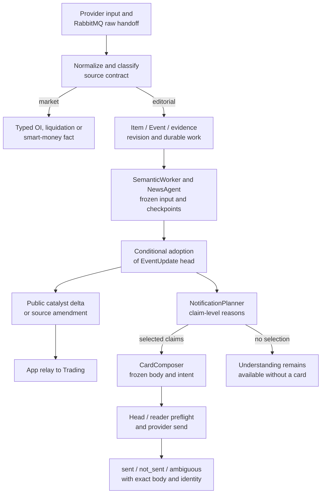
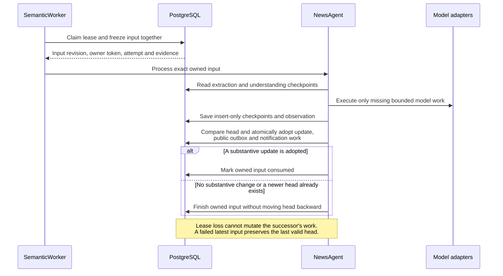

# News: versioned EventUpdates and independent notifications

[Handbook](../README.md) · [Architecture](../ARCHITECTURE.md) · [OI](oi.md) ·
[Review and calibration](learning.md) · [EventUpdate technical reference](../design/news-event-updates.md)

This guide describes main **after PR #711**. The editorial result is an adopted
`EventUpdate`, not the removed three-predictor Program's verdict. Understanding a
source, deciding what a reader needs, sending a card and offering a Trading
catalyst are different responsibilities with separate durable outcomes.

## 1. Objects and source owners

| Object / owner | Meaning |
| --- | --- |
| [Item and admission](../../tracefold/news/pipeline/admission.py) | Original source identity, observed material and attribution; editorial and typed market paths diverge here. |
| [FactUnit scope](../../tracefold/news/events/facts.py) | Deterministic extraction focus within an Item, preserving shared context rather than treating every line as a new story. |
| [Event membership](../../tracefold/news/storage/events.py) | Source grouping and candidate identity; near similarity does not establish claim equivalence. |
| [Evidence revision and semantic work](../../tracefold/news/storage/event_updates.py) | What changed, what input is wanted/done, and who owns the current attempt. |
| [FrozenInput, Claim, EventUpdate](../../tracefold/news/updates/contracts.py) | Exact citable inputs, stable Event-local claim refs, changes, source relations, implications and open questions. |
| [SemanticWorker](../../tracefold/news/pipeline/semantic.py) | Consume the existing `news.triage` queue, claim bounded work, run the Agent and attribute retry/failure. |
| [NewsAgent](../../tracefold/news/updates/service.py), [SemanticAnalyzer](../../tracefold/news/updates/semantics.py) | Checkpoint extraction/understanding, assemble content and adopt against the current head. |
| [NotificationPlanner and CardComposer](../../tracefold/news/updates/notification.py) | Per-claim reader decision, selected intent and on-demand Chinese copy. |
| [Deliverer](../../tracefold/news/pipeline/delivery.py), [store adapter](../../tracefold/news/storage/event_update_store.py) | Poll notification work, freeze/send the exact body and persist the actual outcome. |
| [PublicUpdate](../../tracefold/news/updates/public.py), [App mapping](../../tracefold/app/news_updates.py) | Card-independent catalyst delta or source amendment for Trading. |

An Item revision is not an Event's adopted content revision. A semantic observation
is not necessarily a changed head. A selected notification is not a sent receipt.
These distinctions are visible in the API rather than flattened into one status.

## 2. End-to-end flow

Market observations follow [their own contract](oi.md); they do not need an
editorial Event, model result or reader card. The same independence applies to
Trading: a card failure cannot retract an already adopted update or its public outbox.

## 3. Input scope, extraction and comparison

Admission records source-body or attribution changes as revisions. Content equality
and occurrence are different: an A → B → A sequence can be three local observations,
while an exact repeat of current material is idempotent. The receiver's immutable
observation clock orders local arrivals; publication time is not a provider edit
version, and a later arrival of old text does not prove an upstream restoration.

Fact splitting remains deliberately narrow: at least three contiguous explicitly
numbered blocks can become scoped FactUnits, with shared lead context. A clock such
as `10:30` is not a numbered story. Other material remains whole-item input.
For a changed body, its earlier extraction scope is a comparison target, not old
character offsets that can safely slice new text. Only frozen evidence is citable.

Each semantic turn extracts **new, not-yet-analyzed material**. Adopted claims,
questions and bounded related claims are comparison context. Successful progress
records consumed evidence even when it yields no new claim, so the next member
does not force extraction of the entire historical Event again. Arrivals during
an owned turn coalesce into the latest wanted revision for a following turn.

Matching has two responsibilities: deterministic exact/source/near matching recalls
Event candidates; semantic relation judgments decide equivalent, added information,
real-world change, correction, conflict, unrelated or unresolved propositions.
Neither shared vocabulary nor token similarity proves a restatement. Typed primary
versus mentioned assets are part of the claim; a cashtag and a venue route still
answer different questions.

## 4. Which steps use models, and which are code?

| Step | Actual owner | Boundary |
| --- | --- | --- |
| Extraction | [DspyExtractor](../../tracefold/news/updates/dspy_backend.py) | Native DSPy prediction of structured claims and optional hints, with source-language citations. |
| Understanding | [SemanticAnalyzer](../../tracefold/news/updates/semantics.py), [NewsJudgments](../../tracefold/news/updates/judgment.py) | Bounded mode/phase/content, relation, support and other narrow judgments; cache by task/input/model identity. |
| Assembly/adoption | [service.py](../../tracefold/news/updates/service.py), [storage](../../tracefold/news/storage/event_updates.py) | Carry forward unaffected knowledge, validate refs, create substantive revisions and conditionally advance the head. |
| Reader planning | [notification.py](../../tracefold/news/updates/notification.py) | Named code-owned selection rules using grounded claim readings and actual delivered-body coverage. |
| Card generation | [DspyCardComposer](../../tracefold/news/updates/dspy_backend.py) | Only for selected claims; it does not decide the Event's truth or Trading admission. |
| Sending/publication | [ports](../../tracefold/news/updates/ports.py), [public.py](../../tracefold/news/updates/public.py) | Explicit durable identities, preflight, provider receipt and deterministic public facts. |

The default judgment route is generative. Optional `llm.news_judgment` uses the
existing Jev/System One SDK and DSPy Choice/Noul adapter for narrow questions.
Successful native answers are reused without a second-model vote; unavailable
native batches can fall back to the corresponding generated judgment.

**There is no fixed three-call formula.** A turn can reuse checkpoints, require
several judgment batches, produce no changed content, or generate no card. Actual
calls depend on the supplied claims, prior comparisons, missing answers and cache.
Shared stage deadlines and individual physical-call limits bound the work; their
constants live in the service/judgment owners, not a separate config table here.

Core schema/citation errors fail the turn. Invalid optional hint/question proposals
are diagnosed and omitted without destroying valid claims. Unknown comparisons
can remain `possible_new`; an unknown mode remains unknown rather than becoming
a fabricated positive decision. One optional additional read uses a supplied stored
News target and a durable lineage reservation, **not arbitrary web browsing**.

## 5. Version-safe adoption and the three state dimensions

| Dimension | Stored meaning | Common misreading |
| --- | --- | --- |
| Input progress | Wanted/done revision, lease owner, attempt count, next attempt and failure | A semantic failure means the Event has no news value. |
| Adopted knowledge | Immutable content revisions and one current head | Every processed input must produce a new head. |
| Reader outcome | Plan, selected intent, card attempt and provider receipt | A completed plan proves the card was delivered. |

Checkpoint identity includes the complete frozen comparison context, not just the
new body text. Head compare-and-swap prevents an older observation replacing a
newer head. An owned older input may finish while newer evidence waits, without
spending the newer revision's attempt budget. Unaffected claims/questions carry
forward; omission is not an implicit retraction or question resolution.

Source-version selection prevents old/new attribution for the same record counting
as two independent confirmations. A publisher's authority does not verify every
allegation it quotes. Topic contributions follow active claims, not retired/superseded
ones. New documents are v2; immutable v1 history retains its original identity.

## 6. Reader coverage and side effects

Notification planning compares the selected propositions against **actual sent
bodies**. Related Events, claim refs and source-language quotes recall candidates;
similarity or a list of selected claim IDs does not itself establish coverage.
Only full coverage suppresses a claim as already told. In-flight or ambiguous
sends block overlapping work without being counted as successful delivery.

Commentary, promotion, forecast, schedule-only material, unsupported price reports,
watchlist matches and source evidence have named claim-level reasons. Unknown mode
is visible, not an indefinite quality-approval gate. The `key` presentation mark
requires the implemented content/topic/corroboration conditions; it is not a claim
of fact certainty or permission to trade.

Selected claim refs and the adopted update define a stable `intent_id`. The sender
rechecks both the Event head and reader revision, freezes the exact body/digest,
and records the provider result. A proved `not_sent` can retry that intent;
`ambiguous` is not blindly resent. Cross-Event corrections/replacements participate
in this preflight even when the card's own Event head did not move.

## 7. One hypothetical story across updates

A source says “Acme will open a plant if approval arrives.” The claim must retain
its commitment, condition and supported timing; it does not establish an operating
plant. A second source merely repeating it may add evidence without a new catalyst.
A later report that the plant actually opened can be a real-world/phase change.
A source retracting the original claim is a correction, not another bullish entry.

News adopts these differences before any card is composed. Trading receives a
structured `catalyst_delta` for eligible new changes, or `source_update` for an
amendment to earlier published knowledge. The latter records an amendment without
a new Trigger/Case or refreshed TTL. See [Trading](trading.md) for final-entry
invalidation and the explicit no-order-authority boundary.

## 8. Failure diagnosis and verification

Follow input revision → owned attempt/checkpoint → observation → adopted head →
notification plan → intent/body → actual receipt. A model outage can leave durable
work pending; an exhausted revision stays visibly failed. Janitor re-wakes due
work. Deploying a new prompt does not automatically reset failed work or recompute
historical adoptions. `news retry-work` requires the exact kind/revision and, for
card work, the exact unsent failed intent; see [Operations](../OPERATIONS.md).

Tests cover [input scope](../../tests/news/test_news_update_input_scope.py),
[revision ownership](../../tests/integration/test_news_revision_ownership.py),
[update store](../../tests/integration/test_news_event_update_store.py),
[semantic pipeline](../../tests/integration/test_news_semantic_pipeline.py),
[notification behavior](../../tests/news/test_news_event_update_notifications.py),
[delivery](../../tests/integration/test_news_update_delivery.py), and
[Trading public updates](../../tests/integration/test_trading_analysis_public_updates.py).
These do not establish model accuracy, delivery volume, cost reduction or profitability.
