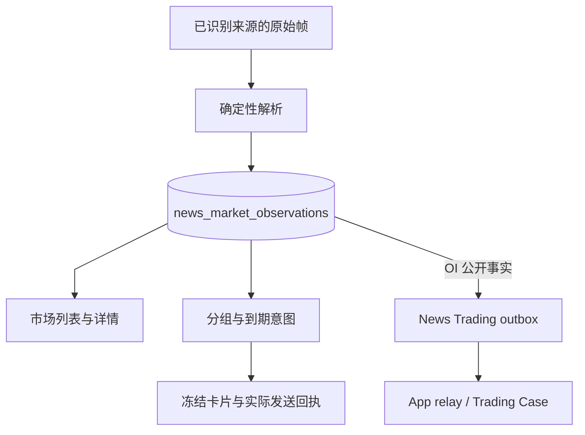

# OI 与类型化市场观察

[手册](../README.md) · [News](news.md) · [行情复盘](market-review.md) · [Trading](trading.md) · [Wallets](wallets.md)

OI、清算和大户报告是 News 的类型化市场事实，通过确定性解析和分组通知处理，不进入编辑新闻的 Event / Claim 语义流程。OI 可经公开 outbox 交给 Trading 独立分析；是否发通知不决定是否建立 Trading Case，OI 增长也不等于多头信号。

## 来源、解析与存储

来源分类以提供商 strategy ID 识别契约族，显示名改变不改变测量身份。OI 的 `oi_v1` 契约绑定 strategy `1019`，清算和大户报告使用各自解析器。未知市场来源或模板无法匹配时保留原始观察与具名解析原因，不补零、不送入模型猜测数值。

市场准入由 `pipeline/admission.py` 构建 `MarketObservation`，`storage/observations.py` 是 `news_market_observations` 的统一写入入口。`news_items` 只保存编辑新闻。相同 observation 身份的重放不改首次业务字段和解析状态；新增 provenance 只合并提供商策略元数据，相同帧不重复发布或更新数据库行。

Live 观察进入通知待处理状态；recovery 观察以历史状态可读，不因补采而重新报警。类型化 OI 首插同时写公开 Trading outbox，payload 保存解析值、来源身份、原生名称、测量定义、提供商时间、接收/落库时间和 ingest mode。市场保留以独立有界删除批次执行，不借编辑新闻保留机制删除事实。



*数据视图 · 原始观察先保存；通知与 Trading 分别消费事实，箭头不代表通知审批交易。*

## OI 测量契约

以下是格式示例，不是实时行情：

```text
TRUMP OI Rise 4.55%, OI Value 32.17M, Whale Long Profit 80.21%, Whale/OI Ratio 100.71%
```

| 字段 | 当前解释 |
| --- | --- |
| `symbol` / `raw_instrument` | 标题主体的归一化符号与提供商原生拼写，不能证明有可执行合约 |
| `direction` / `oi_change_bps` | 提供商报告的增减与基点变化；4.55% 对应 455 bps |
| `oi_value_usd` | K / M / B 单位解析后的名义美元 OI，不是已验证合约张数 |
| `whale_long_profit_bps` | 来源命名的百分比，不是美元收益、盈利账户数量或全体大户盈亏 |
| `whale_oi_ratio_bps` | 来源定义的占比，不能补造账户持仓快照 |
| `measurement_definition` | metric / source 版本和窗口共同定义哪些观察可比较 |

只有已识别的 OI 来源契约证明 **300,000 毫秒（5 分钟）**窗口。标题本身没有区间；未知来源保持 `unproven`，不从到达间隔推断。解析器接受可选 `N times in 24h` 后缀，但重复次数从本地账本推导。百分比用十进制半入舍入转换基点，超出 BIGINT 范围的输入拒绝解析。

美元 OI 变化混合价格与数量影响，仅凭标题不能拆分。类型化测量、读者通知和执行准入分别有自己的事实和规则。

## 分组与通知生命周期

`group_identity` 使用提供商、venue、原生 instrument 和测量定义建立 OI 组；已证明窗口与未证明窗口不会混合。清算另含被清算持仓方向；大户按已提供地址，或明确未验证的 provider / strategy / label 身份归组。解析失败的原始观察各自可读，不创建兜底通知组。

| 家族 | 通知规则 |
| --- | --- |
| OI | 首报；方向变化或绝对变化达到上次通知锚点两倍时跟进；观察间隔达到 4 小时重开一轮 |
| 清算 | 首报立即；后续以发送尝试开始时间锚定 60 秒窗口，有新记录才跟进 |
| 大户报告 | 每账户、标的的 24 小时一轮；首报与首次 open → close 变化各可发一次 |
| 钱包 | 达标 episode 首报，经发送时完整证据复查；细节见 [Wallets](wallets.md) |

同组最多有一个尚未开始的 intent，新观察合入其覆盖范围。OI 锚点为零时，新的非零变化可跟进。每条观察先入账，不发卡仍保留事实和暂不通知原因。

`MarketNotificationLoop` 先保存 intent 和 due time，领取时冻结正文，在事务外调用通知端，再保存结果。稳定 `delivery_key` 跨重试和重启保持一致。可证明未发送的暂态失败最多三次实际尝试，等待 5 秒、30 秒写入 PG due time；外部结果未知不盲目重发。

上个进程留下的 `sending` 在恢复时转为 `unknown`，保留防重锚点，不能展示为已投递。可选报价和相关新闻只补充卡片上下文，不证明来源测量，也不决定核心发送。

## Trading 消费与接口

`AnalysisRunner.relay_once()` 接收公开 OI payload，使用 LIVE 合约目录选择单个合格经济资产，幂等保存 Trading 输入和 Case 后确认 outbox。Trading 冻结自己的 LIVE 行情并运行预测/策略，不以 OI 通知倍数作为交易准入；执行只允许 DEMO，详见 [Trading](trading.md)和 [Execution](execution.md)。

`/api/news/market` 列表和详情从市场观察、通知组和回执构造只读投影。排障顺序是来源身份 → 原始模板与 parse status → 分组锚点和 pending intent → 配置与真实发送结果；没有 Case 时再查 outbox、relay 和目标排除原因，没有 Signal 时查策略及发布资格。

## 实现与验证

| 实现 | 职责 |
| --- | --- |
| [source_contracts.py](../../tracefold/news/source_contracts.py) | 提供商来源契约分类 |
| [admission.py](../../tracefold/news/pipeline/admission.py)、[market_observations.py](../../tracefold/news/market_observations.py) | 市场准入和不可变事实契约 |
| [oi_signals.py](../../tracefold/news/oi_signals.py)、[oi_contracts.py](../../tracefold/news/oi_contracts.py) | OI 格式、单位、窗口与版本 |
| [liquidations.py](../../tracefold/news/liquidations.py)、[smart_money.py](../../tracefold/news/smart_money.py) | 清算、大户各自的结构化解释 |
| [observations.py](../../tracefold/news/storage/observations.py)、[storage/market.py](../../tracefold/news/storage/market.py) | 观察写入、市场读取与通知组存储 |
| [market_notifications.py](../../tracefold/news/market_notifications.py) | 分组纯规则、到期工作、冻结发送与结果 |

[解析与单位](../../tests/news/test_news_oi_signals.py)、[来源窗口](../../tests/news/test_oi_source_contract.py)、[市场路径边界](../../tests/architecture/test_news_market_path_boundaries.py)、[通知集成](../../tests/integration/test_news_market_notifications.py)和 [市场读模型](../../tests/integration/test_news_market_read_model.py)覆盖事实与通知；[Analysis 闭环](../../tests/integration/test_trading_analysis_closure.py)验证公开消费接缝。离线研究见 [notebooks](../../notebooks/README.md)。
