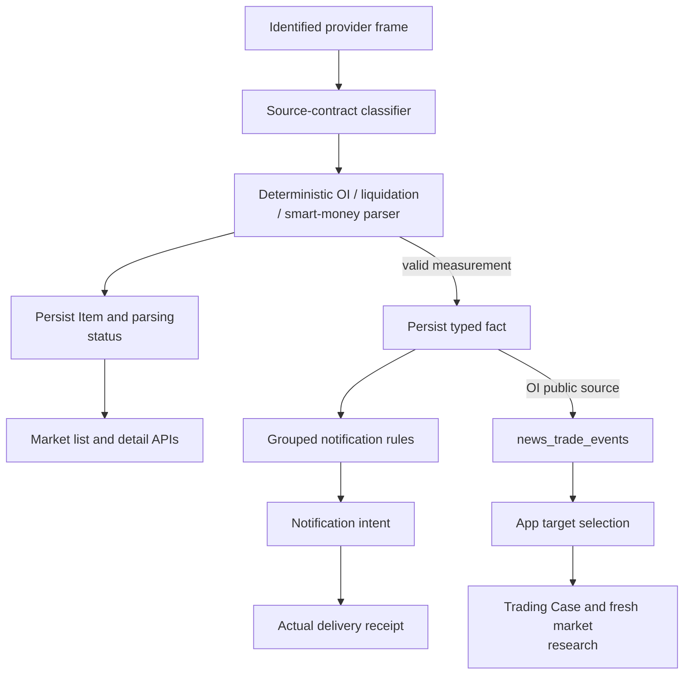
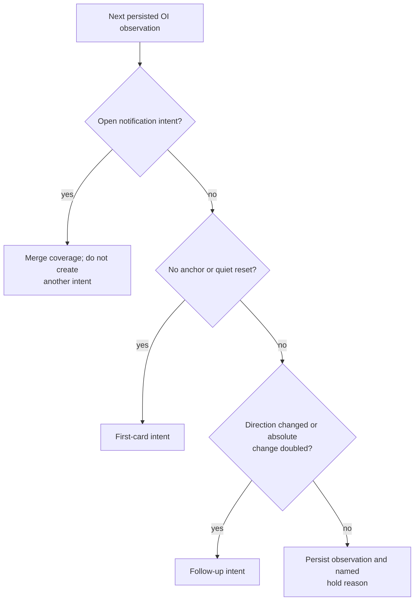

# OI and market observations

[Handbook](../README.md) · [News](news.md) · [Trading](trading.md)

OI is a typed **News market observation consumed by Trading**, not a third
business package or a synonym for the execution process. Source parsing, reader
notification and trading eligibility are three independent responsibilities.

## 1. Source-to-consumer flow



There is **no editorial Event, Gate/Triage model verdict or taxonomy prerequisite**
on this path. Unknown contracts and failed parses remain readable source records;
they do not become fabricated zero measurements. See
[source_contracts.py](../../tracefold/news/source_contracts.py),
[admission.py](../../tracefold/news/pipeline/admission.py), and
[market_contracts.py](../../tracefold/news/market_contracts.py).

## 2. What the OI parser actually knows

[oi_signals.py](../../tracefold/news/oi_signals.py) parses the provider's fixed-format
message, for example:

```text
TRUMP OI Rise 4.55%, OI Value 32.17M, Whale Long Profit 80.21%, Whale/OI Ratio 100.71%
```

This is a parser illustration, not current market data. The optional provider
suffix `N times in 24h` is accepted, but does not replace locally derived recurrence.

| Stored value | Meaning and limitation |
| --- | --- |
| `symbol`, `raw_instrument` | Normalized grouping token and original provider spelling; neither alone proves an executable venue route. |
| `direction`, `oi_change_bps` | Provider-reported rise/fall and percentage converted to integer basis points. |
| `oi_value_usd` | Parsed provider notional value, including K/M/B units; not a verified contract count. |
| `whale_long_profit_bps` | The provider's named percentage, not aggregate dollar PnL, profitable-account count or proof all smart-money accounts profit. |
| `whale_oi_ratio_bps` | The provider's ratio with its recorded source meaning, not an invented position snapshot. |
| Measurement/source versions | Provenance binding for interpreting this row later; changed semantics require a new version. |

For the recognized `oi_v1` source-contract family, `oi_source_contract` binds the
measurement window to **300,000 ms**. The number is justified by the identified
provider contract, not by text parsing or the interval between arrivals. An
unproven identity yields an explicit unknown contract/window. Do not apply the
five-minute interpretation to any news text mentioning OI.

Percentages use integer basis points with decimal rounding; a 4.55% example becomes
455 bps. The parser cannot establish whether dollar OI rose because of price,
contract quantities or both. Nor does “OI Rise” establish a long trade. The
[historical holdout](../research/oi-stage-a-holdout-2026-09-01.md) is retained as a
research limitation, not the live policy or a promise of future performance.

## 3. Grouping and notification policy

The sole owner is [market_notifications.py](../../tracefold/news/market_notifications.py):
`group_identity` identifies comparable measurements, `decide_group` chooses work,
and `MarketNotificationLoop` claims/sends/settles that work. Every observation is
persisted even when it does not earn another card.

For OI, the current code starts a round with a first card and considers a follow-up
when direction changes or absolute change reaches twice the anchor. The anchor is
the observation covered by the preceding card, not a continuously moving maximum.
A four-hour gap between live observations resets the round. These are notification
cadence rules, **not entry filters, a backtest result or an optimal trading strategy**.
Exact constants belong to the source owner.



For example, after a sent 6% card, 9% alone is below twice its anchor and 13% can
qualify. If 6%, 9% and 13% all arrive before the first send starts, they can be
covered by one pending card instead. The model does not decide these comparisons.

Liquidations use their own time-window grouping, smart-money reports their own
account/instrument rounds, and wallet episodes the detector's already-qualified
snapshot. Raw/unstructured records are stored and readable, not automatically pushed.
Do not copy OI thresholds into these other families.

## 4. Durable notification outcomes

The current market delivery vocabulary is `pending`, `sending`, `sent`, `failed`,
`unknown`, `unavailable`. `pending` means work exists, not that a reader saw it.
Optional quote/news context enriches a card but does not establish the measurement.
A send attempt freezes the chosen payload and settles against the adapter result.
Provably-not-sent retryable failures use the existing bounded retry policy;
unknown outcomes do not become blind retries.

Parsing state, grouped notification state and Trading Case state remain distinct
in [market API contracts](../CONTRACTS.md). A perfectly valid OI observation can be
held from another notification and independently analyzed by Trading.

## 5. The Trading handoff

News commits the public OI fact handoff. `AnalysisRunner.relay_once` resolves a
single eligible target and records an idempotent Trading Trigger/initial Case,
then acknowledges the exact News outbox payload. Target mapping, native units,
source revision and knowledge time are recorded, not guessed from a short ticker.

Trading reads bounded market evidence and selects from its current plan menu.
The retired OI-only deterministic signal lane is not scheduled by Workers. Names
such as `integrations/nautilus/oi_runtime` remain implementation paths, not proof
that an old OI rank/cooldown strategy is still the live admission mechanism.

## 6. Troubleshooting by boundary

| Observation | Next evidence to inspect |
| --- | --- |
| Provider frames arrive but typed rows stop | Exact source identity, raw title, parser version and `oi_template_unmatched`/other parse reason. |
| Similar frames disappear | Item identities and redelivery versus distinct measurement; market frames must not enter editorial near-duplicate grouping. |
| Typed fact exists but no card | Group anchor, open intent, follow-up reason, delivery configuration and actual send result. |
| Card exists but no Case | Public trade-event outbox, relay status and named target-selection exclusion. |
| Case exists but no Signal | Assessment/decision, publication setting, expiry or source supersession; not the notification threshold. |

Use [market-path boundary tests](../../tests/architecture/test_news_market_path_boundaries.py),
[market notifications](../../tests/integration/test_news_market_notifications.py),
[market read model](../../tests/integration/test_news_market_read_model.py),
[Analysis runner](../../tests/integration/test_trading_analysis_runner.py), and
[Trading strategy tests](../../tests/trading/test_oi_price_strategy.py) to follow
executable contracts. Historical OI research remains under
[notebooks](../../notebooks/README.md), outside runtime imports and account authority.
