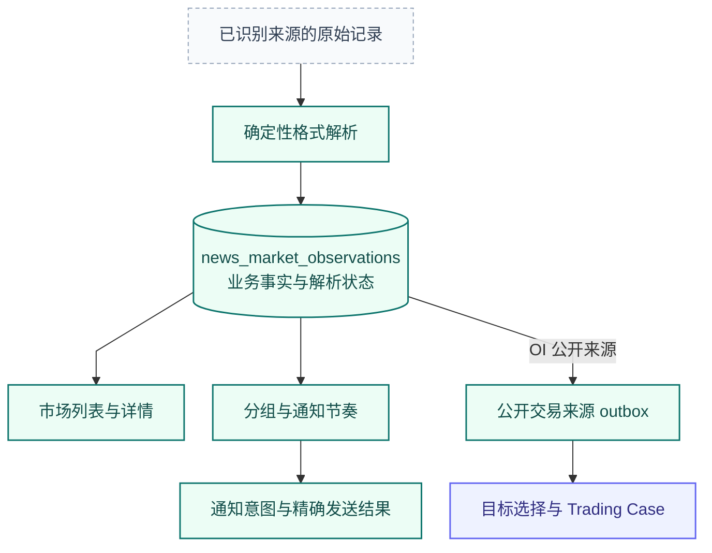
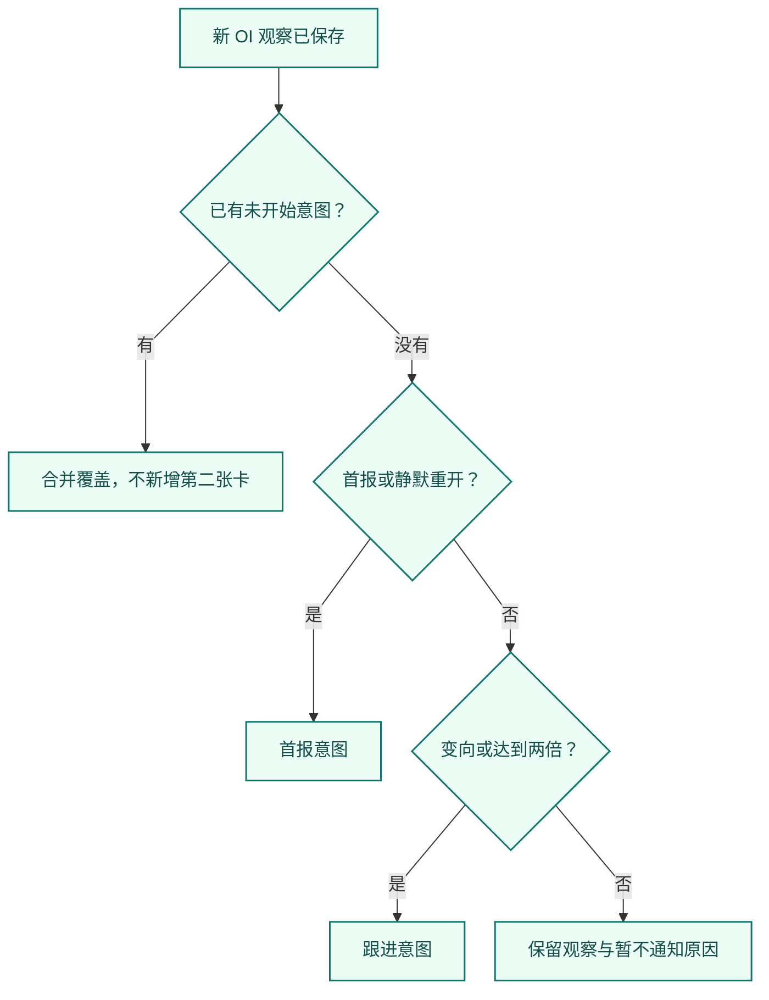
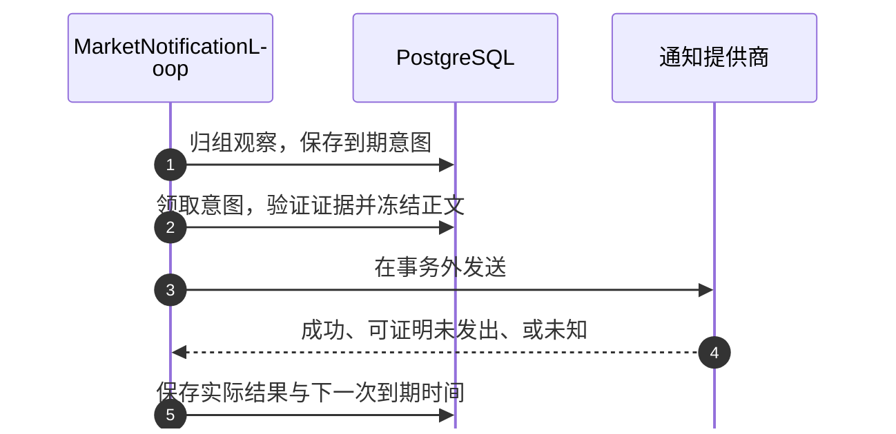

# OI 与类型化市场观察

[手册](../README.md) · [News](news.md) · [行情复盘](market-review.md) · [Trading](trading.md)

OI（未平仓量）是 **News 保存的类型化市场观察，Trading 可以独立消费它**。它不是第三个业务包，不等于多头方向，也不等于执行进程。解析、读者通知与交易准入是三个不同决定。

| 模块速览 | 说明 |
| :--- | :--- |
| **定位** | 信息产品 / 类型化市场观察 |
| **运行位置** | Workers · 确定性解析与市场通知循环 |
| **输入 → 产物** | 已识别来源的 OI、清算、大户报告 → 类型化观察、通知组与回执；合格 OI 公开来源 |

> [!IMPORTANT]
> OI 增长不等于做多信号；是否发送跟进通知，不决定 Trading 是否研究该来源。

[交易研究](trading.md) · [行情与复盘](market-review.md)

<details>
<summary><strong>本页目录</strong></summary>

1. [从来源到两个独立消费者](#section-从来源到两个独立消费者)
2. [OI 解析器知道什么](#section-oi-解析器知道什么)
3. [分组通知的确定性规则](#section-分组通知的确定性规则)
4. [发送生命周期与恢复](#section-发送生命周期与恢复)
5. [OI 如何进入 Trading](#section-oi-如何进入-trading)
6. [排障与验证](#section-排障与验证)
7. [源码责任地图](#section-源码责任地图)
8. [常见误解](#section-常见误解)

</details>

<a id="section-从来源到两个独立消费者"></a>
## 01 · 从来源到两个独立消费者



*数据流 · 解析失败仍保留原始市场观测；通知和 Trading 是独立消费者，不是前后审批步骤。*

此路径没有编辑型 Event、语义模型、四轴 taxonomy 或模型新闻价值判断。未知来源契约与解析失败保留原始记录和具名原因，不能转成 OI 为零的假测量。

<a id="section-oi-解析器知道什么"></a>
## 02 · OI 解析器知道什么

下面仅为格式说明，不是实时行情：

```text
TRUMP OI Rise 4.55%, OI Value 32.17M, Whale Long Profit 80.21%, Whale/OI Ratio 100.71%
```

| 字段 | 含义与边界 |
| --- | --- |
| `symbol` / `raw_instrument` | 归组符号与提供商原始名称；不证明某交易所存在可执行合约 |
| `direction` / `oi_change_bps` | 提供商报告的增减方向与基点变化；4.55% 对应 455 bps |
| `oi_value_usd` | 解析 K / M / B 单位后的提供商名义金额，不是已验证合约张数 |
| `whale_long_profit_bps` | 提供商命名的百分比；不是美元收益、盈利账户数量或全体大户的盈亏 |
| `whale_oi_ratio_bps` | 保留来源定义的占比；不能由此补造持仓快照 |
| measurement / source 版本 | 绑定当时采用的解析与计量含义，语义改变必须版本化 |

来源被识别为 `oi_v1` 契约族时，测量窗口绑定为 **300,000 毫秒（5 分钟）**。这是来源契约给出的解释，不是根据两条消息的到达间隔猜测。任意新闻提到 OI，并不自动拥有这个窗口。

可选的 `N times in 24h` 后缀能被接受，但不替代本地记录推导的重复观察。百分比使用十进制舍入后转基点。美元 OI 的变化可能涉及价格与数量变化，单凭这段文本无法拆分，更不能推出应该做多。

<a id="section-分组通知的确定性规则"></a>
## 03 · 分组通知的确定性规则

`group_identity` 决定哪些测量可比较，`decide_group` 决定本轮是否需要通知，`MarketNotificationLoop` 领取、发送并结算。**每条观察均先保存，不发卡不等于丢数据。**

| 家族 | 当前通知逻辑 | 不应套用的逻辑 |
| --- | --- | --- |
| OI | 每轮首报；方向改变或绝对变化达到前一通知锚点的两倍时跟进；观察间隔达到 4 小时重开一轮 | 不把通知阈值当交易入场过滤器 |
| 清算 | 首报立即；后续以发送尝试开始时间锚定 60 秒窗口，有新记录才跟进 | 不让持续到达的记录无限延后窗口 |
| 大户报告 | 按账户、标的和日级主题组织首报 / 收尾 | 不再每次成交都用一个新的短窗口发送 |
| 钱包 | 使用净买入 detector 已达标的 episode，再进行发送时证据检查 | 不复制 OI 倍数阈值 |
| 原始未结构化记录 | 保存并可读，不自动建立第四套“兜底评分” | 不用零值伪装成功解析 |



*决策视图 · 菱形为代码分支，阈值是通知节奏，不是交易入场规则。*

锚点是上一通知覆盖的观察，不是不断上移的最大值。例如 6% 的卡已经发送，9% 仍不足两倍，13% 可以触发跟进。如果 6%、9%、13% 在第一张卡开始发送前一起到达，则可合并为一张，不应为了凑例子强造两张卡。

<a id="section-发送生命周期与恢复"></a>
## 04 · 发送生命周期与恢复

市场通知保留自己的状态：`pending`、`sending`、`sent`、`failed`、`unknown`、`unavailable`。不要强行把它和编辑型 News 的 adapter outcome 枚举合成同一个字段。



*时序 · intent 和实际发送分别保存；未知结果不能变成已证明未发送。*

同一组至多保留一个尚未开始的意图；重试沿用稳定 `delivery_key`，不是每次生成一个新身份。当前可证明未发送的可重试错误最多三次实际尝试，间隔由代码返回 5 秒、30 秒并写入 due time，不在事务里 sleep。

上个进程留下的 `sending` 不能被当作已发送或确定失败，必须保留未知结果。行情、相关新闻上下文属于可选卡片补充，不成为原始测量的真实性依据。

<a id="section-oi-如何进入-trading"></a>
## 05 · OI 如何进入 Trading

News 保存公开来源；`AnalysisRunner.relay_once` 解析单一合格目标、原生单位与映射来源，幂等保存 Trigger / Case 后确认相同 outbox payload。是否再发一张市场卡，与是否进行这次研究相互独立。

Trading 读取自己的有界市场证据并选择当前计划菜单。旧 OI 专用确定性 signal lane 不再由 Workers 调度；`oi_runtime` 这个历史目录名不能用来推断仍有另一套 OI 交易策略。

<a id="section-排障与验证"></a>
## 06 · 排障与验证

| 现象 | 顺序检查 |
| --- | --- |
| 源消息在增加，类型化 OI 不增加 | 来源身份、原始标题、解析版本和 `oi_template_unmatched` 等原因 |
| 看似重复消息消失 | 原始身份是重投还是新测量；是否错误走编辑型近似去重 |
| 事实存在但没卡 | 分组锚点、待发送意图、暂不通知原因、配置与实际发送结果 |
| 有卡没有 Case | outbox、relay 接收 / 排除结果、经济身份映射 |
| 有 Case 没 Signal | 决策、发布设置、截止时间和来源修订，而非 OI 通知倍数 |

验证入口：[市场路径边界](../../tests/architecture/test_news_market_path_boundaries.py)、[通知集成](../../tests/integration/test_news_market_notifications.py)、[市场读模型](../../tests/integration/test_news_market_read_model.py)、[Analysis 闭环](../../tests/integration/test_trading_analysis_closure.py)。历史研究见 [notebooks](../../notebooks/README.md)，不是当前在线收益承诺。

<a id="section-源码责任地图"></a>
## 07 · 源码责任地图

| 实现 | 职责 |
| --- | --- |
| [source_contracts.py](../../tracefold/news/source_contracts.py) | 识别提供商来源契约，不凭任意标题猜测 measurement 含义 |
| [admission.py](../../tracefold/news/pipeline/admission.py) | 市场分支保存 Item 与类型化事实，不创建编辑型 Event |
| [oi_signals.py](../../tracefold/news/oi_signals.py)、[oi_contracts.py](../../tracefold/news/oi_contracts.py) | OI 格式解析、单位、窗口与来源语义 |
| [liquidations.py](../../tracefold/news/liquidations.py)、[smart_money.py](../../tracefold/news/smart_money.py) | 清算、大户报告各自的结构化解释 |
| [market_contracts.py](../../tracefold/news/market_contracts.py)、[storage/market.py](../../tracefold/news/storage/market.py) | 市场读模型、持久记录与通知组 |
| [market_notifications.py](../../tracefold/news/market_notifications.py) | 分组身份、确定性决策、到期工作、冻结发送与结果 |

<a id="section-常见误解"></a>
## 08 · 常见误解

<details>
<summary><strong>展开常见问题</strong></summary>

**没有跟进通知，是不是 OI 数据被丢弃？**

不是。类型化事实仍保留，通知节奏与交易研究分别处理。

**OI Rise 是否意味着看多？**

不是。它表达来源报告的 OI 变化；名义金额还可能受价格变化影响。

</details>

---

[返回文档中心](../README.md) · [架构图谱](../ARCHITECTURE.md#atlas) · [返回顶部](#oi-与类型化市场观察)

市场存储由 [observations.py](../../tracefold/news/storage/observations.py)统一写入：相同帧重放不改 `xmin`，业务字段和解析状态保持首次记录，新增策略只合并元数据。首插 OI 才写公开 outbox，观测 ID 与旧市场 Item ID 相同。`news_items` 只保存编辑新闻；市场保留由独立有界删除批次执行。
