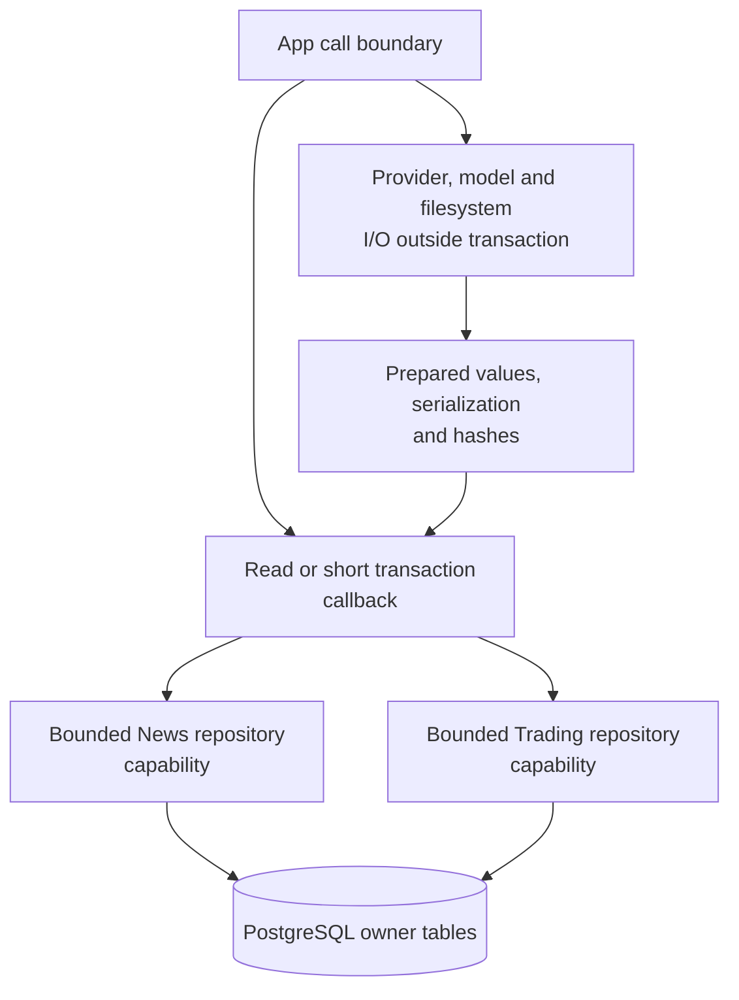
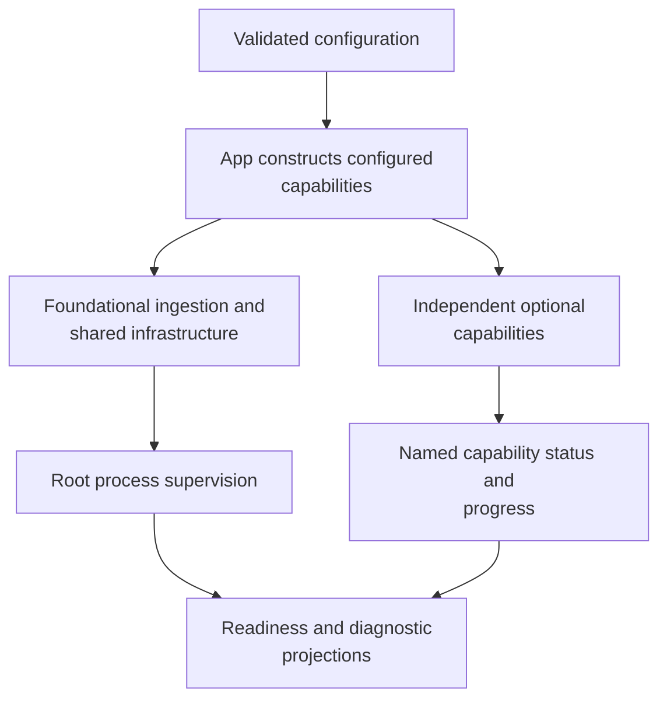

# Platform, integrations and application composition

[Handbook](../README.md) · [Architecture](../ARCHITECTURE.md) ·
[Setup](../SETUP.md) · [Contracts](../CONTRACTS.md)

These packages supply infrastructure and compose the two business capabilities.
They are not a third trading domain, a generic Agent scheduler or a second ledger.
Use the [repository map](../generated/repository-map.md) for every tracked path and
this guide for ownership and interaction.

## 1. Configuration and process resources

| Source | Responsibility |
| --- | --- |
| [config/models.py](../../tracefold/platform/config/models.py) | Typed settings, defaults and validation; unknown removed keys do not silently survive. |
| [config/loader.py](../../tracefold/platform/config/loader.py) | Load the operator's configuration and expose the effective settings. |
| [config/secret_file.py](../../tracefold/platform/config/secret_file.py) | Secure file checks for credentials. |
| [paths.py](../../tracefold/platform/paths.py) | Operator-owned paths, not a repository-local secret convention. |
| [resource.py](../../tracefold/platform/resource.py) | Physical resource limits and bounded-operation semantics. |
| [runtime_identity.py](../../tracefold/platform/runtime_identity.py), [market_identity.py](../../tracefold/platform/market_identity.py) | Runtime and economic identity primitives without business-policy authority. |
| [observability](../../tracefold/platform/observability/) | Logging and telemetry; measurements do not replace durable business receipts. |

`tracefold init` is the generated default-config authority. The normal operator
root is `~/.tracefold/`, with private directories and secure files. No `.env` or
copied static YAML becomes an alternative authority. Existing configuration is
preserved; strict validation names obsolete keys rather than guessing a migration.
[Setup](../SETUP.md) owns the exact lifecycle and supported examples.

An asyncio timeout is not proof a blocking database/provider operation physically
stopped. The adapter must retain its permit until completion/cancellation is
actually established. Do not wrap each business loop in another generic timeout
that releases scarce resources prematurely.

## 2. Persistence and transactions

[postgres/client.py](../../tracefold/platform/postgres/client.py) owns connection
resources; [migrations.py](../../tracefold/platform/postgres/migrations.py) and
[Alembic revisions](../../tracefold/platform/postgres/alembic/versions/) own schema
evolution. [audit.py](../../tracefold/platform/postgres/audit.py),
[maintenance_gate.py](../../tracefold/platform/postgres/maintenance_gate.py), and
[restore_drill.py](../../tracefold/platform/postgres/restore_drill.py) own their
specific diagnostic/maintenance boundaries.

Repositories do not hide commits or hand a domain unrestricted access to sibling
tables. App adapters in [repository_session.py](../../tracefold/app/repository_session.py),
[worker_database.py](../../tracefold/app/worker_database.py),
[serve_database.py](../../tracefold/app/serve_database.py), and
[Workers database wiring](../../tracefold/app/workers/wiring/database.py) provide
the composed capabilities. Expensive canonicalization/model work stays outside
transaction callbacks; locks, SQL and conditional writes stay bounded inside.

The [generated database reference](../generated/db-schema.md) is introspected from
an isolated migrated database, not a hand-maintained table count. It does not
justify deleting old migration instructions that are still necessary to restore
a recorded backup. See [Migrations](../MIGRATIONS.md).

## 3. Adapter responsibilities

| Adapter area | External responsibility | Business consumer |
| --- | --- | --- |
| [OpenNews](../../tracefold/integrations/opennews/) | Provider transport/history contracts, payload interpretation and recovery | News admission |
| [integrations](../../tracefold/integrations/) broker/delivery adapters | Durable handoff and provider-specific send outcomes | News pipeline and notification loops |
| [venues](../../tracefold/integrations/venues/) | Instrument catalogues, bounded quotes and historical review data | News market review and display |
| [marketdata](../../tracefold/integrations/marketdata/) | Bounded Trading market evidence with explicit availability | Analysis frame preparation and tools |
| [Nautilus](../../tracefold/integrations/nautilus/) | Account-facing runtime, signed venue evidence and recovery | Execution process only |

The transport is chosen for its consumer's semantics. News quote/reaction review
uses bounded public REST reads and explicit missing/stale state; it is not a tick
archive or an order-book execution feed. A broker message is not a canonical fact,
a latest quote is not historical evidence, and a model claim is not venue authority.

## 4. Application composition

[Workers wiring](../../tracefold/app/workers/wiring/) separates News, market review,
chain tape, database ports and shared components. [task_contract.py](../../tracefold/app/workers/task_contract.py)
is the actual declaration of task names, capabilities and foundational failure
semantics. There is no extra registry to keep in sync with a second table in docs.

An optional task can fault without stopping healthy siblings. Required ingestion,
schema or ownership failures retain their root-level behavior. Missing credentials
must produce explicit capability state rather than fake data. Presence in the task
list does not establish availability.

Serve, Workers, Analysis and Nautilus have different process contracts. In
particular, Trading analysis is not silently scheduled as a News worker, and a
frontend deployment is not authorization to restart the account owner.

## 5. HTTP, CLI and frontend contracts

[HTTP routes](../../tracefold/app/http/routes/) adapt explicit application/query
operations; [schemas](../../tracefold/app/http/schemas/) own public shapes.
[CLI parsers](../../tracefold/app/cli/parsers/) own grammar and
[commands](../../tracefold/app/cli/commands/) own adapters. Reads return persisted
projections rather than rerunning provider/model work invisibly.

The React console consumes generated API types and feature-owned queries. It may
present a decision, account snapshot or command result but cannot promote a stale
projection into execution authority. [Frontend](../FRONTEND.md) owns its architecture
and [Contracts](../CONTRACTS.md) the exact supported APIs.

## 6. Verification without another infrastructure framework

Use [backend boundaries](../../tests/architecture/test_backend_boundaries.py),
[package layout](../../tests/architecture/test_package_layout.py),
[Workers runtime integration](../../tests/integration/test_workers_runtime_v2.py),
[broker tests](../../tests/integration/test_news_bus_rabbitmq.py), and the relevant
[CI lane](../TESTING.md). A pure documentation or index change does not require a
production restart, real credential access, live model call or venue action.
