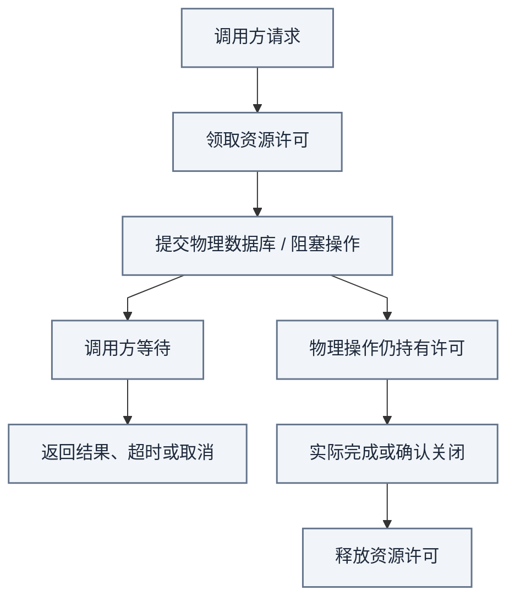
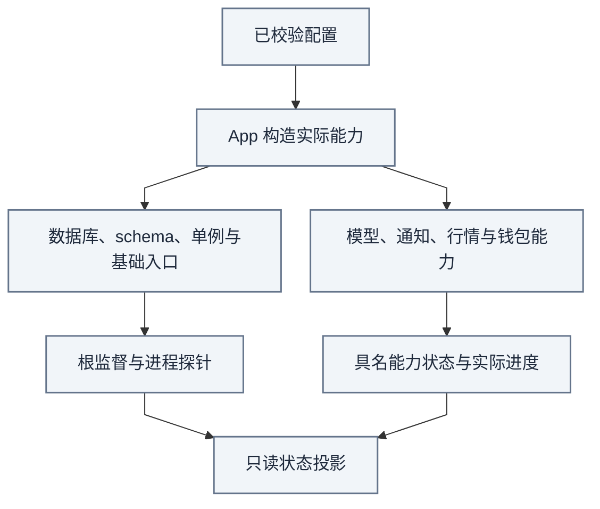

# Platform：配置、资源、适配器与进程装配

[手册](../README.md) · [架构](../ARCHITECTURE.md#packages) · [安装](../SETUP.md) · [测试](../TESTING.md) · [术语](../../CONTEXT.md)

Platform 提供配置、数据库、资源和进程身份。Integrations 把外部系统接到领域端口。App 创建对象并安排进程、任务与跨域映射。

这些代码在 Serve、Workers、Analysis、Executor 各自的进程中运行。共用应用镜像不表示共用进程、资源预算或权限。业务事实、决策与账户状态仍由 News 和 Trading 各自拥有。

| 模块速览 | 说明 |
| :--- | :--- |
| **定位** | 运行基础 / 资源与装配 |
| **运行位置** | App 在各角色内装配 Platform 和 Integrations；部署脚本负责容器生命周期 |
| **输入 → 产物** | 配置、领域端口、外部响应 → 校验结果、受限资源、数据库会话、任务与诊断 |

> [!IMPORTANT]
> 共享基础设施不合并业务所有权；协程超时不意味着物理操作结束或许可已经可回收。

[依赖方向](../ARCHITECTURE.md#packages) · [资源验证](../TESTING.md)

<strong>本页目录</strong>

1. [各层负责什么](#section-各层负责什么)
2. [输入与输出](#inputs-outputs)
3. [主流程](#process)：[配置](#section-单一配置入口) → [资源](#section-数据库连接短事务与资源隔离) → [监督](#section-workers-如何监督任务) → [持久工作](#section-rabbitmq-与持久工作) → [外部适配](#section-外部适配器不能扩大业务权限)
4. [状态与可观测性](#section-状态与可观测性)
5. [失败与恢复](#recovery) · [常见误解](#section-常见误解)
6. [源码与验证入口](#section-验证入口)

## 01 · 各层负责什么

| 层 | 所有者 | 边界 |
| --- | --- | --- |
| 配置与文件 | [config](../../tracefold/platform/config/)、[paths.py](../../tracefold/platform/paths.py) | 校验配置、解析本地路径与密钥文件；不复制业务策略 |
| PostgreSQL | [postgres](../../tracefold/platform/postgres/) | 连接、迁移、事务设置、维护锁、审计与恢复演练 |
| 资源 | [resource.py](../../tracefold/platform/resource.py) | 准入、物理完成、取消和资源回收语义 |
| 可观测性与身份 | [observability](../../tracefold/platform/observability/)、[runtime_identity.py](../../tracefold/platform/runtime_identity.py)、[market_identity.py](../../tracefold/platform/market_identity.py) | 观测、进程 / 构建身份及共享市场词表；不把探针变成业务事实 |
| 外部适配 | [integrations](../../tracefold/integrations/) | provider 格式、传输与错误分类 |
| 部署装配 | [scripts/deploy.py](../../scripts/deploy.py)、[compose.yaml](../../compose.yaml) | 系统 Python 编排生命周期，Compose 拥有服务与挂载；与应用业务装配分开 |
| App 装配 | [app](../../tracefold/app/)、[workers/wiring](../../tracefold/app/workers/wiring/) | 创建对象、传入能力端口、安排进程与跨域映射 |
| HTTP / CLI | [http](../../tracefold/app/http/)、[cli](../../tracefold/app/cli/) | 接口语法、查询与显式命令适配，不隐藏额外业务流程 |

平台仅拥有 `alembic_version` 与 `runtime_processes` 两张基础表。News、目录 / 报价及 Trading 的记录由各自仓储维护；[后端边界测试](../../tests/architecture/test_backend_boundaries.py)约束导入、SQL 位置与表所有权。

## 输入与输出

| 输入 | 产物与责任 |
| --- | --- |
| `TRACEFOLD_HOME/config.yaml` 和私有密钥文件 | 校验后的 Settings、明确的模型路由与路径；配置层不另存业务策略 |
| 领域端口与实现适配 | 角色实际拥有的能力对象；App 不改变端口的业务权限 |
| 领域请求与持久工作 | 有界操作、短事务与任务调度；领域仓储保存事实和处置 |
| 外部系统响应 | 类型化值或具名错误；响应不自动成为已采用事实或成功回执 |
| 进程和任务运行结果 | 心跳、能力报告、探针与指标；诊断不替代领域账本 |

## 主流程

按以下顺序理解一次角色启动和运行：

1. 读取并校验配置，明确该角色实际启用哪些能力。
2. App 创建领域仓储、适配器和资源能力，分别设置并发与权限。
3. Workers 根据任务声明启动基础任务和可选任务，持续报告各自状态。
4. 领域调用方提交短事务；消息发布、模型与外部请求在各自边界完成。
5. 停止时先关闭准入，再等待已提交操作，最后回收资源。

下文分别解释这些步骤的约束。它们是职责顺序，不是一条把所有业务串起来的统一流水线。

## 02 · 单一配置入口

[paths.py](../../tracefold/platform/paths.py)解析 `TRACEFOLD_HOME`，默认是 `~/.tracefold`。[loader.py](../../tracefold/platform/config/loader.py)读取该目录下的 `config.yaml`，再由 [models.py](../../tracefold/platform/config/models.py)校验。

Compose 的可选 `.env` 只承载项目名、宿主机目录和端口等部署参数。业务配置只来自 Settings；两份 YAML 不隐式合并。

模型 endpoint 的 `api_key`、`base_url`、`model` 构成完整配置组。不同用途的模型路由分别定义：

| 路由 | 用途与边界 |
| --- | --- |
| `news_triage_model` | 主 News 模型字段 |
| `news_triage_judgment_model` | 可选；只改变同一 endpoint 上用于语义判断的模型名 |
| `news_judgment` | 独立配置的 News 判断路由 |
| `news_reader_judgment` | 通知决策独用的 System One 路由，不借用其他路由 |
| Analysis model 与版本化 Program | Trading 预测，独立于 News 路由 |

`news_reader_judgment` 的密钥只接受配置目录下的私有 `api_key_file`。初始化创建的文件名是 `news_reader_judgment_api_key`。

`llm.news_embedding` 显式启用 Workers 本地 MiniLM 命题召回增强。先通过 `news embedding prepare` 下载固定 revision。运行时只读本地文件，核验 manifest 和 golden vectors；Serve 不创建 ONNX 会话。

模型缺失、自检或推理失败时，`news_claim_recall` 报告不可用，召回退回无向量路径。向量相似度只提供候选，不证明新事实或采用结论。

未知字段会显式报错。删除旧字段时按完整 YAML 路径修改，避免改变其他配置组。

`tracefold init` 负责初始化和文件权限。升级仍需按当前配置契约处理字段，不能依赖初始化命令自动解释历史配置。

## 03 · 数据库连接、短事务与资源隔离

App 通过 [repository_session.py](../../tracefold/app/repository_session.py)装配 News、Trading、目录和价格仓储。仓储拥有 SQL 与领域记录；调用方开启事务、领取资源并提交。

这种分工让事务边界可见，也防止业务层通过通用连接访问兄弟域内部表。

| 运行角色 | 当前资源形状 | 用意 |
| --- | --- | --- |
| Serve | 7 个连接：6 个普通只读许可、1 个控制许可 | 页面查询不挤占基础状态读取；整个 pool 默认只读 |
| Workers | 最多 8 个连接：1 个单例所有权、2 个普通业务、4 个 News lane、1 个控制 | 入口与控制任务不被行情复盘或普通业务挤满 |
| Workers 重型操作 | 单个 heavy gate，再进入普通业务接缝 | 约束重型工作，不另建无界连接池 |
| Workers 同步外部操作 | [FiniteOperations](../../tracefold/app/workers/capabilities.py) 的 3 个线程 / 许可 | 模型等有限阻塞工作与数据库线程分别计量 |
| 命题 embedding | 1 个推理线程 / 许可，单批最多 32 条 | ONNX 仅占自身能力，超时后仍等待物理完成释放许可 |

资源数值和具体超时以 [serve_database.py](../../tracefold/app/serve_database.py)、[worker_database.py](../../tracefold/app/worker_database.py)、[capabilities.py](../../tracefold/app/workers/capabilities.py) 和 [claim_embedding.py](../../tracefold/app/claim_embedding.py) 为准。这些预算限制真实并发，不是吞吐能力证明。

Analysis 与 Executor 各自装配数据库和外部能力，不能套用 Workers 的线程数。

*资源视图 · 箭头解释许可生命周期；超时不是底层线程或数据库请求已经停止的证明。*

调用方停止等待之后，线程、数据库请求或外部阻塞操作可能仍在运行。资源许可跟随物理操作完成，而不是跟随协程结束；提前释放会让真实并发超过上限。

物理操作超过完成预算会报告 `ResourceOperationOverrun`。忽略异常不能证明关闭流程已经回收资源。

事务内只执行必要 SQL、锁和条件写。网络、模型、文件读取、长计算和昂贵哈希在事务外完成。

业务回调不自行 commit。调用方在离开事务后访问外部提供商，避免持有数据库锁等待网络响应。

## 04 · Workers 如何监督任务

[task_contract.py](../../tracefold/app/workers/task_contract.py)统一声明任务名、能力名和 `foundational` 属性。`foundational` 表示该任务属于基础入口，其未处理错误会影响整个 Workers 进程。

`NewsPipeline.runners()`只提供 News 的任务函数。App 决定任务如何监督；任务列表本身不证明能力可用。

数据库接缝把暂时拿不到槽位和有界操作超时，分别表达为 `DeferError / TransientError`。领域流程决定是否推迟或重试，不能一律当成程序错误。

News 接收端已经发布帧之后，辅助记账失败只记录 warning，下一帧重试。连接、断开和事故开启等状态迁移仍保留根级失败语义；这个例外不能吞掉其他未预期错误。

| 分类 | 当前任务 | 未预期程序错误的处理 |
| --- | --- | --- |
| 基础入口 | `news-receiver`、`news-recovery`、`news-deduper`、`news-janitor` | 保留根级失败语义，不能让入口永久停止却持续报告绿色 |
| 编辑与发送 | `news-semantic`、`news-deliverer`、`news-market-notifications` | 标记对应能力异常，健康兄弟任务继续 |
| 目录与价格 | `news-instruments`、`news-quotes` | 与编辑链路分别呈现；可恢复 provider 错误按各循环规则处理 |
| 钱包 | `news-wallet-roster`、`news-chain-tape`、`news-wallet-net-buy` | 名单、采集、检测各有能力与进度 |

*监督视图 · 故障影响范围由任务与异常类别决定；探针可用不等于所有业务能力都在推进。*

能力状态说明当前可用性，不是工作完成结果：

| 能力状态 | 当前含义 |
| --- | --- |
| `disabled` | 配置未启用能力 |
| `unavailable` | 当前所需的配置、资源或依赖不可用 |
| `faulted` | 装配或任务已因具名错误失败 |
| `running` | 能力报告正在运行；业务进度仍需另查 |

循环中的外部提供商错误可按领域规则退避。它与配置关闭、资源不足、程序错误分别表达。

`news_claim_recall` 是语义链路调用的本地能力，没有单独后台任务。它通过 embedding 自检和推理结果报告可用性。任务对象存在不能覆盖装配时记录的能力诊断。

故障范围取决于发生阶段和任务类型。启动装配时的共享资源异常会继续向根传播。运行时，未处理的 `ResourceOperationOverrun` 保留根级故障语义；非基础任务的其他未处理异常停止该任务并标记对应能力为 `faulted`。

因此，不能仅凭“数据库错误”四个字推断整个进程一定退出。还要确认错误发生在装配、基础任务、控制任务，还是可选能力内部。

## 05 · RabbitMQ 与持久工作

[bus.py](../../tracefold/news/bus.py)、[broker_policy.py](../../tracefold/news/broker_policy.py)、[rabbitmq.py](../../tracefold/integrations/rabbitmq.py)维护声明、投递、重试 / 死信和 provider 结果分类。Compose 固定 RabbitMQ 4.3 系列，是 broker 延迟重试等机制的前置条件。

`news.raw` 驱动输入准入，`news.triage` 唤醒 `news-semantic`。PostgreSQL 保存真正待处理的版本、尝试预算和租约；恢复循环据此重新发布未完成工作。

通知工作由 `news-deliverer` 轮询续接。通知决定、冻结意图和发送账本分别持久化，队列状态不能代表最终发送状态。

应用先提交事实，再发布或确认消息。PostgreSQL commit 与 RabbitMQ ack 是两个边界；中途失败通过持久身份和幂等重放恢复。

broker ready 只说明 broker 可用，不能证明消费进度。队列为空也不能证明所有语义工作已经完成。

## 06 · 外部适配器不能扩大业务权限

| 适配 | 消费者与作用 |
| --- | --- |
| [OpenNews](../../tracefold/integrations/opennews/) | News 原始实时输入与历史恢复 |
| [Telegram](../../tracefold/integrations/telegram.py)、[Feishu](../../tracefold/integrations/feishu.py) | 发送精确冻结卡片，报告真正可证明的发送结果 |
| [venues](../../tracefold/integrations/venues/) | News 目录、当前报价、发送时行情；公共只读 REST |
| [marketdata](../../tracefold/integrations/marketdata/) | Trading 研究的有界原始市场数据 |
| [Robinhood Chain](../../tracefold/integrations/robinhood_chain.py)、[名单适配](../../tracefold/integrations/robinhoodtrenches.py) | 回执采集和名单刷新，两个独立请求边界 |
| [DEMO REST 适配](../../tracefold/integrations/trading/binance.py) | 账户操作与签名 venue evidence；仅执行进程拥有凭据 |

News 展示报价用于信息产品；执行行情、历史价格和账户证据需要各自的来源与时间语义。最新快照不能补作过去时刻的价格证据。

适配器转换格式和传输错误，不创建额外 Claim，也不放宽交易风险。新增适配优先复用已有端口。

## 07 · 状态与可观测性

先确认正在读取哪个角色、哪种状态：

| 状态入口 | 能证明什么 |
| --- | --- |
| Serve `/healthz` | HTTP 进程存活 |
| Serve `/readyz` 的 `ok` | PostgreSQL 可连接且 schema 匹配；`composition` 另附 Workers 报告 |
| `/api/status` 的 `runtime.ok` | 数据库检查通过，且 Workers 状态是 `running`；不汇总可选能力完成情况 |
| 各角色的探针 | 对应进程的就绪结果，不能互换 |
| `/metrics` | 所在进程的观测，不证明账户资金真实状态 |

Workers 心跳超过 15 秒时，投影变为 `stale` 并清空 `capabilities`。这样，旧的 running 报告不会被当成当前事实。

业务状态仍需结合能力、工作进度、错误、数据新鲜度和测量时钟读取。

平台 [RuntimeProcesses](../../tracefold/platform/postgres/runtime_processes.py) 独占 `runtime_processes` 的读写。Workers 使用 singleton 键，Analysis 和 Executor 使用账户槽位键。每次启动有独立 UUID，旧实例不能更新已接管的行。

心跳统一使用毫秒。detail 只保存进程诊断和能力报告，不保存交易账户、预测或执行事实。App 组合平台与业务报告；业务仓储不读取进程存活表。

## 失败与恢复

| 情况 | 当前处理与恢复边界 |
| --- | --- |
| 配置不完整或密钥文件不可读 | 保留具名装配诊断；修正配置并按对应角色重新启动 |
| 槽位暂时不可用或有界操作超时 | 领域流程决定推迟与重试；物理许可仍跟随真实完成 |
| 可选任务程序错误 | 停止该任务并报告 `faulted`；修复后由操作员重启，不自动无限自愈 |
| 基础任务、控制或单例所有权失效 | 保留根级失败语义，不用健康兄弟任务掩盖入口或控制失效 |
| 待处理工作未被唤醒 | 恢复循环读取持久工作并重新发布，不把队列当作唯一事实 |
| 关闭期限内不能回收资源 | 保留具名 fatal code，协程退出不等于物理资源回收 |

Workers 关闭时先停止任务和资源准入，等待已提交操作，再关闭业务管道、模型连接与有限操作执行器。之后记录 stopped，排空控制操作，释放单例锁，关闭数据库连接池、线程和探针。

这些步骤共享同一关闭期限。不能为每个步骤重新计时来延长退出。

记录 `event_id / revision / intent / case / entry` 等实际身份，以便串联一次处理。日志不能写完整密钥、DSN 凭据或含密码的 proxy URL。具体恢复与备份步骤见 [运维](../OPERATIONS.md) 和 [迁移](../MIGRATIONS.md)。

## 常见误解

<strong>展开常见问题</strong>

**协程超时后可以立刻释放资源许可吗？**

不一定。许可跟随物理操作实际完成，不能因等待方取消就扩大真实并发。

**readiness 正常是否代表全部能力正常？**

不代表。具名能力、数据新鲜度与工作进度分别读取。

## 源码与验证入口

### App 装配源码

以下入口连接领域公开端口。领域 SQL 与决策规则仍由业务模块维护：

| 装配入口 | 当前职责 |
| --- | --- |
| [serve_runtime.py](../../tracefold/app/serve_runtime.py)、[serve_database.py](../../tracefold/app/serve_database.py) | 只读 HTTP 进程、数据库准入、状态测量与关闭 |
| [workers/root.py](../../tracefold/app/workers/root.py)、[workers/wiring](../../tracefold/app/workers/wiring/) | 单例所有权、任务监督、News / 市场 / 钱包能力及资源回收 |
| [news_updates.py](../../tracefold/app/news_updates.py)、[learning_runtime.py](../../tracefold/app/learning_runtime.py) | 语义与通知模型、System One 连接、Program 身份及显式回退 |
| [claim_embedding.py](../../tracefold/app/claim_embedding.py) | Workers 本地命题 embedding 的固定模型、校验和有界推理 |
| [trading_intake.py](../../tracefold/app/trading_intake.py)、[trading_case_prepare.py](../../tracefold/app/trading_case_prepare.py)、[trading_analysis.py](../../tracefold/app/trading_analysis.py) | 从公开 News 契约映射研究输入、冻结 Case 与 Analysis 生命周期 |
| [executor.py](../../tracefold/app/executor.py)、[operator_control.py](../../tracefold/app/operator_control.py) | 独立执行进程及本地操作员命令；HTTP 不拥有该写能力 |
| [analysis_status.py](../../tracefold/app/analysis_status.py)、[execution_status.py](../../tracefold/app/execution_status.py) | 合并平台进程报告与 Trading 领域记录，生成只读诊断 |

### 验证范围

| 测试 | 证明范围 |
| --- | --- |
| [包布局](../../tests/architecture/test_package_layout.py)、[后端边界](../../tests/architecture/test_backend_boundaries.py) | 依赖方向、SQL 位置与表所有权 |
| [资源许可](../../tests/test_worker_capabilities.py) | 调用方超时之后的物理完成、并发限制和资源回收 |
| [Workers 集成](../../tests/integration/test_workers_runtime_v2.py) | 启动、角色边界、探针、故障范围与关闭 |
| [RabbitMQ 集成](../../tests/integration/test_news_bus_rabbitmq.py) | 消息接缝、确认与恢复 |

文档改动只需相应链接、入口同步、契约和图形检查，不要求真实密钥、模型调用、生产重启或额外基础设施框架。

---

[返回文档中心](../README.md) · [架构图谱](../ARCHITECTURE.md#atlas) · [返回顶部](#platform配置资源适配器与进程装配)
