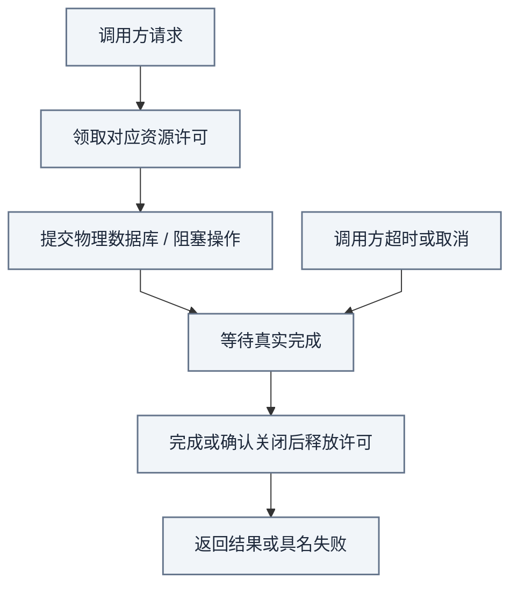
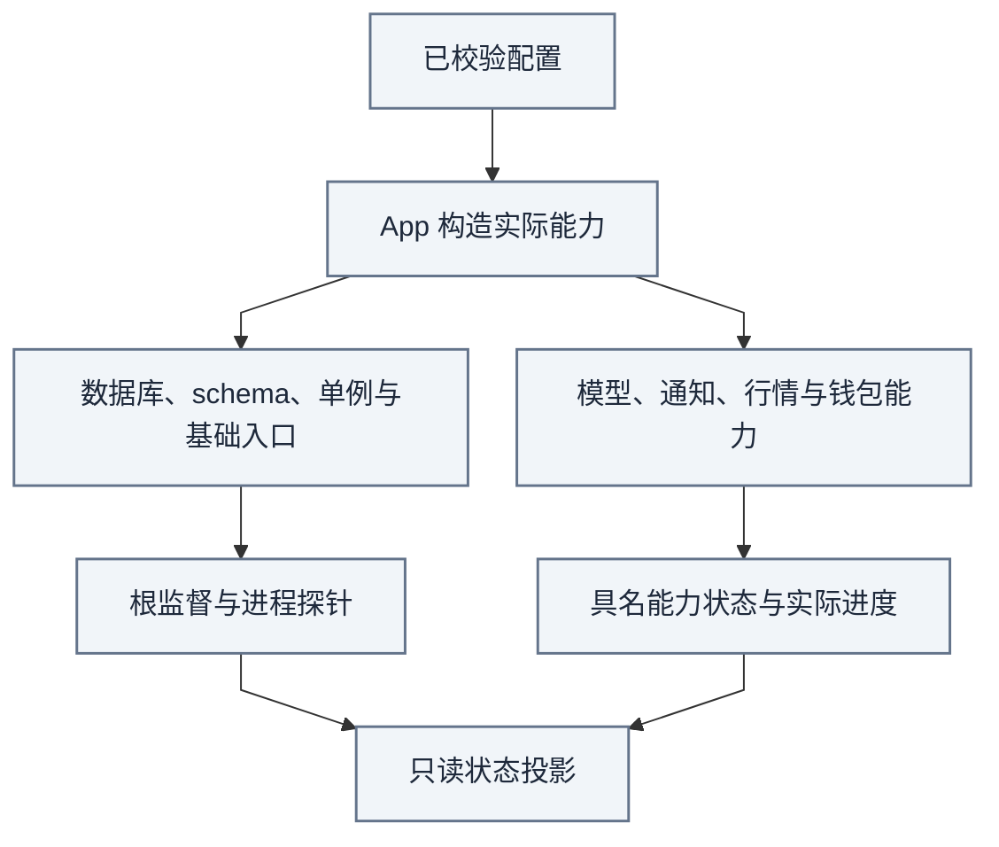

# Platform：配置、资源、适配器与进程装配

[手册](../README.md) · [架构](../ARCHITECTURE.md#packages) · [安装](../SETUP.md) · [测试](../TESTING.md)

Platform 提供物理基础设施，Integrations 对接外部系统，App 装配进程与业务端口。它们不能替 News 或 Trading 创建第二份事实、决策或账户状态。

| 模块速览 | 说明 |
| :--- | :--- |
| **定位** | 运行基础 / 资源与装配 |
| **运行位置** | Platform、Integrations、App 的各自接缝 |
| **输入 → 产物** | 已校验配置、领域端口、外部系统响应 → 受控资源、持久会话、具名任务与观测 |

> [!IMPORTANT]
> 共享基础设施不合并业务所有权；协程超时不意味着物理操作结束或许可已经可回收。

[依赖方向](../ARCHITECTURE.md#packages) · [资源验证](../TESTING.md)

<strong>本页目录</strong>

1. [各层负责什么](#section-各层负责什么)
2. [单一配置入口](#section-单一配置入口)
3. [数据库连接、短事务与资源隔离](#section-数据库连接短事务与资源隔离)
4. [Workers 如何监督任务](#section-workers-如何监督任务)
5. [RabbitMQ 与持久工作](#section-rabbitmq-与持久工作)
6. [外部适配器不能扩大业务权限](#section-外部适配器不能扩大业务权限)
7. [状态与可观测性](#section-状态与可观测性)
8. [验证入口](#section-验证入口)
9. [常见误解](#section-常见误解)

## 01 · 各层负责什么

| 层 | 所有者 | 边界 |
| --- | --- | --- |
| 配置与文件 | [config](../../tracefold/platform/config/)、[paths.py](../../tracefold/platform/paths.py) | 校验配置、解析本地路径与密钥文件；不复制业务策略 |
| PostgreSQL | [postgres](../../tracefold/platform/postgres/) | 连接、迁移、事务设置、维护锁、审计与恢复演练 |
| 资源 | [resource.py](../../tracefold/platform/resource.py) | 准入、物理完成、取消和资源回收语义 |
| 可观测性与身份 | [observability](../../tracefold/platform/observability/)、[runtime_identity.py](../../tracefold/platform/runtime_identity.py) | 结构化观测、进程 / 构建身份；不把探针变成业务事实 |
| 外部适配 | [integrations](../../tracefold/integrations/) | provider 格式、传输与错误分类 |
| 部署装配 | [scripts/deploy.py](../../scripts/deploy.py)、[compose.yaml](../../compose.yaml) | 系统 Python 编排生命周期，Compose 拥有服务与挂载；与应用业务装配分开 |
| App 装配 | [app](../../tracefold/app/)、[workers/wiring](../../tracefold/app/workers/wiring/) | 创建对象、传入能力端口、安排进程与跨域映射 |
| HTTP / CLI | [http](../../tracefold/app/http/)、[cli](../../tracefold/app/cli/) | 接口语法、查询与显式命令适配，不隐藏额外业务流程 |

## 02 · 单一配置入口

[paths.py](../../tracefold/platform/paths.py)解析 `TRACEFOLD_HOME`，默认 `~/.tracefold`；[loader.py](../../tracefold/platform/config/loader.py)读取其中的 `config.yaml`，由 [models.py](../../tracefold/platform/config/models.py)校验。Compose 的可选 `.env` 只承载项目名、宿主机目录与端口等部署参数，不替代业务 Settings，也不形成两份 YAML 的隐式合并。

模型 endpoint 的 `api_key`、`base_url`、`model` 是完整配置组；主 News 路由保留 `news_triage_model` 字段名。News 的 `news_judgment` 独立配置；`news_reader_judgment` 是通知决策层独用的 System One 路由，密钥只接受配置目录下的私有 `api_key_file`（默认 `news_reader_judgment_api_key`），不借用其他路由。Trading 已删除旧 Jev 路由，预测使用独立的 Analysis model 与版本化 Program。

未知字段显式报错；去掉旧字段必须按完整 YAML 路径修改，不能做缩进无关的批量文本替换。`tracefold init` 负责初始化与文件权限，不替升级自动解释所有历史配置。

## 03 · 数据库连接、短事务与资源隔离

App 通过 [repository_session.py](../../tracefold/app/repository_session.py)装配 News、Trading、目录与价格仓储。仓储拥有 SQL 与领域记录，调用方拥有事务、资源接缝和提交。业务层不能借一个通用连接绕过兄弟域边界。

| 运行角色 | 当前资源形状 | 用意 |
| --- | --- | --- |
| Serve | 7 个连接：6 个普通只读许可、1 个控制许可 | 页面查询不挤占基础状态读取；整个 pool 默认只读 |
| Workers | 最多 8 个连接：1 个单例所有权、2 个普通业务、4 个 News lane、1 个控制 | 入口与控制任务不被行情复盘或普通业务挤满 |
| Workers 重型操作 | 单个 heavy gate，再进入普通业务接缝 | 约束重型工作，不另建无界连接池 |

数值与具体超时由 [serve_database.py](../../tracefold/app/serve_database.py)、[worker_database.py](../../tracefold/app/worker_database.py)拥有。它们是当前代码预算，不是“支持多少条每秒”的容量证明。Analysis 与 Runtime 有各自的数据库 / 外部能力装配，不能套用 Workers 的线程数。

*资源视图 · 箭头解释许可生命周期；超时不是底层线程或数据库请求已经停止的证明。*

协程超时不证明线程、数据库请求或外部 native operation 已结束。未结束就释放许可会让真实并发超过上限；把超时异常吞掉也不能证明 shutdown 已经清理资源。

事务内只执行必要 SQL、锁与条件写。网络、模型、文件读取、长计算与昂贵哈希放在事务外。业务 callback 不自行 commit，不在数据库锁下等 provider 回应。

## 04 · Workers 如何监督任务

[task_contract.py](../../tracefold/app/workers/task_contract.py)是任务名、能力与 foundational 属性的唯一声明，`NewsPipeline.runners()`只提供本模块 runner，不决定其他业务域是否健康。

| 分类 | 当前任务 | 未预期程序错误的处理 |
| --- | --- | --- |
| 基础入口 | `news-receiver`、`news-recovery`、`news-deduper`、`news-janitor` | 保留根级失败语义，不能让入口永久停止却持续报告绿色 |
| 编辑与发送 | `news-semantic`、`news-deliverer`、`news-market-notifications` | 标记对应能力异常，健康兄弟任务继续 |
| 目录与价格 | `news-instruments`、`news-quotes`、`news-reactions` | 与编辑链路分别呈现；可恢复 provider 错误按各循环规则处理 |
| 钱包 | `news-wallet-roster`、`news-chain-tape`、`news-wallet-net-buy`、`news-wallet-prices` | 名单、采集、检测、价格各有能力与进度 |

*监督视图 · 故障影响范围由任务与异常类别决定；探针可用不等于所有业务能力都在推进。*

可选任务因为配置缺失而 unavailable、因 provider 暂时失败而退避、因程序异常而 faulted，是不同状态。任务对象存在不等于能力可用，不能由 runner 列表覆盖装配阶段的诊断。修复程序性 fault 后是否需要重启由当前进程机制决定，不声称有隐式无限自愈任务。

## 05 · RabbitMQ 与持久工作

[bus.py](../../tracefold/news/bus.py)、[broker_policy.py](../../tracefold/news/broker_policy.py)、[rabbitmq.py](../../tracefold/integrations/rabbitmq.py)维护声明、投递、重试 / 死信和 provider 结果分类。Compose 固定 RabbitMQ 4.3 系列，是 broker 延迟重试等机制的前置条件。

当前语义唤醒仍使用 `news.triage` 队列，消费者为 `news-semantic`。真正待处理版本、预算和租约在 PostgreSQL；通知工作由轮询续接，不再用一条旧的 `news.deliver` 队列代表最终发送状态。

应用必须先提交事实再发布或确认消息，重放靠幂等身份闭合。broker ready 不等于消费正在推进，队列为空也不等于全部语义工作已完成。

## 06 · 外部适配器不能扩大业务权限

| 适配 | 消费者与作用 |
| --- | --- |
| [OpenNews](../../tracefold/integrations/opennews/) | News 原始实时输入与历史恢复 |
| [Telegram](../../tracefold/integrations/telegram.py)、[Feishu](../../tracefold/integrations/feishu.py) | 发送精确冻结卡片，报告真正可证明的发送结果 |
| [venues](../../tracefold/integrations/venues/) | News 目录、当前报价、历史 Reaction；公共只读 REST |
| [marketdata](../../tracefold/integrations/marketdata/) | Trading 研究的有界原始市场数据 |
| [Robinhood Chain](../../tracefold/integrations/robinhood_chain.py)、[名单适配](../../tracefold/integrations/robinhoodtrenches.py) | 回执采集和名单刷新，两个独立请求边界 |
| [Dexscreener](../../tracefold/integrations/dexscreener.py) | 钱包价格等公共证据，不决定首报资格 |
| [DEMO REST 适配](../../tracefold/integrations/trading/binance.py) | 账户操作与签名 venue evidence；仅执行进程拥有凭据 |

News 的展示报价不是执行 tick feed；最新快照不是历史价格证据；provider transport 不能创建额外 Claim 或私自放宽交易风险。新适配优先复用已有端口，不为每个 helper 新建框架。

## 07 · 状态与可观测性

`/healthz` 是进程存活问题；`/readyz` 是对应角色的就绪问题；业务状态还必须看能力、工作进度、错误、freshness 与测量时钟。`/metrics` 提供该进程的观测，不代表账户资金真实状态。

记录 `event_id` / revision / intent / case / entry 等实际身份，以便串联调用。日志不得写完整密钥、DSN 凭据或含密码 proxy URL。恢复和备份执行证据见[运维](../OPERATIONS.md)及[迁移](../MIGRATIONS.md)，不要为了查看文档生成物连接生产数据库。

## 08 · 验证入口

[包布局](../../tests/architecture/test_package_layout.py)、[后端边界](../../tests/architecture/test_backend_boundaries.py)、[Workers 集成](../../tests/integration/test_workers_runtime_v2.py)、[RabbitMQ 集成](../../tests/integration/test_news_bus_rabbitmq.py)约束不同资源与状态接缝。

文档改动只需相应链接、入口同步、契约和图形检查，不要求真实密钥、模型调用、生产重启或额外基础设施框架。

## 09 · 常见误解

<strong>展开常见问题</strong>

**协程超时后可以立刻释放资源许可吗？**

不一定。许可跟随物理操作实际完成，不能因等待方取消就扩大真实并发。

**readiness 正常是否代表全部能力正常？**

不代表。具名能力、数据新鲜度与工作进度分别读取。

---

[返回文档中心](../README.md) · [架构图谱](../ARCHITECTURE.md#atlas) · [返回顶部](#platform配置资源适配器与进程装配)
