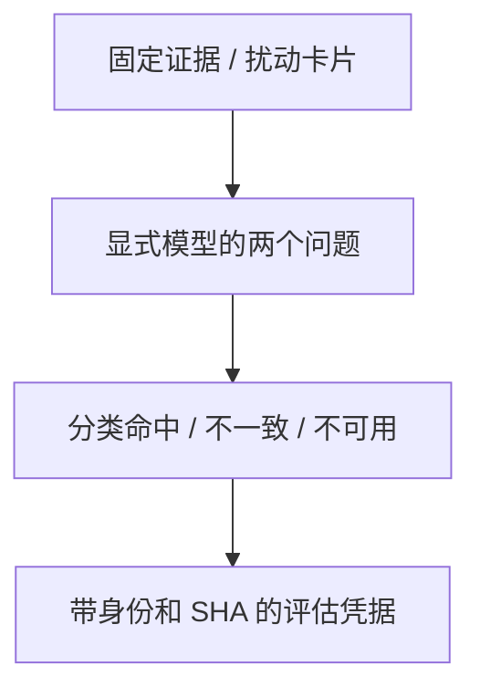

# 卡片评审器校准

[手册](../README.md) · [News](news.md) · [测试](../TESTING.md) · [离线研究](../../notebooks/README.md)

`tracefold news learning judge-calibration` 在固定合成语料上测量卡片评审器是否回答正确。它是显式运行的离线评估，不参与 News 生产判定、发送或 Trading，不读取生产数据库，也不训练或激活模型。

## 两个有界问题

评审器只读取调用方提供的不可变证据和冻结卡片正文，分别回答：卡片的每个重要陈述是否得到证据支持，以及预先给定的 must-keep facts 是否仍在卡片中表达。它不能补充外部知识、决定通知或把模型意见写成来源真值。

事实支持返回 typed verdict、未支持陈述、证据缺口和错误类型；事实覆盖必须按问题顺序给出等长布尔列表。无法访问模型、响应格式无效或答案长度错误以 `unavailable` / `judge_unavailable` 表达，不制造拒绝结论。相同证据/正文的成功回答可在一次运行中缓存并协调并发，失败不缓存。

## 固定语料与凭据

语料随应用包分发，当前包含 14 对证据与卡片，覆盖实体替换、数字/单位替换、条件删除、计划写成执行、无依据因果、忠实改写、证据支持的强结论七类。最后两类应通过，以检测把所有卡片都拒绝的评审器。语料加载验证 schema、case ID 唯一性、卡片结构和七类完整性。

评估报告按扰动类别保存已回答数、命中数和不一致样本；不可用回答单独统计，不能把提供商故障算成模型判断错误。JSON 凭据钉住语料、judge 程序、指令/schema、DSPy、显式模型与执行配置，并带 `receipt_sha256`，使不同运行的证明可核对。



*评估视图 · 箭头是离线测量产物，不连接生产判定、通知或模型激活。*

## 运行入口与证明范围

```bash
# 查看参数，不调用模型
uv run tracefold news learning judge-calibration --help
# 显式运行；会调用配置端点
uv run tracefold news learning judge-calibration --model MODEL --out judge-calibration.json
```

CLI 使用已配置的 `llm.news_triage_fallback` endpoint / 凭据，并要求显式 `--model`；端点缺失具名失败。模型请求最多输出 4,096 tokens、超时 120 秒，关闭 LM cache 和自动重试。配置来源不把校准变为生产 fallback 调用；输出只保存到操作员指定文件和 CLI 摘要。

合成语料证明已知错误类型的识别能力，不代表真实新闻分布、独立人类一致性或交易收益。真实业务评估应另记采样范围、来源/事件版本、实际评审者和误差定义。由人发起的 AI 评分仍是模型评审；模型分数不能写成人工确认。

## 实现与验证

| 实现 | 职责 |
| --- | --- |
| [learning/judge.py](../../tracefold/news/learning/judge.py) | 两个类型化问题、调用与成功缓存 |
| [learning/judge_calibration.py](../../tracefold/news/learning/judge_calibration.py)、[固定语料](../../tracefold/news/learning/resources/judge_calibration_cases.json) | 语料校验、分类测量和凭据 |
| [news_learning.py](../../tracefold/app/cli/commands/news_learning.py)、[learning_runtime.py](../../tracefold/app/learning_runtime.py) | 显式端点装配与 JSON 文件输出 |

[Judge 边界](../../tests/architecture/test_news_judge_boundary.py)证明评估不访问数据库或生产运行所有者；[固定语料测试](../../tests/news/test_news_judge_calibration.py)验证统计和凭据结构。真实模型校准需要本次运行凭据，离线测试通过不能代替。
