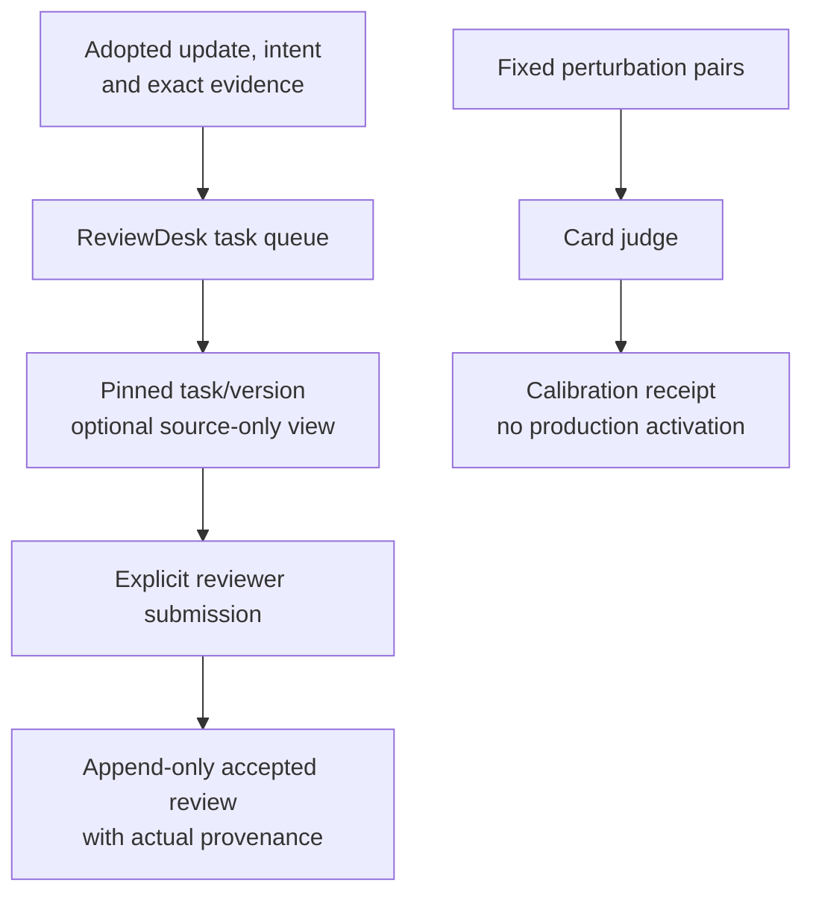

# ReviewDesk and card-judge calibration

[Handbook](../README.md) · [News](news.md) · [Review terminology](../../CONTEXT.md)

The current review product inspects News intent/update evidence and records the
actual review. The retained card judge can be measured against a fixed perturbation
corpus. Neither path automatically changes the News Agent or activates a model.

## 1. Current source owners

| Owner | Responsibility |
| --- | --- |
| [review/desk.py](../../tracefold/news/review/desk.py) | Versioned tasks, queue/evidence views, accepted reviews and external misses |
| [learning/judge.py](../../tracefold/news/learning/judge.py) | Card-copy judge, not the semantic or notification authority |
| [judge_calibration.py](../../tracefold/news/learning/judge_calibration.py), [corpus](../../tracefold/news/learning/resources/judge_calibration_cases.json) | Fixed synthetic calibration inputs and measurement |
| [app/learning_runtime.py](../../tracefold/app/learning_runtime.py) | Composition of the retained bounded resources |
| [CLI parser](../../tracefold/app/cli/parsers/news.py), [review handler](../../tracefold/app/cli/commands/news_review.py), [learning handler](../../tracefold/app/cli/commands/news_learning.py) | Actual read/write commands and calibration adapter |

The package directory `learning` is not evidence of an available optimizer. Its
remaining code and the parser determine the capability, not the historical name.

## 2. Review flow and provenance



`news review queue` selects existing tasks. `news review evidence TASK --version
VERSION` reads the pinned evidence; `--source-only` excludes the Agent answer and
existing reviews. `news review submit` accepts the supplied rubric with its actual
reviewer principal and idempotency identity. `external-miss` records a different
fact: missing coverage, not an invented original News intake.

Use [generated CLI help](../generated/cli-help.md) for exact required arguments.
Submission is a write, not merely displaying a draft. An assisted proposal is not
accepted Gold, and acceptance does not prove independent human accuracy. Preserve
who proposed/accepted, which evidence/version they saw and what they could not know.
Do not relabel AI-generated reviews as human judgments.

Current tasks use the new intent/update product. Old verdicts and their retained
ReviewDesk vocabulary remain explicitly historical; they are not converted into
new EventUpdate claims. [Contracts](../CONTRACTS.md) explains the legacy read fields.

## 3. Judge calibration and limits

```bash
uv run tracefold news learning judge-calibration --help
```

This help command makes no model call. The actual calibration operation requires
an explicit model, spends provider resources, and can write its receipt using
`--out`. It needs no database write and does not update accepted reviews, semantic
checkpoints, notification policy or runtime selection.

Agreement on synthetic perturbations is not production recall, claim accuracy,
reader usefulness or trading returns. Count failures and unavailable results with
their actual denominator. The card judge is not another compulsory approval before
semantic adoption or delivery.

The old fixed News Program, GEPA campaign, dataset freeze/baseline and
release/canary commands are removed from current execution. Historical artifacts
remain in their original Git or research context; they do not make those commands
available. An exact `news retry-work` repair is not training or model promotion.

## 4. Verification

Use [judge boundary tests](../../tests/architecture/test_news_judge_boundary.py),
[judge calibration](../../tests/news/test_news_judge_calibration.py),
[review CLI](../../tests/news/test_news_review_cli.py), and
[ReviewDesk integration](../../tests/integration/test_news_review_desk.py).
No end-to-end automatic optimization/release loop for the new News Agent is implied
by the retained review and calibration capabilities.
