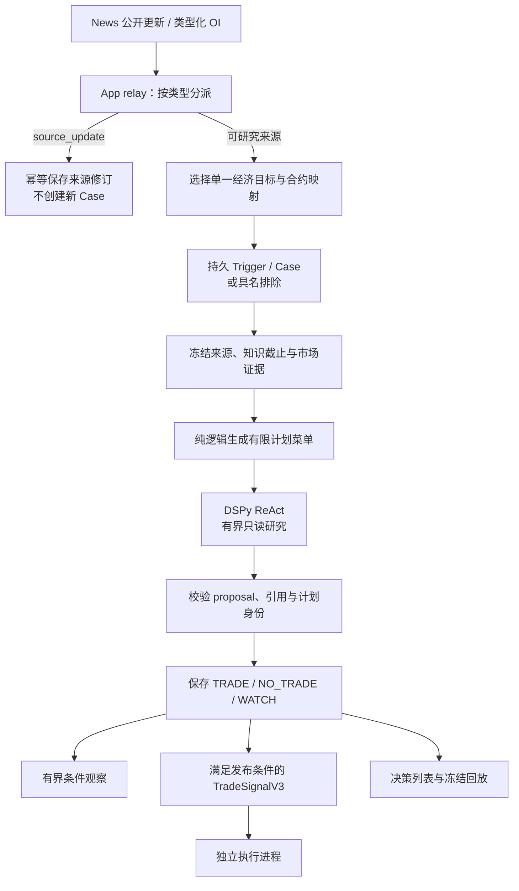
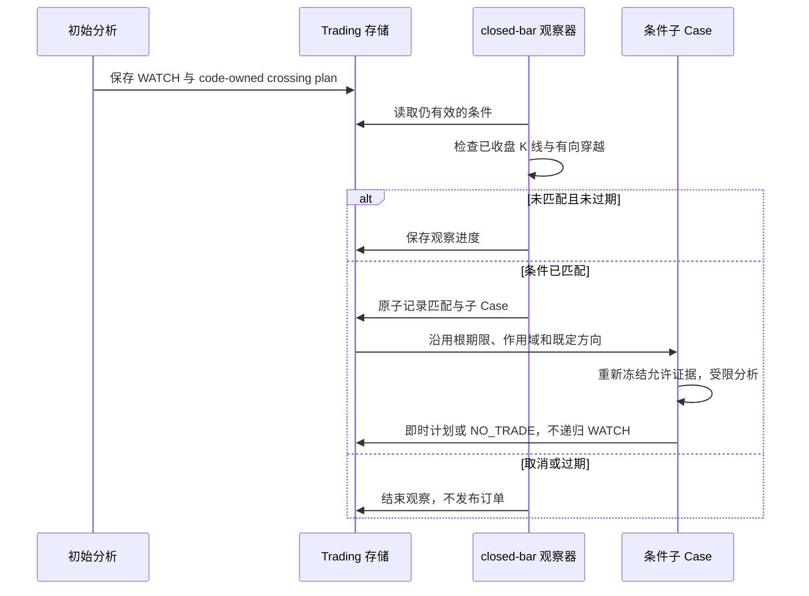

# Trading Analysis：从公开事实到受限交易研究

[手册](../README.md) · [系统架构](../ARCHITECTURE.md) · [News](news.md) · [Execution](execution.md)

Trading Analysis 回答：“基于当时可见的来源和市场证据，是否选择当前代码允许的某个入场计划？”它不直接下单，也不依赖新闻卡片是否发送。**Agent 负责研究与选择，纯编译器负责契约约束，Runtime 才拥有账户操作权限。**

## 1. 入口与所有者

| 实现 | 职责 |
| --- | --- |
| [app/trading_analysis.py](../../tracefold/app/trading_analysis.py) | `AnalysisRunner`：可靠转交、Case 调度、证据冻结、WATCH、研究结果 |
| [app/trading_analyst.py](../../tracefold/app/trading_analyst.py) | `TradeAnalyst`：原生 DSPy ReAct、调用预算和物理请求账本 |
| [app/trading_tools.py](../../tracefold/app/trading_tools.py) | 只读 Case 工具、可见证据、引用与访问限制 |
| [app/analysis_files.py](../../tracefold/app/analysis_files.py) | 冻结研究材料与文件身份 |
| [engine/target.py](../../tracefold/trading/engine/target.py) | 经济身份与原生合约目标选择 |
| [engine/features.py](../../tracefold/trading/engine/features.py)、[brief.py](../../tracefold/trading/engine/brief.py) | 将原始来源和市场证据变成可审计特征、简报 |
| [engine/plans.py](../../tracefold/trading/engine/plans.py)、[policy.py](../../tracefold/trading/engine/policy.py) | 内容寻址的有限计划、引用校验与纯决策编译 |
| [storage/analysis.py](../../tracefold/trading/storage/analysis.py) | Trigger、Case、租约、决策、WATCH、来源修订与原子结算 |
| [execution_contracts.py](../../tracefold/trading/execution_contracts.py)、[storage/execution_stream.py](../../tracefold/trading/storage/execution_stream.py) | Signal / 操作意图 / 执行观察的严格交接 |

`trading/engine` 不调用模型、网络或数据库；App 按显式端口装配 I/O。Analysis 是独立进程，不是 News Workers 的一条可选函数调用。

## 2. 研究链路



<a id="editorial-catalyst-versus-source-amendment"></a>
## 3. 催化增量与来源修订

编辑型 News 通过 `news_public_update_v1` 提供已采用的变化命题、精确引文、前驱 / 受影响引用、首次可用与语义完成时钟。该契约由知识生成，不读卡片的 headline / why 作为替代事实。

| 来源 | `relay_once` 的处理 |
| --- | --- |
| `catalyst_delta` | 从变化命题的主要资产中选合格目标；不是把所有提到的资产都拿来交易 |
| `source_update` | **先于目标选择**保存 Trading amendment；不产生 Trigger / 新 Case / 新 TTL |
| OI | 保留原生 measurement、来源窗口与 source-key 身份，独立匹配交易目标 |

旧式仅有 headline / why 的催化 payload 不被当前编辑型公开更新路径接受。多个合格主要资产同时出现时，应保留歧义排除，而非随机选一个。目标不存在、被配置排除、单位不明确或来源已过期都需要具名结果。

News 和 Trading 的事务独立：先持久接收，再确认相同 outbox 身份和 payload。中间崩溃可能重放，由幂等身份避免重复 Case；它不是跨域共享一次数据库提交。

修订可指向另一 Event 的旧 Claim。研究只读取知识截止前可知的材料；后来的修订作为新事实保留，不重写已冻结的历史。运行时可据显式更正拒绝尚未提交的入场，但 source_update 自身不拥有撤单、平仓或刷新入场有效期的权力。

## 4. 一个 Case 冻结什么

| 材料 | 用途 |
| --- | --- |
| 来源身份与首次可用时间 | 确定根的有效期，避免模型完成时间给旧来源续期 |
| 经济资产、原生合约、单位与映射摘要 | 防止同名币、倍数合约或错误环境被混用 |
| 知识截止时间与历史来源 / 修订 | 明确当时允许看到哪些事实 |
| 原始市场数据及覆盖信息 | 可复算特征，缺失保持缺失 |
| 特征、简报与可引用证据 refs | 区分观察、派生计算和研究结论 |
| 有限 EntryPlan 菜单 | 限定可选方向、条件、时效与退出规则 |
| 工具调用、模型请求、proposal 与最终决策 | 保留实际研究路径与失败边界 |

`FrameReader.prepare` 将原始行情端口映射为 Trading 自己的冻结材料。读 API 的 Case replay 是读取这些记录，**不是重新请求行情或重新跑模型**。

## 5. Agent 有哪些工具

| 工具 | 允许做什么 | 不允许做什么 |
| --- | --- | --- |
| `get_event_context` | 按有界主题和时间范围读取 Case 可知的历史事件 | 任意扩展历史或读取知识截止后的更正 |
| `get_market_snapshot` | 读取允许的数据集与窗口，形成可引用市场证据 | 无限制行情下载或取得订单写权限 |
| `read_evidence` | 按可见 ref 和有界片段读取已授权材料 | 任意文件、SQL、shell、跨 Case 私有内容 |
| 可选 `assess_claims` | 对明确命题和事实 refs 做有界判断 | 创建一个独立拥有交易批准权的“第二 Agent” |

调用账本区分逻辑工具步骤与物理模型请求。物理请求开始前登记，完成后记录 token、时钟、费用或未知结果；无法确定的费用不能填成零。模型异常、工具异常、证据不足、合法 NO_TRADE 是不同结果。

所有循环受 Case 所有权、模型超时、输入 / 输出大小、调用并发与成本边界约束。修正非法 proposal 的流程也必须有界，不能靠无上限“再试一次”获得一个看似合规的答案。

## 6. 计划不是模型随意生成的参数

当前 `entry_plan_v1` 由代码构造，模型从当次可见菜单选择 `plan_id` 或不交易。计划包含来源版本、映射摘要、引用、方向、参考价、时效、条件与退出策略。

| 计划类型 | 语义 |
| --- | --- |
| `immediate_entry_v1` | 在剩余有效期内提出即时入场；仍需 Runtime 的最终账户与来源检查 |
| `closed_bar_cross_v1` | 等待已收盘 1 分钟 K 线按方向穿越价格条件；匹配后创建条件子 Case |

当前 [plans.py](../../tracefold/trading/engine/plans.py)的退出参数是代码政策，不是 Agent 的自由建议：取连续 16 根 1 分钟 K 线，计算既定 ATR14；止损距离按 `2 × ATR14 / 参考收盘价` 换成基点并向上取整，约束在 **100–1,000 bps**；止盈距离为止损的两倍；最长持有 **14,400 秒**。缺少连续有效 K 线时不制造默认计划。

计划入场有效期不超过根到期时间，并受参考 K 线后 **120 秒**窗口约束。根 TTL 的默认配置为 **600 秒**。这些分别是来源、入场计划和持仓期限，不能相互替代，更不能在模型重试或 WATCH 触发后不断续期。

纯编译器检查所选计划确实存在、方向和引用有效、proposal 契约合法，再生成最终 action。它不需要网络，也不会从一个自由文本“看多”直接构造账户订单。

<a id="state"></a>
## 7. Case、结果与发布状态

| 维度 | 示例 | 回答什么 |
| --- | --- | --- |
| Case `state` | `PENDING`、`RUNNING`、`DONE`、`SIGNAL_EMITTED`、`FAILED`、`EXCLUDED` | 这次持久工作处于哪里 |
| `analysis_status` | 待分析、成功、排除、过期或具名失败 | 分析是否真正执行以及如何结束 |
| `action` | `TRADE`、`NO_TRADE`、`WATCH` | 有效分析作出了什么决策 |
| `publish_status` | 是否发布及未发布原因 | 决策是否形成可消费 Signal |

`TRADE` 可以因为发布关闭或有效性条件不满足而未发布；`NO_TRADE` 是合法决策，不是系统失败；`WATCH` 不是已成交。不能用一个字段替代全部过程。

Case 领取绑定 claim token、lease 和根期限。超时或失去所有权的旧任务不能覆盖新的完成结果；模型开始 / 完成记录、证据冻结和最终决策必须指向同一次尝试。未知失败不能被伪装为“不交易，所以安全完成”。

## 8. WATCH 如何结束



WATCH 保存 waiting / triggered / cancelled / expired 的观察语义。穿越由前一根与当前已收盘价判定，不拿尚未收盘的瞬时价格直接执行。条件匹配只是研究触发，不是交易所下单动作。

## 9. Signal 的权限边界

`TradeSignalV3` 绑定账户槽位、entry scope、目标和映射摘要、Case / decision、方向、计划与根约束的截止时间。发布策略、有效来源、数据库原子结算与 Runtime 接受都是独立边界。

默认 `trading.enabled=false`、`trading.analysis.publish_signals=false`、`trading.execution.enabled=false` 分别控制分析能力、Signal 发布和执行。开启模型配置不会隐式开启账户。

Runtime 仍需读取准确的 Binance connection、账户状态、风险、保护与并发条件。News 通知命中观察名单、标记 key 或 OI 数字很大，都不能跨越这条权限边界。

## 10. 研究结果与真实执行收益

`label_once` 与根研究采样保存规定期限下的价格路径，不依赖模型最终是否选 TRADE。它们支持复盘选择与遗漏，但不是交易所成交事实。

真实收益必须由原生成交、手续费、资金费率和覆盖状态组成。历史导入、研究重放和重新分析不能刷新 Signal TTL、覆盖原 Case 或给过去交易补一个虚构成交。详细归属见[执行文档](execution.md)。

## 11. 排障与验证

```bash
docker compose exec -T analysis tracefold trading status
docker compose exec -T analysis tracefold trading cases --limit 20
docker compose exec -T analysis tracefold trading gate --limit 20
```

排查顺序：来源公开记录 → relay 接收 / 排除 → Case 领取 → 冻结证据 → 物理模型账本 → proposal / compiler → action → publish_status → Runtime 实际处理。新闻推送阈值不是这条链路的答案。

验证入口：[领域边界](../../tests/architecture/test_trading_boundaries.py)、[计划与策略](../../tests/trading/test_oi_price_strategy.py)、[Analysis runner](../../tests/integration/test_trading_analysis_runner.py)、[分析存储](../../tests/integration/test_trading_analysis_storage.py)、[公开来源修订](../../tests/integration/test_trading_analysis_public_updates.py)、[Signal 作用域](../../tests/integration/test_trading_signal_v3_scope.py)。
