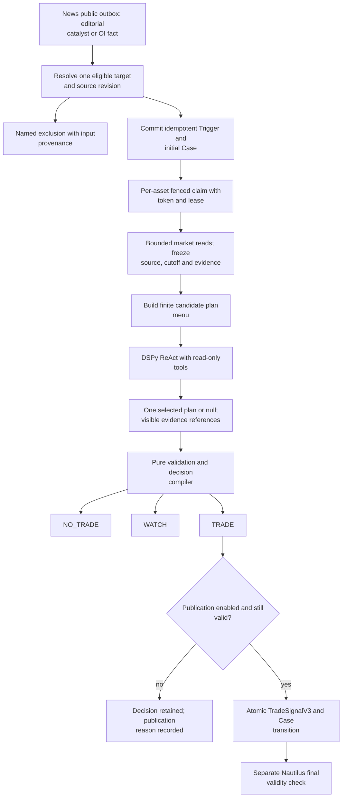
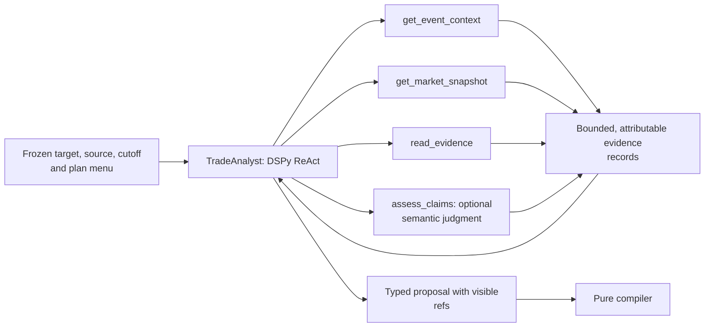
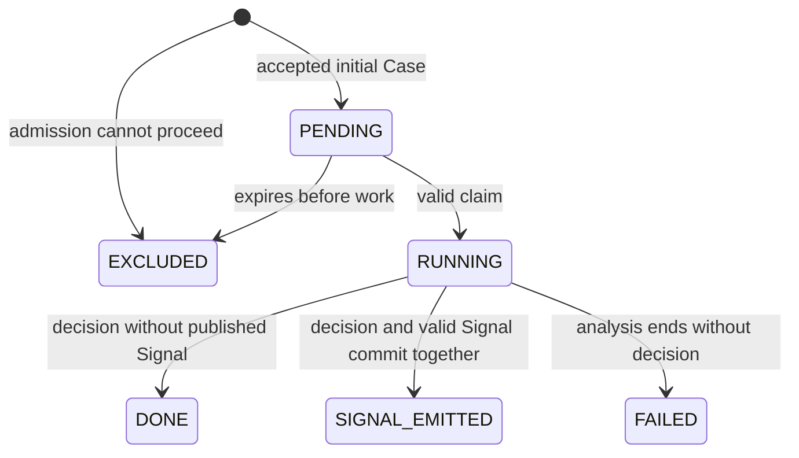
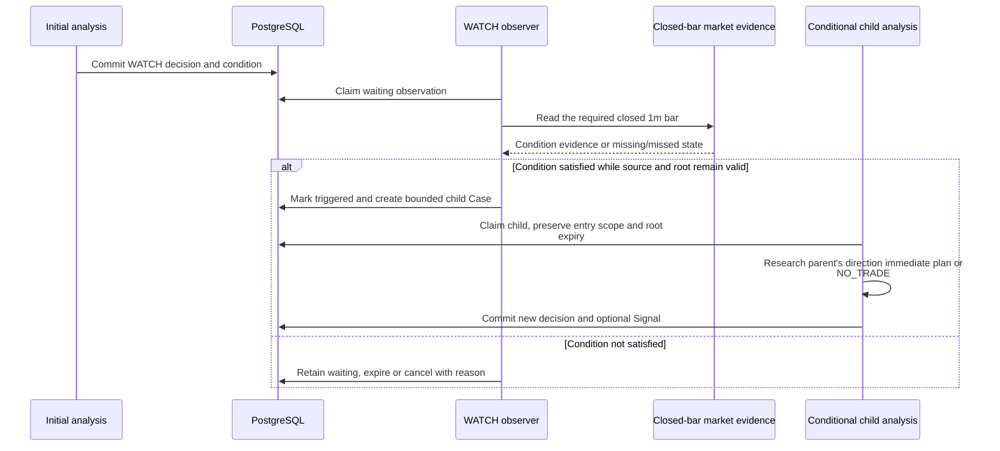

# Trading Analysis: source, Case, decision and Signal

[Handbook](../README.md) · [Architecture](../ARCHITECTURE.md) ·
[Execution](execution.md) · [OI](oi.md)

Trading Analysis owns an auditable research decision for one eligible target. It
is a separate process from News Workers and from the account-owning Nautilus
Runtime. It does not import News internals, place orders or treat a delivered
reader card as execution permission.

## 1. Implementation map

| Owner | Responsibility |
| --- | --- |
| [app/trading_analysis.py](../../tracefold/app/trading_analysis.py) | `AnalysisRunner`: source relay, claims, frozen frame preparation, Agent calls, settlement, WATCH and research outcome sampling. |
| [app/trading_analyst.py](../../tracefold/app/trading_analyst.py) | `TradeAnalyst`: one native DSPy ReAct agent, bounded physical calls, structured proposal and narrow correction path. |
| [app/trading_tools.py](../../tracefold/app/trading_tools.py) | Read-only evidence tools, knowledge-cutoff enforcement and optional claim assessment. |
| [engine/target.py](../../tracefold/trading/engine/target.py) | Eligible target and economic identity selection. |
| [engine/features.py](../../tracefold/trading/engine/features.py), [marketdata.py](../../tracefold/trading/engine/marketdata.py) | Typed evidence, feature meaning and market-data contracts. |
| [engine/brief.py](../../tracefold/trading/engine/brief.py), [plans.py](../../tracefold/trading/engine/plans.py), [policy.py](../../tracefold/trading/engine/policy.py) | Frozen brief, finite plan menu, validated proposal and pure decision compilation. |
| [storage/analysis.py](../../tracefold/trading/storage/analysis.py) | Triggers, fenced Cases, attempts, model-call receipts, decision/publication and WATCH state. |
| [execution_contracts.py](../../tracefold/trading/execution_contracts.py) | Current `TradeSignalV3`, scoped entry/exit envelope and operator/execution contracts. |
| [analysis_files.py](../../tracefold/app/analysis_files.py), [analysis_status.py](../../tracefold/app/analysis_status.py) | Content-addressed evidence archives and process status. |

The pure engine has no provider, database or Nautilus order dependency. App supplies
I/O and maps public News values into Trading's own contracts.

## 2. The complete live research path

A timeout in target lookup is not an acknowledgement of the source. Trigger commit
precedes News acknowledgement; replay across that gap is intentional and idempotent.
Malformed public payloads have a named rejection outcome rather than silently
entering an alternative compatibility path. Source amendments are dispatched
before target selection and do not create a Trigger or initial Case.

### Editorial catalyst versus source amendment

The public editorial schema is **`news_public_update_v1`**, emitted from adopted
EventUpdates by [public.py](../../tracefold/news/updates/public.py) and mapped by
[app/news_updates.py](../../tracefold/app/news_updates.py). Reader-card text is not
its authority. Historical `headline`/`why` payloads are rejected on this path,
not silently interpreted as the current structured contract.

| Public kind | Trading treatment | What it must not do |
| --- | --- | --- |
| `catalyst_delta` | Select from changed claims' primary assets; persist an eligible Trigger/Case with public update identity and first-availability time. | Treat restatement or unresolved `possible_new` as a fresh catalyst merely because new prose arrived. |
| `source_update` | Record an idempotent amendment in `trading_source_amendments`, before target selection. | Create a new Trigger/Case, refresh the original TTL, cancel an existing venue order or grant new account authority. |

Corrections, refutations/evidence amendments and real-world replacements preserve
explicit target claim refs, including cross-Event refs. Final entry checks can
reject a still-unsubmitted entry as `source_corrected`. This is source validity,
not a new Agent approval or an automatic flatten operation. Amendment/supersession
reads retain the knowledge-time cutoff; OI keeps its separate source-key scope.
An immutable historical Case is not rewritten after a later correction.

## 3. What the Agent can and cannot do

The tools are read-only. There is no `buy`, `sell`, unrestricted SQL, arbitrary
network tool or account command in this menu. Tool output and source text are
untrusted evidence, not instructions that can grant new authority.

The Agent chooses a visible `plan_id` or null, cites supporting/opposing evidence
and states limitations. Optional Jev/System One claim assessment produces a
separately attributable judgment; it is neither compulsory nor a second order
approver. Tool-record references and judgment references have different meanings.

The physical-call ledger records request start before external I/O and outcome
when known. A Case can contain several ReAct/tool/extraction calls; one Case is not
one model request. Unknown token cost is recorded as unknown rather than zero.
A limited correction path handles named correctable proposal/reference errors;
it does not transform a model failure into a positive decision.

## 4. Freeze and concurrency semantics

A Case records source identity/revision, selected target mapping, root validity,
knowledge cutoff, raw market evidence, features, brief/menu, assessment and decision.
Content-addressed artifacts preserve what was actually read; a later console read
must not rerun the model or fetch fresh data into the historical decision.

`claim_analysis_case` and settlement use a token and lease. Settlement additionally
checks root/work deadlines and relevant per-asset coordination. An old worker's
late answer cannot commit just because it knows the Case ID. Publication checks
newer/superseding source evidence and binds the same Case, decision, scope, target,
mapping digest, direction and selected plan.

The principal settlement states are:

This diagram summarizes admission and settlement, not every lease-recovery SQL
branch. `state`, `analysis_status`, decision `action` and `publish_status` are
separate axes. For example, a valid TRADE with publication disabled is not a
Signal, and an infrastructure failure is not the Agent deciding NO_TRADE.

## 5. WATCH is observation followed by another decision

The initial `closed_bar_cross_v1` selection does not place an order when crossed.
The child must analyze again, uses the same entry scope and cannot create another
recursive WATCH. No new root TTL is granted to revive an old catalyst. The durable
watch vocabulary includes `waiting`, `triggered`, `cancelled` and `expired`.

## 6. The Signal is a recommendation, not capital authority

Current publication uses **`TradeSignalV3`**, not V1/V2. Its identity binds Case,
decision, account slot, entry scope, asset, native route and mapping digest. It
also carries direction, observed/expiry clocks, exit plan and an explicit immediate
or activated-condition entry envelope. The Signal's expiry cannot outlive its root.

`publish_signals` defaults to false. Even when true, the Runtime performs the final
validity and account/venue checks before an order. Position sizing and protective
orders are execution responsibilities. The analysis menu's deterministic exit
parameters are code-owned, not free-form Agent inventions.

Research price-path outcomes, historical simulation and native execution outcomes
are different denominators. A hypothetical profitable decision is not a venue fill
or a strategy profitability proof. Exact-image historical replay must not issue
retrospective Signals, refresh an expired root or mutate old decisions.

## 7. Diagnose in order

| Question | Durable evidence |
| --- | --- |
| Was the source offered? | News outbox identity, payload digest and relay acknowledgement/rejection. |
| Was a target eligible? | Trigger target selection or named exclusion, including mapping provenance. |
| Did analysis run? | Case claim/attempt and physical model-call records, not just process uptime. |
| What did it decide? | Frozen menu, validated proposal, compiler reason and action. |
| Why no Signal? | Publication disabled/blocked/superseded/expired outcome, separately from action. |
| Did it execute? | Runtime acceptance and signed venue/native execution evidence; see [Execution](execution.md). |

Relevant tests: [analyst](../../tests/trading/test_trading_analyst.py),
[tools](../../tests/trading/test_trading_tools.py),
[analysis storage](../../tests/integration/test_trading_analysis_storage.py),
[runner](../../tests/integration/test_trading_analysis_runner.py),
[public updates and amendments](../../tests/integration/test_trading_analysis_public_updates.py),
[Signal V3 scope](../../tests/integration/test_trading_signal_v3_scope.py), and
[execution stream](../../tests/integration/test_trading_execution_stream.py).
[Operations](../OPERATIONS.md) retains the actual status/control commands and
[Contracts](../CONTRACTS.md) the exact read/write API shapes.
