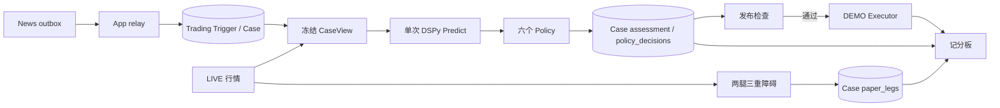

# Trading Analysis：LIVE 事实、冻结预测与可比结果

[手册](../README.md) · [系统架构](../ARCHITECTURE.md) · [News](news.md) · [Execution](execution.md)

Analysis 独立接收 News 公开 Trading 事实，从 Binance USD-M **LIVE** 市场数据冻结 CaseView。模型只预测多、空纸面腿的 TP / SL / timeout 概率；纯函数策略把预测映射为 long / short / abstain。执行账户仅允许 **DEMO**。Analysis 即使不发布 Signal、执行器离线，仍持续建立两条纸面腿和记分板。



## 摄入与冻结

`trading_intake.py` 在 App 边界把 News 的公开 catalyst delta、source update、OI 映射成 Trading 值。News 与 Trading 各自提交事务；Trading 持久接收后才确认 outbox。source update 不创建 Case 或新 TTL。目标选择只认单个合格 crypto 主要资产，使用 LIVE exchangeInfo `baseAsset` 和经核实的倍数映射。排除原因存在 Trigger；只有选中的 Trigger 有 Case。DEMO 是否上市只在发布时检查，因此不影响纸面样本。

`CasePreparer` 读取 LIVE 永续、现货、BTC 基准 K 线、OI、funding / premium 和盘口。连续 16 根已收盘 1m K 线决定 `leg_geometry_v1`：止损 `ceil(2 × ATR14 / close × 10000)`，限制为 100–1000 bps；止盈 2R；最长持有 4 小时。任何关键输入缺失都具名失败，不从 DEMO 或缺失值制造事实。

每个 Case 只写一次 gzip 原始快照到 `archive/trading-cases/<sha前缀>/<sha>.json.gz`，保留 30 天。PG 的 `trading_cases.view` 保存不可变 CaseView，包括特征、短证据别名、News 类型化字段、同资产近期事实与修订、PIT 基线、双侧几何与点差。模型输入排除 Case ID、绝对时钟和 64 位摘要；原始身份与 cutoff 留在 PG。失败重领复用同一 `view`，不重取历史行情。

PIT 基线按同 trigger_kind × side 取前 14 天已到期、且当时已落库的纸面腿；不足 30 条为空，不补零。历史 CaseView 不随之后修订或基线增长改变。

`trading_inputs` 统一保存 OI、catalyst 与 source update；Case 的 `assessment`、`policy_decisions`、`paper_legs` 保存预测、策略决定和成对标签。文档由 Trading 的类型模型验证，小数存为字符串，读取时恢复 numeric；`record_forecast` 只允许首次写入或内容完全相同的重试。运行状态属于平台 `runtime_processes`，由 App 装配读取，Trading 不拥有或查询进程存活表。

## 预测、策略和发布

`trading.analysis.program` 用 JSON 路径和 SHA256 钉住一个 `dspy.Predict(ForecastSignature)` 工件；工件不含 LM、endpoint 或密钥。`trading.analysis.model_name` 必须显式设置，并由独立 Analysis 进程调用配置的 LLM endpoint，不从 News triage 猜模型。工件缺失或 sha 不符时状态为 `faulted`，不静默换用别的程序。

Assessor 一次输出两侧三类概率与最多 12 条证据驱动，Pydantic 校验概率和结构。未知证据别名被丢弃并记入 notes。失败分 `parse`、`truncated`、`schema`、`provider`、`timeout`、`rate_limit`；只有暂态错误在同一截止内重试。模型调用的截止时间从获得并发槽位后起算，排队等待不消耗 provider 超时预算。模型用量随 assessment 入库。

每个 Case 都保存 `forecast`、`always_long`、`always_short`、`abstain`、`momentum15m`、`fade15m` 六个动作。ForecastPolicy 以恒等校准器计算扣除双边 taker 5 bps 与 LIVE 半点差后的期望 R；阈值以下 abstain。`active_policy` 指定唯一 live policy，默认 `forecast`；`publish_signals` 默认 false。发布前检查执行器心跳、DEMO 合约上市、来源更正 / 替代和根到期，结果作为 `publish_status` 持久保存。Signal v4 仍由 DEMO executor 独立做账户与行情准入；发布不等于受理或成交。

## 纸面腿、记分板和重放

决策时刻后的首根 LIVE 1m 收盘作为两腿共同锚点。后续 4 小时应用 SL / TP / timeout 三重障碍，同一 bar 同时碰到 SL 和 TP 按 SL；净 R 扣双边 5 bps taker 与冻结半点差。缺 bar、缺锚点和未到期窗口写 `missing` 及原因，不当作零收益。冷标签读取 LIVE，与 executor 是否在线无关。

同一个 PostgreSQL `scoreboard()` 构造器供 CLI、HTTP、UI 使用。漏斗展示 Trigger、选中、评估成功、发布、执行受理与成交；每个 Policy 显示覆盖率、净平均 R、胜率与按日 × 资产聚类 bootstrap 的区间。预测质量显示多类 Brier、log loss、相对 PIT 基线的 BSS 和可靠性分箱。执行偏差比较实际成交 R 与同 Case 同方向纸面 R。样本不足显示 `insufficient_data`，不显示伪精度。

```bash
tracefold trading scoreboard --since 2026-09-01 --until 2026-09-08
```

Replay 只读取已冻结 CaseView，对候选程序打开 DSPy cache，写候选 SHA 的 assessment 与六个动作，不发 Signal、不访问行情或交易所。比较应使用预先登记的同一 Case 窗口；人工修改配置中的 SHA 才晋升。当前没有自动优化器或自动晋升。数据门槛与实验约束见 [Issue #746](https://github.com/AnalyThothAI/tracefold/issues/746)。

## 接口、迁移与操作

`GET /api/trading/status` 报 Analysis 的程序、模型、故障及执行器状态；`GET /api/trading/cases` 列表或以 `?case_id=<64位hex>` 读取冻结 Case、assessment、策略动作和双腿标签，也可用 `?source_item_id=<OI观察ID>` 查关联 Case；`GET /api/trading/scoreboard` 可指定窗口和程序 SHA；`GET /api/trading/executions` 是场所证据支持的执行投影。CLI 有 `trading status`、`cases`、`scoreboard`、`signals`、`fills`。浏览器使用同一 API，不拥有下单权限。

迁移 `20260929_0418` 是不可降级的 Analysis 数据硬切：删除旧 Gate、WATCH、ReAct 模型调用与旧 Case 表，重建 LIVE Case / assessment / action / paper 账本；不回填原 DEMO 行情事实。部署前停止 Analysis、确认执行账户仓位 / 普通单 / Algo 单均为零、完成 Trading 全表备份，并确保当时的 Signal 表无旧行。迁移与新镜像应在同一维护窗口完成。执行层迁移 `0417` 和 Demo 操作见 [Execution](execution.md)、[运维](../OPERATIONS.md#trading-operations)。旧 `archive/trading-analysis` 留作已授权的验收期隔离清理，不再写入。

`20261001_0424` 在停写维护窗口将当前账本无损收敛，保留冻结模型输入、策略、纸面标签和公开 HTTP 投影。`trading replay` 已删除；候选离线评估需另建带运行身份的评估账本。升级、导出与恢复步骤见 [迁移手册](../MIGRATIONS.md)。
