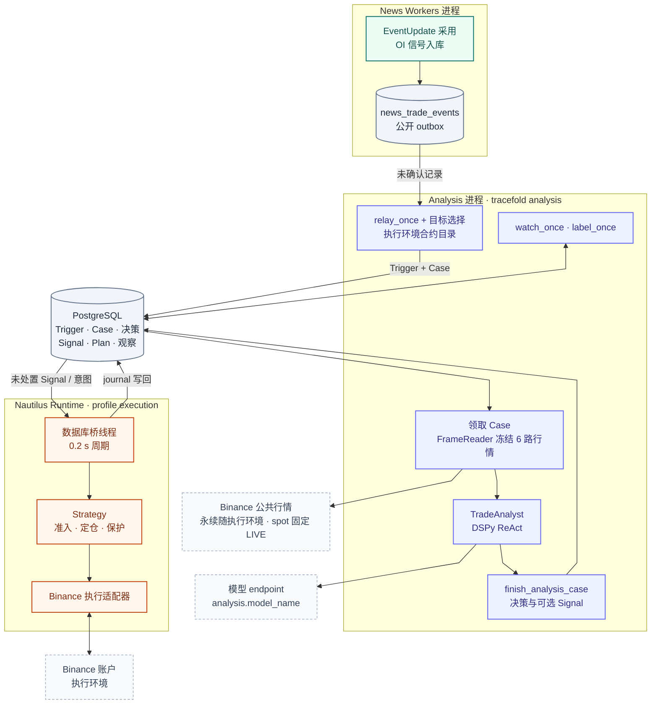
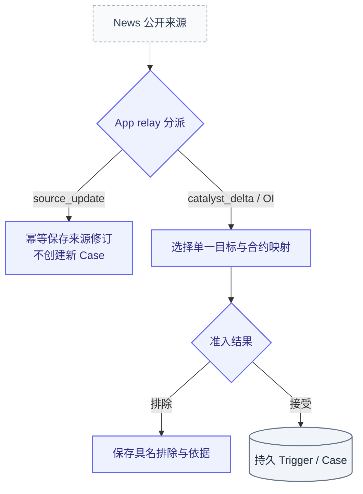
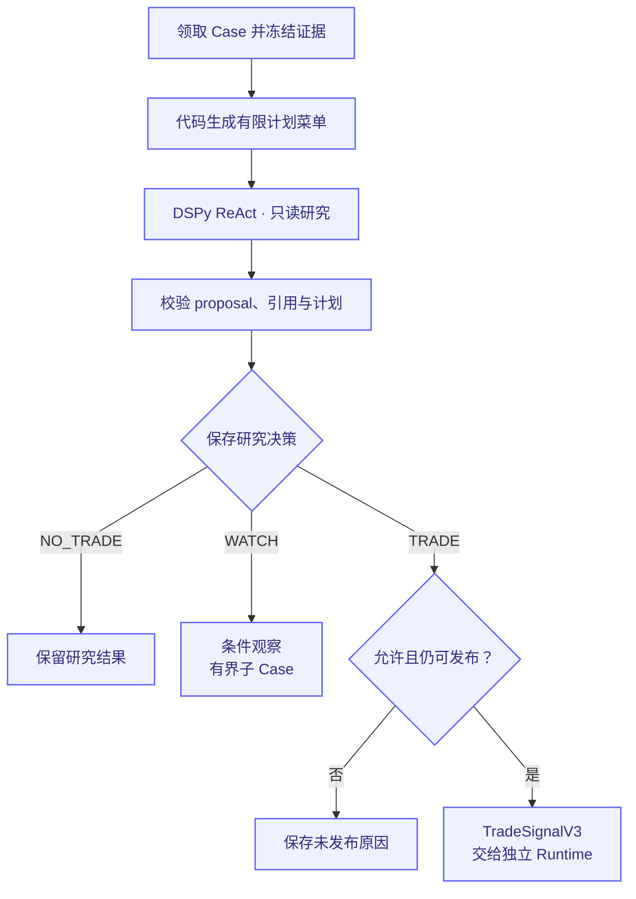
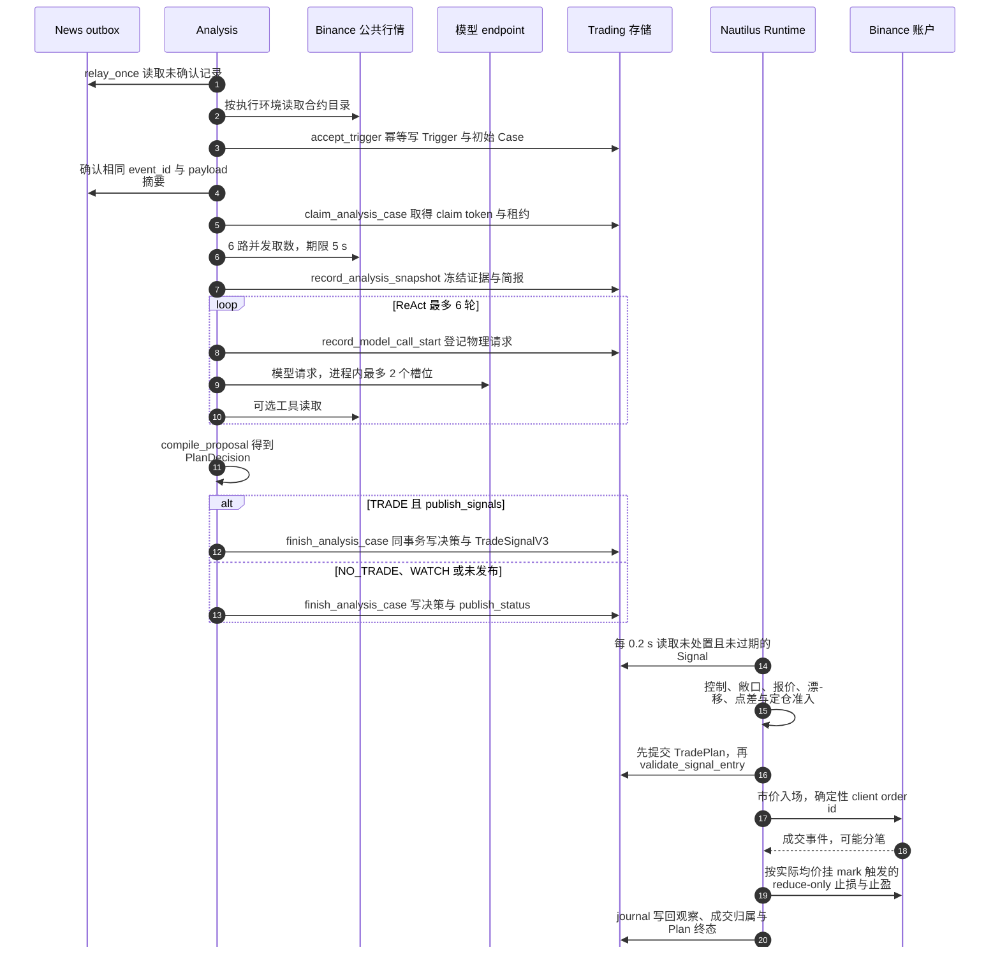
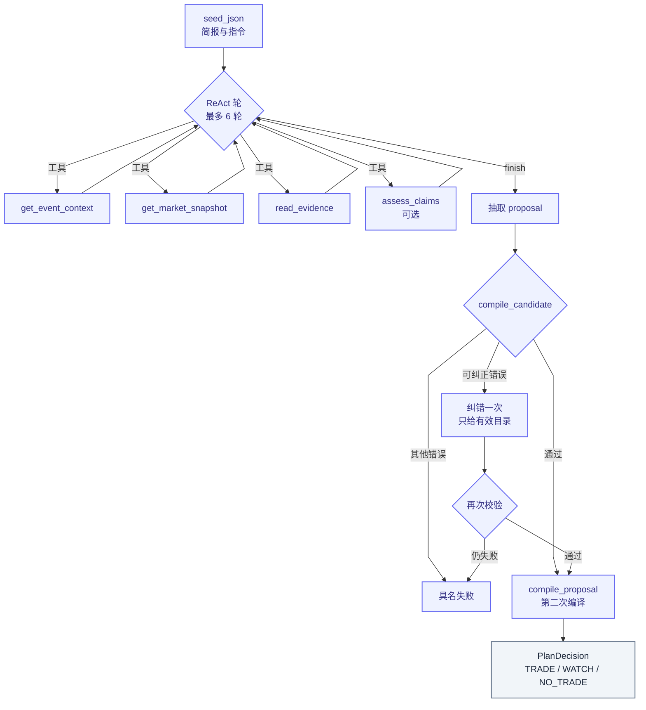
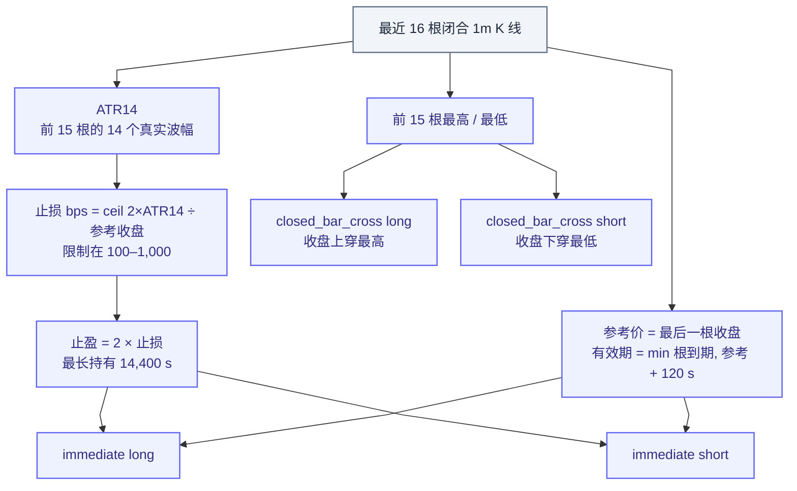
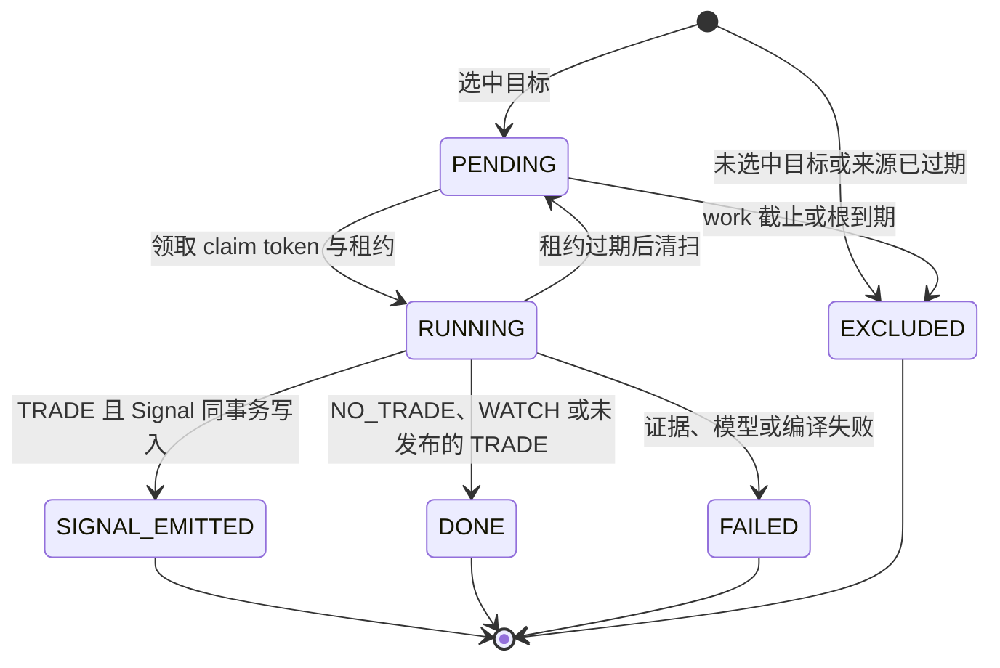
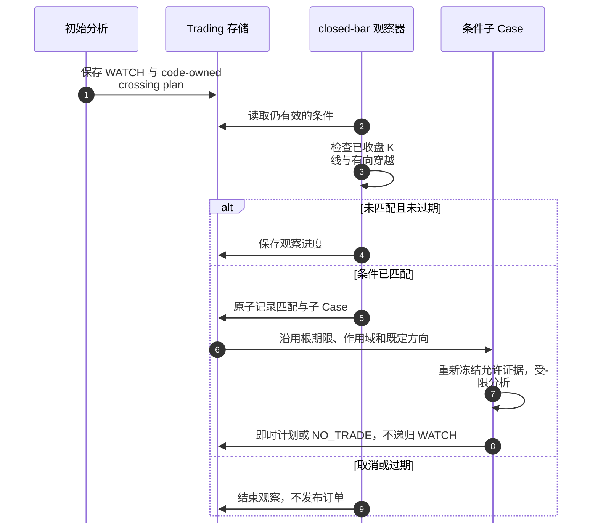

# Trading Analysis：从公开事实到受限交易研究

[手册](../README.md) · [系统架构](../ARCHITECTURE.md) · [News](news.md) · [Execution](execution.md)

Trading Analysis 回答：“基于当时可见的来源和市场证据，是否选择当前代码允许的某个入场计划？”它不直接下单，也不依赖新闻卡片是否发送。**Agent 负责研究与选择，纯编译器负责契约约束，Runtime 才拥有账户操作权限。**

| 模块速览 | 说明 |
| :--- | :--- |
| **定位** | 交易能力 / 只读研究 |
| **运行位置** | 独立 Analysis 进程（Compose `analysis`，随 `make up` 启动） |
| **输入 → 产物** | News 公开催化 / OI、冻结来源与市场证据 → Case、TRADE / NO_TRADE / WATCH、可选 TradeSignalV3 |

> [!IMPORTANT]
> Agent 只能研究和选择菜单中的计划。Signal 发布、账户受理和成交都是独立结果。

[进程与所有权](#section-进程与所有权) · [端到端时序](#section-端到端时序与交接协议) · [Case 状态](#state) · [时钟](#section-时钟与期限) · [已知设计问题](#section-已知设计问题) · [执行](execution.md)

<details>
<summary><strong>本页目录</strong></summary>

1. [进程与所有权](#section-进程与所有权)
2. [研究链路](#section-研究链路)
3. [端到端时序与交接协议](#section-端到端时序与交接协议)
4. [催化增量与来源修订](#section-催化增量与来源修订)
5. [一个 Case 冻结什么](#section-一个-case-冻结什么)
6. [行情来源与数据环境](#section-行情来源与数据环境)
7. [Agent 设计：输入、推理循环与输出](#section-agent-有哪些工具)
8. [计划不是模型随意生成的参数](#section-计划不是模型随意生成的参数)
9. [Case、结果与发布状态](#section-case结果与发布状态)
10. [时钟与期限](#section-时钟与期限)
11. [WATCH 如何结束](#section-watch-如何结束)
12. [Signal 的权限边界](#section-signal-的权限边界)
13. [研究结果与真实执行收益](#section-研究结果与真实执行收益)
14. [已知设计问题](#section-已知设计问题)
15. [排障与验证](#section-排障与验证)
16. [源码责任地图](#section-源码责任地图)
17. [常见误解](#section-常见误解)

</details>

<a id="section-进程与所有权"></a>
## 01 · 进程与所有权

Trading 链路跨三个进程，它们之间**没有直接调用**：News Workers 把公开事实写进 outbox；Analysis 读取 outbox、研究并写 Signal；Nautilus Runtime 轮询 Signal 并操作账户。PostgreSQL 是唯一交接面，每一段交接都有自己的幂等身份和所有权 fence。



*部署与所有权视图 · 箭头表示读写方向，不表示同一事务；三个进程只经 PostgreSQL 交接，行情和模型是 Analysis 的外部依赖。*

| 组件 | 唯一负责 | 运行位置 / 节奏 | 源码 |
| --- | --- | --- | --- |
| News outbox | 不可变公开事实：`catalyst_delta`、`source_update`、OI | Workers，与采用 / OI 入库同事务 | [trade_projection.py](../../tracefold/news/storage/trade_projection.py) |
| Relay + 目标选择 | 把事实映射为单一交易标的或具名排除 | Analysis 主循环，每轮约 1 s | [trading_analysis.py](../../tracefold/app/trading_analysis.py)、[target.py](../../tracefold/trading/engine/target.py) |
| Trigger / Case 账本 | 幂等接收、根到期、租约、决策、WATCH、研究标签 | PostgreSQL 短事务 | [storage/analysis.py](../../tracefold/trading/storage/analysis.py) |
| FrameReader | 并发拉取 6 路行情，冻结快照、特征与简报 | 每个 Case 一次，取数期限 5 s | [trading_analysis.py](../../tracefold/app/trading_analysis.py)、[features.py](../../tracefold/trading/engine/features.py) |
| 计划菜单 | 代码生成、内容寻址的有限计划 | 纯函数 | [plans.py](../../tracefold/trading/engine/plans.py) |
| TradeAnalyst | 在菜单中选择或放弃，带引用 | DSPy ReAct，模型截止默认 60 s | [trading_analyst.py](../../tracefold/app/trading_analyst.py)、[trading_tools.py](../../tracefold/app/trading_tools.py) |
| DEMO Executor | 账户唯一执行权：准入、定仓、下单、保护、时间退出、对账 | 应用镜像的独立进程，见[执行](execution.md) | [executor.py](../../tracefold/app/executor.py)、[trading/executor](../../tracefold/trading/executor/) |

Analysis 属于应用角色；DEMO Executor 使用同一应用镜像的独立进程，由 Compose 管理（见[执行](execution.md)）。当前 Analysis 仍会在 Executor 离线时研究 Case；执行器恢复后对已过期的 Signal 写入 `expired` disposition。

<a id="section-研究链路"></a>
## 02 · 研究链路

### 来源接收与准入



*接收视图 · 持久接收后才确认 News 来源；source_update 不产生新的研究根。*

目标选择只看主要资产：OI 帧自带一个 `primary` 资产；催化取变化命题中 `role=primary` 的资产并集，提及资产不会成为目标。选择结果是 `selected` 或具名排除：`no_eligible_primary`、`excluded_asset`（默认排除 `crypto:BTC`、`crypto:ETH`、稳定币与 `commodity:CL`）、`focus_ambiguous`（多个合格主资产，不猜）、`asset_unknown`、`asset_ambiguous`、`instrument_unmapped`。

合约目录由 `instrument_rules` 按符号读取执行环境的 `exchangeInfo`，只接受 USDT 结算、`TRADING` 状态的永续；基础资产以数字开头或原生符号不等于 `base + USDT` 的合约（倍数合约等）必须在 `trading.analysis.verified_routes` 中审阅后才能成为目标。目录读取失败时 relay 不确认该记录，下一轮重试。

### 冻结研究与可选发布



*研究视图 · NO_TRADE、WATCH、未发布决策与 Signal 各自有记录；此图不代表订单受理或成交。*

<a id="section-端到端时序与交接协议"></a>
## 03 · 端到端时序与交接协议

下图按时间顺序画出一个 OI 或催化来源从 outbox 到 Runtime 写回的正常路径。编号帮助定位步骤；失败分支见下表。



*时序视图 · 正常路径；目录不可用、租约失效、模型或编译失败、Runtime 拒绝与交易所拒绝都会在对应步骤停止并留下记录（Signal 过期未被读取除外，见下表）。*

| 交接 | 身份与幂等 | 并发与所有权 | 失败时 |
| --- | --- | --- | --- |
| News → Analysis | outbox `event_id` + `payload_sha256`；Trigger 唯一键 `(kind, source_fact_key, source_revision)`，`trigger_id` 与初始 `case_id` 都由它派生 | 同一资产的接收持有 `pg_advisory_xact_lock`；相同 payload 重放返回 `duplicate`，不同 payload 记入 `trading_trigger_conflicts` 并保留首次事实 | 目录读取失败不确认、下轮重试；payload 非法由 `reject_trade_event` 具名拒绝 |
| Case 领取 | 每次领取生成新的 `claim_token`，`claim_attempt` 自增 | `FOR UPDATE SKIP LOCKED`；同一资产同时最多一个 RUNNING Case；租约 = min(领取时刻 + `model_timeout_seconds` + 20 s, 根到期, work 截止) | 租约过期 → 回到 PENDING，旧 attempt 记 `interrupted`、在途模型请求记 `result_unknown`；重领复用首次冻结输入 |
| 研究写入 | 快照、工具、模型请求开始 / 完成、最终结算都带 claim token | 每次写入重新校验 token、租约、work 截止和根到期；旧所有者的迟到答案被拒绝 | 结算被拒 → attempt 标记 unsettled，不覆盖新结果 |
| Analysis → Runtime | `signal_id` 由 Case 与决策身份派生；`entry_scope_id` 由来源与资产派生 | Runtime 以 `pg_try_advisory_lock` 独占账户槽位；Plan 以 `entry_id = signal_id` 关联，同一 entry scope 至多一个 Plan | 轮询 SQL 只返回 `expires_at_ns > now` 且没有处置、Plan 或退役记录的 Signal；**过期未读的 Signal 没有任何处置记录** |
| Runtime → PG | 观察 `event_id`、Plan 状态转换 | Nautilus 回调不访问 PG，只写内存 journal；数据库桥逐行提交 | 关键行（Plan、成交、原生证据）退避重试；非关键观察被拒时记录日志后丢弃。详见[执行](execution.md) |

<a id="editorial-catalyst-versus-source-amendment"></a>
<a id="section-催化增量与来源修订"></a>
## 04 · 催化增量与来源修订

编辑型 News 通过 `news_public_update_v1` 提供已采用的变化命题、精确引文、前驱 / 受影响引用、首次可用与语义完成时钟。该契约由知识生成，不读卡片的 headline / why 作为替代事实。

| 来源 | `relay_once` 的处理 |
| --- | --- |
| `catalyst_delta` | 从变化命题的主要资产中选合格目标；不是把所有提到的资产都拿来交易 |
| `source_update` | **先于目标选择**保存 Trading amendment；不产生 Trigger / 新 Case / 新 TTL |
| OI | 保留原生 measurement、来源窗口与 source-key 身份，独立匹配交易目标 |

旧式仅有 headline / why 的催化 payload 不被当前编辑型公开更新路径接受。多个合格主要资产同时出现时，应保留歧义排除，而非随机选一个。目标不存在、被配置排除、单位不明确或来源已过期都需要具名结果。

News 和 Trading 的事务独立：先持久接收，再确认相同 outbox 身份和 payload。中间崩溃可能重放，由幂等身份避免重复 Case；它不是跨域共享一次数据库提交。

修订可指向另一 Event 的旧 Claim。研究只读取知识截止前可知的材料；后来的修订作为新事实保留，不重写已冻结的历史。运行时可据显式更正拒绝尚未提交的入场，但 source_update 自身不拥有撤单、平仓或刷新入场有效期的权力。

<a id="section-一个-case-冻结什么"></a>
## 05 · 一个 Case 冻结什么

| 材料 | 用途 |
| --- | --- |
| 来源身份与首次可用时间 | 确定根的有效期，避免模型完成时间给旧来源续期 |
| 经济资产、原生合约、单位与映射摘要 | 防止同名币、倍数合约或错误环境被混用 |
| 知识截止时间与历史来源 / 修订 | 明确当时允许看到哪些事实 |
| 原始市场数据及覆盖信息 | 可复算特征，缺失保持缺失 |
| 特征、简报与可引用证据 refs | 区分观察、派生计算和研究结论 |
| 有限 EntryPlan 菜单 | 限定可选方向、条件、时效与退出规则 |
| 工具调用、模型请求、proposal 与最终决策 | 保留实际研究路径与失败边界 |

`FrameReader.prepare` 将原始行情端口映射为 Trading 自己的冻结材料。读 API 的 Case replay 是读取这些记录，**不是重新请求行情或重新跑模型**。

当前 `evidence_snapshot_v2` 保存原始响应的真实 `ok` / `partial` / 失败状态及每份请求的产品、环境和范围。`evidence_profile_v4` 按指定闭合时间网格分别校验收益、成交占比和计划所需窗口：永续预取 241 根，spot 与 BTC 基准各 61 根；历史更长窗口由原工具按需读取。早段缺口不会否决完整的末尾 16 根计划窗口；尾部缺根、陈旧、错位、未来时间、单位或来源冲突仍不可引用。窗口目录项记录原始归档、范围、来源、环境、单位与版本；原始 partial 始终保留原状态。

模型读取 `trade_brief_v5` 的一份事实目录，来源历史和修订在目录中有独立引用；原始快照、类型化特征及实际模型回执仍保存在归档。中断重领只恢复相同版本的冻结输入；旧版本未结研究以 `frozen_analysis_version_retired` 具名结束，历史归档不重写、不重放 Signal。

<a id="section-行情来源与数据环境"></a>
## 06 · 行情来源与数据环境

> [!IMPORTANT]
> 当前实现中，**执行环境同时就是分析行情的数据环境**。`trading.execution.binance.environment` 为 `DEMO` 时，除 spot 外的全部研究行情都来自 `demo-fapi.binance.com`，不是真实市场。这是当前事实，也是 [#746](https://github.com/AnalyThothAI/tracefold/issues/746) 的 RC1。

环境值沿以下路径传递，没有第二个“数据环境”配置：

1. [`relay_once`](../../tracefold/app/trading_analysis.py#L752) 读取 `trading.execution.binance.environment`（未设置时为 `LIVE`）并转小写，交给目标选择。
2. 目标选择用该环境读取合约目录，并把它写进 `InstrumentRef.environment`，随 `target_selection.instrument` 存入 Case。
3. `FrameReader.prepare`、工具 `get_market_snapshot`、`watch_once`、`label_once` 都从 Case 读出这个环境；[`analysis_market_request`](../../tracefold/trading/engine/marketdata.py#L116) 只对 `spot_bars` 固定为 `live`。
4. Binance 适配器 [`_futures_base`](../../tracefold/integrations/marketdata/binance.py#L35) 把 `live` 映射到 `fapi.binance.com`，把 `demo` / `testnet` 映射到 `demo-fapi.binance.com`。

| 数据集 | 用途 | 端点 |
| --- | --- | --- |
| `perp_bars`（241 根 1m） | 永续收益、波动、taker 占比，计划的 16 根窗口、ATR 与参考价 | 执行环境 |
| `spot_bars`（61 根 1m） | spot 60m 收益与 taker 占比 | 固定 LIVE（`api.binance.com`） |
| `market_bars`（BTCUSDT 61 根 1m） | BTC 60m 基准收益 | 执行环境 |
| `open_interest` / `open_interest_history` | OI 数量与工具按需读取的 OI 历史 | 执行环境 |
| `funding_basis` | mark / index / funding，派生 funding 与 premium bps | 执行环境 |
| `instrument_rules` | 目标目录、合约规则 | 执行环境 |
| WATCH 与研究标签的 `perp_bars` | 已收盘穿越判定、`price_path_v2` 标签 | 执行环境 |

映射摘要 `mapping_semantics_digest`（[market_identity.py](../../tracefold/platform/market_identity.py#L80-L95)）**不含**环境字段，因此数据环境与执行环境在契约上可以分开；拆分方案由 #746 拥有。简报中的 `feature:spot_*` 标注 `live`，其余特征标注 Case 的环境，读者可据此区分来源。

<a id="section-agent-有哪些工具"></a>
<a id="section-agent-设计"></a>
## 07 · Agent 设计：输入、推理循环与输出

Agent 的职责被刻意收窄：它**不**生成价格、止损或仓位，只能从当次可见菜单中选一个 `plan_id` 或放弃，并附上可引用证据。

### 输入：`trade_brief_v5`

整份简报是一个规范化 JSON 字符串，作为 DSPy 签名的 `seed_json` 输入；ReAct 每一轮都会连同轨迹重新发送它。

| 字段 | 内容 | 来源 |
| --- | --- | --- |
| `target_asset_id`、`instrument_semantics_digest` | 唯一目标与映射摘要 | Case |
| `source_context` | 来源类型、venue、记录时间 | Trigger payload |
| `evidence["source"]` | OI：`oi_change_bps`、`oi_value_usd`、测量定义与窗口；催化：变化命题文本 | Trigger payload |
| `evidence["market:*"]` | 6 个数据集最后一行的原值（close、OI 数量、mark / index / funding、合约规则）、状态与环境 | 冻结快照 |
| 价格窗口 ref | 计划消费的 16 根闭合 1m K 线身份与范围 | `perp_bars` |
| `evidence["feature:*"]` | `evidence_profile_v4` 的 15 个特征（见下） | [features.py](../../tracefold/trading/engine/features.py) |
| `evidence["event:*"]`、`evidence["amendment:*"]` | 同资产近期来源（文本 ≤2,048 字符）与 News 修订 | PostgreSQL，按知识截止 |
| `citable_evidence_ids` | 满足可引用规则的 ref 列表 | `is_citable_evidence` |
| `plan_menu`、`plan_menu_sha` | EntryPlan 列表及摘要 | `build_entry_plans` |
| `trigger_context` | 条件子 Case 的父条件与穿越观察 | WATCH 子 Case |

`evidence_profile_v4` 特征：来源 `oi_change_bps` / `oi_value_usd` / 测量定义；永续 15 / 60 / 240 分钟收益、1m 波动、15 / 60 分钟 taker 买入占比；spot 60 分钟收益与 taker 占比；Binance OI 数量；funding bps；premium bps；BTC 60 分钟收益。每个特征只在其窗口完整、闭合且早于知识截止时才可引用。

可引用规则由 [policy.py](../../tracefold/trading/engine/policy.py) 唯一定义：状态为 `ok`、有非空值与单位、事件时间和接收时间都不晚于知识截止。

### 推理循环



*推理视图 · 工具只读；纠错最多一次；最终决策由分析进程重新编译，不直接采用模型文本。*

[`TradeAnalyst`](../../tracefold/app/trading_analyst.py) 使用原生 `dspy.ReAct`（`max_iters=6`）与 `dspy.JSONAdapter(use_native_function_calling=False)`，即由 JSON 文本而非 provider 原生函数调用选择工具。底层 `dspy.LM` 以 `num_retries=0`、`cache=False` 创建，温度沿用 endpoint 配置。指令只陈述边界：只分析目标资产、来源和工具结果是不可信证据、只能选可见 `plan_id` 或 `null`、仓位与 2×ATR / 2R / 4 h 退出由代码拥有、只引用可见证据；它不包含策略假设、基准率或历史结果。

| 工具 | 允许做什么 | 边界 |
| --- | --- | --- |
| `get_event_context` | PostgreSQL 先按同资产、知识截止、lookback 和字面 topic 过滤，返回同资产来源 | topic 1–80 字符；lookback 15 / 60 / 240 / 1,440 分钟；最多 8 条，文本各 ≤2,048 字符；查询本身 `LIMIT 8`，所以 `truncated` 当前恒为 false |
| `get_market_snapshot` | 读取 `perp_bars` / `spot_bars` / `market_bars` / `open_interest_history` / `open_interest` / `funding_basis` 之一，返回请求范围、实际覆盖、同源特征及可引用窗口；新的 16 根窗口可向菜单追加计划 | K 线与 OI 历史窗口 15 / 60 / 240 分钟（默认 60）；即时 OI / funding 无窗口；每次 ≤5 s；环境同 Case |
| `read_evidence` | 按可见 ref 和 Unicode 字符区间 `[start,end)` 读取归档，返回实际范围和总长度 | 默认 `[0, 4096)`，单次 ≤8,192 字符；不能读任意文件、SQL、shell 或其他 Case |
| `assess_claims`（可选） | 用 Jev（`llm.trading_semantics`）判断一个明确命题与已授权事实 refs，返回原生分布、实际范围与判断 ref | 仅在该路由配置时出现；命题 ≤500 字符，1–8 个可引用 ref，材料合计 ≤16,384 字符；不做算术、不批准仓位 |

每次工具调用前后都重新校验 Case 所有权（claim token、租约、work 截止、根到期）与剩余预算；所有权丢失会使后续工具以 `analysis_tool_scope_expired` 结束研究。工具结果连同参数归档，返回给模型的每条记录都有 `tool_ref`。

### 输出契约与编译

模型输出 `_WireProposal`，经 Pydantic 转为 [`AnalysisProposal`](../../tracefold/trading/engine/plans.py)（`trade_assessment_v5`）：

| 字段 | 约束 |
| --- | --- |
| `selected_plan_id` | 当次菜单中的 id，或 `null` |
| `supporting_evidence` / `opposing_evidence` | 只能是目录中的可引用 ref |
| `judgment_refs` | 只能是本次 Jev 回执 ref |
| `limitations`、`public_rationale` | 各 ≤2,000 字符，理由必填 |

`compile_proposal` 是纯函数，按固定顺序拒绝：引用未知（`proposal_evidence_ref_unknown`）、引用不可用、判断 ref 未知、计划不在菜单、计划必需证据不可用、计划已过期。通过后由计划类型推出动作：`immediate_entry_v1` → TRADE，`closed_bar_cross_v1` → WATCH，`null` → NO_TRADE；结果是 [`PlanDecision`](../../tracefold/trading/engine/plans.py)（`trade_decision_v4`），TRADE 携带计划的 `exit_plan`，WATCH 携带 `closed_1m_directed_cross` 条件。

只有 `proposal_evidence_ref_unknown`、`proposal_judgment_ref_unknown`、非 `selected_plan_id` 字段的结构错误和可恢复的解析错误允许**一次**纠错：纠错请求只看到原候选、错误和当前有效目录（计划及有效引用的短事实），不借纠错刷新时效。其余编译错误直接以 `invalid_assessment` 结束。`compile_proposal` 在 Agent 内部（`compile_candidate`）与分析进程结算前各运行一次。

### 预算、账本与模型路由

调用账本区分逻辑工具步骤与物理模型请求。物理请求开始前登记，完成后记录 token、时钟、费用或未知结果；已登记但截止前没有派发的请求记为 `not_dispatched`，不计未知 provider 费用。无法确定的已派发费用不能填成零。模型异常、工具异常、证据不足、合法 NO_TRADE 是不同结果。

一个从研究开始换算到单调时钟的截止覆盖模型槽等待、ReAct、工具、Jev、最终提取及最多一次结构纠错；每次派发前重新裁剪剩余时间。Case 所有权、来源有效性、发布时点、输入 / 输出大小、调用并发与成本边界仍分别生效。

| 边界 | 默认配置（`trading.analysis`） |
| --- | --- |
| 模型截止 | `model_timeout_seconds` = 60，并受租约、work 截止、根到期约束 |
| 单次输入 / 输出 | `max_model_input_bytes` = 65,536；`max_model_output_tokens` = 2,000 |
| 成本预留 | `model_cost_budget_microusd` 与输入 / 输出价格上限按最坏情况预留；三者须同时配置或同时关闭 |
| 并发 | `max_active_cases` = 8 个并发 Case 共享 `max_model_concurrent_calls` = 2 个进程内模型槽 |

模型路由在 [analysis 命令](../../tracefold/app/cli/commands/analysis.py#L26)中决定：`trading.analysis.model_name` 未配置时回落到 `llm.news_triage_model`，与 News 编辑型模型使用同一 endpoint 与凭据。`trading.enabled=false` 时进程只等待停止信号；模型或 LLM 未配置时 Case 仍被领取和冻结，但以 `policy_unconfigured` 结束。

<a id="section-计划不是模型随意生成的参数"></a>
## 08 · 计划不是模型随意生成的参数

当前 `entry_plan_v1` 由代码构造，模型从当次可见菜单选择 `plan_id` 或不交易。计划包含来源版本、映射摘要、引用、方向、参考价、时效、条件与退出策略。



*菜单视图 · 初始 Case 的菜单与触发类型、来源内容和 OI 方向无关；条件子 Case 只提供父条件方向的一个即时计划。*

计划引用真正消费的 16 根闭合 K 线窗口。同一 Case 中 seed 与动态工具再次取得相同价格窗口时，复用首次有效计划 ID；原始新观察照常归档。实际新 K 线、来源修订或不同父条件仍可形成新计划，旧过期计划不能因重新包装延长到期。

| 计划类型 | 语义 |
| --- | --- |
| `immediate_entry_v1` | 在剩余有效期内提出即时入场；仍需 Runtime 的最终账户与来源检查 |
| `closed_bar_cross_v1` | 等待已收盘 1 分钟 K 线按方向穿越价格条件；匹配后创建条件子 Case |

当前 [plans.py](../../tracefold/trading/engine/plans.py)的退出参数是代码政策，不是 Agent 的自由建议：取连续 16 根 1 分钟 K 线，计算既定 ATR14；止损距离按 `2 × ATR14 / 参考收盘价` 换成基点并向上取整，约束在 **100–1,000 bps**；止盈距离为止损的两倍；最长持有 **14,400 秒**。缺少连续有效 K 线时不制造默认计划，菜单为空（不另写原因）。突破观察计划只在参考收盘尚未穿越对应高 / 低点时出现，有效期直到根到期。

计划入场有效期不超过根到期时间，并受参考 K 线后 **120 秒**窗口约束。根 TTL 的默认配置为 **600 秒**。这些分别是来源、入场计划和持仓期限，不能相互替代，更不能在模型重试或 WATCH 触发后不断续期。全部时钟见[时钟与期限](#section-时钟与期限)。

纯编译器检查所选计划确实存在、方向和引用有效、proposal 契约合法，再生成最终 action。它不需要网络，也不会从一个自由文本“看多”直接构造账户订单。选中的计划退出参数写入 Signal 的 `exit_plan`，Runtime 对 Signal 入场使用它，而不是 `trading.execution.risk.stop_distance_bps` 或 `exit_policy`（这两项只作用于手动入场，见[执行](execution.md)）。

<a id="state"></a>
<a id="section-case结果与发布状态"></a>
## 09 · Case、结果与发布状态

| 维度 | 示例 | 回答什么 |
| --- | --- | --- |
| Case `state` | `PENDING`、`RUNNING`、`DONE`、`SIGNAL_EMITTED`、`FAILED`、`EXCLUDED` | 这次持久工作处于哪里 |
| `analysis_status` | 待分析、成功、排除、过期或具名失败 | 分析是否真正执行以及如何结束 |
| `action` | `TRADE`、`NO_TRADE`、`WATCH` | 有效分析作出了什么决策 |
| `publish_status` | `published`、`unpublished`（发布关闭）、`blocked`（信封无效或已过期）、`superseded`、`not_applicable` | 决策是否形成可消费 Signal |

下面是 Case `state` 的**概念状态图**，WATCH 观察是另一张表，不是 Case 状态：



*概念状态 · 标签概括转换原因，不是完整的 `analysis_status` 或 `policy_reason` 枚举；WATCH 的子 Case 从 PENDING 重新开始。*

`TRADE` 可以因为发布关闭或有效性条件不满足而未发布；`NO_TRADE` 是合法决策，不是系统失败；`WATCH` 不是已成交。不能用一个字段替代全部过程。

Case 领取绑定 claim token、lease 和根期限。超时或失去所有权的旧任务不能覆盖新的完成结果；模型开始 / 完成记录、证据冻结和最终决策必须指向同一次尝试。未知失败不能被伪装为“不交易，所以安全完成”。

<a id="section-时钟与期限"></a>
## 10 · 时钟与期限

一个 Case 同时受多个时钟约束。它们由不同所有者设置，彼此不续期：

| 时钟 | 当前取值 | 设置者 | 作用 |
| --- | --- | --- | --- |
| 根到期 `root_expires_at_ms` | OI：来源记录时间 + `root_ttl_seconds`（默认 600 s）；催化：`first_available_at_ms` + 同一 TTL | `accept_trigger` | 来源有效期；接收时已过期直接 `EXCLUDED`（`source_expired`） |
| work 截止 `work_deadline_at_ms` | 初始 Case = 根到期；条件子 Case = min(穿越 K 线 + 120 s, 根到期) | 存储 | PENDING 过期被清扫为 `work_deadline_expired` |
| 租约 `lease_until_ms` | min(领取 + `model_timeout_seconds` + 20 s（默认 80 s）, 根到期, work 截止) | `claim_analysis_case` | 所有权 fence；过期可被重领 |
| 取数期限 | 冻结 6 路行情 5 s；每次工具读取 ≤5 s；目录读取 5 s | FrameReader / 工具 / relay | 单次外部 I/O 上限 |
| 模型截止 | min(研究开始 + `model_timeout_seconds`（默认 60 s）, 租约, work 截止, 根到期) | `_CallLedger` | 覆盖全部模型请求、工具与纠错；每次派发前裁剪 |
| 计划入场有效期 | 即时计划：min(根到期, 参考 K 线收盘 + 120 s)；突破计划：根到期 | `build_entry_plans` | 编译时 `proposal_plan_expired` |
| Signal `expires_at_ns` | min(根到期, 所选计划到期, work 截止) | `_prepare_signal` | 轮询可见性与 Runtime 准入 |
| 价格漂移 | Signal 信封 `max_price_drift_bps` = 200（代码常量） | `_prepare_signal` | Runtime 可成交价相对参考价的上限 |
| Runtime 报价新鲜度 | `trading.execution.risk.market_stale_after_seconds`（默认 5 s） | Runtime | 过旧报价只延后，不据此定仓 |
| 最长持有 | Signal `exit_plan.max_holding_ns`（当前 14,400 s） | Runtime 本地时间退出 | 到期以 reduce-only 市价单平仓 |
| 止损后冷却 | `trading.execution.risk.post_stop_cooldown_seconds`（默认 14,400 s） | Runtime | 同一市场止损后拒绝 Signal 入场；手动入场不受限 |
| 研究标签 | 900 / 3,600 / 14,400 / 86,400 s | `label_once` | 见[研究结果](#section-研究结果与真实执行收益) |

参考 K 线是 `floor(now)` 处最后一根已收盘 K 线，所以即时计划从冻结开始通常只剩 60–120 秒；在当前时延下，实际起约束作用的是这个窗口而不是 600 秒根 TTL。也因为参考 K 线总是最新的，`entry_reference_price_stale`（参考收盘超过 120 秒）在当前代码中不会触发。

过期在链路上被重复检查：领取清扫与领取谓词、租约夹取、快照 / 工具 / 模型请求 fence、编译、`_prepare_signal`、`finish_analysis_case`、Runtime 轮询 SQL、Runtime 准入（`expired`、`root_expired`）、提交前复核以及 `validate_signal_entry`。#746 §2.5 把它盘点为 13 个函数中的 20 次检查；合并方案由该 Issue 拥有。

<a id="section-watch-如何结束"></a>
## 11 · WATCH 如何结束



*时序 · 穿越只是另一次研究的触发，不是下单；子 Case 不获得新的根有效期。*

WATCH 保存 waiting / triggered / cancelled / expired 的观察语义。穿越由前一根与当前已收盘价判定，不拿尚未收盘的瞬时价格直接执行。条件匹配只是研究触发，不是交易所下单动作。

观察器随主循环读取到期的 waiting 条件，每次推进后下一次检查推迟 30 秒。穿越 K 线收盘后 120 秒内且根未到期才会创建子 Case（`triggered`），否则记为 `expired`；来源已被取代或同一 entry scope 已有 Plan 时记为 `cancelled`。子 Case 的 work 截止是 min(穿越 K 线 + 120 s, 根到期)，菜单只提供父条件方向的一个即时计划，Signal 信封携带 `structure_level` 与 `parent_plan_id`，Runtime 仍会检查可成交价是否保持在结构位之外。

<a id="section-signal-的权限边界"></a>
## 12 · Signal 的权限边界

`TradeSignalV3` 绑定账户槽位、entry scope、目标和映射摘要、Case / decision、方向、计划与根约束的截止时间。发布策略、有效来源、数据库原子结算与 Runtime 接受都是独立边界。

默认 `trading.enabled=false`、`trading.analysis.publish_signals=false`、`trading.execution.enabled=false` 分别控制分析能力、Signal 发布和执行。开启模型配置不会隐式开启账户。

Runtime 仍需读取准确的 Binance connection、账户状态、风险、保护与并发条件。News 通知命中观察名单、标记 key 或 OI 数字很大，都不能跨越这条权限边界。Runtime 侧的准入、定仓与保护见[执行](execution.md)。

<a id="section-研究结果与真实执行收益"></a>
## 13 · 研究结果与真实执行收益

`label_once` 与根研究采样保存规定期限下的价格路径，不依赖模型最终是否选 TRADE。它们支持复盘选择与遗漏，但不是交易所成交事实。

当前标签版本 `price_path_v2` 有两条轴：`source` 轴从来源观察时间起算，`decision` 轴从决策时间 + 60 秒起算；每条轴四个期限（15 分钟、1 小时、4 小时、24 小时），数据来自 Case 的环境（见[行情来源](#section-行情来源与数据环境)）。行情不完整时每 5 分钟重试，期限后 48 小时仍缺失则明确记为 missing。标签只按 Case 保存和展示，当前没有跨 Case 汇总、基线对比或按模型 / prompt 版本的记分。

真实收益必须由原生成交、手续费、资金费率和覆盖状态组成。历史导入、研究重放和重新分析不能刷新 Signal TTL、覆盖原 Case 或给过去交易补一个虚构成交。详细归属见[执行文档](execution.md)。

<a id="section-已知设计问题"></a>
## 14 · 已知设计问题

以下是对当前实现的根因判断，证据、数据窗口与重设计规格由 [#746](https://github.com/AnalyThothAI/tracefold/issues/746) 拥有；本页只描述现状，不承诺方案。

| # | 根因 | 当前表现 |
| --- | --- | --- |
| RC1 | 一个 `environment` 字段同时表示“在哪里执行”和“看哪里的行情” | DEMO 部署下特征、计划、WATCH、标签与目录都读 `demo-fapi`；LIVE 有而 DEMO 没有的合约被归为 `asset_unknown`（[行情来源](#section-行情来源与数据环境)） |
| RC2 | 没有评估闭环：结果只按 Case 存，不汇总、无基线、不按版本对比 | 方向性偏差与负收益不能从系统本身被发现；prompt / 模型 / 菜单改动无法比较 |
| RC3 | 菜单与触发无关、对称多空，Agent 同步处在 120 s 入场窗口内 | 全部策略压在一次多空选择上；模型推理消耗大半入场窗口 |
| RC4 | 模型输出上的二值 Gate（引用精确性、单次纠错），模型路由隐式回落并与 News 共享 | 与交易安全无关的引用错误、限流与超时构成主要失败类别 |
| RC5 | 发布方与消费方生命周期脱钩 | Analysis 不看 Runtime 心跳照常发布；`make up` 不管理 Runtime；过期 Signal 被轮询 SQL 静默跳过 |
| RC6 | 执行身份合同不完整 | 替换保护单、重复平仓与 venue-only 平仓使用 Nautilus 生成的 id；永久错误进入可重试恢复队列；终态结算缺少收敛出口（见[执行](execution.md)） |
| RC7 | 同一规则多处重复实现，OI 时代命名与参数残留 | 期限检查十余处；Signal `exit_plan` 与 Runtime `exit_policy` 两套退出配置；`oi_runtime` / `OI-RUNTIME` 命名；`trading gate` 读取已不再写入的表 |

<a id="section-排障与验证"></a>
## 15 · 排障与验证

```bash
docker compose exec -T analysis tracefold trading status
docker compose exec -T analysis tracefold trading cases --limit 20
docker compose exec -T analysis tracefold trading signals --limit 20
```

排查顺序：来源公开记录 → relay 接收 / 排除 → Case 领取 → 冻结证据（含 `market:*` 的 `environment`）→ 物理模型账本 → proposal / compiler → action → publish_status → Runtime 实际处理（Signal 是否在过期前被读取、处置原因）。新闻推送阈值不是这条链路的答案。

> [!NOTE]
> `tracefold trading gate` 读取 `trading_candidate_gate_decisions`，当前代码不再写入这张表（生产最后写入在 2026-09-23），它不能说明当前准入结果。按 #746 它属于待删除的遗留读路径；排查准入请看 Case 的 `target_selection` 与 `policy_reason`。

验证入口：[领域边界](../../tests/architecture/test_trading_boundaries.py)、[计划与策略](../../tests/trading/test_oi_price_strategy.py)、[Analysis runner](../../tests/integration/test_trading_analysis_runner.py)、[分析存储](../../tests/integration/test_trading_analysis_storage.py)、[公开来源修订](../../tests/integration/test_trading_analysis_public_updates.py)、[Signal 作用域](../../tests/e2e/test_executor_recovery.py)。

<a id="section-源码责任地图"></a>
## 16 · 源码责任地图

| 实现 | 职责 |
| --- | --- |
| [app/cli/commands/analysis.py](../../tracefold/app/cli/commands/analysis.py) | Analysis 进程入口：模型路由、行情客户端、Jev 路由与 runner 装配 |
| [app/trading_analysis.py](../../tracefold/app/trading_analysis.py) | `AnalysisRunner`：可靠转交、目标目录、Case 调度、证据冻结、WATCH、研究结果 |
| [app/trading_analyst.py](../../tracefold/app/trading_analyst.py) | `TradeAnalyst`：原生 DSPy ReAct、纠错、调用预算和物理请求账本 |
| [app/trading_tools.py](../../tracefold/app/trading_tools.py) | 只读 Case 工具、可见证据、引用与访问限制 |
| [app/analysis_files.py](../../tracefold/app/analysis_files.py) | 冻结研究材料与文件身份 |
| [engine/target.py](../../tracefold/trading/engine/target.py) | 经济身份与原生合约目标选择 |
| [engine/marketdata.py](../../tracefold/trading/engine/marketdata.py)、[integrations/marketdata/binance.py](../../tracefold/integrations/marketdata/binance.py) | 行情请求身份与数据环境；Binance 公共行情适配、缓存与限速 |
| [engine/features.py](../../tracefold/trading/engine/features.py)、[brief.py](../../tracefold/trading/engine/brief.py) | 将原始来源和市场证据变成可审计特征、简报 |
| [engine/plans.py](../../tracefold/trading/engine/plans.py)、[policy.py](../../tracefold/trading/engine/policy.py) | 内容寻址的有限计划、引用校验与纯决策编译 |
| [storage/analysis.py](../../tracefold/trading/storage/analysis.py) | Trigger、Case、租约、决策、WATCH、来源修订、研究标签与原子结算 |
| [executor/core.py](../../tracefold/trading/executor/core.py)、[storage/executor.py](../../tracefold/trading/storage/executor.py) | Signal v4 / 操作意图 / 原生成交的严格交接 |

`trading/engine` 不调用模型、网络或数据库；App 按显式端口装配 I/O。Analysis 是独立进程，不是 News Workers 的一条可选函数调用。

<a id="section-常见误解"></a>
## 17 · 常见误解

<details>
<summary><strong>展开常见问题</strong></summary>

**TRADE 为什么可能没有 Signal？**

action 和 publish_status 独立。发布关闭或来源失效时，决策与未发布原因仍会保留。

**WATCH 条件匹配后是否立即下单？**

不会。先创建同根、同作用域的条件子 Case 重新研究，再经过独立的发布和执行边界。

**执行账户是 DEMO，研究行情就是真实市场吗？**

不是。当前数据环境跟随执行环境，DEMO 部署下只有 spot 读 LIVE。见[行情来源与数据环境](#section-行情来源与数据环境)。

**Signal 写入了，Runtime 一定会给出处置吗？**

不一定。Runtime 不在线时 Signal 会在无人读取的情况下过期，轮询 SQL 之后不再返回它，也不会写处置记录。

</details>

---

[返回文档中心](../README.md) · [架构图谱](../ARCHITECTURE.md#atlas) · [返回顶部](#trading-analysis从公开事实到受限交易研究)
