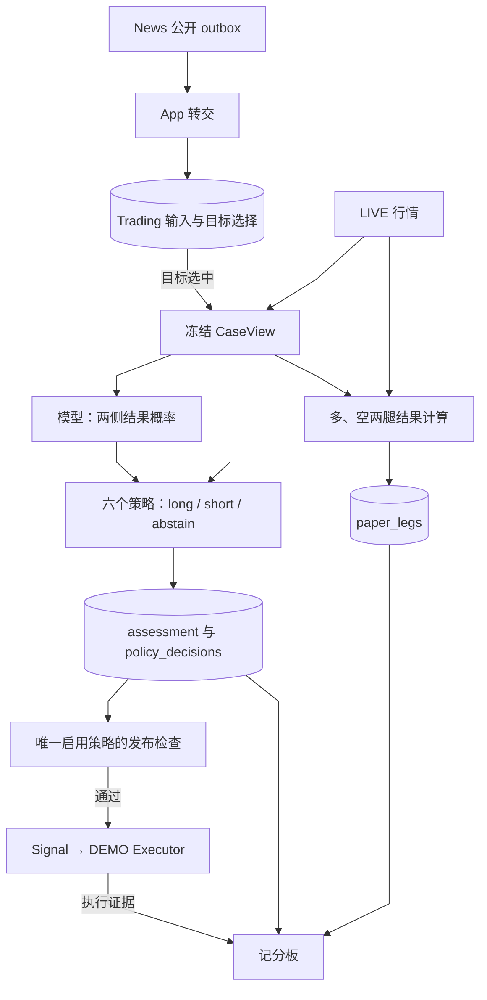

# Trading Analysis：LIVE 事实、冻结预测与可比结果

[手册](../README.md) · [系统架构](../ARCHITECTURE.md) · [News](news.md) · [Execution](execution.md) · [术语](../../CONTEXT.md)

Analysis 把 News 的公开事实转成交易研究实例，并冻结当时可见的证据。模型预测多、空两条纸面腿的结果概率。六个纯函数策略分别产生 `long / short / abstain` 三种动作之一。

研究和纸面标签使用 Binance USD-M **LIVE** 行情。账户执行只允许 **DEMO**。Analysis 即使不发布 Signal、Executor 离线，仍可保存研究结果、建立纸面标签和更新记分板。

<details>
<summary><strong>本页目录</strong></summary>

1. [运行位置与责任](#运行位置与责任) · [输入与输出](#输入与输出)
2. [摄入与冻结](#摄入与冻结)
3. [预测、策略和发布](#预测策略和发布)
4. [纸面腿与记分板](#纸面腿记分板和重放)
5. [状态与事实](#状态与事实) · [失败与恢复](#失败与恢复)
6. [接口与实现入口](#接口与实现入口)

</details>

## 运行位置与责任

| 责任主体 | 负责什么 | 运行位置 |
| --- | --- | --- |
| App 转交与 Analysis 编排 | 接收公开来源、选择目标、领取 Case、冻结输入、调用模型和发布 Signal | 应用镜像中的独立 `tracefold analysis` 进程 |
| Trading 领域与仓储 | 定义输入和结果契约、运行纯函数策略、保存研究事实 | `trading/engine` 与 `trading/storage` |
| Executor | 根据账户和场所证据独立决定是否接受 Signal，并执行订单与对账 | 独立 `tracefold executor` 进程，见 [Execution](execution.md) |

News 与 Trading 各自拥有事务和表。App 映射公开契约，Trading 不查询 News 内部表。模型不选择入场计划、不调用工具、不下单。

## 输入与输出

| 输入 | 产物与用途 |
| --- | --- |
| `catalyst_delta`、类型化 OI | 保存 Trigger 和目标选择；只有选中目标的 Trigger 才创建 Case |
| `source_update` | 保存对历史命题的修订；不创建 Case，不延长原有时效 |
| LIVE 行情、同资产近期事实和修订 | 冻结 CaseView，作为模型与六个策略共同使用的研究输入 |
| 模型的两侧结果概率 | 保存 assessment；六个策略分别保存动作和原因 |
| 决策之后的 LIVE K 线 | 为多、空两条纸面腿生成结果标签 |
| 通过发布检查的策略动作 | 写入 Signal v4；执行接受与成交由 Executor 另行确认 |

`Trigger` 是一次研究触发输入；`Case` 是选定资产的研究实例；`CaseView` 是该实例被冻结的输入。它们不是同一份状态。



*数据视图 · 箭头表示输入和产物关系。图中的发布分支只适用于唯一启用策略；Signal、执行接受和实际成交分别需要账本证据。*

## 摄入与冻结

### 1. 接收来源，再确认 News outbox

App 在边界把公开 `catalyst_delta`、`source_update` 和 OI 映射成 Trading 值。Trading 先持久接收，App 才确认同一条 outbox 记录。两侧各自提交事务，因此中途崩溃后的重复转交必须幂等。

`source_update` 在目标选择之前保存。它记录旧命题的更正或替代，不制造新的研究机会，也不创建新 Case 或新 TTL。

### 2. 选择单个合格资产

目标选择只接受一个合格 crypto 主要资产。它使用 LIVE `exchangeInfo` 的 `baseAsset` 和经核实的倍数映射，避免把提及资产、同名资产或未经核实的单位当成可执行目标。

系统保存目标选择和排除原因。只有选中目标的 Trigger 才有 Case。DEMO 是否上市在发布时检查，因此不会排除原本可研究的 LIVE 纸面样本。

### 3. 读取 LIVE 证据，确定双侧几何

`CasePreparer` 并行读取永续、现货、BTC 基准 K 线、OI、funding / premium 和盘口。它检查来源身份与知识截止时间，随后构造 CaseView。

连续 16 根已收盘的 1m K 线决定 `leg_geometry_v1`：

- 止损为 `ceil(2 × ATR14 / close × 10000)`，限制在 100–1000 bps。
- 止盈为 2R，最长持有时间为 4 小时。
- 几何历史不完整、LIVE 盘口超过 10 秒或价格无效时，准备失败。
- 其他特征缺失时，保留缺失值和原因；不以 DEMO 数据或零值补造事实。

PIT 基线只使用冻结时已经可知的历史结果。系统按相同 `trigger_kind × side`，取前 14 天已到期且当时已落库的纸面腿。不足 30 条时基线为空。

### 4. 冻结输入，保留可追溯身份

PostgreSQL 的 `trading_cases.view` 保存不可变 CaseView。内容包括特征、短证据别名、News 类型化字段、同资产近期事实与修订、PIT 基线、双侧几何和点差。

模型输入排除 Case ID、绝对时钟和 64 位摘要；原始身份和知识截止时间保存在 PostgreSQL。后续修订和基线增长不会改写历史 CaseView。

原始快照按内容 SHA 原子写入 `archive/trading-cases/<sha前缀>/<sha>.json.gz`。Analysis 每日清理超过 30 天的文件。崩溃后重新领取 Case 时，已经冻结的 `view` 会被复用，不重新采样历史行情。

## 预测、策略和发布

### 5. 使用明确版本的预测程序

`trading.analysis.program` 用 JSON 路径和 SHA256 固定一个 `dspy.Predict(ForecastSignature)` 工件。工件不包含 LM、endpoint 或密钥。

`trading.analysis.model_name` 必须显式设置。Analysis 调用自己的模型路由，不从 News 配置猜测模型。工件缺失或 SHA 不符时，进程报告 `faulted`，不自动换用别的程序。

Assessor 一次输出两侧各自的 TP / SL / timeout 概率，以及最多 12 条证据驱动。Pydantic 校验概率和结构。未知证据别名被丢弃，并记入 `notes`；模型用量随 assessment 入库。

模型调用的截止时间从获得并发槽位后开始。排队等待不消耗提供商的超时预算。Assessor 未配置时，系统仍可建立 Case 和纸面标签；`forecast` 策略因预测缺失而选择 `abstain`。

### 6. 保存六个策略各自的动作

每个 Case 保存以下六个策略的结果：

| 策略标识 | 选择动作的依据 |
| --- | --- |
| `forecast` | 比较多、空两侧扣除成本后的期望 R |
| `always_long` | 固定选择 `long` |
| `always_short` | 固定选择 `short` |
| `abstain` | 固定选择 `abstain` |
| `momentum15m` | 根据 15 分钟收益方向选择动作 |
| `fade15m` | 根据 15 分钟收益的反方向选择动作 |

六个策略共享冻结输入，动作词表都是 `long / short / abstain`。动量特征缺失、无效或没有变化时，两种动量策略都选择 `abstain`。

ForecastPolicy 使用恒等校准器。它从预测收益中扣除每侧 5 bps 的 taker 费用和 LIVE 半点差，再计算期望 R。最佳一侧的期望 R 未超过阈值时，动作是 `abstain`。

### 7. 检查唯一启用策略是否可以发布

`active_policy` 指定唯一参与 Signal 发布的策略，默认是 `forecast`。`publish_signals` 默认是 `false`。保存六个策略结果不表示六个策略都会下单。

发布前检查执行器心跳、DEMO 合约上市、来源更正或替代，以及根时效。系统保存 `publish_status`。通过检查后，Analysis 写入 Signal v4；Executor 仍需独立完成账户与行情准入。

**策略选择方向、发布 Signal、执行器接受入场和实际成交是四件事。** 一个阶段成功，不能证明后一个阶段成功。

## 纸面腿、记分板和重放

### 8. 独立计算多、空两条纸面腿

决策时刻后的首根 LIVE 1m 收盘是两腿共同的价格锚点。后续 4 小时应用 SL / TP / timeout 三重障碍。同一根 K 线同时碰到 SL 和 TP 时，按 SL 计算。

净 R 扣除每侧 5 bps 的 taker 费用和冻结半点差。缺 K 线、缺锚点或窗口未到期时，保存 `missing` 和原因，不当作零收益。结果计算使用 LIVE 行情，与 Executor 是否在线无关。

### 9. 从同一组事实构造记分板

CLI、HTTP 和工作台共用 PostgreSQL `scoreboard()` 构造器，避免各入口形成不同口径。

| 读数 | 依据 |
| --- | --- |
| 漏斗 | Trigger、选中、评估成功、发布、执行接受和成交分别计数 |
| 策略表现 | 覆盖率、净平均 R、胜率，以及按日 × 资产聚类 bootstrap 的区间 |
| 预测质量 | 多类 Brier、log loss、相对 PIT 基线的 BSS 和可靠性分箱 |
| 执行偏差 | 实际成交 R 与同 Case、同方向纸面 R 的差异 |

样本不足时显示 `insufficient_data`。未知或缺失的结果不能产生看似精确的收益结论。

当前 Case 只保留一个冻结 assessment。候选程序研究在 [离线 notebook](../../notebooks/README.md) 中进行，不重写生产 Case 或发布 Signal；人工配置程序 SHA 后才启用。

## 状态与事实

| 持久记录或状态 | 能证明什么 |
| --- | --- |
| `trading_inputs` | 收到了哪些 OI、catalyst 和 source update；目标选择与排除原因是什么 |
| `trading_cases.view` | 本次研究冻结了哪些输入 |
| `assessment`、`policy_decisions`、`paper_legs` | 预测结果、六个策略动作和两条纸面标签 |
| Case `pending → running → complete / failed` | 编排进度；`complete` 不保证预测成功、Signal 已发布或已经成交 |
| `publish_status` | 启用策略的发布处置；不证明执行接受或成交 |
| 平台 `runtime_processes` | Analysis / Executor 进程状态；不替代研究或账户事实 |

领取 Case 使用行锁、租约和 claim token。同资产只允许一个有效领取者。旧 token 不能继续冻结或结算 Case。

Trading 类型模型验证结果文档。小数存为字符串，读取时恢复 numeric。`record_forecast` 只允许首次写入或内容完全相同的重试。App 装配并读取平台进程报告；Trading 仓储不查询进程存活表。

## 失败与恢复

| 情况 | 当前处理与恢复边界 |
| --- | --- |
| 转交中途崩溃 | 重放未确认 outbox；依靠来源身份和 payload 身份幂等接收 |
| Case 运行中崩溃 | 租约到期后可重领；复用已冻结 CaseView，旧 claim token 失效 |
| 几何或必要价格证据不足 | 准备失败并保存原因；不补造输入，终态失败不自动重新分析 |
| 模型输出失败 | 区分 `parse / truncated / schema / provider / timeout / rate_limit`；保存失败结果 |
| 模型暂态错误 | 仅在同一截止时间内最多重试一次；预测缺失时 `forecast` 选择 `abstain` |
| 发布条件不满足 | 保存发布原因；研究与纸面结果仍可保留 |
| 纸面证据不足 | 保存 `missing` 和原因，不补零 |

升级、停写、导出和恢复步骤见 [迁移手册](../MIGRATIONS.md)。执行账户操作见 [Execution](execution.md) 和 [运维](../OPERATIONS.md#trading-operations)。

## 接口与实现入口

工作台使用同一组只读 API，不拥有下单权限。

| 入口 | 内容 |
| --- | --- |
| `GET /api/trading/status` | Analysis 的程序、模型、故障及执行器状态 |
| `GET /api/trading/cases` | Case 列表；`?case_id=<64位hex>` 读取冻结详情；`?source_item_id=<OI观察ID>` 查关联 Case |
| `GET /api/trading/scoreboard` | 指定窗口和程序 SHA 的记分板 |
| `GET /api/trading/executions` | 场所证据支持的执行投影 |

```bash
tracefold analysis
tracefold trading cases --limit 20
tracefold trading scoreboard --since 2026-09-01 --until 2026-09-08
```

CLI 还提供 `trading status`、`signals`、`fills`；精确语法见 [CLI 契约](../generated/cli-help.md)。

| 实现 | 职责 |
| --- | --- |
| [trading_intake.py](../../tracefold/app/trading_intake.py)、[target.py](../../tracefold/trading/engine/target.py) | 公开来源映射与单资产选择 |
| [trading_analysis.py](../../tracefold/app/trading_analysis.py) | 转交、租约、模型调用、发布和纸面标签编排 |
| [trading_case_prepare.py](../../tracefold/app/trading_case_prepare.py)、[case_view.py](../../tracefold/trading/engine/case_view.py)、[features.py](../../tracefold/trading/engine/features.py) | LIVE 快照和冻结输入 |
| [trading_assessor.py](../../tracefold/app/trading_assessor.py)、[forecast.py](../../tracefold/trading/engine/forecast.py) | 类型化预测与六个策略 |
| [paper.py](../../tracefold/trading/engine/paper.py)、[scoreboard.py](../../tracefold/trading/engine/scoreboard.py) | 几何、双侧标签与评分 |
| [storage/analysis.py](../../tracefold/trading/storage/analysis.py)、[storage/scoreboard.py](../../tracefold/trading/storage/scoreboard.py) | 分析账本与共享投影 |

[领域边界](../../tests/architecture/test_trading_boundaries.py)、[冻结输入](../../tests/trading/test_case_view.py)、[预测与评分](../../tests/trading/test_forecast_scoreboard.py)、[纸面结算](../../tests/trading/test_paper_closure.py) 和 [PostgreSQL Analysis 闭环](../../tests/integration/test_trading_analysis_closure.py)覆盖不同证明范围。模型端点和真实 DEMO 生命周期需要各自的外部回执。
