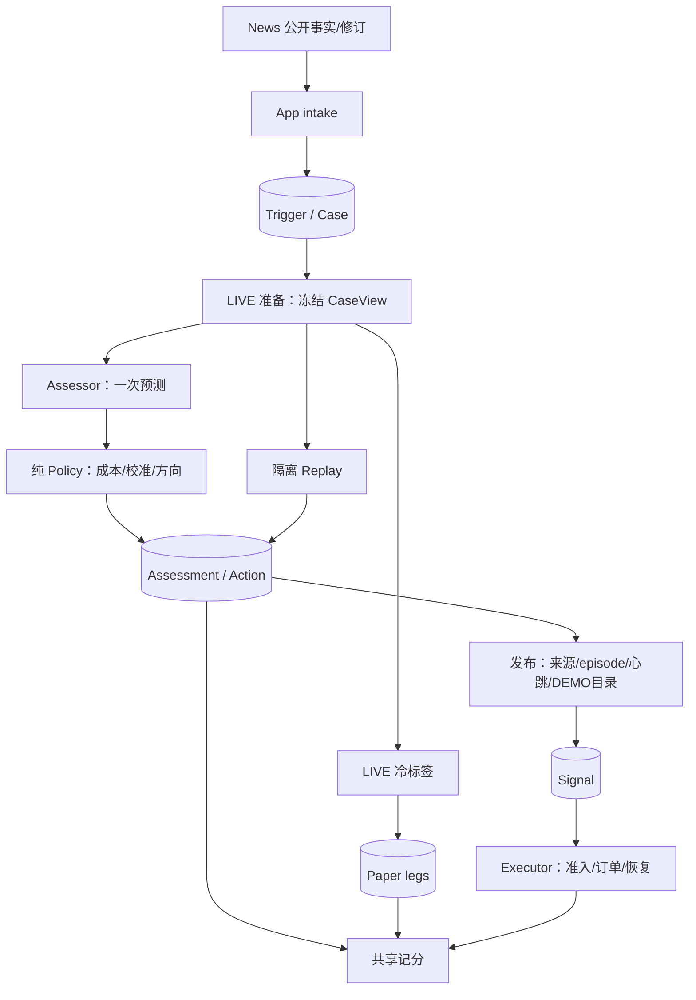

# Trading Analysis：冻结输入、评估身份与可比决策

[手册](../README.md) · [架构](../ARCHITECTURE.md) · [News](news.md) · [Execution](execution.md)

Analysis 从 News 公开事实和 Binance USD-M LIVE 行情建立 Case。Assessor 一次预测多、空 TP/SL/timeout 概率；纯 Policy 选择方向，发布器生成 Signal，DEMO Executor 另做账户准入。冷标签独立运行，失败与未发布不删除研究样本。

## 数据流、事务与所有者

箭头表达数据关系，各持久边界独立短事务。



| 所有者 | 职责 |
| --- | --- |
| App intake / CasePreparer | 映射公开契约、外部读取、冻结输入 |
| AnalysisRunner | 容量绑定领取/续租、owner fence、checkpoint、动作与发布 |
| Trading engine | 特征/几何/episode/Policy/校准/记分纯函数；不读 DB/HTTP/settings |
| Trading storage | SQL、约束、短事务与查询投影 |
| BinanceCatalogue | 分 LIVE/DEMO 的有界目录缓存与读取截止；不代替持久事实 |
| App ModelBudget | 按实际 endpoint 的跨进程 PG advisory slots，News/Trading 共用 |

保留具体工作流，不增加通用 Agent 框架、事件总线或代理 Facade；CLI/API/UI 共享查询和记分构造器。

## 输入、episode 与冻结合同

intake 先持久接收再确认 outbox。修订不创建 Case或延长根 TTL；LIVE 目录与经核实倍数映射解析单个合格 crypto 主标的，DEMO 上市留到发布。所有 Trigger/排除原因保留。

CaseView v2 冻结标的、原生单位、相对年龄、输入质量、OI 定义/方向、近期观察和事件证据别名。催化投影最多 12 个类型化 claim，保留机制、期限、条件与观察；数量遗漏显式记录并阻止发布，完整公开 payload 与 gzip 原始快照仍保存。模型不读绝对 ID/时钟，驱动只引用输入别名。

同 catalyst Event 归同 episode；OI 仅在资产/定义/venue/方向一致且相邻窗口不超过 15 分钟时归组，两倍相对变化或新 claim refs 为 material。保留全部 Case/纸面观察，repeat 不自动再发布；纯规则在 episodes.py，旧 episode 未知不回填。

16 根连续已收盘 LIVE 1m bar 定义 leg_geometry_v1：stop=ceil(2×ATR14/close×10000)，限制 100–1000bps，TP 2R，默认持有 4 小时。Case 冻结实际期限与 paper_cost_v1：双边 5bps taker、半点差一次、首个后续收盘共同锚点、同 bar SL 优先。缺关键行情具名失败，不用 DEMO 补 LIVE。

PG view 不可变；gzip 在 `archive/trading-cases/<sha前缀>/<sha>.json.gz` 保留 30 天。PIT baseline 仅用 cutoff 前 14 天、当时已落库且到期的同 trigger_kind×side 腿，至少 30 条。旧 Case 依原合同解释，legacy geometry v1 成本仍 5bps，不回写当前参数。

## 身份、容量与预测恢复

| 身份 | 含义 |
| --- | --- |
| evaluator_id | 程序 SHA、模型名称/显式版本、非秘密生成参数、输入/输出/特征/窗口合同 |
| run_id | online/inference/policies/legacy，候选与冻结 Case 集合/窗口/来源/tag |
| assessment_id | Case×run 不可变终态成功或具名失败 |
| action_id / policy_version | assessment 与完整规则、校准/成本/timeout 假设 |
| Signal.decision_id | 实际发布的 action，而非仅 program SHA |

endpoint URL/密钥不进入公开 evaluator；相同 evaluator 在线重启复用 run。模型/预测合同变化产生新 evaluator，仅重算策略产生 policies run。legacy 缺失参数继续 unknown。

领取数绑定本进程容量，续租与写入按 owner token fence；失权/取消不能写赢家或 Signal。成功输出先持久 checkpoint，重领复用而不再问 LM。News/Trading LM 共用 `llm.max_shared_concurrent_calls` 的 endpoint slots，连接关闭释放；保护/退出不依赖模型容量。

Assessor 校验概率与最多 12 条引用驱动；具名失败 parse/truncated/schema/provider/timeout/rate_limit。暂态最多一次有限重试，Retry-After 放不进截止则不重试。保存非秘密状态/request reference/Retry-After/时长与规范化 usage，未知 NULL。provider 时长含共享预算等待，不能当纯生成延迟。

## 策略、校准与发布

六策略 forecast/always_long/always_short/abstain/momentum15m/fade15m。forecast 扣冻结成本；温度、min_expected_r、min_expected_r_gap、条件 timeout gross R 与工件 SHA 均进身份。默认恒等温度与显式未拟合 timeout=0，不因当前小样本自动调阈值或升杠杆。

calibrate 声明训练/未来验证边界，训练 Case 双腿退出也早于训练边界，跨边界排除。预声明温度网格按训练 log loss 拟合，条件 timeout 少于 10 条保留未拟合零。工件绑定 evaluator/视图摘要/窗口/样本，不自动启用；不同 evaluator 或 Case cutoff 早于训练截止时拒绝。

active_policy 选择唯一在线策略，publish_signals 默认 false。发布核对来源覆盖、TTL/年龄、修订、episode、心跳和 DEMO 目录；刚完成预测不刷新有效期，repeat/unknown episode、遗漏或缺时钟具名不发布。

## 记分、重放与证明

记分按 run 展示漏斗/失败、原始与已落库校准预测、PIT 覆盖、动作率、净 R、资产/来源/年龄/episode/采集方式分组和执行筛选。BSS 在匹配 PIT 子样本计算，至少 30 腿并报告覆盖。

配对只用共同 Case、同几何、成熟双腿；abstain 为零持仓收益，失败/缺标签保持 missing。均值可描述；区间要求七个有效日期、十个资产日簇，整日重采样，仍不证明市场因子独立。capture_cohort 来自首次受理时记录的 relay_capture_v1：本轮 relay 启动前已在公开 outbox 落库为 backlog，其后落库为 prospective；保存启动/落库/受理时间，重试不改组。它描述 Trading 领取边界，不推断 News 上游采集模式；来源年龄与原 ingest_mode 单列，旧记录缺边界仍 unknown。backlog 保留预测与双腿但不自动发布。#746 七天 prospective/双腿覆盖须独立真实窗口。

```bash
tracefold trading scoreboard --since 2026-09-01 --until 2026-09-08
tracefold trading replay --mode policies --source-run <run_id> --since 2026-09-01 --until 2026-09-08 --tag policy-v1
tracefold trading replay --mode inference --program /path/candidate.json --since 2026-09-01 --until 2026-09-08 --tag model-v1
tracefold trading calibrate --source-run <run_id> --train-since 2026-09-01 --train-until 2026-09-08 --validate-until 2026-09-15 --output /path/calibration.json
```

Policies replay 复用指定 run 输出，零 LM；inference 关闭 cache，隔离新输出。同 run 再执行复用终态，新 tag 明确新评估；均不发 Signal、不访问交易所或补取行情。

0419 前向保留 Case/失败评估/Signal/活跃 Plan/Fill，补齐身份和准入，不重复历史硬切。接口见 [契约](../CONTRACTS.md)，维护见 [迁移](../MIGRATIONS.md)。工程证明：[claim](../../tests/integration/test_trading_claim_recovery.py)、[identity](../../tests/trading/test_evaluation_identity.py)、[calibration](../../tests/trading/test_calibration.py)、[budget](../../tests/integration/test_model_budget.py)。[760](https://github.com/AnalyThothAI/tracefold/issues/760)/[746](https://github.com/AnalyThothAI/tracefold/issues/746) 现场证据不能由 Mock 替代。
