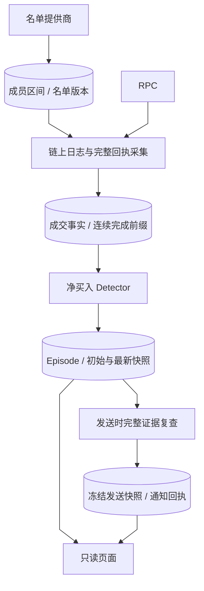

# Wallets：链上集中净买入警报

[手册](../README.md) · [市场观察](oi.md) · [平台任务](platform.md) · [运维](../OPERATIONS.md)

钱包产品从完整可归属的链上事实中，识别多个关注地址在同一窗口净买入同一代币。当前在线路径没有钱包模型评分，也没有把 wallet episode 自动转换为 Trading 策略；名单质量、历史参与和代币年龄是上下文。

## 三个 Workers 任务

| 任务 | 职责 | 输入和产物 |
| --- | --- | --- |
| `news-wallet-roster` | 刷新并发布完整有效名单 | Robinhood Trenches → 成员区间和版本 |
| `news-chain-tape` | 扫描日志、获取完整回执并解释现金/代币变动 | Robinhood Chain RPC → 成交事实与连续完成前缀 |
| `news-wallet-net-buy` | 处理完整回执并评估净买入规则 | 已提交事实 → episode 初始/最新快照 |

`news.chain_tape.enabled` 控制三类任务的装配；poll、roster 刷新间隔和规则来自同一配置。任务拥有独立 Adapter 与有界 `advance()`，通过 PostgreSQL 事实和工作标记连接；名单网站变慢不占住回执采集，某阶段故障仅关闭自己的客户端。停止或取消时 App 等待在途工作并关闭资源，下次运行重新读取持久标记。



*数据视图 · 名单不是成交，连续完成前缀才支持窗口判断；episode 与通知回执分别保存。*

## 名单与证据覆盖

名单任务完成有效地址集校验后一次发布。成员集不变只刷新 handle 与状态，不因 provider 排名或利润变化重置版本。名单表达关注哪些地址，不能证明地址在当前窗口买入；排名不再是成员资格的二次门槛。

`news_market_wallets` 保存成员区间及 `monitoring_from_ms`。成员变化关闭离开区间并为新成员开区间，历史版本按区间边界重建。地址在离开后的 30 分钟采集覆盖内重新加入可继承原监控起点，否则重新建立覆盖。名单刷新和链进度分别归 `news_collectors.wallet_roster` / `chain_tape`，行锁防止并发覆盖；采集器读取已发布名单，不在每次扫描时请求名单网站。

安全进度是已完整处理的 `(block, log)` 连续前缀，而不是见过的最大区块。同一交易的相关日志、回执、现金和代币变动一起解释，事实与完成位置在同一事务提交。回执缺失或核心解释失败保留具名失败和重试位置，不越过缺口推进。重叠扫描按链、交易哈希和日志身份去重，不能重复增加买家。

普通转账不直接算买入，无法归属现金或无法定价的交易不填零美元。区块哈希保存用于证据核对，不代表实现了任意深度重组的自动回滚。Detector 先按完整回执处理 backlog，清空后才使用链上 cutoff 滑动窗口，不用主机时钟先过期未处理事实。

## 单一净买入规则

默认规则是 **30 分钟内，至少 5 个不同关注地址，每个地址净买入不少于 1,000 美元，且窗口净买入代币数量为正**。

| 参数 | 默认值 | 语义 |
| --- | --- | --- |
| `NET_BUY_WINDOW_MS` | 30 分钟 | 固定产品窗口，与 provider 名单的查询周期无关 |
| `news.chain_tape.rules.net_buy_slow_n` | 5 | 最低合格地址数，历史命名仍是当前唯一 quorum |
| `news.chain_tape.rules.min_net_buy_usd` | 1,000 美元 | 每个地址窗口内买入美元减去卖出美元的下限 |
| `news.chain_tape.rules.trigger_max_age_s` | 60 秒 | 首报触发时效，不允许跳过历史事实 |

每地址分别计算 `net_usd = buy_usd - sell_usd` 与 `net_token_raw = buy_token_raw - sell_token_raw`，再统计合格地址。一个地址的五笔买入仍是一个买家。

资格要求名单成员、完整监控覆盖、无采集缺口、买卖可定价、无无法归属的转出、净金额达标且净数量为正。对应原因包括 `not_on_roster`、`incomplete_monitoring_window`、`collection_gap`、`unpriced_trade`、`transfer_out_incomplete`、`below_min_net_buy`、`nonpositive_net_quantity`。未定价或转出不完整时净美元是未知，不是精确的零。

新 episode 还要求本笔回执产生有效新增净买入、在 cutover 后且触发时效合格。未来链时间、过期触发和 cutover 前记录仍保留诊断原因，不发首报。`notifications_enabled=false` 不关闭名单/采集/检测，episode 可保存但不能发送。

## Episode 与发送证据

| 持久字段 | 语义 |
| --- | --- |
| `initial_snapshot` | 首次达标时的窗口和成员证据，不随未来改变 |
| `latest_snapshot` | 后续完整回执或链上滑动窗口的当前观察 |
| `send_snapshot` | 实际开始发送时冻结的重新评估结果 |
| `last_effective_buy_at_ms` | 最近合格成员有效新增净买入的链上时点 |
| `ended_at_ms` / `change_reason` | episode 是否结束及原因 |

同一代币活跃 episode 根据完整买卖和窗口更新，连续一个窗口没有有效新增净买入后结束；新的达标窗口可再开启 episode。单 episode 只准备首报，不随每次买入重复建卡。初始、最新和发送快照承担不同证明，不能用通知已发送替代 episode 状态。历史参与次数来自此前 episode，代币年龄来自首次观察，不预测未来收益。

发送可能排队，所以首报领取时在 collector 的**已提交 cutoff**上复查：episode 已结束或触发过期则具名抑制；cutoff 未知、早于触发或其内证据尚未派生则暂缓；证据完整时用 Detector 的同一纯规则重新评估。截止之后的不断增长尾部不阻止发送，不能要求永久追赶最高区块。

复查不修改 `latest_snapshot`，通过后仅冻结 `send_snapshot` 和正文；卖出后不再达标则 `invalidated_before_send`。外部结果未知沿用市场通知恢复语义，不盲目重发。可选报价、余额、社交或模型研究不阻塞首报，但必要回执和现金归属必须完整。

## 存储、接口与诊断

成交归 `news_market_wallet_fills`，episode 与三类快照归 `news_market_wallet_events`；对应市场观察存入 `news_market_observations`，通知意图和回执使用 `news_jobs` / `news_notifications`。这些是 News 事实，Trading 不查询其内部表。当前钱包不持久保存参考价、期限采样或交易 outcome；即时行情通过独立报价接口读取。

`GET /api/news/wallets` 返回名单、覆盖、规则、采集滞后与通知漏斗；`/api/news/wallets/events` 提供固定历史窗口和 cursor 分页；`/api/news/wallets/events/{episode_id}` 读取初始/最新快照、成员与成交分页。发送快照保存在账本，当前 HTTP 投影公开通知状态、原因和发送时钟。状态、列表和详情从数据库快照构造，只读页面不拥有下单权限。

```bash
docker compose exec -T workers tracefold news wallets --hours 24 --queue-limit 10
```

排障顺序：名单发布 → 连续完成前缀 → 成交解释 → 每地址资格原因 → episode → 发送复查 → 实际回执。无警报时先区分没有达标与证据不足，诊断配置和参数见 [契约](../CONTRACTS.md)及 [运维](../OPERATIONS.md)。

## 实现与验证

| 实现 | 职责 |
| --- | --- |
| [chain_tape wiring](../../tracefold/app/workers/wiring/chain_tape.py)、[task_contract.py](../../tracefold/app/workers/task_contract.py) | 独立任务装配、轮询与资源生命周期 |
| [roster_refresh.py](../../tracefold/news/chain_tape/roster_refresh.py) | 有界名单请求、完整性校验与成员集发布 |
| [loop.py](../../tracefold/news/chain_tape/loop.py)、[tape_io.py](../../tracefold/news/chain_tape/tape_io.py) | 完整回执扫描与持久进度 |
| [evm.py](../../tracefold/news/chain_tape/evm.py)、[classify.py](../../tracefold/news/chain_tape/classify.py) | 交易内资产流与 buy / sell / transfer 归属 |
| [rules.py](../../tracefold/news/chain_tape/rules.py)、[detect.py](../../tracefold/news/chain_tape/detect.py) | 单一窗口纯规则、回执派生和 episode 更新 |
| [storage/chain_tape.py](../../tracefold/news/storage/chain_tape.py)、[wallet_events.py](../../tracefold/news/storage/wallet_events.py)、[wallet_snapshots.py](../../tracefold/news/storage/wallet_snapshots.py) | 名单、成交、episode 和快照 |
| [market_notifications.py](../../tracefold/news/market_notifications.py)、[wallet_diagnostics.py](../../tracefold/news/storage/wallet_diagnostics.py) | 首报复查、冻结发送与可解释诊断 |

[纯规则](../../tests/news/test_news_chain_tape_rules.py)、[成交解释](../../tests/news/test_news_chain_tape_classify.py)、[完整前缀](../../tests/integration/test_wallet_complete_prefix.py)、[名单刷新](../../tests/integration/test_wallet_roster_refresh.py)、[净买入](../../tests/integration/test_wallet_net_buy.py)和 [发送活性](../../tests/integration/test_wallet_send_liveness.py)分别覆盖规则、事实和发送接缝。
