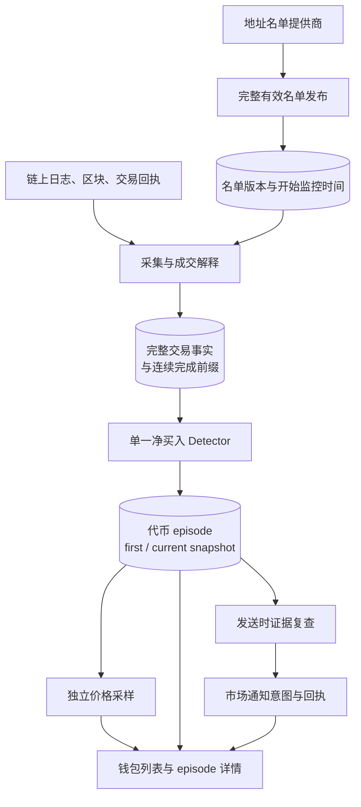
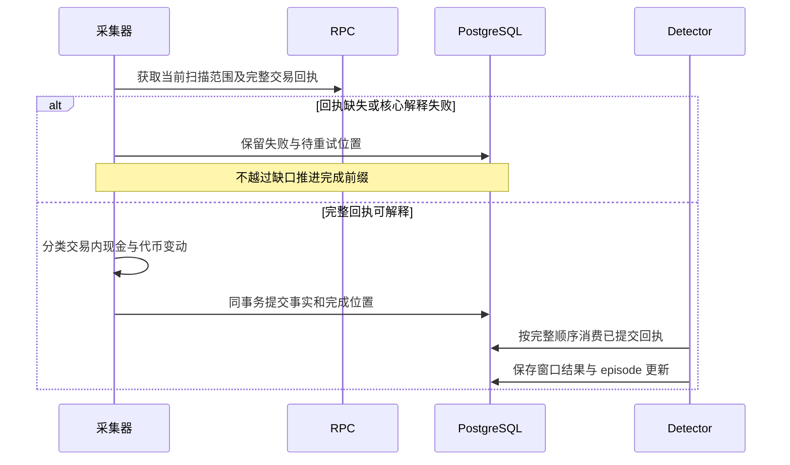

# Wallets：链上集中净买入警报

[手册](../README.md) · [市场观察](oi.md) · [平台任务](platform.md) · [运维诊断](../OPERATIONS.md)

当前钱包产品只聚焦一件事：**在完整可归属的链上证据中，发现多个关注地址在同一窗口净买入同一代币。** 名单质量统计、代币价格和历史参与次数是上下文，不是又一套大模型评分入口。

## 1. 四个独立任务

| Workers 任务 | 职责 | 来源 / 产物 |
| --- | --- | --- |
| `news-wallet-roster` | 刷新并发布完整有效地址名单 | 名单提供商 → 版本化成员集 |
| `news-chain-tape` | 扫描、获取完整回执、解释现金与代币变动 | RPC → receipt / fill 与连续已完成前缀 |
| `news-wallet-net-buy` | 消费完整回执，评估单一净买入规则 | 成交事实 → episode 首报 / 当前快照 |
| `news-wallet-prices` | 独立采样触发参考价与后续期限 | 公共价格 → 明确时点的价格观察 |

任务由 [chain_tape wiring](../../tracefold/app/workers/wiring/chain_tape.py)与 [task_contract.py](../../tracefold/app/workers/task_contract.py)装配。名单服务变慢不应占住回执采集；价格失败不应延迟首次买入证据。



## 2. 源码责任地图

| 源码 | 核心职责 |
| --- | --- |
| [roster_refresh.py](../../tracefold/news/chain_tape/roster_refresh.py) | 有界名单抓取、完整性校验、成员集发布 |
| [loop.py](../../tracefold/news/chain_tape/loop.py)、[tape_io.py](../../tracefold/news/chain_tape/tape_io.py) | 扫描编排、完整回执与已完成进度，失败结果不跳过 |
| [evm.py](../../tracefold/news/chain_tape/evm.py)、[classify.py](../../tracefold/news/chain_tape/classify.py) | 日志解释、交易内资产流与 buy / sell / transfer 归属 |
| [rules.py](../../tracefold/news/chain_tape/rules.py) | 无 I/O 的净买入窗口、成员排除原因与有效新增买入 |
| [detect.py](../../tracefold/news/chain_tape/detect.py) | 回执推进、episode 创建 / 更新及滑动到期 |
| [prices.py](../../tracefold/news/chain_tape/prices.py) | 触发参考与期限价格采样，不改变触发事实 |
| [wallet_contracts.py](../../tracefold/news/wallet_contracts.py)、[chain_tape/contracts.py](../../tracefold/news/chain_tape/contracts.py) | 窗口、成员、快照、回执与价格的类型契约 |
| [storage/chain_tape.py](../../tracefold/news/storage/chain_tape.py)、[wallet_events.py](../../tracefold/news/storage/wallet_events.py)、[wallet_snapshots.py](../../tracefold/news/storage/wallet_snapshots.py) | 持久事实、episode 与快照读取 |
| [market_notifications.py](../../tracefold/news/market_notifications.py) | 首报发送前复查、冻结正文、实际投递结果 |
| [wallet_diagnostics.py](../../tracefold/news/storage/wallet_diagnostics.py) | 状态、覆盖、规则和队列的可解释诊断 |

## 3. 名单不是成交

名单任务取回完整有效地址集后一次发布。成员版本表达**关注哪些地址**，不是每次 provider 的利润或排名变化都重置监控身份。采集器读取最近一次已发布名单，不在每次链扫描里同步请求名单网站。

地址在名单中不代表它在当前窗口买入。`monitoring_from_ms`、名单已知时间和覆盖范围决定该地址是否具备完整可解释观察。排名、昵称和历史参与次数可展示，但不替代完整回执，更不能把 AI 猜测的钱包身份当作事实。

## 4. 完整前缀：不能跳过失败回执

一个安全的采集进度不是“见过的最大区块号”，而是**已完整处理的 `(block, log)` 连续前缀**。同一交易的相关日志和现金变动要一起解释，事实与推进位置一起提交。



成交按链、交易哈希和日志身份去重；重叠扫描或进程恢复不能重复增加买家。普通转账不直接算买入；缺失现金归属或未定价的交易不能用零美元填充。保存区块哈希也不等于已经实现任意深度链重组自动回滚。

Detector 先处理待消费回执，队列清空后才按链上时间滑动 episode；不能用主机墙钟先过期一批仍有待处理交易的信号。

## 5. 当前只有一条净买入规则

默认规则是：**30 分钟内，至少 5 个不同的关注地址，每个地址净买入至少 1,000 美元，并持有正的窗口净买入代币数量。**

| 参数 | 当前默认 | 配置含义 |
| --- | --- | --- |
| 窗口 | 30 分钟 | `NET_BUY_WINDOW_MS` 固定产品定义，不是名单 provider 的 `30d` 查询范围 |
| `net_buy_slow_n` | 5 | 最低合格地址数，可配置；历史命名不代表仍有 fast 分支 |
| `min_net_buy_usd` | 1,000 美元 | 每个地址在窗口内买入美元减去卖出美元的最低金额 |
| `trigger_max_age_s` | 60 秒 | 首报触发的时效边界；不是允许采集器跳过历史事实 |

每个地址计算：`net_usd = buy_usd - sell_usd`，`net_token_raw = buy_token_raw - sell_token_raw`。先逐地址判断资格，再统计合格地址数和金额，不能把一个地址的五笔交易算成五个人。

具名排除原因包括：不在名单、监控覆盖不足、交易无法定价、转出导致归属不完整、净买入金额不足、净代币数量非正。只要存在未定价买卖或不完整转出，净美元值可以是未知，而不是看起来精确的零。

已删除的 `net_buy_fast_n` 是不支持的配置，不应在文档或默认 YAML 中重新出现为可用参数。名单排名不是成员资格的二次门槛；不要把历史回测中的某个排名过滤器描述成现在线上规则。

## 6. Episode、首次快照与当前快照

| 数据 | 语义 |
| --- | --- |
| `first_snapshot` | 达标时的事实和成员证据，保留首报时点 |
| `current_snapshot` | 后续完整回执或滑动窗口更新后的当前观察 |
| `send_snapshot` | 实际开始发送时冻结的证据；不能随未来状态改变 |
| 历史参与次数 | 该地址在此前 episode 中的已记录参与，不是未来持续买入概率 |
| 新代币标签 | 基于首次观察年龄的上下文，不是一道“老币不报警”的过滤器 |

已经开启的 episode 根据新的有效买入和窗口状态更新，不为同一轮不停新建卡片。episode 结束与重新出现新的达标窗口是产品状态，不能用“通知已发送”代替。

## 7. 首报为什么还要做发送时检查

Detector 达标后，发送可能排队。期间成员可能已卖出，或 collector 已推进而 detector 尚未处理完。发送前必须在**已提交的完整前缀**上复查实际窗口，而不是仍用过时达标结果。

这个检查只围绕 collector / detector 的完整证据边界：不能要求永远追上一个不断移动的未来最高区块，也不能为了首报再等价格、余额、模型解释或社交研究。缺少必要证据时具名暂缓；通过后冻结 payload，外部结果不明时不盲目重发。

## 8. 价格观察是独立后续

触发参考价最多在触发后 **5 分钟**内形成；更晚取得的价格不能回填成触发价。后续期限为 **15m、1h、4h**，保存目标时间和实际观察时间，期限采样还有自己的延迟限制。

缺少参考价时收益为未知，不能计算成 0%；拿当前价格重新覆盖历史样本会破坏复盘含义。价格采样失败不改变已经保存的净买入证据，也不阻断首报。

## 9. 页面与诊断

`/api/news/wallets` 回答名单和采集状态；`/api/news/wallets/events` 与详情接口回答 episode、成员、first / current、价格与历史。页面是只读投影，既不是另一份成交账本，也没有自动下单权限。

```bash
docker compose exec -T workers tracefold news wallets --hours 24 --queue-limit 10
```

排障顺序：**名单发布 → 完整前缀 → 成交解释 → 每地址排除原因 → 达标 episode → 发送时复查 → 真实回执**。不要看到“没有警报”就先增加模型调用。

## 10. 验证入口

[纯规则](../../tests/news/test_news_chain_tape_rules.py)、[成交解释](../../tests/news/test_news_chain_tape_classify.py)、[完整前缀](../../tests/integration/test_wallet_complete_prefix.py)、[名单刷新](../../tests/integration/test_wallet_roster_refresh.py)、[净买入集成](../../tests/integration/test_wallet_net_buy.py)、[发送活性](../../tests/integration/test_wallet_send_liveness.py)分别覆盖不同接缝。

这些能力不等于“钱包天然聪明”或收益保证；目前也不能由一个 wallet episode 推断已经存在自动 Trading 策略。当前产品不再以旧版钱包摘要、多模型画像或单钱包解读作为核心入口。
