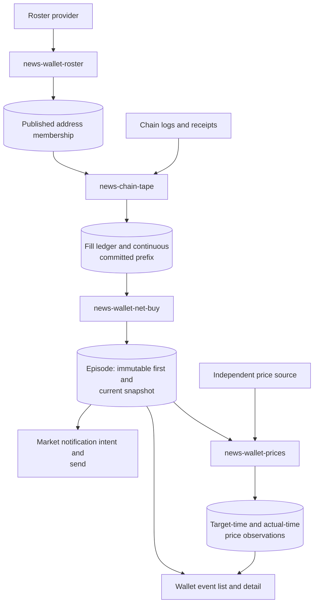
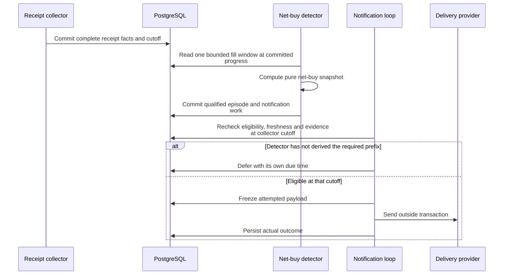

# Wallets: receipt-backed concentrated net buying

[Handbook](../README.md) · [News](news.md) · [Market notifications](oi.md) ·
[Version-specific cutover](../wallet-net-buy-cutover.md)

The wallet product detects concentrated net buying among followed addresses.
Roster statistics identify whom to follow; on-chain receipts establish observed
fills. Notifications describe the evidence, not a recommendation to copy a wallet
or proof that a provider's historical profit figure is accurate.

## 1. Four independently supervised tasks

[Workers wiring](../../tracefold/app/workers/wiring/chain_tape.py) constructs these
components and [task_contract.py](../../tracefold/app/workers/task_contract.py)
supervises them. The collector reads the last published roster from PostgreSQL;
it does not call the roster site itself. Optional price sampling depends on its
configured adapter, not on the first-alert path being allowed to run.

| Module | Responsibility |
| --- | --- |
| [roster_refresh.py](../../tracefold/news/chain_tape/roster_refresh.py) | Fetch and publish a complete valid address set and its provenance. |
| [loop.py](../../tracefold/news/chain_tape/loop.py), [tape_io.py](../../tracefold/news/chain_tape/tape_io.py) | Bounded collection, receipt work, retry and durable progress. |
| [evm.py](../../tracefold/news/chain_tape/evm.py), [classify.py](../../tracefold/news/chain_tape/classify.py) | Interpret receipt/log evidence into attributable token/cash activity. |
| [rules.py](../../tracefold/news/chain_tape/rules.py), [detect.py](../../tracefold/news/chain_tape/detect.py) | Pure window computation and persisted episode detection. |
| [prices.py](../../tracefold/news/chain_tape/prices.py) | Independent price observations and explicit missing baseline/coverage. |
| [wallet_contracts.py](../../tracefold/news/wallet_contracts.py), [chain contracts](../../tracefold/news/chain_tape/contracts.py) | Typed snapshots, timing and receipt identities. |
| [market_notifications.py](../../tracefold/news/market_notifications.py) | Due intent selection, evidence recheck, payload freeze, send and outcome. |

## 2. Collection is a complete prefix, not the largest block seen

A membership version changes when the valid address set changes, not whenever a
provider updates a displayed statistic. Collection can continue against the last
published membership while the roster provider is slow or unavailable.

The durable cutoff is a **continuous complete receipt prefix** identified by
`(scanned_block, scanned_log)`. Seeing a later block is not permission to skip a
missing earlier receipt. Complete transaction facts and derivation progress commit
atomically; real receipt gaps stop that turn and retry durably. Optional token or
quote metadata does not acquire permission to block valid receipt progress.

Transaction/log identities support idempotent overlap. A plain transfer is not
automatically a buy, and absent cash attribution means unknown pricing rather
than zero spend. Stored block hashes are useful provenance, but do not alone
implement full chain-reorganization repair or prove historical portfolio coverage.

## 3. From fills to a net-buy episode

The detector computes its configured window from the same fill set and records
member coverage, pricing availability and exclusion reasons. Thresholds and timing
constants belong to the pure rules/contracts and operator settings, not a second
hand-maintained scoring formula in the console.

An episode has an immutable first snapshot and an independently updated current
snapshot. Later selling or additional buying can change the current picture
without changing what the first alert actually asserted. Several fills from the
same address do not become several independent wallets merely because they are
several rows.

Facts above the committed cutoff cannot hold a valid first card hostage. A card
whose necessary evidence is not yet derived is deferred rather than dropped.
Detection and the first notification do not require balance/bags queries, an
external price quote or an LLM. Once an attempt has started, its payload is not
silently rewritten as new fills arrive.

## 4. Prices and product reads

Price samples record both the intended observation time and the actual observation
time. A missing trigger baseline leaves return unknown. A later available quote
must not be presented as the exact price a wallet received or as evidence that a
reader could have executed at that price.

The console reads `/api/news/wallets/events` and episode detail. The roster endpoint
is auxiliary membership context. Old wallet digests, single-wallet model research,
exit/crowding rules and “buy because a famous wallet bought” are not the current
product. No automatic Trading strategy is implied by a qualifying episode.

## 5. Debug a missing alert

| Boundary | Evidence to inspect |
| --- | --- |
| Membership | Last complete roster publication, address-set version and unavailable-provider reason. |
| Collection | Receipt retries and continuous cutoff, not just the maximum observed block. |
| Interpretation | Transaction/log identities, buy/sell/cash attribution and explicit exclusions. |
| Detection | Same-window fill set, distinct member participation and first/current snapshots. |
| Delivery | Current qualification at the cutoff, deferred due time, frozen payload and actual receipt. |
| Performance display | Baseline availability, sampling target/actual time and missing coverage. |

[Chain-tape integration tests](../../tests/integration/test_news_chain_tape.py),
[notification tests](../../tests/integration/test_news_market_notifications.py),
[market API tests](../../tests/integration/test_news_market_api.py), and the
[recorded wallet verification](../research/wallet-net-buy-verification-2026-09-12.md)
cover different evidence boundaries. The historical receipt is not a current
production-health claim. Follow [Operations](../OPERATIONS.md) for live diagnosis
and [Migrations](../MIGRATIONS.md) for the actual schema/config cut.
