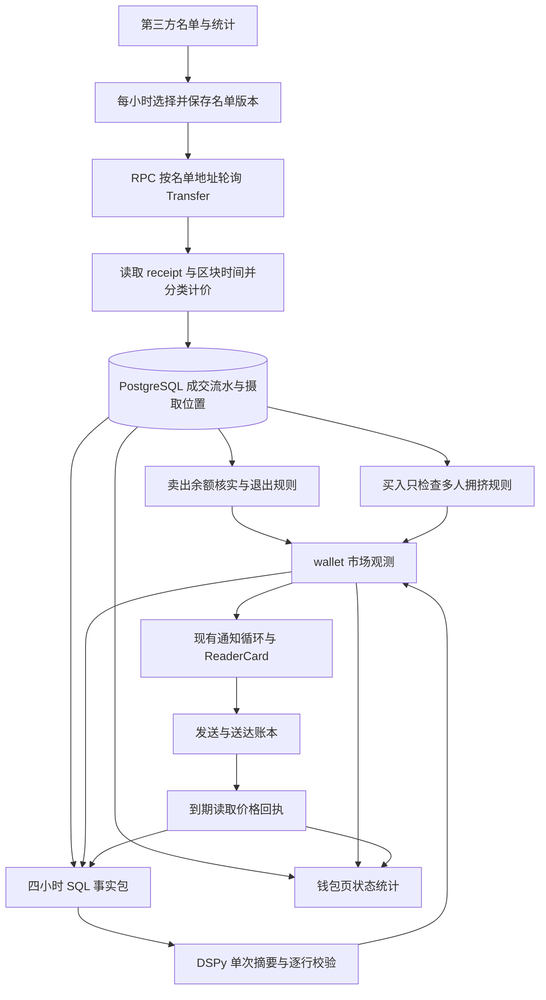

**Robinhood 链上买入研究：当前链路、目标错位与设计分析**

分析日期：2026-09-08。代码基线：`96bd90c98`（本次 fetch 后的 origin/main）。用户目标：主要研究买入，不希望大量无关减仓占据提醒和 agent 总结。本次仅分析和撰写报告，没有修改业务代码、运行配置、名单或推送规则，也没有发送通知。

**结论**

当前系统已经实现一条有审计能力的「名单钱包活动监控」链路，产品重点是减仓核实、多人买入拥挤提醒和四小时摘要。用户需要的是围绕买入展开研究：谁买了什么、这笔投入对他有多重要、首次建仓还是加仓、其他人何时跟进、自己看到信息时价格已变化多少、买入后行为如何演变。现有实现缺少承载这些问题的买入观察与研究事实包。

减仓过多的根因分布在事件定义、名单范围、SQL 选材、模型指令与展示页面五处。只在 prompt 里增加「多讲买入」，只能改变已经入选事实的措辞，无法恢复上游没选进来的买入，也无法补足买入时间、代币明细和仓位阶段。

最小完整方向是复用现有采集、PostgreSQL、admission、发送和审计，把研究主体改为「钱包对某代币的一段买入行为」。卖出继续作为事实保存，用于解释这段买入之后是否减弱或结束；它是否单独通知，应该有明确的产品策略。

**证据范围与当前状态**

| 证据 | 本次核实结果 | 可以说明什么 |
| --- | --- | --- |
| 当前代码与相关测试 | 已读采集、分类、名单、规则、摘要、存储、模型、发送、前端 | 确定当前实现行为与测试缺口 |
| #572 正文与全部评论 | 已读，含后续配置调整与关闭记录 | 2026-09-06 的设计依据及最后记录的部署参数 |
| 公开数据源 | 2026-09-08 低量只读核验；原域跳转新域，当前公开名单 147 行 | 上游当前公开行为；不能证明 Tracefold 当前进程状态 |
| 本机 `uv run tracefold config` | 因退役键 `trading.notifications` 校验失败 | 本机配置与当前代码不兼容；不是生产故障证据 |
| 已知部署连接 | SSH 超时，本机 Docker 未见本项目生产 workers/serve | 本次没有生产数据库、实时摘要分布与送达量证据 |
| 最小复现 | 直接调用当前纯函数、分类器，以及受控的派生控制流 | 证明特定输入下代码的输出；不能代表线上发生频率 |

本报告不会把代码默认参数、历史部署参数、第三方公开样本和生产现状混成同一口径。

**原方案为什么走向了卖出**

[#572](https://github.com/AnalyThothAI/tracefold/issues/572) 依据 2026-09-06 的有界样本，把减仓信息视为更有价值：原站买入已经广泛广播，跟随者相对领头者的入场溢价很大，而卖出后跟随买入减少。该 Issue 自己也注明样本小、部分落在周末。这些结果足以支持「检查追涨代价」与「保留退出信息」，不足以证明所有买入研究没有价值，或减仓应该长期占据用户的注意力预算。

尤其要分开三个问题：领头钱包有没有选币优势；跟随者收到信号后还有没有可达机会；用户能不能通过长期研究识别不同钱包的行为模式。已广播、拥挤和追高风险主要约束第二个问题，不能替代另外两个问题的分析。

原来的质量榜与大户榜并集约 35 人。后续用户要求扩大买入信息覆盖，部署记录将大户榜上限设为 200，把当时全部 147 人纳入，拥挤规则改成 2 人、60 分钟、每人累计至少 1,000 美元。退出规则同时扩大到所有这些人，因此具备增加卖出提醒的机制；本次未核实调整前后的实际发送量。这是共享名单用于两种不同产品目标的影响。[配置调整记录](https://github.com/AnalyThothAI/tracefold/issues/572#issuecomment-5557742484)

| 项目 | 当前代码默认值 | 2026-09-06 最后记录的部署值 |
| --- | --- | --- |
| 质量榜 | 平仓 ≥10、PF ≥1.2，按已实现盈亏取 20 | 同左 |
| 大户榜 | 持仓成本前 20 | 上限 200，当时纳入全部 147 人 |
| 拥挤 | 3 人／15 分钟／每人 ≥1,000 美元 | 2 人／60 分钟／每人 ≥1,000 美元 |
| 退出 | 单笔比例严格 >30% 或清仓；卖前仓位 ≥20,000 美元，或级联条件下 ≥5,000 美元 | 最后上线回执同左 |
| 摘要 | 每 4 小时，最多 8 行 | 同左，曾确认 Qwen 经 DSPy 生成并送达 |

这些部署值今天是否仍有效，尚未从运行进程核实。Issue 关闭时已经记录「用户正在考虑移除减仓单独通知」，但没有记录最后执行了关闭。[关闭记录](https://github.com/AnalyThothAI/tracefold/issues/572#issuecomment-5558666574)

**完整链路及职责**



这条链路属于 News 市场面，没有把钱包买入转为 Trading 的交易指令。账本与发送链路可以直接复用，无须为买入再建立一套独立采集进程、数据库、通知系统或多 agent 编排。

1. **名单模块。** 第三方 `/api/traders?window=7d&stocks=false` 与逐 handle 统计提供候选；程序取质量榜和大户榜并集。质量排名依赖近七天已实现盈亏、profit factor 与平仓样本，大户排名只按持仓成本。名单并非全链发现，也并非独立验证过的买入能力榜。资料中的 `stocks=false` 也提示当前候选统计范围，不应把此流程泛化成 Robinhood 股票代币策略。[名单选择](https://github.com/AnalyThothAI/tracefold/blob/96bd90c98/tracefold/news/chain_tape/roster.py#L52)
2. **摄取模块。** 两个方向的 Transfer 日志筛选名单地址，receipt 检查 V3/V4 Swap，读取 token 元数据及区块时间，保存 raw 数量、现金腿、美元口径与名单版本。默认每轮最多 20 个 receipts、一次区块段最多 100,000 块，重叠 30 块；初启默认从近端开始，曾部署的 24 小时回补是额外操作。[摄取循环](https://github.com/AnalyThothAI/tracefold/blob/96bd90c98/tracefold/news/chain_tape/loop.py#L227)
3. **持久化。** `(chain_id, tx_hash, log_index)` 幂等，原始数量保持精确数值；fills 与摄取位置一起提交，然后派生观测。默认保留 90 天。这是可靠的流水基础，但观察历史与真实仓位历史不是同一件事。[存储](https://github.com/AnalyThothAI/tracefold/blob/96bd90c98/tracefold/news/storage/chain_tape.py#L59)
4. **规则模块。** 每笔卖出走余额、比例、仓位价值与级联条件；买入只检查多人拥挤。单人首次观察买入、大额买入、连续加仓都没有专门观测类型。[派生入口](https://github.com/AnalyThothAI/tracefold/blob/96bd90c98/tracefold/news/chain_tape/derive.py#L160)
5. **发送模块。** 派生观测进入既有 market admission、通知循环、ReaderCard 和投递账本。钱包规则已经在上游筛选，下游通常直接通知，只保留同组未开始 intent 的限制。因此改摘要 prompt 不会改变独立减仓卡数量。[发送决策](https://github.com/AnalyThothAI/tracefold/blob/96bd90c98/tracefold/news/market_notifications.py#L837)
6. **摘要模块。** PostgreSQL 先算数字，程序选材，DSPy 调用模型写最多八句中文。模型没有链上查询工具，也不负责筛名单、计算、解释交易动机或产生买入研究判断。[模型指令](https://github.com/AnalyThothAI/tracefold/blob/96bd90c98/tracefold/news/program/chain_tape_digest.py#L44)
7. **回执与前端。** +1h/+4h 价格针对已发送的卡；钱包页展示名单、摄取状态、卡片和回执，缺少可按 token／钱包展开的买入流水及行为时间线。[钱包页面](https://github.com/AnalyThothAI/tracefold/blob/96bd90c98/web/src/features/news/ui/wallets/NewsWalletsPage.tsx#L62)

**摘要偏减仓的具体机制**

第一层在 SQL：钱包按买卖合计金额选前 20，wallet/token 按买卖合计金额选前 12，卡片按时间选最早 20。一个大额退出会同时争夺钱包明细、仓位明细和卡片明细的空间。[选材 SQL](https://github.com/AnalyThothAI/tracefold/blob/96bd90c98/tracefold/news/storage/chain_tape.py#L320)

第二层在事实结构：钱包行只是买入多少笔、卖出多少笔的合计；token 行主要是三个成本口径，缺少完整的「谁在什么时间以多少金额买了哪个 token、仓位阶段是什么」。事实顺序为概览、卡片、回执、噪声、钱包、仓位。[事实包](https://github.com/AnalyThothAI/tracefold/blob/96bd90c98/tracefold/news/chain_tape/digest.py#L265)

第三层在模型目标：指令明确写 `Prefer the largest positions, the cards that were sent and the price receipts`，同时禁止判断、解释动机、预测与重新计算。这使当前模型适合复述活动，缺少进行买入研究的任务和证据。[指令](https://github.com/AnalyThothAI/tracefold/blob/96bd90c98/tracefold/news/program/chain_tape_digest.py#L44)

第四层在输出预算：模型输出最多 8 行，每行最多 60 字符；模板同样最多 8 行，但没有该字符上限。模板也并非按注释说的每区取一条；代码顺序填满整组。存在两条回执、噪声、两个成本条目时，8 行就是 `w0,w1,k0,o1,o2,n1,c1,c2`，钱包买入事实完全没有位置。本次直接调用 `template_lines` 已复现。[模板](https://github.com/AnalyThothAI/tracefold/blob/96bd90c98/tracefold/news/chain_tape/digest.py#L453)

第五层在读者工作流：遗漏的单人买入不会自动出现在钱包页的交易明细里，页面主要展示产生过卡的内容。读者因此很难从摘要顺手下钻补回被省略的信息。

**买入研究之前必须看清的事实口径**

| 问题 | 代码证据与复现 | 对买入研究的影响 |
| --- | --- | --- |
| 截断子集写成全量总计 | activity SQL LIMIT 20；`w0` 用 `len(rows.activity)`，`w1` 汇总该列表；卡数同样来自最多 20 张卡 | >20 活跃钱包或卡时低估总数；当前线上是否越界未知 |
| 首次观察被当作新建仓 | crowding SQL 用窗口前不存在任何 buy 判定，而不看真实余额和清仓状态 | 观察前已有仓位会被误标新建；清仓后重入会被排除 |
| 不完整流水被当作已清仓 | 剩余量按保留期 buy−sell−transfer_out；非正时生成「已清空」 | 只有观察后的卖出、没有观察前买入时，仍可能有持仓；本次构造已复现误导文字 |
| 未计价交易影响均价 | buy_usd 的 NULL 不参与求和，但 buy_raw 包含全部买入数量 | 已计价部分的美元除以全体数量会低估观察均价；需匹配同一组已计价 fills |
| 数字一致不等于语义一致 | `ground` 只查引用、数字集合和词汇；Alice 买入的事实被改写为 Bob 卖出、保留同样数字仍通过 | 输出可以错主体、错方向、错 token，现有校验不会证明句子整体正确 |
| 拥挤回执基准混淆 | crowding 存领头者 `entry_price`，没有 `mark_price`；回执取 `COALESCE(mark_price,entry_price)`，文案称相对发卡时价格 | 领头者收益会被误读为读者收到信息后的机会 |

对应来源：[总量计算](https://github.com/AnalyThothAI/tracefold/blob/96bd90c98/tracefold/news/chain_tape/digest.py#L280)、[新仓判别](https://github.com/AnalyThothAI/tracefold/blob/96bd90c98/tracefold/news/storage/chain_tape.py#L229)、[净现金与成本](https://github.com/AnalyThothAI/tracefold/blob/96bd90c98/tracefold/news/chain_tape/digest.py#L394)、[数量和金额 SQL](https://github.com/AnalyThothAI/tracefold/blob/96bd90c98/tracefold/news/storage/chain_tape.py#L339)、[ground](https://github.com/AnalyThothAI/tracefold/blob/96bd90c98/tracefold/news/chain_tape/digest.py#L485)、[拥挤事件](https://github.com/AnalyThothAI/tracefold/blob/96bd90c98/tracefold/news/chain_tape/derive.py#L544)、[回执统计](https://github.com/AnalyThothAI/tracefold/blob/96bd90c98/tracefold/news/storage/chain_tape.py#L387)。

回执的一个算术例子：领头买入价 1，提醒时价格 1.5，一小时后 1.2。相对领头者为 +20%，相对提醒时为 −20%。这是说明两种分母差异的假设例子，不是实际币种或实盘结果。退出和拥挤又被按 horizon 混合汇总，同一个价格下跌对两种事件的含义不同；且普通单人买入根本不在 sent-card 样本里。这组回执目前不能回答「买入策略是否有效」。

**成交流水也有明确的覆盖边界**

分类器检查 receipt 内存在 Swap topic，按 token 的首发／末收 Transfer 和对手地址收到的现金判断交易，尚未把每个钱包的支付、每条兑换路径和最终资产净流严格配对。[分类逻辑](https://github.com/AnalyThothAI/tracefold/blob/96bd90c98/tracefold/news/chain_tape/classify.py#L132)

本次直接调用当前分类器的合成输入复现了三类边界：一个钱包支付 100 USDG 同时收到 A/B，两个 buy 各归入 100 USDG；正常兑换附赠另一 token，赠币也归作 buy 并取得全额现金；两个跟踪钱包在同交易收到同 token，仅最后接收者被判 buy。这证明算法处理这些输入的方式，尚未证明这些输入在线上样本中出现过。不要把问题扩大成全部账本失真，也不要把两笔真实路由的校准泛化为所有路由已验证。

适合当前规模的处理是继续复用单个 receipt，以 wallet/transaction 的资金和代币净流检查已验证路由；现金不能唯一分配时明确标注 ambiguous/unpriced，保留证据。模型不应替代这一步决定成交金额。

此外，动态名单之外不采集，默认初启只读近端，普通入站不进入持仓流水，receipt 连续三轮不存在后会计 unknown 并前移，90 天保留期会截断历史；30 块重叠解决短答重读，不等于 reorg 处理。模型至少需要知道开始观察时间、覆盖是否连续、有无余额基线和未知比例。[摄取范围](https://github.com/AnalyThothAI/tracefold/blob/96bd90c98/tracefold/news/chain_tape/loop.py#L455)、[缺 receipt](https://github.com/AnalyThothAI/tracefold/blob/96bd90c98/tracefold/news/chain_tape/loop.py#L548)、[重组范围声明](https://github.com/AnalyThothAI/tracefold/blob/96bd90c98/tracefold/news/chain_tape/contracts.py#L51)

**还有两个与实时买入召回有关的执行问题**

同一批次的相同 token 只用第一笔买入触发 crowding 检查，查询窗口又截止于第一笔时间。本次用真实 `derive()` 控制流加受控上下文适配复现：同 token 三笔买入一次传入不产卡，只以最后一笔触发则产卡。重叠重读可能在后续轮补触发，因此实际漏卡率与完整摄取／PostgreSQL seam 仍待验证。正确性至少不应依赖输入如何分批。[首笔去重](https://github.com/AnalyThothAI/tracefold/blob/96bd90c98/tracefold/news/chain_tape/derive.py#L163)

fills 与摄取 cursor 先提交，派生在后；没有独立 durable 派生进度。短重叠可能重供成交，但失败一旦超出这个窗口，就没有从账本补做的保证。模型摘要也在摄取 turn 内等待，默认每四小时发生一次、模型传输超时设置为 60 秒。买入研究若增加外部查询或模型深度，必须从摄取等待中移出去，用已有 worker 模式和有界账本读取即可，不必新增消息系统。[提交顺序](https://github.com/AnalyThothAI/tracefold/blob/96bd90c98/tracefold/news/chain_tape/loop.py#L330)、[模型时限](https://github.com/AnalyThothAI/tracefold/blob/96bd90c98/tracefold/news/program/chain_tape_digest.py#L40)

**本次额外发现的当前上游变化**

2026-09-08 对旧域 `/api/traders?window=7d&stocks=false`、`/api/tokens` 的不跟随跳转请求均返回 301，Location 指向 `https://rhtrenches.com` 相同路径。跟随跳转后的公开状态及名单仍可读取，公开名单为 147 人。当前默认 adapter 用旧域且 `follow_redirects=False`；本次直接调用 `RobinhoodTrenchesClient().traders()` 得到 `RosterProviderError: roster_payload_invalid`。[客户端](https://github.com/AnalyThothAI/tracefold/blob/96bd90c98/tracefold/integrations/robinhoodtrenches.py#L129)

因此，「代码默认客户端对当前公开端点失败」已复现。生产是否仍使用旧域尚未核实；不能据此声称生产已停止同步。若生产仍用旧域，已有名单可能让链上采集继续运行，同时名单刷新、bags、marks 等上下文降级。最小修复候选是把 operator-owned 的 provider URL 指向已核实的新域；本次没有执行该配置变更。外部来源与采样说明见[一手来源复核笔记](robinhood-buy-design-source-review-2026-09-08.md)。

**买入研究应当回答的五个问题**

| 问题 | 必需事实 | 当前缺口 |
| --- | --- | --- |
| 谁买了什么，买了多少 | chain+token 地址、钱包、准确成交时间、数量、金额、价格和来源 | 流水部分具备，摘要缺少完整 token 买入条目 |
| 这笔对该钱包有多重要 | 与该钱包自己近期买入规模比较；投入占比的明确分母 | 只有绝对美元排序，资金规模主导关注度 |
| 他在建立什么仓位 | 买前余额基线、首次观察／已证新建／加仓／重入／历史不足 | 用没有历史 buy 替代真实仓位状态 |
| 谁先行动，后来者付了什么价 | 首买时间、后续买家顺序、各人成交价、提醒时价格、流动性 | crowding 是主要入口，但先后与可达价格证据不足 |
| 买完之后怎样演变 | 是否继续加仓、是否很快卖回、目前保留量、观察期收益与覆盖状态 | 卖出是孤立提醒；普通买入没有完整研究跟踪 |

研究这些问题可以区分试探建仓、持续加仓、已有仓位补充、退出后重入、多人随后买入、短暂买后立即退出等可观察行为。不能仅凭一次买入推断「内幕」「强信念」或真实动机；要研究动机，应把可检验的假设与链上已经证明的事实分开。

全体 147 人可以保留为观察集合，但「要采集谁」与「谁的一笔买入值得提醒」应拆开。质量榜身份、资金规模、入场早晚是三种不同信息。先保留直观维度和理由，不急于拼一个难解释的综合聪明钱分数。粉丝多也不等于独立信号多，多钱包可能存在跟随或关联，相关性未知时不能称为独立共识。

**建议的最小完整设计**

采集模块与真实事实继续留在原位置。用一个具有清晰 interface 的买入研究 module，从既有 fills 读取有界数据，聚合 wallet/token 的一段买入行为，输出结构化买入观察和证据；既有 admission、通知和前端消费这个结果。内部可以复用分类、余额与第三方 context adapter，调用方不应各自学习如何拼接仓位基线、买入窗口和价格来源。

建议的产品结果包括三种并行用途：即时买入观察；同一买入观察的后续变化；周期性的买入研究摘要。多人买入是观察的一项增强证据，不应成为单人买入进入研究的前提。减仓只有在更新已研究 token／钱包的买入状态、影响正在跟踪的假设时才占用主要摘要篇幅，其他卖出留在明细。

一个买入观察至少保存：钱包与 token 精确身份，起止时间及 fills 引用，已计价买入金额／数量／均价，未计价部分，仓位阶段及其证据，观察覆盖边界，质量榜／大户榜入选理由，后续买卖，领头者与其他买家时间，当前 mark 和其时间／来源。缺字段时明确未知，尤其不把观察开始前不存在的历史当零。

候选排序可以先按买入金额与新鲜度，让买入事实完整可见，再加入有足够历史的「相对本人惯常投入」和钱包质量。候选集合应大于通知集合，保留落选原因才能查漏。阈值与每天多少卡，应由当前全量买入分布和读者反馈选择；本次没有当前生产数据，不能声称某套数字已经最优。

摘要的 interface 应提供结构化买入条目，不再只给分散的文本金额集合。程序负责身份、方向、数量、价格、总量、历史完整性与选材；模型负责连接事实、解释行为序列、归纳不确定性。输出可以是买入对象、重要性理由、已证事实、需继续观察的假设与反证，各字段引用证据。可直接确定的身份／方向／金额由程序渲染，避免自由句子交换角色后仍通过数字校验。

保留 8 行短摘要时，一种可评估的版式是 1 行买入总览、4–5 行主要买入及理由、1–2 行这些买入的后续变化。所有总量从全量查询得到，Top N 明细单独限额；明确还有多少候选未展示。没有值得研究的买入时，允许跳过，不用无关退出卡填满八行。更深的说明放在 token 研究详情，避免把完整研究压进推送卡。

钱包页应把买入候选与时间线放在主要位置，并支持钱包／token 下钻。现有运行状态和送达回执继续可查。买入条目应能回答「为什么选中、原始证据是什么、后面发生了什么」，而不仅展示一张卡曾经发出。

**怎么判断改造有用**

先评价买入研究是否覆盖正确事实，再评价信号是否有价值：

- 召回：符合研究标准的买入有多少进入候选、选中多少、遗漏原因是什么；分单人、多人成交、加仓、重入，不能只数发送卡。
- 时效：block→接收→可研究→通知的各段延迟，避免用旧成交价解释新通知。
- 数据质量：分类歧义、未计价、余额基线缺失、历史不连续分别计数；未知样本不能静默删除。
- 阅读价值：摘要中买入条目占比、重复卖出占比、用户标记有用与无用的原因。
- 行为与结果：买入后 15m／1h／4h 的价格变化及持有／退出行为，按事件种类与钱包分组；同时保留钱包成交价、研究信号时价和通知时价。短持仓行为需要比四小时更早的观察点。
- 可达性：mark 收益与扣除实际费用、滑点后的可执行结果分开；还没有执行报价或可靠历史价格时，只称价格变化。
- 研究有效性：使用事件发生时可得的名单和特征，按时间向后验证，报告样本量、集中度、缺失和不同市场时段。不能拿今天的赢家名单回放昨天，再宣称选人有效。

**建议执行顺序与验收 seam**

1. 先核实运行配置、最新摄取位置、当前名单版本与买卖／卡片分布，处理已验证的旧域跳转兼容性。保留所有事实；按明确的通知策略降低无关退出曝光。
2. 修正会污染研究的数据语义：全量统计与 Top N 分开、首次观察与真实建仓分开、缺历史不能称清空、均价金额和数量同样本、收益基准分开。分类器多资产歧义应有可审计结果。
3. 让单钱包买入进入候选，增补 token 级事实包和页面；使用原发送链路。顺便修正批次影响 crowding 与派生缺少补做保证的问题。
4. 最后调整模型任务和摘要版式，再用买入候选全样本评价钱包与规则，而不是先堆更多 agent 或更复杂打分。

实现时最小必要验证应跨越真实风险 seam：同 token 多买在同批与分批下结果一致（摄取＋真实 PostgreSQL＋派生）；真实余额／历史不足／清仓重入的仓位语义；超过 20 人仍保持正确全量；大量退出不会挤掉买入名额；缺失价格样本不制造均价；身份方向交换不获许可；三个不同价格时点不被混算；派生临时失败能从已提交事实补做。仅 mock SQL 返回期望值，无法证明这些问题已经解决。

**本次验证记录**

未修改生产行为，未运行 `make test-fast` 或 `make test-ci`。以下是分析用最小执行证据，并非生产集成测试通过：

```text
grounding_subject_and_direction_swap_kept: 1
partial_history_sell_cost_fact:
  Alice TOKEN：观察期买入均价 未知；剩余持仓成本 未知；净现金回收线 已清空，净现金 $100
template_fact_ids: ['w0', 'w1', 'k0', 'o1', 'o2', 'n1', 'c1', 'c2']
default_provider_client:
  failure / RosterProviderError / roster_payload_invalid
```

前三项由当前代码纯函数直接产生，输入为明确构造的数据；最后一项由当前默认真实 adapter 对公开 `/api/traders` 的一次只读请求产生。分类与批次反例由并行只读审计直接执行当前分类器／派生控制流获得。公开来源复核、原方案假设与名单分析详见[一手来源复核笔记](robinhood-buy-design-source-review-2026-09-08.md)。
